# Moniepoint — Engineering Manager Interview Cheatsheet
### Round: Project Planning, Execution & Product Thinking

---

## What They're Really Evaluating

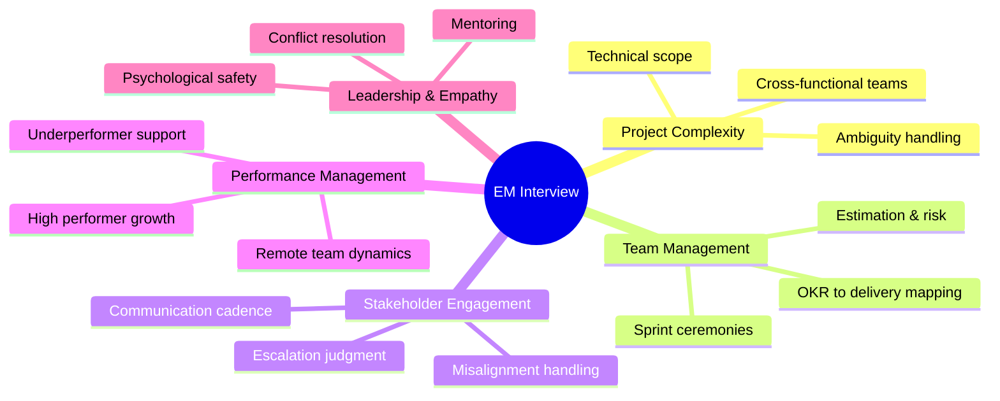

---

## 1. Project Complexity & Scope

### The 3-Layer Articulation

Always frame complex projects across three dimensions:

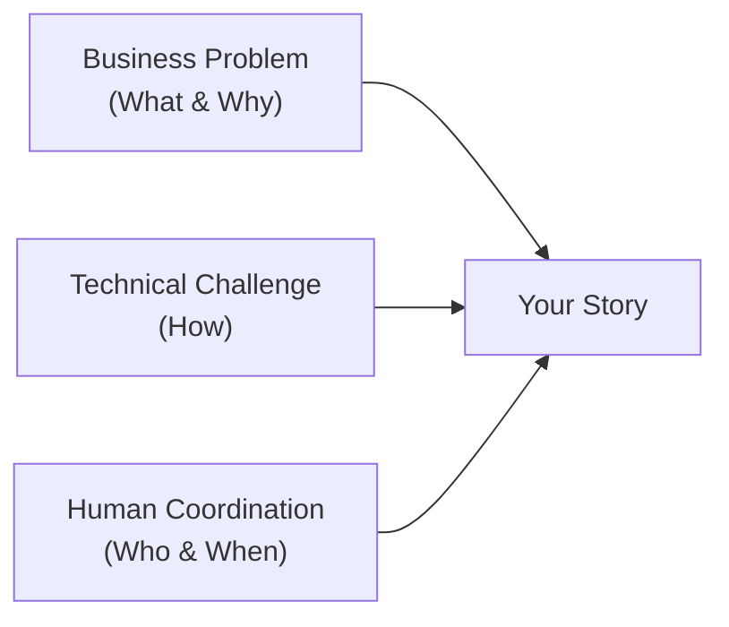

**Example:**
> "The **business problem** was onboarding drop-off at payment step. The **technical challenge** was integrating 3 third-party payment rails with inconsistent APIs. The **human coordination challenge** was aligning mobile, backend, and compliance teams with conflicting release schedules."

### Scope Discipline

- Use change request processes when scope expands mid-project
- Run discovery spikes and PoCs to reduce ambiguity early
- Document decisions with explicit tradeoffs, not just outcomes

---

## 2. Team Management

### 2a. Planning Hierarchy

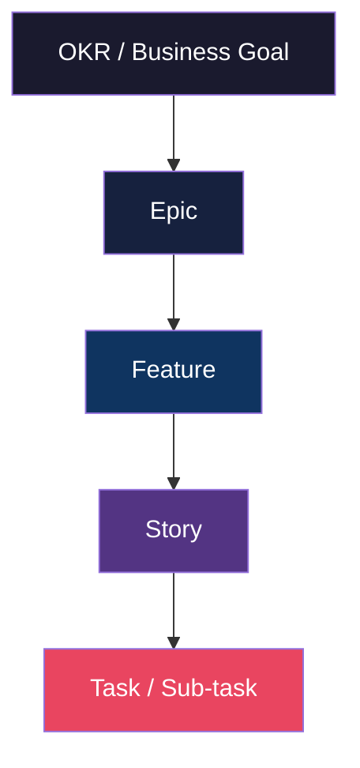

### 2b. Estimation Approach

| Phase | Technique | Notes |
|---|---|---|
| Discovery / Roadmap | T-shirt sizing (S/M/L/XL) | Speed over precision |
| Sprint planning | Story points + team velocity | Anchor to historical data |
| Risk buffer | +20–30% on unknowns | Justify explicitly |
| Dependencies | Mapped upfront | External > internal risk |

### 2c. Risk Evaluation Matrix

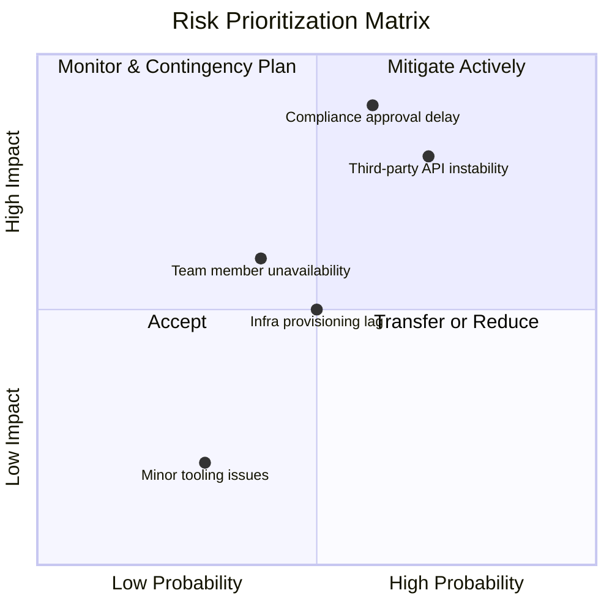

### 2d. Dependency Management

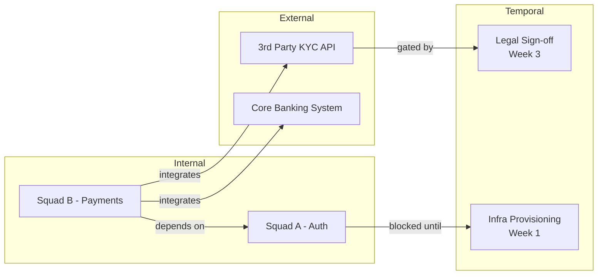

> "I maintained a dependency map surfaced in planning, not during execution. I owned the resolution of external dependencies — I didn't wait for them to become blockers."

---

### 2e. Sprint Ceremonies — Purpose Over Ritual

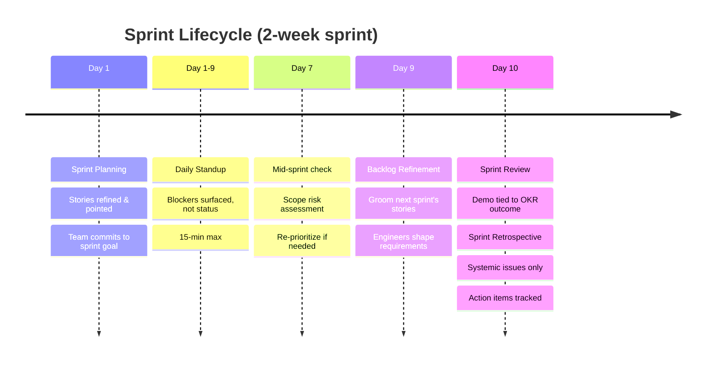

**Ceremony philosophy:**
- Planning → "We're here to commit, not clarify."
- Standup → "What's blocked? Not what's done."
- Review → "Here's the metric movement, not just the feature."
- Retro → "Systemic patterns, not one-off vents."

### 2f. Detecting Delivery Drift — Early Signals

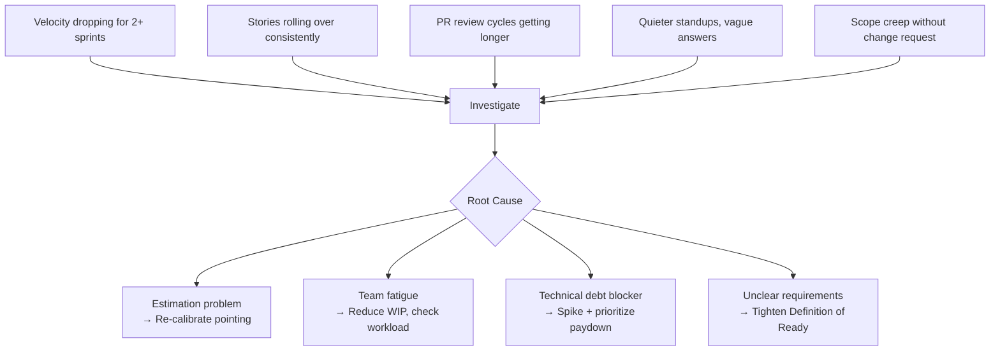

### 2g. Measuring Impact — Outcome Not Output

Always connect delivery to the OKR:

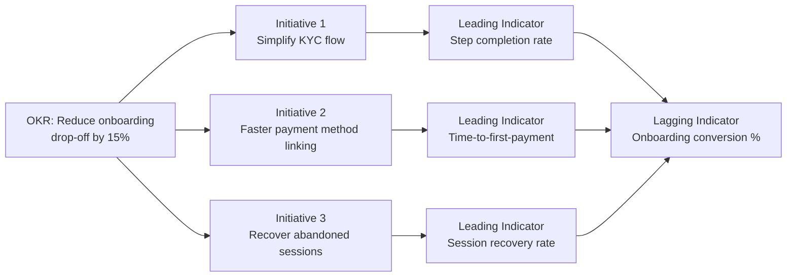

---

## 3. Stakeholder Engagement

### Stakeholder Mapping

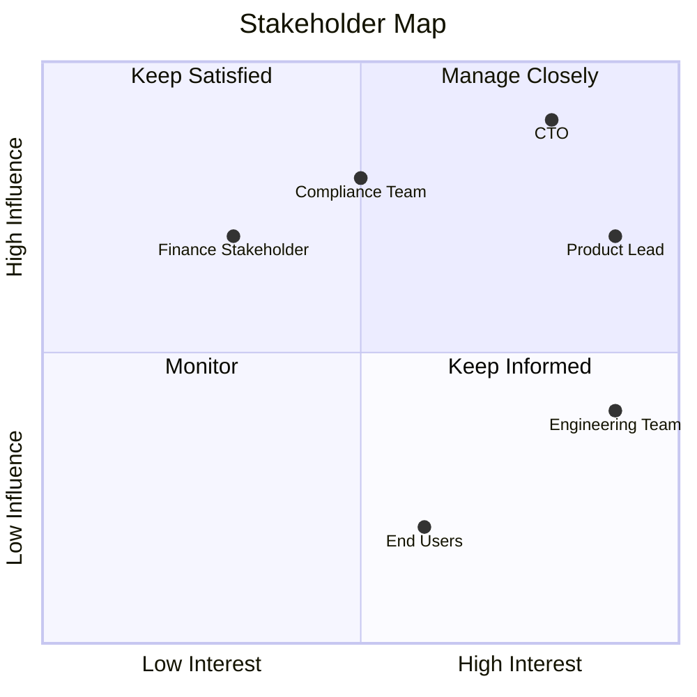

### Communication Cadence

| Stakeholder | Frequency | Format |
|---|---|---|
| High influence + interest | Weekly | 1:1 + written digest |
| High influence + low interest | Bi-weekly | Executive summary (3 bullets) |
| Low influence + high interest | On milestones | Update email |
| Engineering team | Daily | Standup + async Slack |

**Weekly project digest format:**
```
✅ What we shipped
⚠️  What's at risk
🙏 What I need from you
```

### Escalation Decision Tree

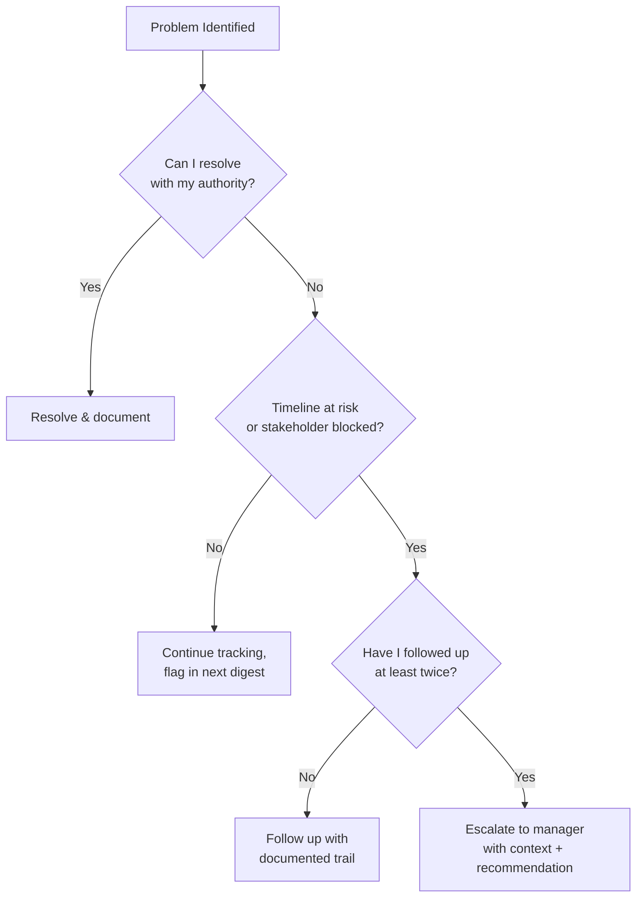

> Never say you never escalated. That signals you hide problems.

---

## 4. Performance Management

### Performance Diagnosis Framework

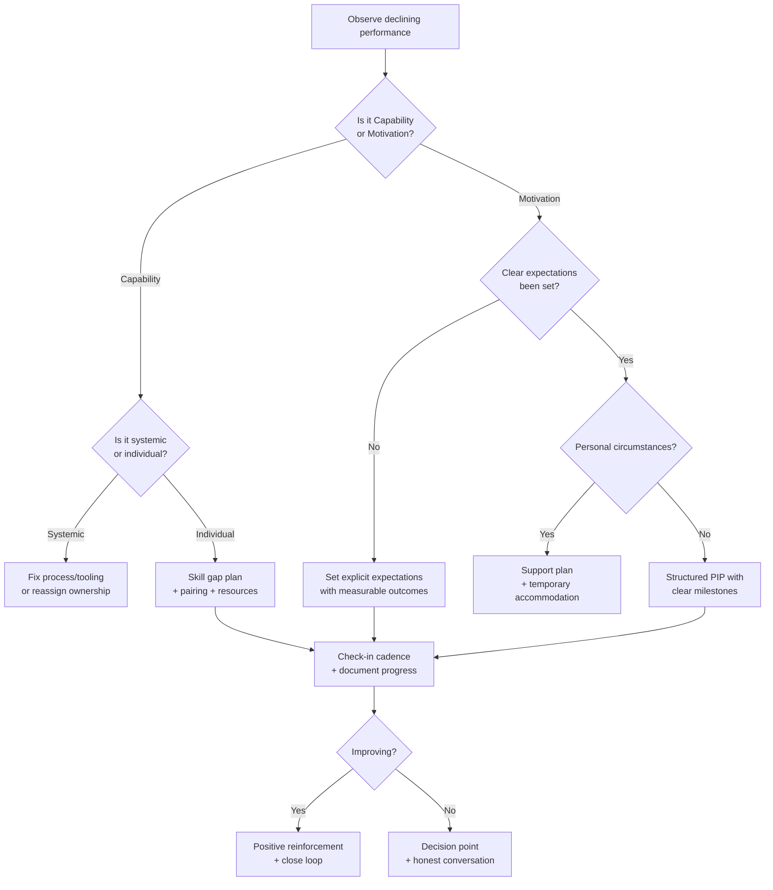

### High Performers — Growth, Not Just Output

| Risk | Signal | Response |
|---|---|---|
| Boredom | Asking for "more work" repeatedly | Give stretch problems, not more of the same |
| Undervalued | Quiet in planning, disengaged in retros | Give visibility: demos, cross-team forums |
| Burnout | High output + declining quality | Protect their time, reduce WIP |
| Leaving | Job market conversations | Career path conversation, not a counter-offer |

> "I made sure high performers had visibility and worked on problems they hadn't solved before. The goal was to grow their ceiling, not just their throughput."

### Remote Team Principles

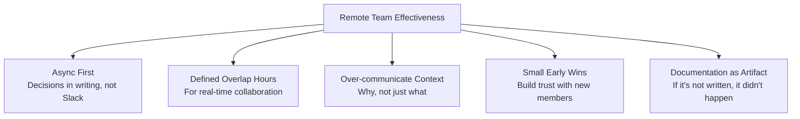

---

## 5. Mentoring, Leadership & Conflict Resolution

### Mentoring — Deliberate, Not Accidental

**Skill alignment model:**

```mermaid
vennDiagram
```

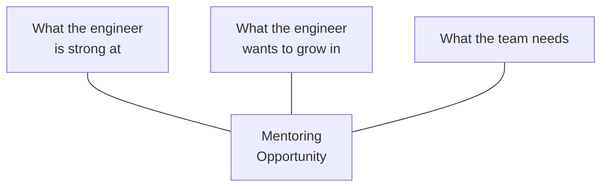

**Techniques:**
- Pairing on unfamiliar domains
- Code reviews as teaching moments, not just approval gates
- Shadow stakeholder conversations to grow communication skills
- Structured feedback: **Observe → Impact → Suggest**

> "Here's what I observed, here's the impact it had on the team, here's what I'd try differently."

### Conflict Resolution — Position vs. Interest

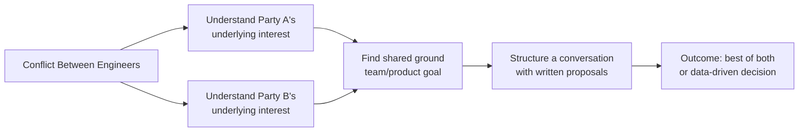

**Concrete technique:**
> "I asked each engineer to write a 1-page doc: problem statement, proposed approach, tradeoffs. Then we reviewed together. The conflict became a design discussion."

---

## STAR Story Bank — Prepare These 5

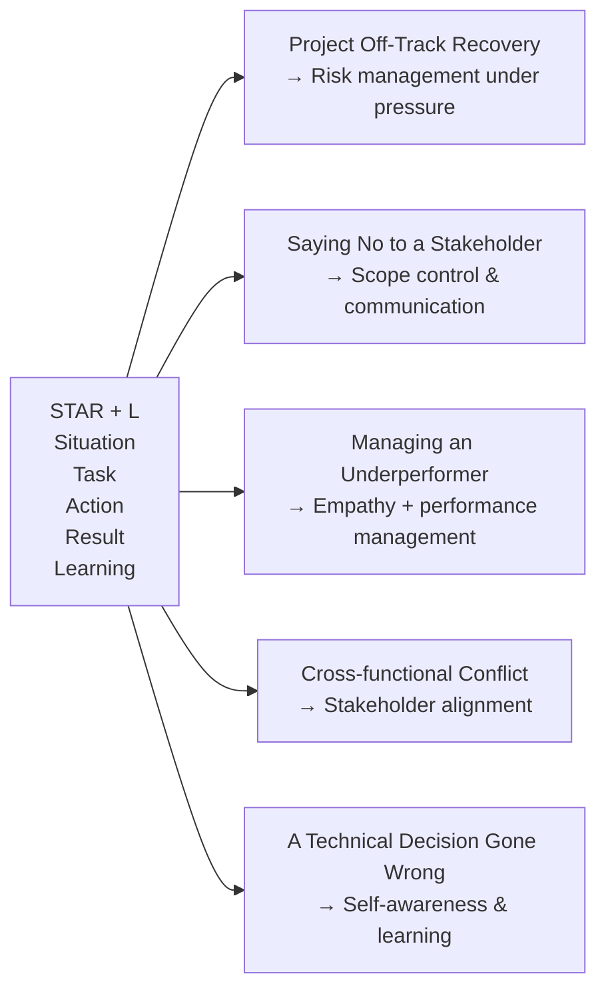

> Always add the **L — Learning**: "Here's what I'd do differently." This signals maturity, not weakness.

---

## Seniority Language Patterns

| Junior phrasing | Senior phrasing |
|---|---|
| "I kept everyone updated." | "I created visibility so stakeholders could make informed decisions." |
| "We balanced speed and quality." | "We had a healthy tension between shipping speed and quality — here's how we managed it." |
| "We used Agile." | "Here's how we adapted our process to the specific constraints of this project." |
| "Things went wrong but we fixed it." | "I own this outcome — here's what I should have caught earlier." |
| "We had good communication." | "I established explicit communication contracts with each stakeholder group." |

---

## Anti-patterns That Signal Disqualification

- Vague answers with no specifics
- Attributing success entirely to yourself
- No self-awareness about past failures
- Describing conflict avoidance as conflict resolution
- Not connecting delivery to business outcome
- "We never had to escalate" (signals problems were hidden)

---

## Closing Question to Ask Them

> "What does a great engineering leader look like at Moniepoint 12 months in — what would they have shipped, what relationships would they have built, and what problems would they have made smaller?"

This signals you're already thinking about **impact**, not just the interview.

---

*Prepared for Moniepoint EM Interview — Project Planning, Execution & Product Thinking Round*
