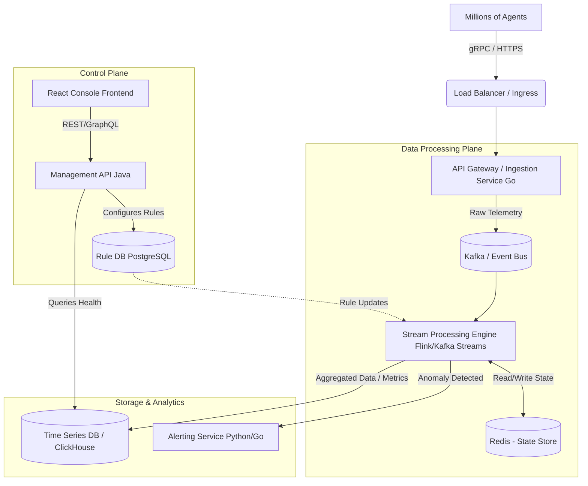

# Singularity Health Center: Architecture Design

## 1. Problem Context & Requirements

**Objective**: Detect high-impact operational anomalies (disabled agents, anti-tampering turned off, connectivity losses, low disk space) and trigger actionable alerts across millions of endpoints.

**Scale & Constraints**:
*   **Throughput**: Billions of telemetry events daily (translates to tens of thousands of requests per second).
*   **Latency**: Near real-time detection of anomalies (seconds to minutes, depending on the rule).
*   **Scale**: Millions of concurrently deployed endpoints.
*   **Tech Stack constraints**: Java/Go/Python backend, React frontend, K8s on AWS/GCP, Terraform, ArgoCD/GitHub Actions.

## 2. High-Level Architecture

The architecture follows a standard high-throughput event streaming pattern, broken down into Ingestion, Stream Processing, Storage, Alerting, and the Management Control Plane.



## 3. Component Deep Dive

### 3.1. Ingestion Layer (Go)
*   **Why Go?**: Go is highly concurrent (goroutines) and efficient with network I/O, making it perfect for an API Gateway that needs to handle 10s of thousands of concurrent connections.
*   **Responsibilities**: 
    *   **Authentication & Validation**: Ensure the agent is valid (mTLS or JWT/Tokens).
    *   **Rate Limiting**: Protect downstream systems from "Thundering Herd" scenarios (e.g., millions of agents coming back online at once).
    *   **Publishing**: Push valid events to Kafka topics efficiently (using batching).

### 3.2. Event Bus (Apache Kafka)
*   **Role**: Acts as the central nervous system. Decouples ingestion from processing and acts as a buffer during traffic spikes.
*   **Partitioning Strategy**: Partition by `tenant_id` + `agent_id` hash. This ensures all events for a specific agent go to the same partition, guaranteeing ordered processing per agent, while distributing the load evenly across the cluster to avoid hot partitions.

### 3.3. Stream Processing & Rule Engine (Java + Apache Flink)
*   **Why Flink?**: Native support for stateful stream processing, complex event processing (CEP), and powerful windowing APIs (crucial for "Connectivity Loss" detection).
*   **Responsibilities**:
    *   **Stateless Rules**: E.g., `event.disk_space < 10%` or `event.tampering == false`. Trigger alert immediately.
    *   **Stateful Rules**: E.g., Connectivity loss. Flink uses "Session Windows" or timer states. If an agent hasn't sent a heartbeat within $X$ minutes, the timer fires, and an anomaly is emitted.
    *   **State Store**: Flink manages state internally (RocksDB) but can sync "Last Known Good State" to Redis for external services (like the React dashboard) to query instantly.

### 3.4. State Management (Redis)
*   **Role**: A distributed cache serving as the source of truth for the *current* state of any agent.
*   **Usage**: The Management API queries Redis to populate the console UI quickly without hammering the Time Series DB or Kafka. 

### 3.5. Storage Layer (ClickHouse or VictoriaMetrics)
*   **Role**: Long-term storage of telemetry for historical analysis, trend reporting, and forensic investigation.
*   **Why ClickHouse?**: Columnar database designed for heavy analytical queries (OLAP) on massive datasets. Excellent compression ratios for telemetry data.

### 3.6. Alerting Service (Python/Go)
*   **Role**: Consumes anomaly events from a dedicated Kafka topic (`anomalies_topic`).
*   **Responsibilities**:
    *   **Deduplication**: Prevent spamming users (e.g., if disk space is low, don't send an email every 5 seconds. Use a cool-down period).
    *   **Routing**: Fetch tenant notification preferences (Email, Slack, PagerDuty, Webhook) and dispatch.

## 4. API Definitions (Example)

### Telemetry Ingestion API (gRPC / Protobuf)
Using gRPC over HTTPS is highly recommended for agent communication due to low payload overhead and multiplexing capabilities.

```protobuf
message TelemetryEvent {
  string agent_id = 1;
  string tenant_id = 2;
  int64 timestamp = 3; // Epoch time
  
  // Health Metrics
  bool is_tampered = 4;
  bool is_disabled = 5;
  float disk_space_percent = 6;
  string agent_version = 7;
}
```
