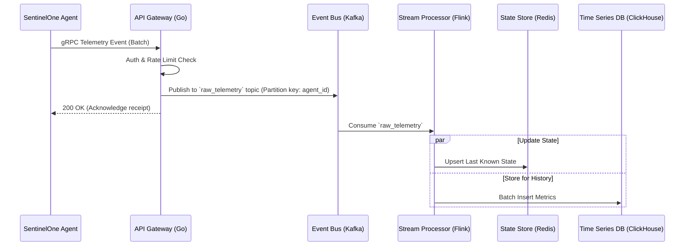
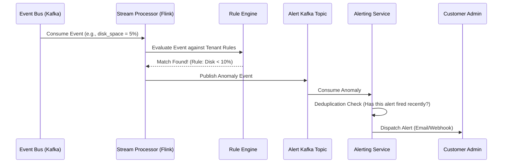
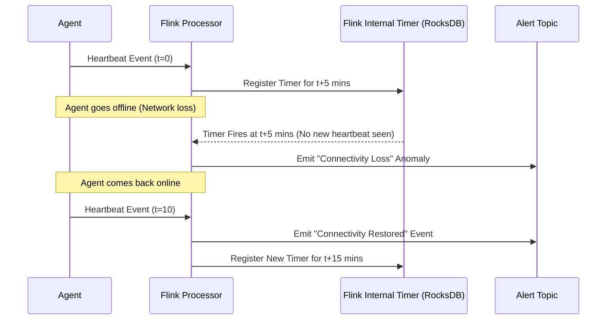

# Singularity Health Center: Data Flows

This document details the specific data flows for different operations in the Singularity Health Center. Understanding these flows is critical for a Senior Engineering Manager to articulate how the system behaves under various conditions.

## 1. Event Ingestion Flow

The standard path for a health telemetry event coming from an endpoint agent into the platform.

### Key Considerations:
*   **Asynchronous Acknowledgement**: The gateway acknowledges the agent as soon as the message is safely stored in Kafka. It does *not* wait for Flink to process the event, ensuring low latency for the agent.
*   **Batching**: Agents send events in batches, and the Gateway writes to Kafka in batches to optimize network and disk I/O.

## 2. Stateless Anomaly Detection Flow (e.g., Low Disk Space, Tampering)

These are rules that can be evaluated on a single event without needing historical context.

## 3. Stateful Anomaly Detection Flow (Connectivity Loss / Missing Heartbeat)

This is the hardest problem to solve at scale: How do you detect that an event *did not* arrive?

### The Flink Timer State Approach

### Why this is an Interview Differentiator:
Many candidates will suggest querying a database via a cron job (e.g., `SELECT * FROM agents WHERE last_seen < NOW() - 5 mins`). 
**Why cron is bad:** Running a cron job across millions of rows every minute is incredibly resource-intensive and doesn't scale.
**Why Stream Processing (Timers/Session Windows) is better:** The stream processor only keeps track of active timers in memory (or fast local state like RocksDB). When the time expires, it fires automatically. It converts a "polling" problem into an "event-driven" solution.
