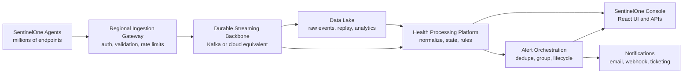
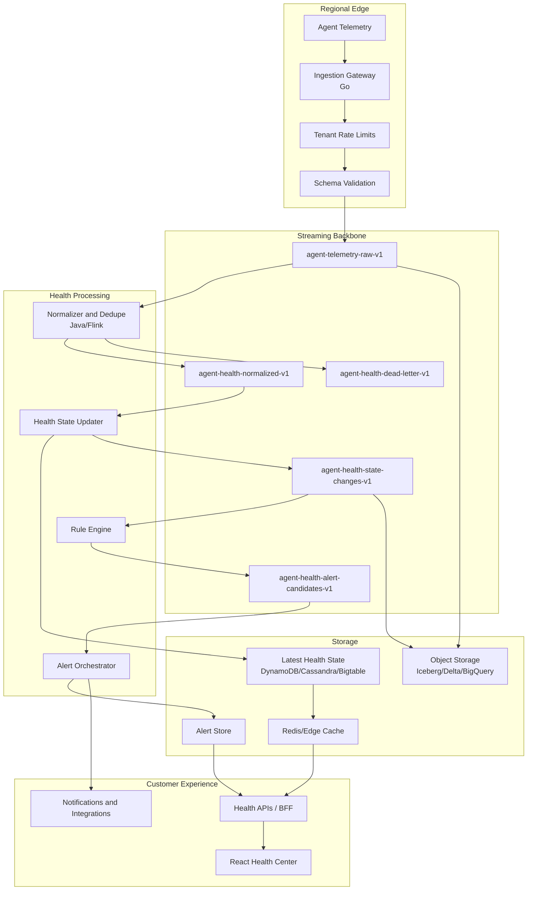
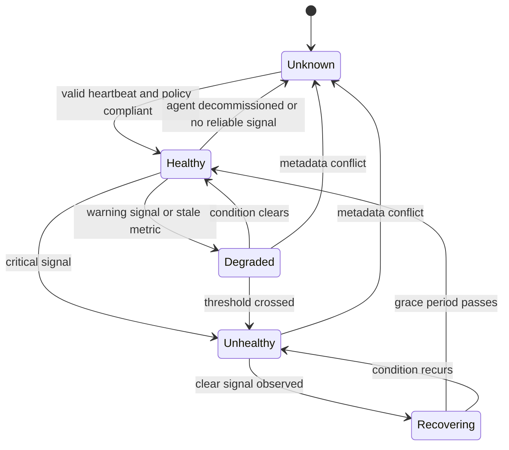
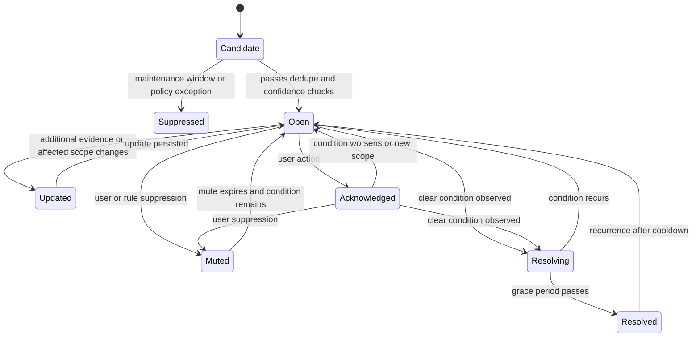
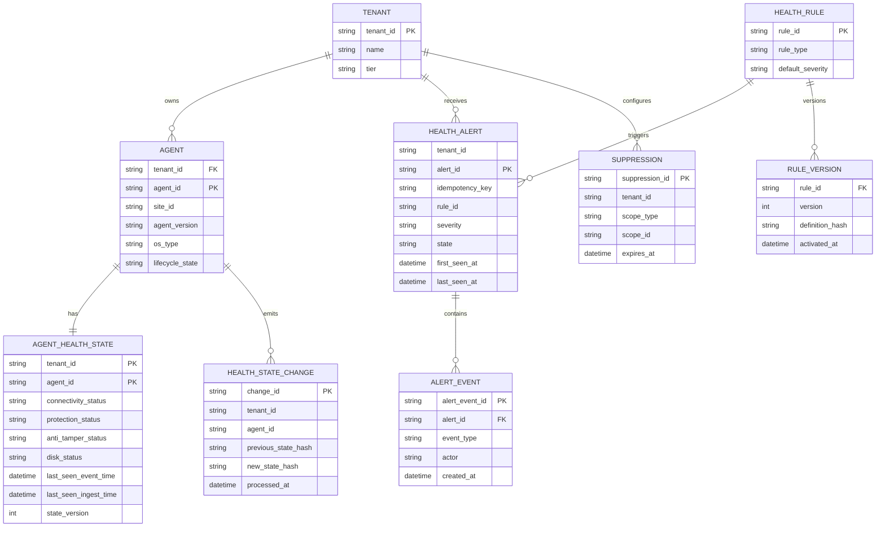
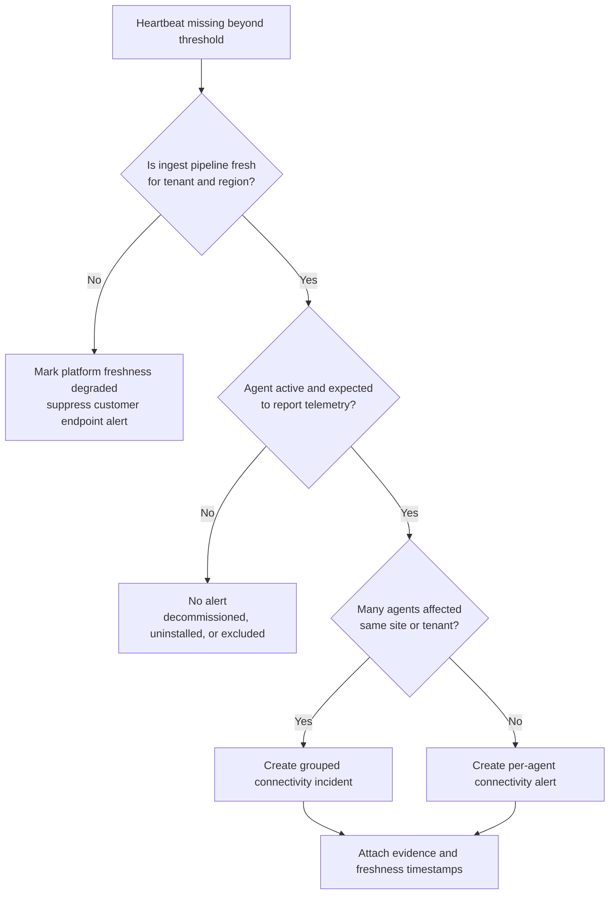
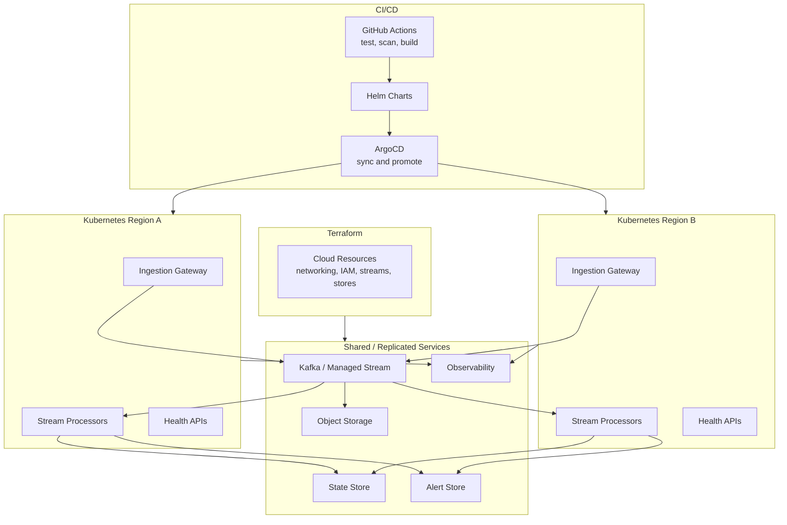
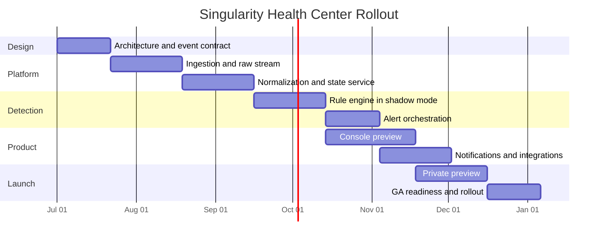

# Singularity Health Center Diagrams

These diagrams are written in Mermaid so they can be pasted into architecture docs, GitHub markdown, or diagram tools that support Mermaid.

## System Context

## Detailed Streaming Architecture

## Health State Machine

## Alert Lifecycle

## Core Data Model

## Connectivity Loss Decision Flow

## Deployment Topology

## Rollout Sequence

