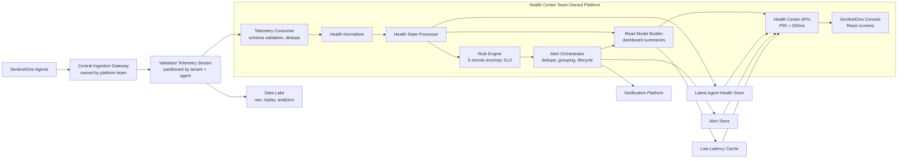
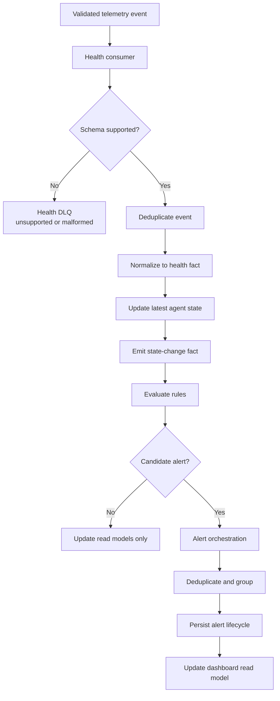
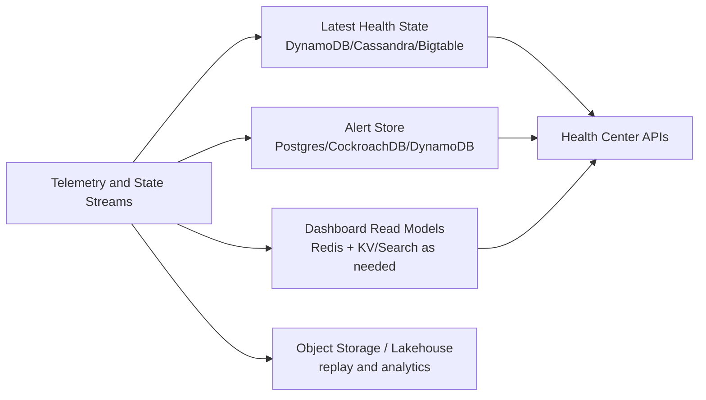
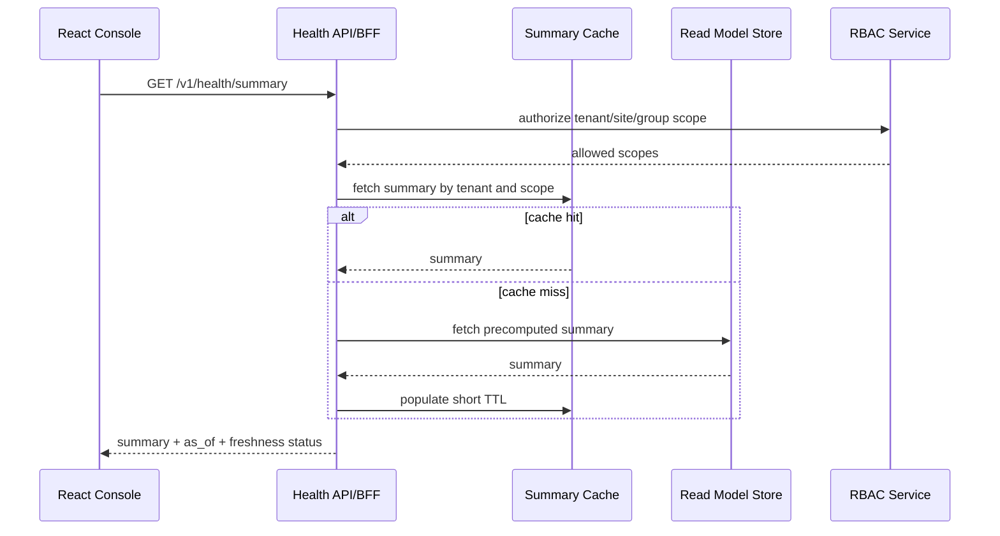
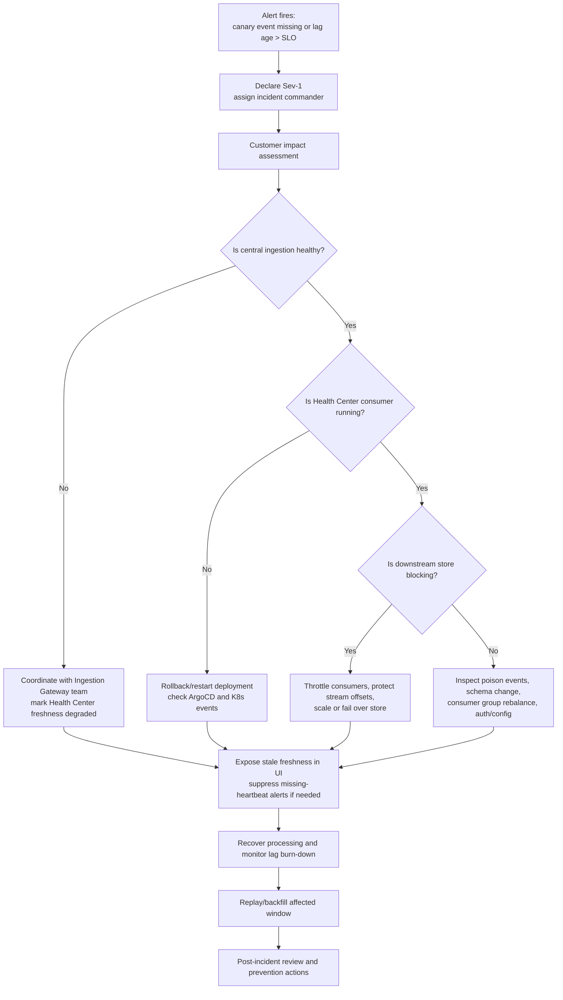

# Challenge 1: Architectural Strategy And Operations

## Interview-Framing Answer

I would design Health Center as a streaming health-state and alerting platform that consumes validated telemetry from the central Ingestion Gateway. Our team owns everything after durable ingestion: event normalization, per-agent health state, anomaly detection, alert lifecycle, low-latency API read models, and the SentinelOne console UI.

The key architectural decision is to separate write-heavy telemetry processing from read-optimized dashboard serving. Billions of events per day should flow through durable streams and state processors, while the UI should read from compact, precomputed health summaries and alert read models so dashboard APIs stay under 200ms.

## Updated Ownership Boundary

The prompt changes the architecture boundary: Health Center does not own agent-facing ingestion. It consumes from a central Ingestion Gateway.

Team owns:

- Telemetry consumer contracts and schema expectations.
- Health event normalization.
- Deduplication and idempotent state updates.
- Rule evaluation and anomaly detection.
- Alert grouping, dedupe, suppression, lifecycle, and notifications.
- Health Center APIs and React console screens.
- Dashboards, SLOs, runbooks, and operational readiness for the Health Center platform.

Team does not own:

- Agent transport protocol.
- Agent authentication.
- Gateway autoscaling.
- Raw edge request handling.

However, the team must still define upstream contracts, freshness SLOs, and incident handoffs with the Ingestion Gateway team.

## Requirements Translated To Architecture

| Requirement | Architectural Response |
| --- | --- |
| Billions of daily events | Durable partitioned stream, horizontal consumers, bounded per-event work, tenant-aware backpressure. |
| Detect anomalies within 5 minutes | Streaming state updates, event-time windows, lag-based autoscaling, freshness SLOs, heartbeat scanners. |
| Dashboard API latency under 200ms | Precomputed read models, cache, cursor pagination, bounded filters, no raw event scans in UI path. |
| Full-stack team of 10 | Clear workstream split: stream/state, alerts/rules, APIs/UI, QA/automation, SRE partnership. |
| Central Ingestion Gateway | Treat ingestion stream as source boundary; define schema, contract tests, replay, and freshness checks. |

## High-Level Architecture



## Data Ingestion Strategy

### Source

The Health Center consumes validated telemetry from a central stream produced by the Ingestion Gateway. The Gateway should publish after authentication, tenant resolution, basic validation, and durable commit.

### Consumer Contract

Required guarantees from the central Ingestion Gateway:

- At-least-once delivery.
- Schema-versioned event envelopes.
- Tenant identity derived from authenticated source, not payload trust alone.
- Per-event `event_id`, `agent_id`, `tenant_id`, `event_time`, `ingest_time`, and `event_type`.
- Dead-letter routing for events that fail platform-level validation.
- Freshness metrics exposed by region, tenant tier, and topic.

Health Center should assume:

- Events can be duplicated.
- Events can be delayed.
- Events can arrive out of order.
- Some agents emit older schema versions.
- The stream can lag during platform incidents.

### Partitioning

Use `tenant_id + hash(agent_id)` as the stream partition key.

Why:

- Keeps most per-agent processing locally ordered.
- Avoids a single tenant partition becoming hot.
- Allows large tenants to be sharded.
- Supports tenant-aware lag and backpressure.

## Event Processing Strategy

## Pipeline Stages



### Processing Choices

Recommended stack:

- Java stream processors using Kafka Streams, Flink, or the company-standard streaming framework.
- Go for thin high-throughput API or worker services if that is the existing platform pattern.
- Python for offline analysis, rule-quality measurement, and threshold tuning.

Processing semantics:

- At-least-once stream consumption.
- Idempotent state updates.
- Conditional writes using `state_version` or event sequence.
- Bounded event-time windows for out-of-order telemetry.
- Separate fast direct-signal rules from slower absence-of-signal checks.

### 5-Minute Detection SLO

For direct health signals such as anti-tamper disabled or agent disabled:

- Target P95 detection under 2 minutes.
- Hard SLO under 5 minutes.
- Alert when stream lag or rule-processing lag threatens the SLO.

For missing heartbeat/connectivity:

- Detection time equals configured heartbeat threshold plus processing delay.
- If heartbeat interval is 60 seconds and missing threshold is 3 intervals, the Health Center should alert within roughly 4-5 minutes.
- The system must correlate with ingestion freshness before creating customer-facing connectivity alerts.

### Anomaly Types

| Anomaly | Signal Type | Detection Approach |
| --- | --- | --- |
| Agent disabled | Direct event plus heartbeat snapshot | State transition rule. |
| Anti-tamper disabled | Direct event plus policy compliance | Policy-aware state transition rule. |
| Connectivity loss | Absence of heartbeat | Windowed missing-signal detector with platform freshness check. |
| Low disk | Metric threshold | Threshold rule with hysteresis. |
| Fleet/site outage | Aggregation | Group-level anomaly rule over rolling window. |
| Policy drift | State comparison | Expected policy vs applied policy with metadata freshness guard. |

## Storage Strategy

Use purpose-built stores rather than one store for every access pattern.



### Latest Agent Health Store

Purpose:

- Fast point lookup by `tenant_id + agent_id`.
- Bulk query by precomputed site/group indexes.
- Authoritative latest state.

Options:

- DynamoDB on AWS.
- Bigtable on GCP.
- Cassandra/Scylla if self-managed or platform-standard.

### Alert Store

Purpose:

- Alert lifecycle and audit.
- Idempotency constraints.
- Acknowledgement, mute, suppression, and resolution state.

Options:

- Relational store if strong transactional alert lifecycle is required.
- DynamoDB/Cassandra if lifecycle access is mostly key-value and global scale is primary.

### Dashboard Read Models

Purpose:

- Serve UI under 200ms.
- Avoid ad hoc aggregation over hot telemetry.

Examples:

- `tenant_health_summary`
- `site_health_summary`
- `group_health_summary`
- `open_alert_summary`
- `top_unhealthy_reasons`
- `agent_health_search_index`

### Data Lake

Purpose:

- Raw event retention.
- Replay.
- Rule backtesting.
- Analytics.
- Customer/support investigations under access controls.

## Dashboard API Design For < 200ms

The UI should not query raw telemetry. It should use compact read models.

### API Pattern

```http
GET /v1/health/summary
GET /v1/health/sites?cursor={cursor}
GET /v1/health/agents?status=unhealthy&reason=anti_tamper_disabled&cursor={cursor}
GET /v1/health/alerts?state=open&severity=critical&cursor={cursor}
GET /v1/health/alerts/{alert_id}
POST /v1/health/alerts/{alert_id}/ack
POST /v1/health/suppressions
```

### Latency Design

- P95 API latency under 200ms for dashboard and list APIs.
- Cache tenant and site summaries in Redis or equivalent.
- Use cursor pagination, not offset scans.
- Precompute expensive counts.
- Bound filters to indexed fields.
- Return `as_of` timestamps so customers understand freshness.
- Use async export jobs for large reports.

### API Request Flow



## Reusable Platform Services

Some components should be built as reusable platform capabilities rather than one-off Health Center code.

| Candidate Platform Service | Why It Is Reusable |
| --- | --- |
| Telemetry schema contract library | Many teams consume central ingestion streams and need version-safe parsing. |
| Event dedupe/idempotency library | Common requirement for at-least-once stream consumers. |
| Rule evaluation framework | Other operational products need deterministic, versioned, dry-runnable rules. |
| Alert lifecycle service | Reusable for security, health, compliance, and operational alerts. |
| Suppression and maintenance-window service | Common customer workflow across alert types. |
| Read-model builder pattern | Reusable for low-latency dashboards over streaming facts. |
| Replay framework | Useful for backfills, rule changes, and incident correction. |
| Freshness and lag SLO library | Common observability pattern for stream processing platforms. |

Interview nuance: do not over-platform everything in v1. Build clean seams where reuse is likely, but ship the Health Center outcome first.

## Operations And Reliability

## Health Center SLOs

| Area | SLO |
| --- | --- |
| Event processing freshness | P95 event processed within 5 minutes of occurrence. |
| Direct anomaly detection | P95 under 2 minutes, hard target under 5 minutes. |
| Dashboard APIs | P95 under 200ms for summary/list APIs. |
| Alert creation availability | 99.9% or better. |
| Replay correctness | Deterministic replay for a tenant/time/rule version. |

## Critical Metrics

Pipeline:

- Input event rate by topic, region, tenant tier.
- Consumer lag by partition.
- Oldest unprocessed event age.
- Event-time-to-process-time latency.
- Deduplication rate.
- DLQ rate.
- Normalization failure rate.
- Rule evaluation rate and latency.

State and alerts:

- State update latency and error rate.
- Conditional write conflict rate.
- Alert candidate rate by rule.
- Alert dedupe rate.
- Open/update/resolve rate.
- Suppression hit rate.
- Notification backlog age.

API/UI:

- API P50/P95/P99 latency.
- Cache hit ratio.
- Read model freshness.
- Slow queries.
- Dashboard error rate.
- UI load time and failed requests.

Business/customer:

- Percentage of active agents with known health.
- Unknown-health count by tenant.
- False-positive feedback rate.
- Alert acknowledgement and mute rates.

## Reliability Patterns

- Durable stream between ingestion and processing.
- Horizontal autoscaling on consumer lag and CPU.
- Circuit breakers around metadata, state store, alert store, and notification platform.
- DLQ with replay tooling.
- Feature flags by rule, tenant, region, and notification channel.
- Kill switch for noisy rules.
- Shadow mode for new rules.
- Synthetic canary events injected continuously.
- Read model freshness surfaced to UI.
- Runbooks and game days before private preview.

## Sev-1 Scenario: Health Center Silently Stops Processing Events

### What Makes This Sev-1

The dangerous part is "silently." If events stop processing but the UI still looks normal, customers may believe their fleet is healthy when the system is stale. This is a trust and safety issue.

### Detection Signals

This should be detected automatically by multiple independent signals:

- Consumer lag increasing.
- Oldest unprocessed event age over threshold.
- Synthetic canary event not visible in health state within SLO.
- Read model `as_of` timestamp stale.
- Drop in state-change rate while upstream ingest rate remains normal.
- Rule candidate rate drops unexpectedly to near zero.
- No heartbeat-derived state updates for active tenants.

### Incident Flow



### First 15 Minutes

1. Declare incident and assign incident commander, tech lead, comms owner, and scribe.
2. Confirm scope: all tenants, one region, one topic, one rule, or one consumer group.
3. Compare upstream ingest rate with Health Center consumed rate.
4. Check oldest unprocessed event age and stream lag.
5. Check latest successful synthetic canary event.
6. Freeze risky deployments and verify recent ArgoCD/GitHub Actions changes.
7. Put UI into degraded freshness mode if read models are stale.
8. Disable missing-heartbeat customer alerts if platform freshness is compromised.

### Diagnostic Decision Tree

| Symptom | Likely Cause | Action |
| --- | --- | --- |
| Upstream ingest normal, consumer lag rising | Health consumer issue | Scale, restart, inspect deployment/config. |
| Consumers healthy, state writes failing | State store throttling/outage | Rate limit consumers, scale store, use retry queue. |
| DLQ spike after deployment | Schema or parser bug | Roll back normalizer, replay DLQ after fix. |
| Candidate alerts drop to zero but state updates continue | Rule engine disabled or misconfigured | Roll back rule config, validate feature flags. |
| UI stale but processors healthy | Read model builder/cache issue | Rebuild read model, bypass cache if safe. |
| Only one tenant impacted | Hot tenant, partition issue, tenant metadata | Shard tenant, inspect tenant-specific config and metadata. |

### Customer-Facing Behavior During Incident

- Show data freshness in UI using `as_of`.
- If stale beyond SLO, show degraded status instead of pretending data is current.
- Suppress alerts whose only evidence is missing telemetry during platform freshness incidents.
- Keep customer actions available only if they are safe against stale state.
- Provide support and status-page messaging if customer impact crosses threshold.

### Recovery

1. Restore processing.
2. Watch lag burn down and estimate full recovery time.
3. Replay affected time window if offsets were skipped or messages went to DLQ.
4. Recompute read models for impacted tenants/time windows.
5. Reconcile alerts: create delayed alerts only when still actionable; avoid flooding customers with stale notifications.
6. Produce incident review with detection, impact, root cause, and prevention work.

### Prevention Improvements

- Mandatory synthetic canary events per region and tenant class.
- Alert on "no output" conditions, not only explicit errors.
- Deployment guardrail: fail rollout if canary does not update state.
- Schema compatibility checks against representative agent versions.
- Rule config validation before activation.
- Consumer lag burn-down automation.
- Stale read model banner in UI.
- Game day for silent consumer stall.

## Full-Stack Team Delivery Plan For Challenge 1

With 10 engineers, I would split ownership like this:

| Role Group | Focus |
| --- | --- |
| 3 backend streaming/state engineers | Consumers, normalization, state store, rule processing. |
| 2 backend API/alert engineers | Alert lifecycle, APIs, suppression, notification integration. |
| 2 frontend engineers | Dashboard, agent list, alert detail, freshness UX. |
| 2 QA/SDET engineers | Contract tests, integration tests, load test harness, replay validation. |
| 1 tech lead or flex engineer | Cross-cutting architecture, operational readiness, hardening. |

As manager, I would ensure the team has crisp interfaces, milestone gates, and incident readiness. The main leadership risk is trying to build all features at once before proving freshness, false-positive quality, and dashboard latency.

## Suggested Milestones

### Milestone 1: Processing Foundation

- Consume from central ingestion stream.
- Normalize and dedupe health events.
- Write latest health state.
- Establish lag/freshness dashboards.
- Inject synthetic canary events.

### Milestone 2: Detection And Alerts

- Implement initial deterministic rules.
- Add alert candidate stream.
- Add dedupe, grouping, suppression, and lifecycle.
- Run in shadow mode.

### Milestone 3: UI And API

- Build summary, unhealthy agents, and alert detail screens.
- Implement precomputed read models.
- Validate P95 API under 200ms.
- Surface `as_of` freshness and degraded states.

### Milestone 4: Operational Hardening

- Load test to peak target.
- Run Sev-1 game day.
- Validate replay and backfill.
- Add tenant/rule/region feature flags.
- Launch private preview.

## Interview Close

My highest-confidence design choice is to make Health Center streaming-first but dashboard-read-model-driven. Streaming gives us the 5-minute anomaly SLO; precomputed read models give us the sub-200ms console experience. The operational backbone is freshness observability: the platform must know, and show, when health data is stale.

