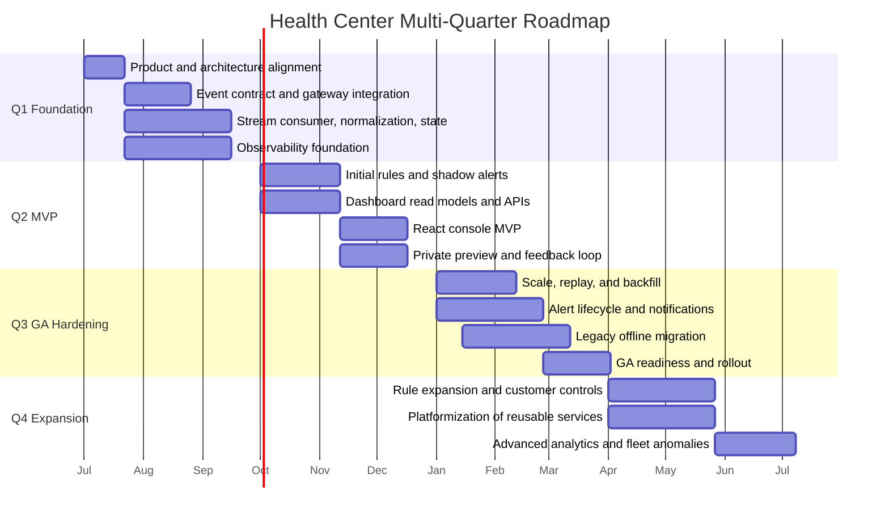
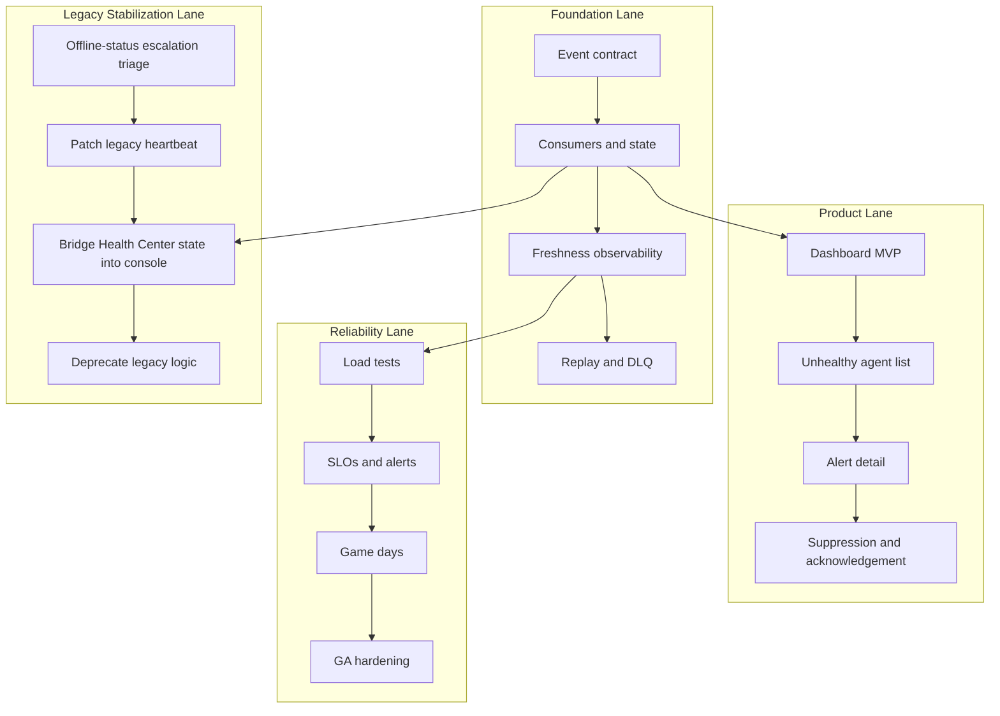
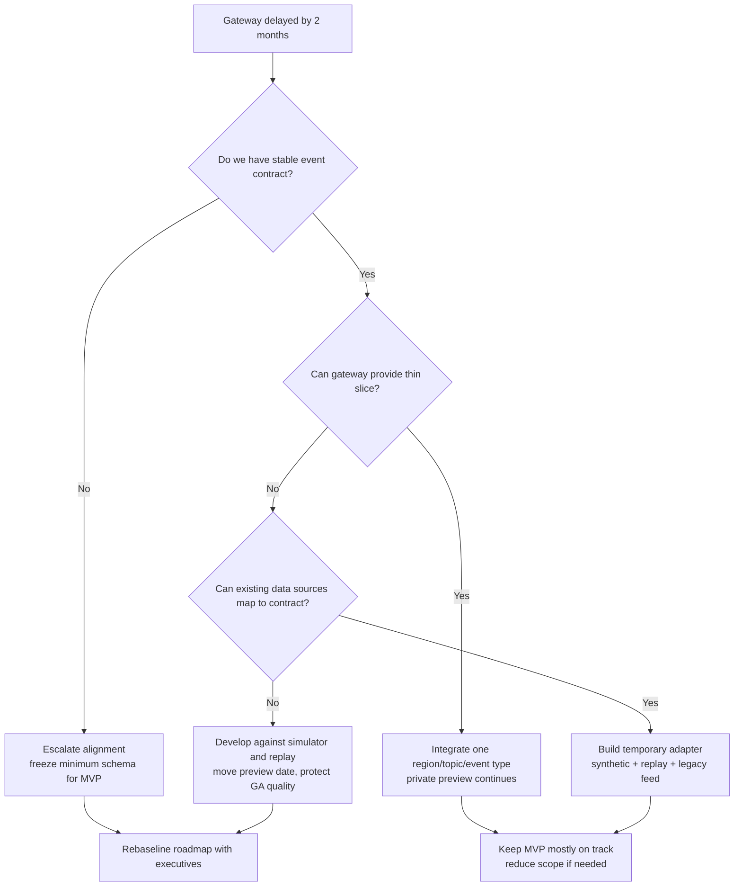
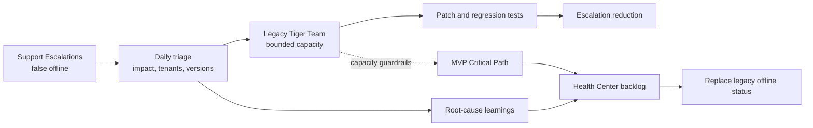
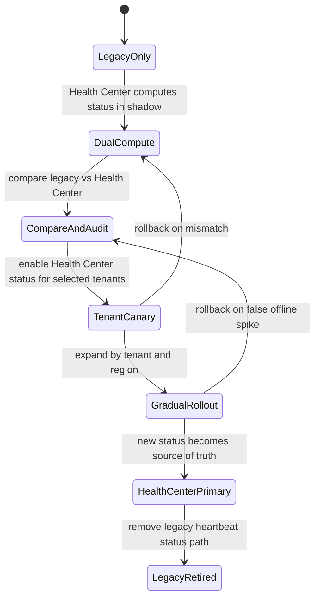

# Challenge 2: Execution, Delivery And Operational Distractions

## Interview-Framing Answer

I would treat Health Center as a multi-quarter initiative with an MVP that proves the core health-state pipeline and customer value, then a GA release that hardens scale, alerting, workflows, and operational ownership. Because we are running a live platform, the roadmap must include capacity for legacy support, dependency risk, and production hardening. I would not allow the team to choose between shipping the future and supporting customers today; I would explicitly split capacity, create a short-term stabilization lane, and use the legacy incident as a forcing function to accelerate Health Center replacement of offline status.

## Assumptions

For the roadmap, I will assume:

- The team has 10 engineers: backend, frontend, and QA.
- The core Ingestion Gateway is owned by another platform team.
- Health Center consumes telemetry after the central gateway routes it to our stream or topic.
- MVP should be valuable without solving every health anomaly.
- GA should be production-grade for broad customer rollout.
- Existing console already has some legacy online/offline status based on a heartbeat microservice owned by this team.

## MVP Versus GA

### MVP Scope

MVP should answer: "Can customers and internal teams reliably see current agent health and high-confidence issues for a limited set of tenants?"

MVP includes:

- Consume health telemetry from the central Ingestion Gateway for selected tenants.
- Normalize and deduplicate health events.
- Maintain latest per-agent health state.
- Detect a small set of high-confidence anomalies:
  - Agent disabled.
  - Anti-tamper disabled.
  - Connectivity loss or stale heartbeat.
  - Low disk space.
- Provide a Health Center dashboard with:
  - Tenant/site/group health summary.
  - Unhealthy agent list.
  - Alert detail with evidence.
  - Data freshness indicator.
- Run alerting initially in shadow mode, then private-preview visible alerts.
- Provide basic acknowledgement and suppression.
- Establish observability, replay, DLQ, and operational runbooks.

MVP excludes:

- Arbitrary customer-defined rules.
- Full self-service rule customization.
- Complex ML-based anomaly detection.
- Broad external notification fanout beyond existing notification paths.
- Automatic endpoint remediation unless the existing platform already supports it.

### GA Scope

GA should answer: "Can this safely replace legacy health status and become the default operational health experience for customers?"

GA includes:

- Multi-region production scale.
- Broad tenant rollout with feature flags.
- Alert grouping for site/fleet incidents.
- Full alert lifecycle: open, update, acknowledge, mute, suppress, resolve, reopen.
- Notification integration through existing platform channels.
- Maintenance windows and policy-aware suppressions.
- RBAC and audit logging.
- Replay and backfill tooling.
- Performance SLOs:
  - P95 anomaly detection within 5 minutes.
  - P95 dashboard API latency under 200ms.
  - Clear freshness state in UI.
- Migration or deprecation path for legacy heartbeat/offline status logic.

## Multi-Quarter Roadmap

## Roadmap By Quarter

### Q1: Foundation And Risk Retirement

Goals:

- Lock event contract with Ingestion Gateway team.
- Build the Health Center processing foundation.
- Prove latest health state can be computed reliably.
- Establish operational visibility before customer exposure.

Deliverables:

- Architecture decision records.
- Telemetry schema and compatibility tests.
- Stream consumer and normalizer.
- Deduplication and DLQ.
- Latest health state store.
- Synthetic telemetry generator.
- Freshness, lag, and state-update dashboards.
- Initial backend APIs for internal validation.

Exit criteria:

- Synthetic and replayed telemetry update health state.
- Canary event freshness is visible.
- Pipeline can run in shadow mode for selected tenants.
- Known scale risks have load-test plans.

### Q2: MVP And Private Preview

Goals:

- Deliver the first useful customer-facing Health Center experience.
- Validate rule quality and dashboard usability.
- Keep alerts conservative and explainable.

Deliverables:

- Initial deterministic rules.
- Alert candidates in shadow mode.
- Read models for summary and unhealthy-agent lists.
- React dashboard, agent list, and alert detail.
- Basic suppress/acknowledge flows.
- Private preview for selected tenants.
- Support playbook and feedback loop.

Exit criteria:

- P95 API latency under 200ms for MVP dashboard paths.
- P95 direct-signal detection under 5 minutes in preview.
- False-positive review completed for MVP rules.
- Preview customers and support can explain alert evidence.

### Q3: GA Readiness

Goals:

- Make Health Center reliable enough for broad rollout.
- Replace or integrate legacy offline status.
- Add alert lifecycle and operational hardening.

Deliverables:

- Alert grouping and lifecycle.
- Notification integration.
- Maintenance windows.
- Full RBAC and audit logging.
- Replay and backfill.
- Multi-region scale testing.
- Legacy heartbeat migration plan.
- GA readiness review.

Exit criteria:

- Sev-1 game day completed.
- Replay and backfill validated.
- Legacy offline false-positive rate reduced or migrated.
- Feature flags and rollback paths tested.
- Support, docs, and customer messaging ready.

### Q4: Expansion And Platformization

Goals:

- Expand rule coverage.
- Make reusable services available to other platform teams.
- Improve customer customization without compromising reliability.

Deliverables:

- More health rules and group-level anomalies.
- Advanced suppression and notification preferences.
- Reusable rule framework.
- Reusable alert lifecycle components.
- Advanced analytics for operational trends.

## Roadmap Swimlanes

## Dependency Risk: Ingestion Gateway Delayed By Two Months

## Problem

The core Ingestion Gateway team is delayed and cannot route new health telemetry to our service on time. This threatens the critical path because our processing pipeline depends on real production telemetry.

## Leadership Response

I would not simply slide the whole roadmap by two months. I would split the dependency into what we truly need from the gateway and what we can simulate, stub, replay, or source from existing systems.

## Adapted Plan

### 1. Preserve The MVP Date Where Possible

Continue building:

- Stream consumer interface using the agreed contract.
- Normalization pipeline.
- State store.
- Rule engine.
- Alert orchestration.
- Read models.
- APIs and UI.
- Observability and replay tooling.

Use alternate inputs:

- Synthetic telemetry generator.
- Historical telemetry replay if available from data lake/logs.
- Existing legacy heartbeat microservice feed.
- Manually generated health fixtures.
- Gateway contract test harness.

### 2. Negotiate A Thin Integration Slice

Ask the Ingestion Gateway team for the smallest useful integration:

- One topic.
- One region.
- One or two event types.
- Limited tenants.
- No full production routing required.

This creates an end-to-end path earlier even if the full gateway work is delayed.

### 3. Build A Temporary Adapter Only If It Is Cheap And Disposable

If business pressure is high, build a temporary adapter from existing heartbeat/agent-status sources into the Health Center event contract.

Guardrails:

- Label it explicitly as transitional.
- Keep it behind feature flags.
- Do not allow it to become a second permanent ingestion platform.
- Use the same canonical event contract so downstream code does not fork.

### 4. Reorder The Roadmap

Pull forward:

- UI implementation against mocked/read-model data.
- Read model APIs.
- Rule engine dry-run.
- Replay tooling.
- Load-test harness.
- Support workflows and operational dashboards.
- Legacy offline-status stabilization.

Push out:

- Broad production telemetry coverage.
- GA rollout.
- High-confidence alerting based only on new gateway telemetry.

## Dependency Delay Decision Tree

## What I Would Communicate Upward

- The dependency delay affects production telemetry confidence, not all Health Center work.
- We can preserve progress by building against a stable contract, replay, and synthetic data.
- MVP scope may shift from "production live telemetry for all preview tenants" to "limited tenant/region thin-slice plus shadow validation."
- GA should not launch until real ingestion path meets freshness and scale SLOs.
- We need executive alignment if the gateway delay changes customer commitments.

## Operational Drain: Legacy Offline Status Escalations

## Situation

Over 3 weeks, support escalations increase by 40% because agents incorrectly show as `Offline` in the console. The logic depends on a legacy heartbeat microservice maintained by the same team. Health Center will eventually replace this system, but customers are hurting now.

## Core Principle

Do not sacrifice current customer trust to ship the future. Also do not let the legacy system consume the entire team indefinitely. Create a bounded stabilization lane, patch the acute issue, and convert the work into acceleration for Health Center migration.

## Immediate Response

### First 48 Hours

- Assign a small tiger team: 2 backend engineers and 1 QA/SDET.
- Establish an incident owner and daily executive/customer-support update.
- Quantify impact:
  - Which tenants?
  - Which regions?
  - Which agent versions?
  - Which OS types?
  - Is the issue false offline, delayed heartbeat, metadata mismatch, or UI cache staleness?
- Add missing observability around the legacy heartbeat path.
- Create a support-facing query or dashboard to identify false offline cases.
- Stop risky releases touching heartbeat or status logic.

### First 1-2 Weeks

- Patch the most likely high-impact cause.
- Add regression tests around offline-status calculation.
- Add stale-data/freshness indication if the UI currently presents stale status as current.
- Add a kill switch or threshold adjustment if false offline is driven by aggressive timeouts.
- Backport Health Center freshness ideas into legacy status if low effort.

### After Stabilization

- Fold learning into Health Center data model and migration plan.
- Prioritize Health Center replacement for offline status as part of MVP or early GA.
- Deprecate the fragile legacy path by moving console status reads to the new health read model.

## Capacity Allocation During Operational Drain

For a 10-engineer team, I would temporarily rebalance capacity:

| Team Slice | Engineers | Focus |
| --- | ---: | --- |
| Legacy stabilization tiger team | 3 | Diagnose and patch false offline issue. |
| Health Center critical path | 5 | State pipeline, rules, APIs, read models. |
| UI/QA flexible support | 2 | Console MVP, regression automation, support tooling. |

This allocation can change after the first week. If the incident is severe or worsening, increase legacy capacity temporarily. If stabilized, return engineers to Health Center.

## Operating Model

## How To Keep MVP On Track

### Protect Critical Path

Identify the work that cannot slip without moving MVP:

- Event contract.
- Consumer pipeline.
- Latest health state.
- Read models.
- Dashboard APIs.
- Basic UI.
- Observability.

Assign named owners and protect them from unbounded escalation interrupts.

### Reduce MVP Scope Before Reducing Quality

If capacity is truly constrained, reduce scope:

- Ship fewer anomaly rules.
- Delay advanced notification channels.
- Delay custom rule configuration.
- Limit preview tenants.
- Keep alerting in shadow mode longer.

Do not cut:

- Freshness indicators.
- Dedupe/idempotency.
- Observability.
- RBAC/security.
- Replay or DLQ basics.

### Turn Legacy Fix Into Migration Work

Where possible, avoid throwaway fixes:

- Reuse the new Health Center state model for offline/online semantics.
- Add a bridge that lets console compare legacy offline status with new computed health state.
- Use legacy incident data as validation set for Health Center connectivity rules.
- Add dual-read or shadow-read mode in console.

## Offline Status Migration Strategy

## Decision Framework For The Legacy Escalation

| Question | Decision Impact |
| --- | --- |
| Is customer trust actively being harmed? | Allocate immediate tiger team. |
| Is there a simple timeout/config fix? | Patch quickly and validate. |
| Is root cause deep architectural fragility? | Stabilize enough, then accelerate replacement. |
| Does the legacy issue affect Health Center assumptions? | Feed findings into Health Center design. |
| Are support escalations still rising after a week? | Escalate staffing or pause lower-priority MVP scope. |
| Can Health Center shadow state help detect false offline? | Pull migration work forward. |

## Risks And Mitigations

| Risk | Mitigation |
| --- | --- |
| Gateway delay causes idle Health Center team | Build against contract, simulator, replay, and temporary adapter. |
| Temporary adapter becomes permanent | Time-box it, own deprecation plan, keep downstream contract unchanged. |
| Legacy escalations consume whole team | Use bounded tiger team and explicit capacity allocation. |
| MVP slips due to operational drain | Reduce MVP scope, not reliability basics. |
| Patch worsens offline status | Add regression tests, canary release, and feature flag. |
| Health Center repeats legacy false-offline mistakes | Use incident data as rule validation and require freshness UI. |

## What I Would Say In The Interview

I would split the plan into three simultaneous lanes: future product delivery, dependency-risk mitigation, and live-site stabilization. The gateway delay should not freeze our team because we can build against a contract, simulator, replay, and possibly a temporary adapter. The legacy offline escalation needs an immediate bounded tiger team because current customer trust matters. But the long-term answer is to use that incident to accelerate migration to Health Center's more reliable health-state model.

The main leadership behavior is making tradeoffs explicit: keep the MVP critical path moving, reduce scope before cutting operational quality, and prevent temporary workarounds from becoming permanent architecture.

