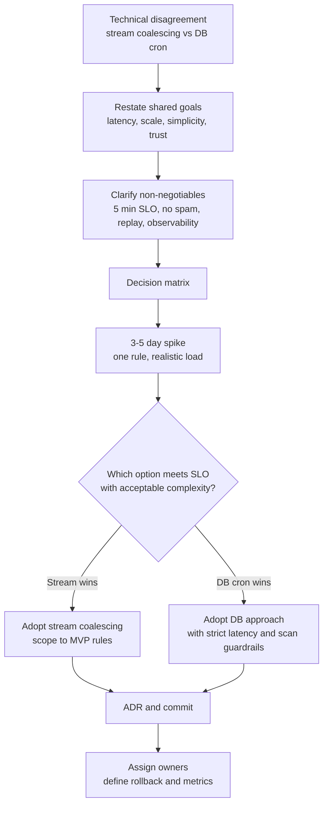
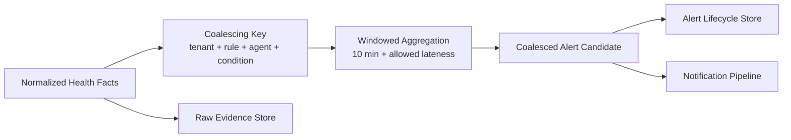
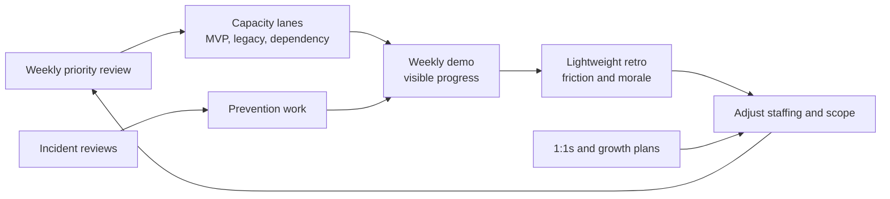

# Challenge 3: People And Talent Management

## Interview-Framing Answer

I would handle this as both a technical decision and a team-commitment moment. Engineer A and Engineer B are optimizing for different valid risks: A is protecting latency and scale, while B is protecting simplicity and operational cost. My role is to make the tradeoff explicit, gather evidence quickly, create a decision framework, and guide the team to disagree-and-commit once we choose.

For morale, I would protect the team from thrash by making priorities explicit, preserving growth opportunities, celebrating progress that is not only feature shipping, and turning operational distractions into learning and platform-improvement work rather than endless interruption.

## Part 1: Technical Conflict Resolution

## Requirement: Alert Coalescing

Alert coalescing prevents customer spam by grouping repeated or related events into one actionable alert.

Example:

- 50 `anti_tamper_disabled` events from the same agent over 10 minutes should become one alert.
- The alert should update evidence and count, not create 50 separate customer-visible records.
- The system must still preserve raw evidence for audit, replay, and debugging.

## The Two Positions

| Position | Strength | Risk |
| --- | --- | --- |
| Engineer A: stream-processing layer using Kafka Streams/Flink | Low-latency aggregation, scalable, close to event stream, better for 5-minute detection SLO | More infrastructure complexity, more operational burden, steeper learning curve |
| Engineer B: write raw events to DB, use async cron jobs to coalesce later | Simpler mental model, fewer moving services, easier first implementation | Harder to meet latency SLO, expensive DB writes/scans, delayed alerts, cron failure modes, risk of customer spam |

Both engineers are making legitimate points. I would avoid framing either position as "right" too early.

## How I Would Mediate

### 1. Start With Shared Principles

I would bring both engineers into a design review and restate the common goal:

- Meet customer-facing alert latency requirements.
- Prevent duplicate or spammy alerts.
- Keep the system operable by a 10-person full-stack team.
- Preserve raw evidence.
- Avoid overbuilding before proving MVP.

This shifts the conversation from "my design vs your design" to "which design best satisfies the constraints."

### 2. Clarify Non-Negotiables

For this problem, the non-negotiables are:

- Health anomalies must be detected within 5 minutes.
- Alert coalescing must happen before customer notification.
- Raw events must remain replayable.
- The design must survive billions of daily events.
- The UI/API path must not scan raw events.
- The system must be observable and debuggable.

These constraints heavily influence the decision.

### 3. Create A Decision Matrix

| Criteria | Stream Coalescing | DB + Cron Coalescing |
| --- | --- | --- |
| Meets 5-minute alert SLO | Strong | Risky under load |
| Handles billions of events/day | Strong if partitioned well | Risky due to write amplification and DB scans |
| Prevents notification spam before customer impact | Strong | Weaker unless cron is very frequent |
| Operational simplicity | Medium | Initially simpler |
| Replay/backfill support | Strong with stream and raw retention | Possible but harder to separate raw and derived state |
| Cost at scale | Usually better | Can become expensive with hot tables and repeated scans |
| Failure isolation | Strong with durable streams and lag visibility | Cron failures can be silent unless heavily instrumented |
| MVP speed | Medium | Fast for tiny scale |
| Long-term fit | Strong | Weak for Health Center scale |

### 4. Ask For Evidence, Not Opinions

I would time-box a short technical spike, probably 3-5 working days:

- Estimate event volume for top tenants.
- Prototype coalescing for one rule: anti-tamper disabled.
- Load test with realistic burst patterns.
- Compare detection latency, DB write amplification, query cost, failure modes, and operational dashboards.
- Validate how each approach handles replay and duplicates.

The spike should produce a one-page decision record, not an open-ended research project.

### 5. Decide With Clear Ownership

Given the stated requirements, I would likely guide the team toward a streaming coalescing approach for alert candidates, with a pragmatic MVP implementation:

- Use a stream-processing layer for short-window aggregation and dedupe before creating customer-visible alerts.
- Preserve raw events in the data lake or raw stream for audit/replay.
- Persist only coalesced alert lifecycle records and compact evidence to the transactional alert store.
- Avoid building a huge generic rule platform in MVP; start with focused coalescing operators for the first rules.

This honors Engineer A's latency and scale concerns while addressing Engineer B's complexity concern by limiting scope and using managed/platform-standard streaming where possible.

## Recommended Decision

Use stream-time coalescing for customer-visible alert creation.

### Why

- The system already has a streaming architecture for 5-minute detection.
- Coalescing after raw DB writes risks alert delay and expensive scans.
- Customer spam prevention must happen before notification.
- Stream lag and window processing are easier to observe than cron correctness at this scale.
- The design scales better for future grouped incidents.

### How To Keep It Pragmatic

- Start with one stream processor and a small set of windowed coalescing rules.
- Use the company's standard stream framework rather than introducing a niche tool.
- Keep raw retention separate from alert lifecycle storage.
- Define a simple coalescing key:
  - `tenant_id + rule_id + agent_id + condition_fingerprint`
- Define a coalescing window:
  - Example: 10-minute tumbling or sliding window with allowed lateness.
- Use idempotency on alert writes:
  - Create once, update count/evidence on repeats.
- Add dashboards:
  - input rate, output alert rate, coalescing ratio, lag, late events, DLQ.

## Decision Flow Diagram



## Alert Coalescing Architecture



## How I Would Handle The People Dynamic

### With Engineer A

I would acknowledge the correctness of the latency and scale concern, while asking A to help constrain the design to the smallest operable streaming solution.

Message:

> Your instinct on pre-database coalescing is aligned with the SLO. I need you to help us make it boring to operate, not just technically elegant.

### With Engineer B

I would acknowledge the complexity concern and ask B to own operational simplicity requirements for the chosen approach.

Message:

> Your concern about unnecessary infrastructure is valid. Even if we choose streaming, I want you to help define the guardrails that keep this maintainable for our team.

### With The Team

I would make the decision transparent:

- Here are the requirements.
- Here is the evidence.
- Here is the chosen design.
- Here is what we are not building yet.
- Here is how we will know if the decision is wrong.
- Here is the rollback or simplification path.

That lets people commit even if their preferred option was not chosen.

## Decision Record Template

```markdown
# ADR: Alert Coalescing Strategy

## Status
Accepted

## Context
Health Center must coalesce repeated health events before customer-visible alerting while meeting 5-minute detection SLO.

## Options
1. Stream-time coalescing with Kafka Streams/Flink.
2. Raw DB writes with asynchronous cron coalescing.

## Decision
Use stream-time coalescing for MVP alert candidates, scoped to the initial high-confidence rules.

## Rationale
- Better fit for latency and scale.
- Prevents notification spam before customer impact.
- Avoids high-volume DB scan pattern.
- Aligns with the existing streaming health-state architecture.

## Consequences
- Requires stream-processing operational expertise.
- Requires lag/freshness dashboards.
- Keeps raw events in replay storage separately from alert lifecycle DB.

## Revisit Trigger
Revisit if volume assumptions are wrong, stream operations become unsustainable, or MVP rules cannot be implemented reliably within the chosen framework.
```

## Part 2: Morale During Distractions And Delays

## Problem

The team is dealing with:

- A delayed Ingestion Gateway dependency.
- Legacy offline-status escalations.
- Pressure to ship a high-visibility MVP.
- Ambiguity around architecture and ownership.

This can create frustration, learned helplessness, and a feeling that the team is always reacting instead of building.

## Morale Strategy

### 1. Make Reality Visible Without Panic

I would keep a single visible plan that separates:

- Committed MVP work.
- Dependency-blocked work.
- Legacy stabilization work.
- Stretch work.

The team should not need to guess what matters this week.

### 2. Protect Focus With Explicit Capacity Allocation

Use planned lanes:

- Health Center critical path.
- Legacy stabilization.
- Dependency mitigation.
- Operational hardening.

This reduces resentment because interrupts are acknowledged and staffed rather than randomly dumped on whoever is available.

### 3. Create Visible Progress During Dependency Delays

Even if gateway routing is delayed, the team can still ship:

- Simulator.
- Replay harness.
- UI with mocked read models.
- API contracts.
- Rule engine dry-run.
- Observability dashboards.
- Legacy status comparison mode.

Progress matters for morale. People need to see that the delay is not freezing their impact.

### 4. Turn Operational Work Into Growth

Operational distractions can become career-building if framed well:

- Senior engineers lead incident review and prevention.
- Mid-level engineers own runbooks, dashboards, and regression automation.
- Frontend engineers design freshness and degraded-state UX.
- QA engineers build replay and load-test harnesses.
- Backend engineers turn legacy lessons into Health Center migration work.

### 5. Recognize Unflashy Work

I would explicitly recognize:

- Reducing support escalations.
- Improving detection and observability.
- Writing runbooks.
- Fixing flaky legacy logic.
- Preventing false positives.
- Helping another team unblock integration.

This matters because platform work often feels invisible until it fails.

### 6. Maintain Technical Agency

Let engineers own decisions at the right level:

- Engineers propose designs and spikes.
- Tech lead facilitates architecture coherence.
- Manager clarifies constraints, staffing, and decision deadlines.
- Team commits through ADRs.

### 7. Keep Growth Plans Alive

Even under pressure, I would keep:

- 1:1s.
- Career conversations.
- Design review opportunities.
- Incident commander rotations.
- Demo ownership.
- Mentoring pairs.

Skipping these for a quarter usually creates a larger retention and execution problem later.

## Morale Operating Rhythm



## Concrete Actions I Would Take

First week:

- Hold a reset meeting explaining priorities, constraints, and decision-making model.
- Create visible roadmap with capacity lanes.
- Assign a bounded tiger team for legacy offline escalations.
- Identify dependency mitigation work not blocked by Gateway.
- Start the alert coalescing spike and define ADR deadline.

First month:

- Celebrate first end-to-end synthetic Health Center event.
- Rotate demo ownership.
- Publish first operational dashboard.
- Close at least one legacy escalation root cause.
- Run a lightweight morale retro.

Quarter:

- Give engineers ownership areas aligned to growth.
- Nominate incident and architecture leads.
- Convert operational fixes into promotion-caliber impact narratives.
- Keep scope honest and escalate dependency risks early.

## Interview Close

For the technical conflict, I would slow the conversation down just enough to make the decision evidence-based, then speed the team up with a clear ADR and commitment. For morale, I would give the team clarity, agency, and visible wins. Dependency delays and operational distractions are normal in live platforms; the leadership challenge is making sure they become managed work, not ambient chaos.

