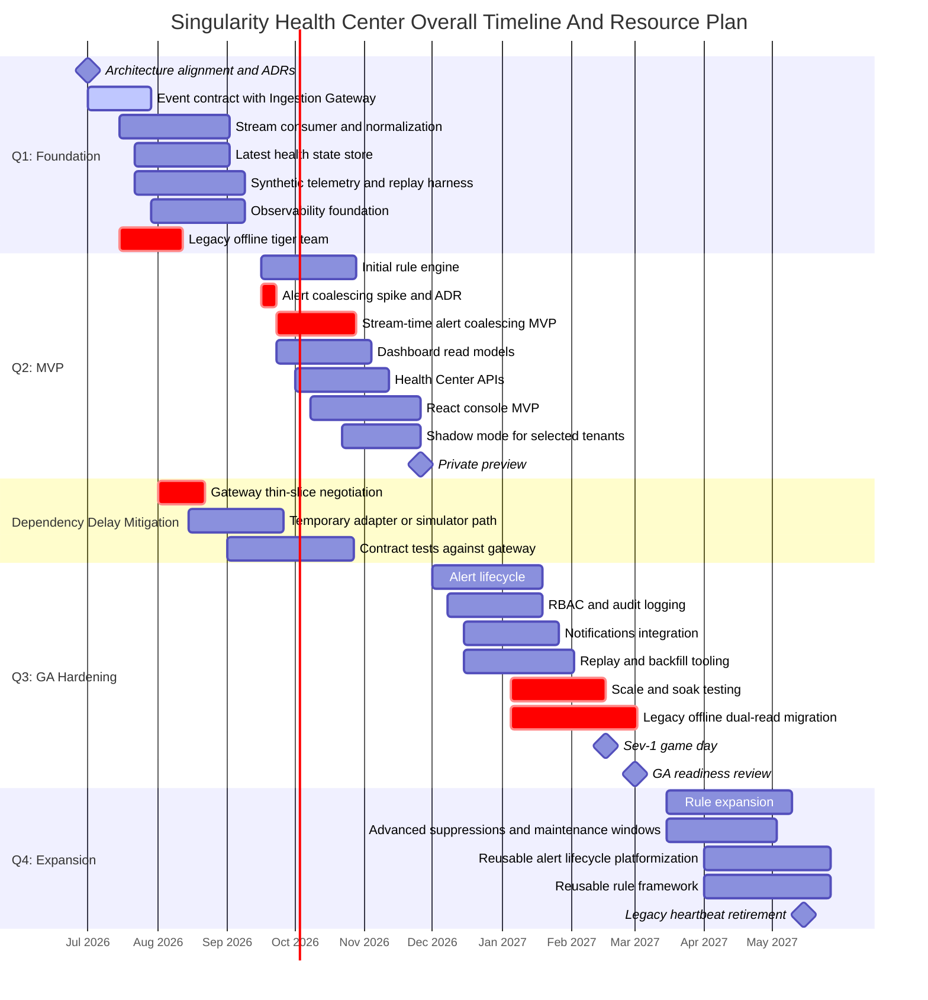
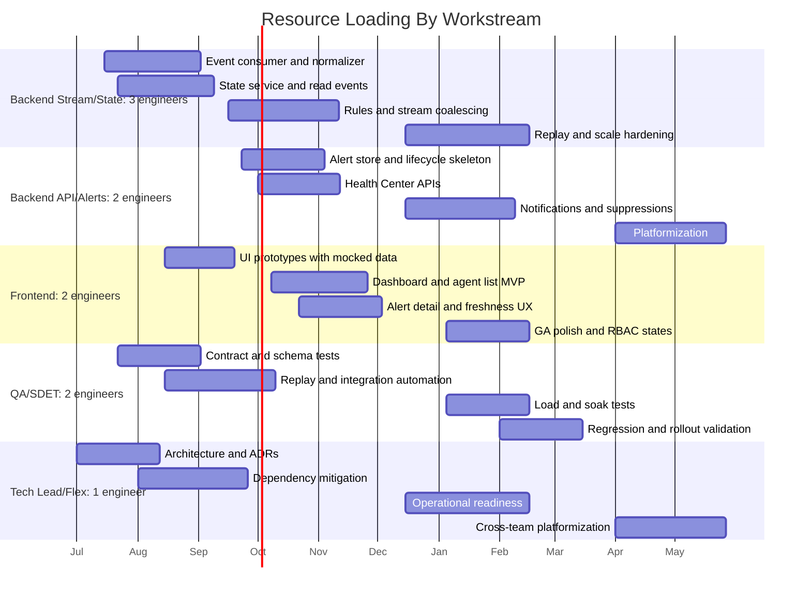

# Overall Project Management Gantt And Resource Plan

## Purpose

This plan consolidates the Health Center architecture, delivery, operations, and people-management work into a project-management view. It is designed for an interview discussion where the panel wants to see how an L7+ engineering manager sequences work across quarters while handling dependencies and live-site distractions.

## Resource Assumptions

Team size: 10 engineers.

| Resource Group | Count | Primary Focus |
| --- | ---: | --- |
| Backend stream/state | 3 | Consumers, normalization, state, rules, replay. |
| Backend API/alerts | 2 | Alert lifecycle, coalescing, APIs, notifications, suppressions. |
| Frontend | 2 | Health Center dashboard, agent list, alert detail, freshness UX. |
| QA/SDET | 2 | Contract tests, integration automation, replay validation, load tests. |
| Tech lead/flex | 1 | Architecture coherence, cross-team integration, incident support. |

Temporary allocation during legacy offline-status spike:

| Lane | Engineers | Duration | Goal |
| --- | ---: | --- | --- |
| Legacy stabilization tiger team | 3 | 2-4 weeks | Reduce false offline escalations and add regression coverage. |
| Health Center critical path | 5 | Ongoing | Keep MVP moving. |
| UI/QA/support tooling | 2 | Ongoing | Dashboard work, test automation, support visibility. |

## Overall Timeline

The timeline assumes a July 2026 start. Adjust dates in an interview if the interviewer gives a different launch target.

## Resource Loading By Phase

## Critical Path

```mermaid
flowchart LR
    A["Event contract"] --> B["Telemetry consumer"]
    B --> C["Latest health state"]
    C --> D["Rule evaluation"]
    D --> E["Alert coalescing"]
    E --> F["Read models"]
    F --> G["APIs under 200ms"]
    G --> H["React console MVP"]
    H --> I["Private preview"]
    I --> J["Scale and soak"]
    J --> K["GA readiness"]
```

Critical-path risks:

- Ingestion Gateway routing delay.
- Alert coalescing decision churn.
- Legacy offline-status escalation consuming too much capacity.
- API read model not meeting 200ms P95.
- Rule false positives eroding preview trust.
- Inadequate freshness observability before customer exposure.

## Milestone Gates

| Milestone | Gate | Required Evidence |
| --- | --- | --- |
| Foundation complete | Pipeline can process synthetic/replayed events | State updates, lag dashboards, DLQ, canary freshness. |
| MVP private preview | Customer-visible dashboard is safe | P95 API < 200ms, freshness UX, basic RBAC, shadow rule review. |
| Alerting preview | Alerts are trustworthy | Coalescing ratio, duplicate rate, false-positive review, suppression. |
| GA readiness | Broad rollout is safe | Scale test, game day, replay/backfill, support docs, rollback plan. |
| Legacy retirement | Old offline status can be removed | Dual-read comparison, tenant canary success, escalation rate reduced. |

## Operating Cadence

| Cadence | Meeting | Purpose |
| --- | --- | --- |
| Daily | Team standup | Coordinate execution and blockers. |
| Twice weekly during incidents | Legacy escalation review | Track false offline impact and patches. |
| Weekly | Dependency sync with Gateway team | Track contract, thin-slice, routing dates. |
| Weekly | Product/engineering checkpoint | Review scope, risks, customer preview feedback. |
| Weekly | Demo | Preserve visible progress and morale. |
| Biweekly | Architecture review | Resolve design decisions through ADRs. |
| Monthly | Executive review | Timeline, risks, staffing, launch confidence. |
| Per milestone | Operational readiness review | SLOs, runbooks, dashboards, rollback. |

## Resource Guardrails

- Keep at least 5 engineers on the Health Center MVP critical path during operational distractions.
- Time-box legacy stabilization tiger team work and review allocation weekly.
- Reduce MVP scope before cutting observability, freshness, idempotency, or security.
- Use a simulator/replay path to keep the team productive during Gateway delays.
- Require ADRs for decisions that affect latency, cost, or operational complexity.
- Keep QA involved from Q1, not only before GA.

## Interview Summary

The project plan has three lanes running in parallel: Health Center delivery, dependency mitigation, and live-platform stabilization. The Gantt chart shows that the team can keep making progress even if the Ingestion Gateway slips, but GA should remain gated on real telemetry freshness, scale tests, alert quality, and operational readiness.

