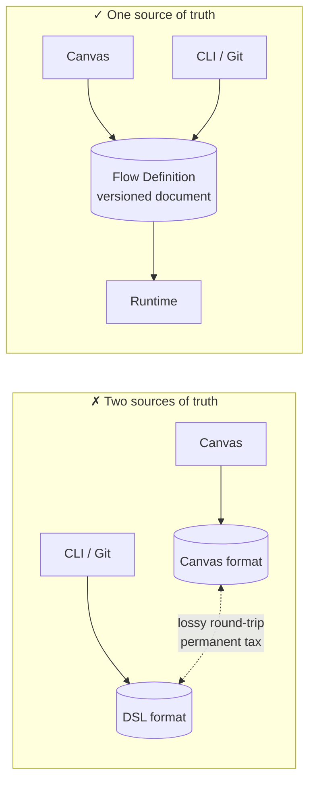
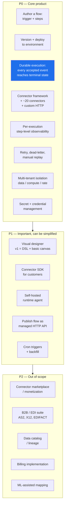
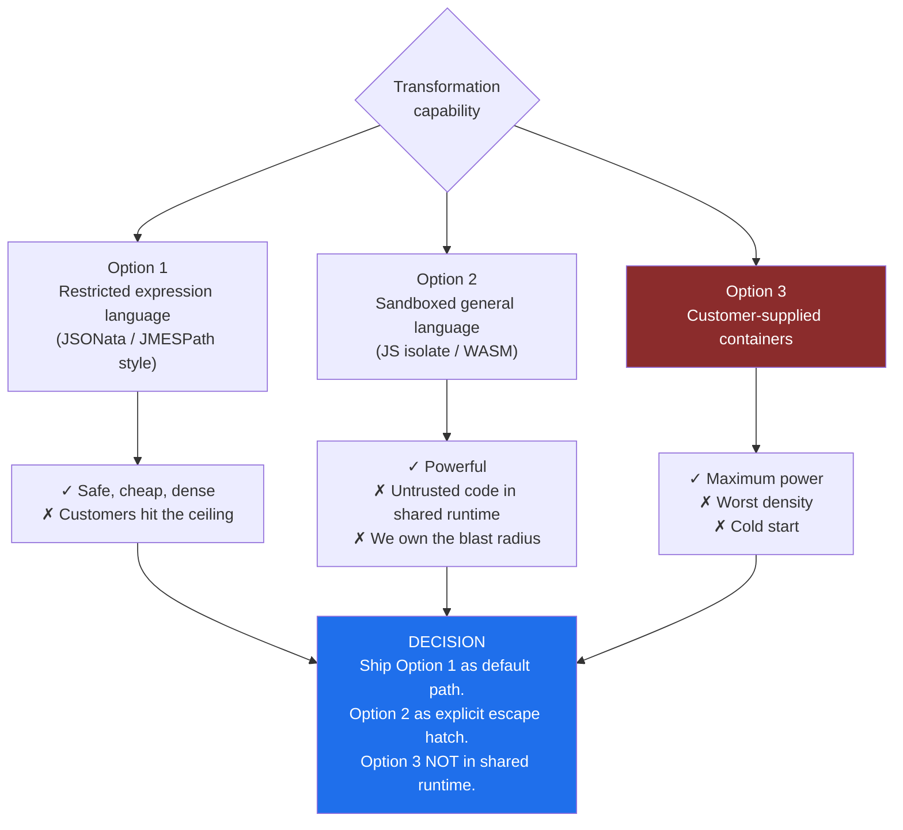
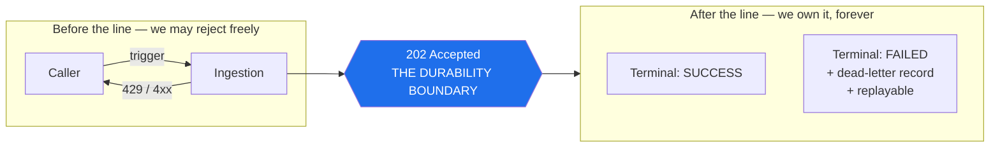
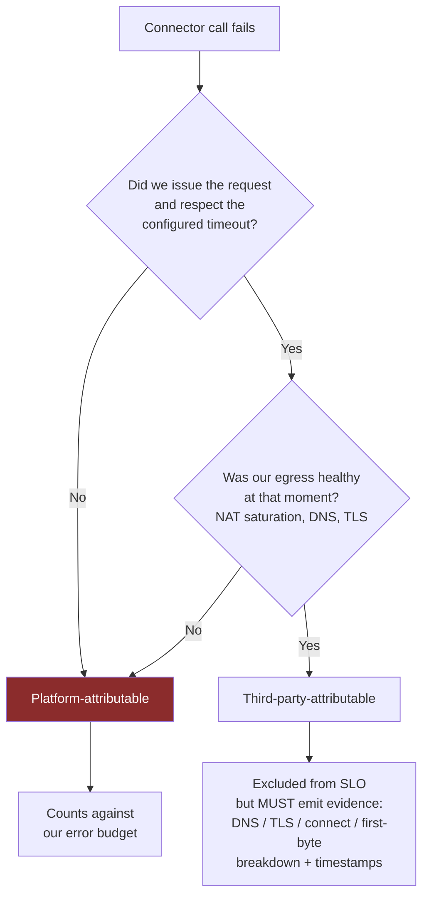

# 01 — Requirements and Scope

[← Index](README.md) · [Next: Capacity Estimation →](02-capacity-estimation.md)

---

## Problem framing

We are building a **platform**, not an integration. Customers author *flows* that move and transform data
between systems they do not control — Salesforce, SAP, Postgres, S3, Kafka, arbitrary REST/SOAP endpoints,
SFTP. The platform runs those flows, guarantees they complete, and shows the customer what happened when
something breaks.

### Clarifications that changed the design

| Question | Answer | Consequence |
|---|---|---|
| Who is the primary user? | Both developers and business users; **developer is the buyer** | The flow definition is a **versioned declarative document**; the visual canvas *renders* it. One format, one source of truth. |
| What triggers a flow? | Majority **event-driven and scheduled batch**; sync APIs are a minority | The platform is fundamentally an **async durable workflow engine**. The sync path is a thin special case layered on top. |
| Shared or dedicated runtime? | **Shared by default**, dedicated as a topology | Integration traffic is spiky and mostly idle; dedicated always-on compute per tenant destroys gross margin. |
| On-prem systems? | Yes — many targets are unreachable from our cloud | A **self-hosted runtime agent** (outbound-only) is a real requirement, not a nice-to-have. |

### Why the canvas must not have its own format



---

## Scope



> **The single most important P0 is A3.** Customers tolerate slow integrations.
> They do not tolerate silently lost orders.

---

## The riskiest requirement: customer transformation logic

Customers need expression logic — field mapping, conditionals, string manipulation, aggregation.
This means **running untrusted customer code**, which is the highest-severity risk in the whole platform.



**Guardrails for the escape hatch:** hard CPU and wall-clock limits per invocation, memory cap enforced by the
isolate (not the process), and **no ambient network access** — all egress goes through the connector layer so
it is policy-controlled and auditable.

---

## Non-functional requirements

```text
Control plane (authoring, deploy, console)
  Availability:            99.9%
  Deploy propagation:      p99 < 60s from "deploy" to runtime serving new version

Data plane — trigger ingestion  (THE DURABILITY BOUNDARY)
  Availability:            99.99%
  Ingest latency:          p50 < 30ms, p99 < 150ms   (accept + durably persist)
  Durability:              < 1 accepted event lost per 10^11 events

Data plane — execution
  Scheduling latency:      p50 < 1s, p99 < 15s   (accepted -> first step starts)
  End-to-end:              UNBOUNDED BY DESIGN — flows call slow third parties.
                           SLO covers OUR overhead only.
  Throughput:              2B executions/day steady; absorb 10x tenant bursts

Synchronous API-triggered flows (minority path)
  Platform overhead:       p99 < 100ms excluding downstream calls
  Availability:            99.95%

Observability
  Trace visibility:        p99 < 10s after step completion
  Retention:               30d hot, 1y cold (configurable)

Disaster recovery
  RTO < 30 min, RPO < 1 min for accepted-but-unexecuted work
```

### The durability boundary, drawn explicitly



### What we deliberately did *not* promise

We did **not** promise end-to-end latency. A flow calling a customer's SAP instance can take four minutes
because SAP took four minutes. Putting that in an SLO means being on-call for someone else's ERP.

This forces a hard requirement: **every failure must be classified as ours vs. theirs**, defensibly.



> **Bias:** over-attribute to ourselves. The moment customers believe we are gaming the classification,
> the metric is worthless — and it is also the basis of support arguments and service credits.
