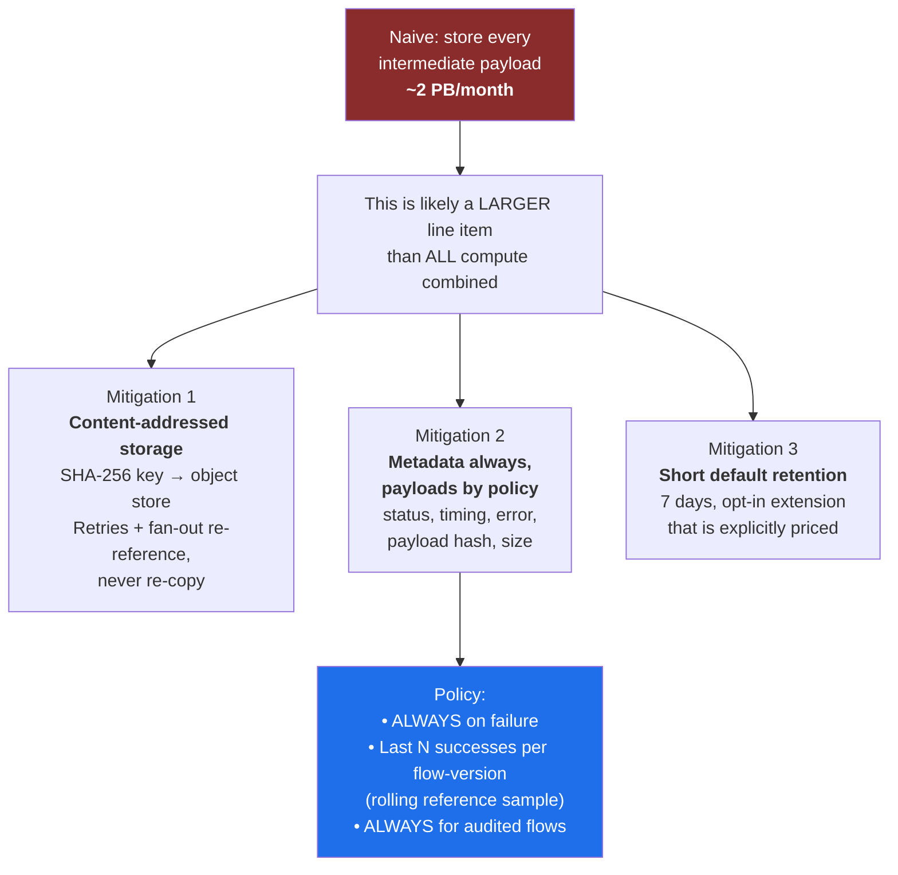
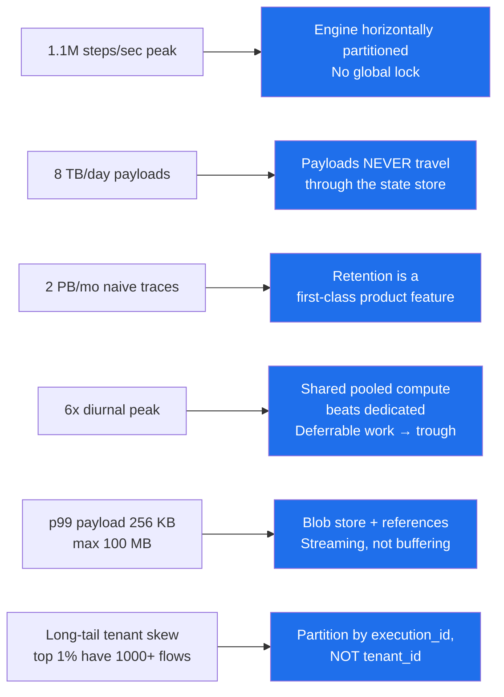
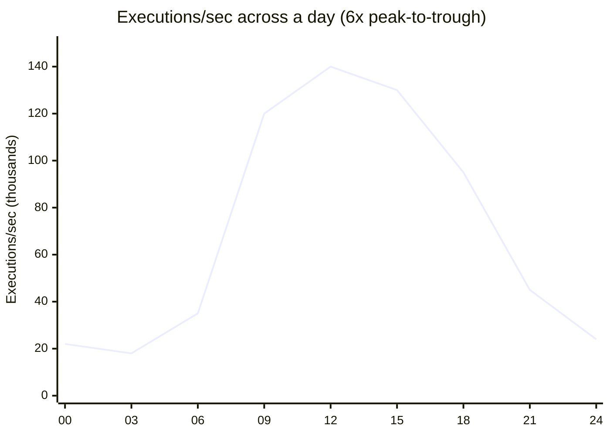

# 02 — Capacity Estimation

[← Requirements](01-requirements-and-scope.md) · [Index](README.md) · [Next: APIs and Data Model →](03-api-and-data-model.md)

---

## Traffic math

```text
Tenants:            5,000
Flows deployed:     200,000   (~40/tenant, long tail — top 1% have 1000+)

Executions:         2B/day
    2e9 / 86,400                    ≈  23,000 executions/sec  (average)
    Business-hours + timezone clustered; peak factor ≈ 6x
                                    ≈ 140,000 executions/sec  (peak)

Steps per execution: 8 (average)
    23,000 x 8                      ≈ 185,000 steps/sec  (average)
    140,000 x 8                     ≈ 1,100,000 steps/sec (peak)
```

> **The step rate — not the execution rate — sizes the engine.** ~1.1M steps/sec at peak means
> the state machine layer must be horizontally partitioned with **no global lock anywhere on the hot path**.

---

## Payload and storage math

```text
Payload size:   median 4 KB · p99 256 KB · max 100 MB (file-transfer flows)
                Median dominates COUNT; p99+ dominates BYTES.

Trigger payload volume:
    2e9 x 4 KB                      ≈ 8 TB/day

Execution trace metadata:
    8 steps x ~1 KB structured metadata = 8 KB/execution
    2e9 x 8 KB                      ≈ 16 TB/day
    30-day hot + replication        ≈ 1.4 PB

Naive full payload retention (every step input AND output):
    8 steps x 4 KB x 2e9            ≈ 64 TB/day
                                    ≈ 2 PB/month hot        ⚠️
```

### The number that killed the naive design



**Why sampling successes is acceptable:** debugging demand is overwhelmingly concentrated on failures and
the runs immediately preceding them. Keeping *all* failures plus a rolling sample of successes covers
"show me what a good run looks like" without paying for two billion of them.

---

## Estimate → design implication



---

## Diurnal load shape (why pooling wins)



Provisioning for the peak wastes most of the day. Two levers follow directly:

1. **Reserved capacity for the trough, elastic for the peak.**
2. **Deliberately schedule deferrable work into the trough** — batch flows, backfills, reindexing.
   This is simultaneously a cost lever and a product feature ("economy tier" pricing for deferrable flows),
   and it only works if the scheduling primitives exist early.

---

## Uncertainty to validate

| Assumption | Confidence | Why it matters | How to validate |
|---|---|---|---|
| 6x peak factor | Low | Drives a large fraction of the compute budget | Measure real traffic before committing capacity; keep the elastic tier large early |
| 8 steps/execution average | Medium | Sizes the engine directly | Instrument from day one |
| 4 KB median payload | Medium | Sizes storage and cross-AZ transfer | Instrument at ingestion |
| Blob dedup rate | Low | Determines actual content-addressing savings | Measure hash collision/reuse rate in Stage 1 |
