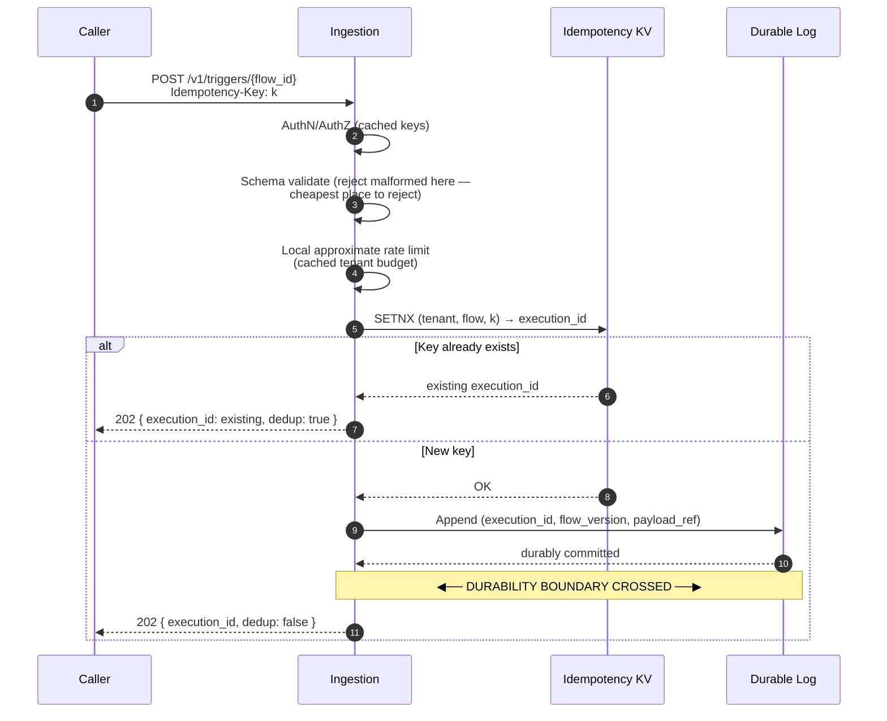
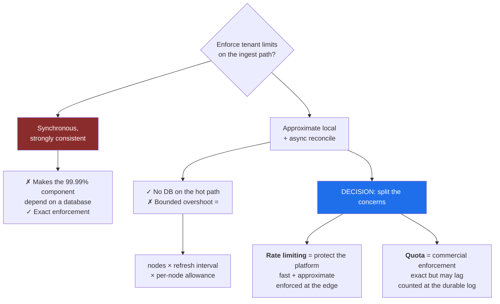
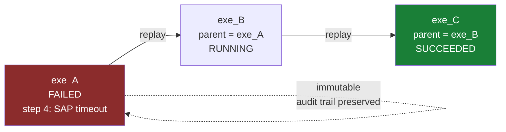
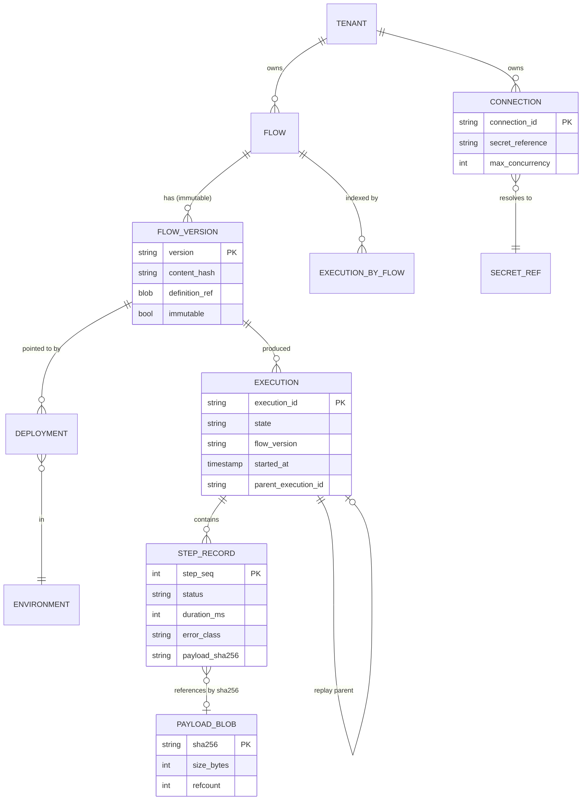
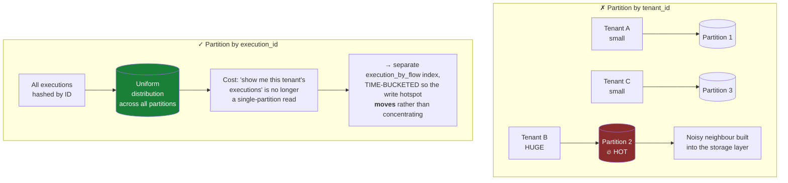
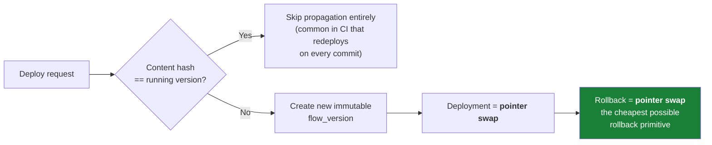

# 03 — APIs and Data Model

[← Capacity](02-capacity-estimation.md) · [Index](README.md) · [Next: High-Level Architecture →](04-high-level-architecture.md)

---

## Surface 1 — Trigger ingestion (the durability boundary)

```http
POST /v1/triggers/{flow_id}
Idempotency-Key: <caller-supplied or derived>
Content-Type: application/json

{ "payload": { ... }, "headers": { ... } }

--- 202 Accepted ---
{
  "execution_id": "exe_01HQ...",
  "status": "ACCEPTED",
  "dedup": false
}
```

### Deliberate choices

| Choice | Reason |
|---|---|
| **`202`, not `200`** | We accepted responsibility; we have **not** done the work. `200` invites callers to assume completion. |
| **Idempotency-Key required for at-least-once sources** | Webhook senders retry. Without dedup we double-charge someone's customer. Scoped to `(tenant, flow, key)`, TTL 24h. |
| **Return the *original* `execution_id` on duplicate** | With `dedup: true`. We don't silently swallow — the caller needs to correlate. |
| **Write path is: validate → append to log → return** | Nothing else. No Postgres lookup of the flow definition. No DB quota check. Everything must be in-memory, cached, or async. |



### Why quota checks are asynchronous



Counting at the **durable log** rather than at the API means the billing count is exact even though the
limit is fuzzy.

---

## Surface 2 — Execution control

```http
GET  /v1/executions/{execution_id}          → status + step timeline
POST /v1/executions/{execution_id}/replay   → NEW execution, links to parent
POST /v1/executions/{execution_id}/cancel
GET  /v1/flows/{flow_id}/executions?cursor=&status=&from=&to=
```

- **Cursor pagination** on `(tenant, flow, started_at, execution_id)`.
  Offset pagination over a table taking 23,000 inserts/sec is a guaranteed incident.
- **Replay creates a new execution** referencing the parent, never mutates the original.
  Mutating history destroys the audit trail — which is frequently the customer's compliance artifact.



---

## Data model

| Entity | Partition key | Sort key | Notes |
|---|---|---|---|
| `flow` | `tenant_id` | `flow_id` | Metadata only; **definition body in object store** |
| `flow_version` | `flow_id` | `version` | **Immutable**; content hash of definition |
| `deployment` | `(tenant_id, env)` | `flow_id` | Pointer to active `flow_version` |
| `execution` | `execution_id` | — | State machine record; hot, high-churn |
| `execution_by_flow` | `(flow_id, time_bucket)` | `started_at, execution_id` | Query index for the console |
| `step_record` | `execution_id` | `step_seq` | Timing, status, error, **payload hash** |
| `payload_blob` | `sha256` | — | Object storage, content-addressed |
| `connection` | `tenant_id` | `connection_id` | Credential **reference**, never the secret |
| `dedup_key` | `(tenant, flow, idem_key)` | — | TTL 24h, KV store |



---

## Three modelling decisions worth defending

### 1. `execution` is partitioned by `execution_id`, not `tenant_id`



### 2. `connection` stores a reference, never a credential

Secrets live in a dedicated store with per-tenant encryption keys. The runtime resolves the reference to a
**short-lived credential at step execution time**.

> This matters because the credential blast radius *is* the product risk: we hold OAuth tokens and database
> passwords for thousands of enterprises' production systems. That is a more attractive target than our own data.

### 3. `flow_version` is immutable and content-hashed



Immutability also answers *"which version of the logic processed this record?"* — a question customers ask
during incidents, sometimes months later, sometimes with auditors present. Mutable versions make that
unanswerable.
