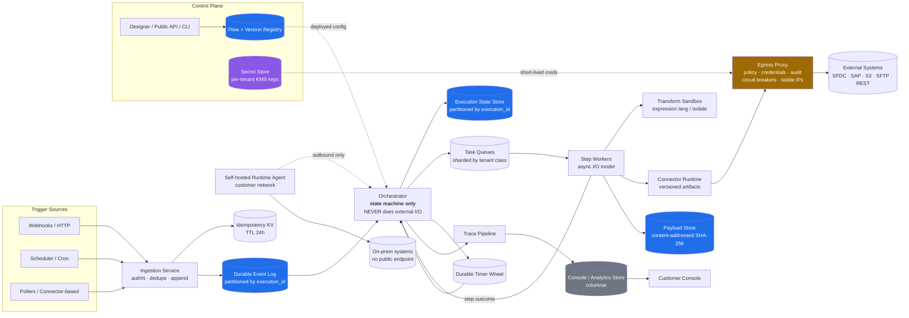
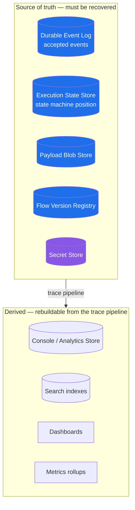
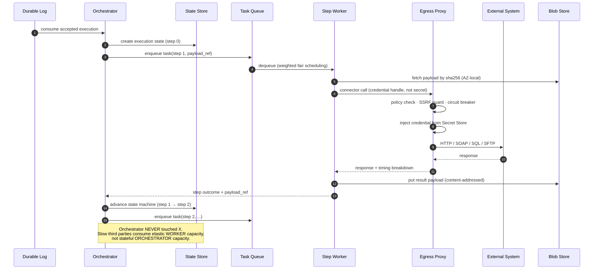
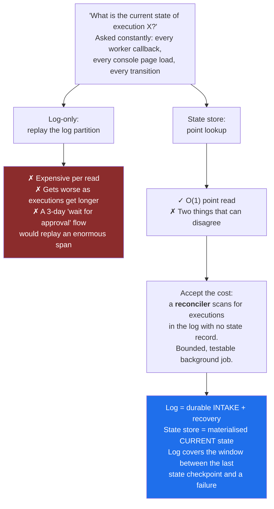
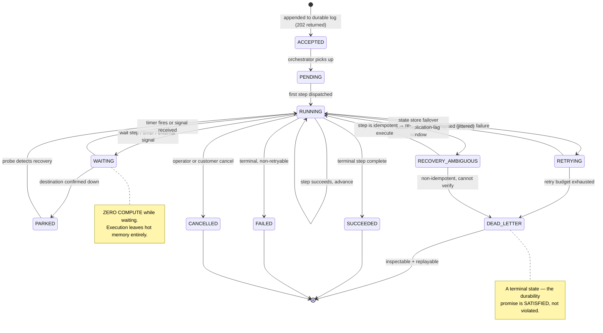

# 04 — High-Level Architecture

[← APIs and Data Model](03-api-and-data-model.md) · [Index](README.md) · [Next: Execution Semantics →](05-execution-semantics.md)

---

## Component architecture



**Legend** — Blue: source of truth · Purple: secrets · Orange: security choke point · Grey: derived/rebuildable

---

## Source of truth vs. derived

This boundary defines what a catastrophic restore actually needs to recover.



---

## The three paths

### Write path — minimal dependencies by design

```text
Trigger → Ingestion → [authN · dedupe · append to log] → 202
```

Three operations. Nothing else. The log is the system of record for *"we accepted this."*

### Execution path — orchestrator decides, worker acts



### Async / derived path

```text
Orchestrator → Trace Pipeline → Analytics Store → Console
                              → Metrics / SLO computation
                              → Per-tenant health view (a product feature)
```

---

## Why the orchestrator does no I/O

```mermaid
flowchart TB
    subgraph Merged["✗ Merged: orchestrator performs connector calls"]
        M1[Flow A calls a hung SFTP server<br/>10-minute timeout]
        M1 --> M2[Occupies an orchestrator thread]
        M2 --> M3[That thread is ALSO responsible<br/>for advancing other executions]
        M3 --> M4["One slow third party degrades<br/>the correctness/durability tier"]
    end

    subgraph Split["✓ Split: orchestrator decides, worker acts"]
        P1[Flow A calls a hung SFTP server]
        P1 --> P2[Occupies a WORKER slot]
        P2 --> P3["Workers are stateless, cheap, elastic<br/>Scale them out; shed them freely"]
        P3 --> P4["Orchestrator keeps advancing<br/>every other execution"]
    end

    style M4 fill:#8b2c2c,color:#fff
    style P4 fill:#1a7f37,color:#fff
```



**Division of responsibility:**

| Component | Job | Failure tolerance |
|---|---|---|
| Orchestrator | Durability and correctness of state transitions | Low — stateful, harder to scale |
| Worker | Dealing with the hostile outside world | High — stateless, cheap, elastic |

---

## Why both a durable log *and* a state store

A pure event-sourced design on the log alone is legitimate. It was rejected for **access pattern** reasons.



> Better to own one bounded reconciler job than to make every state read a log replay.

---

## Execution state machine



> **Key insight:** `DEAD_LETTER` is a *terminal state*, not a failure of the durability promise.
> The promise is "reaches a terminal state," not "always succeeds."
