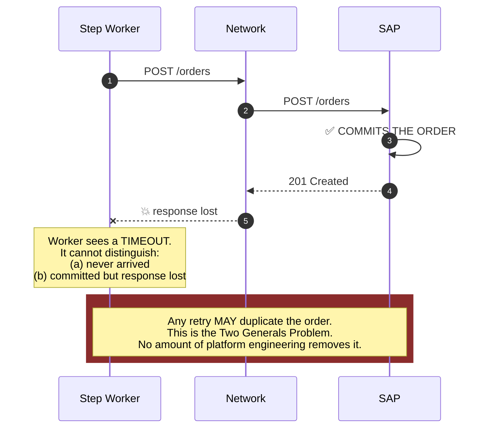
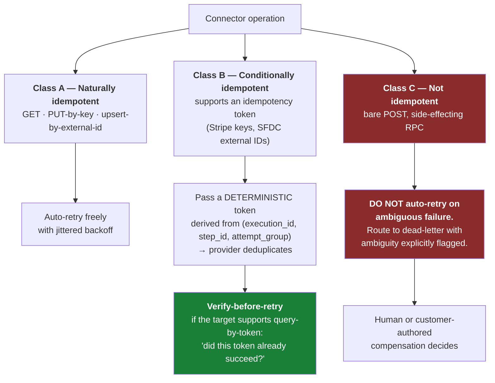
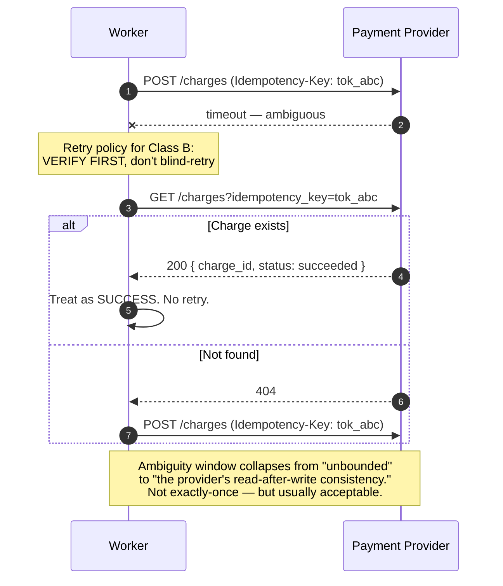
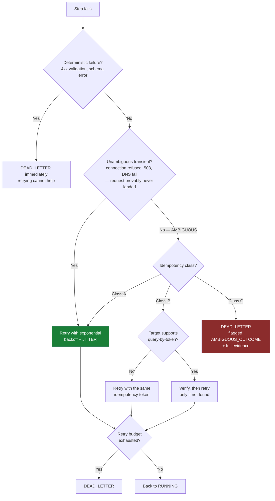
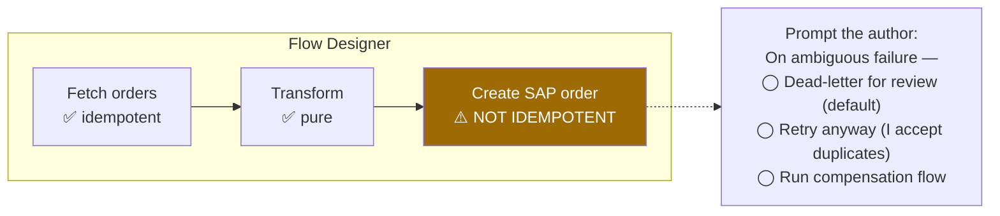

# 05 — Execution Semantics

[← Architecture](04-high-level-architecture.md) · [Index](README.md) · [Next: Multi-Tenancy →](06-multi-tenancy-and-isolation.md)

---

## The guarantee, stated honestly

> **At-least-once execution of each step, with exactly-once *state transition* inside our system.**
>
> The step's side effect on a third-party system **may happen more than once.**

We cannot make an arbitrary HTTP `POST` to a customer's ERP idempotent by wishing.

### The failure that makes it unavoidable



---

## What we *can* do: idempotency classification

Each connector operation **declares** its idempotency class. The engine's retry policy differs per class.



### The deterministic idempotency token

```text
token = f(execution_id, step_id, attempt_group)

  • STABLE across retries of the same logical step
  • DIFFERENT across replays (a replay is a new logical attempt)
```

### Verify-before-retry collapses the ambiguity window



---

## Retry decision flow



---

## Surfacing it in the product

> If we hide this, **every customer discovers it during their first production incident.**

The designer must:

- Visibly mark non-idempotent steps with a warning affordance.
- Prompt the author to configure ambiguous-failure behaviour explicitly.
- Show the dead-letter queue prominently, with the ambiguity reason attached.



---

## What we refuse to do

| Temptation | Why we refuse |
|---|---|
| Claim "exactly-once" in marketing | The support cost of an over-promised guarantee exceeds the sales value. |
| Auto-retry Class C operations by default | Silently duplicates business transactions in customers' systems of record. |
| Hide the ambiguity from the console | The customer must be able to decide; they know whether a duplicate order is recoverable. |
| Build our own dedup for arbitrary targets | We cannot see the target's internal state. The guarantee must come from the provider. |

> When a customer insists they need exactly-once for a payment step: **the guarantee has to come from the
> payment provider, not from us.** Our job is to make using theirs easy — deterministic tokens plus
> verify-before-retry.
