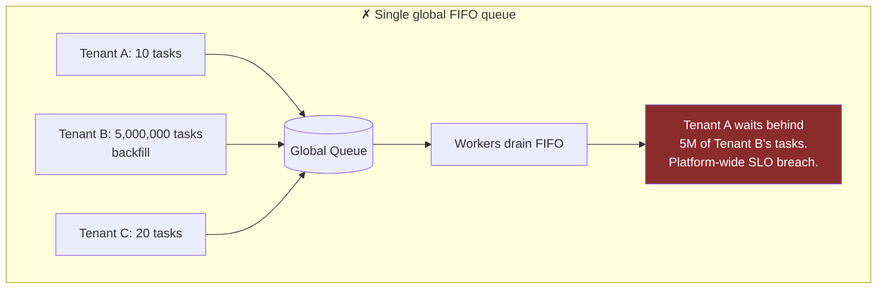
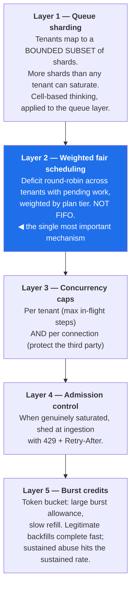
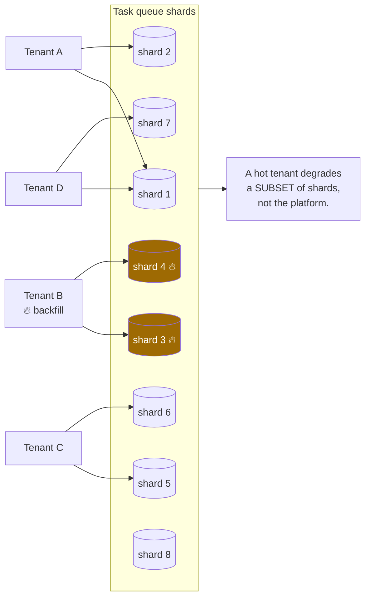
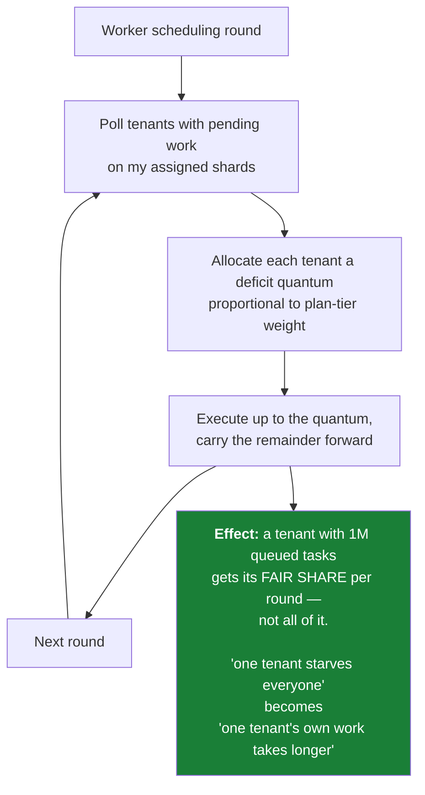
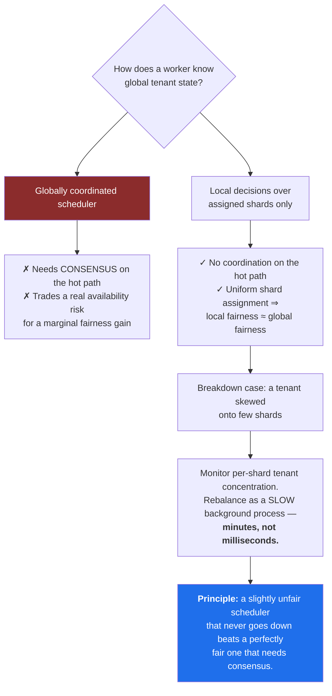
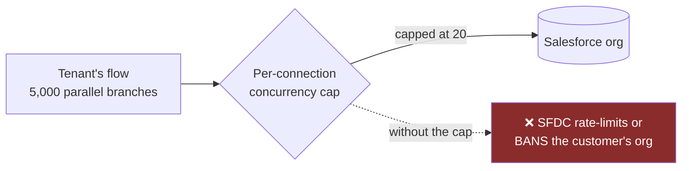
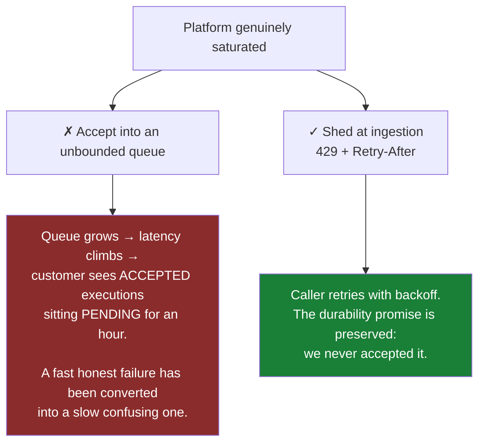
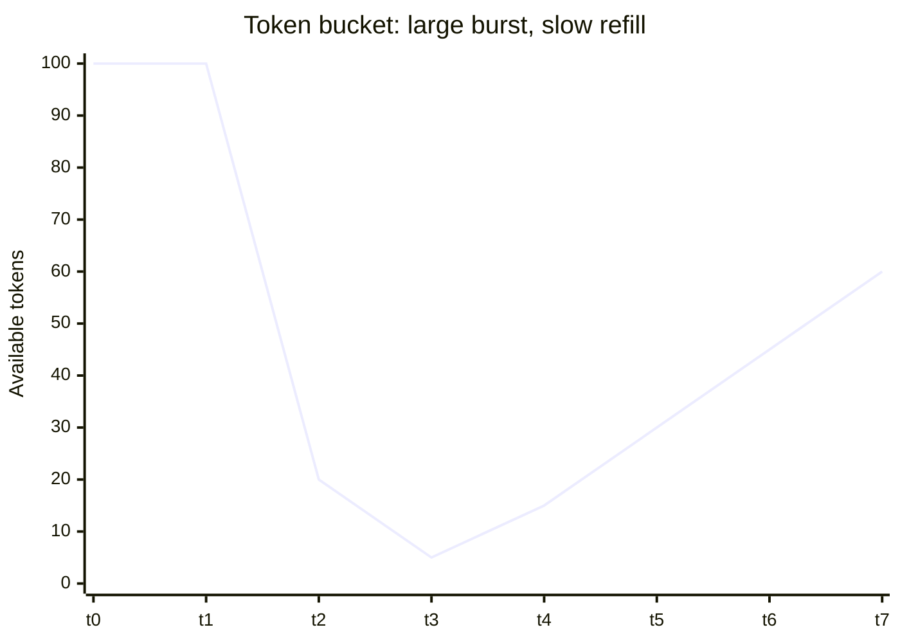

# 06 — Multi-Tenancy and Isolation

[← Execution Semantics](05-execution-semantics.md) · [Index](README.md) · [Next: Connectors and Egress →](07-connectors-and-egress.md)

---

## The scenario to design for

> One tenant starts a backfill and pushes **30% of total platform writes.**

Under a naive single-queue design: everyone's latency degrades, the scheduling SLO breaks platform-wide,
and we have a Sev1 caused by one customer doing something entirely legitimate.

**Backfills are normal. The design must assume them.**

---

## Five layers of defence

### Layer 1 — Queue sharding

### Layer 2 — Weighted deficit round-robin (the key mechanism)

**Why local, not globally coordinated:**

### Layer 3 — Per-connection concurrency caps protect the *customer*

> Respecting the downstream's limits is a **feature, not a restriction** — it protects the customer from
> themselves. The binding constraint is frequently the third party, not us.

### Layer 4 — Shed honestly rather than queue dishonestly

### Layer 5 — Burst credits make the common case pleasant

A legitimate backfill drains the burst and completes fast. Sustained abuse hits the slow refill rate.
A hard cap alone would make backfills impossible; a pure rate limit alone would make them painfully slow.

---

## Tenant isolation summary

| Dimension | Mechanism | Failure mode prevented |
|---|---|---|
| Storage | Partition by `execution_id`, not `tenant_id` | Hot partition from one large tenant |
| Queueing | Bounded shard subset per tenant | Global queue head-of-line blocking |
| Scheduling | Weighted deficit round-robin, local | Starvation by a backfilling tenant |
| Concurrency | Per-tenant + per-connection caps | Worker fleet exhaustion; third-party bans |
| Admission | 429 with `Retry-After` at ingestion | Unbounded queue growth, misleading PENDING states |
| Bursts | Token bucket, large burst / slow refill | Backfills becoming impossible or abuse being unbounded |
| Compute | No shared sandbox instance across tenants | Cross-tenant data exposure via isolate escape |
| Data access | Tenant scoping enforced at the **data layer**, not the API layer | Missing authorization check in one handler |
