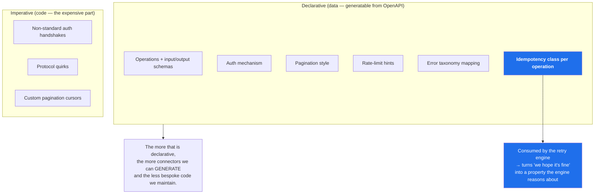
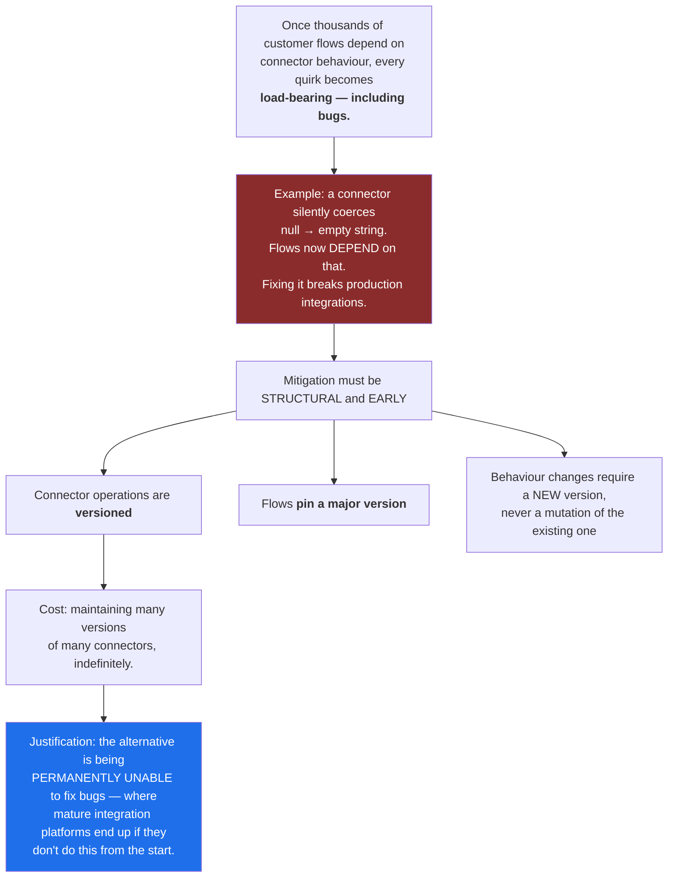
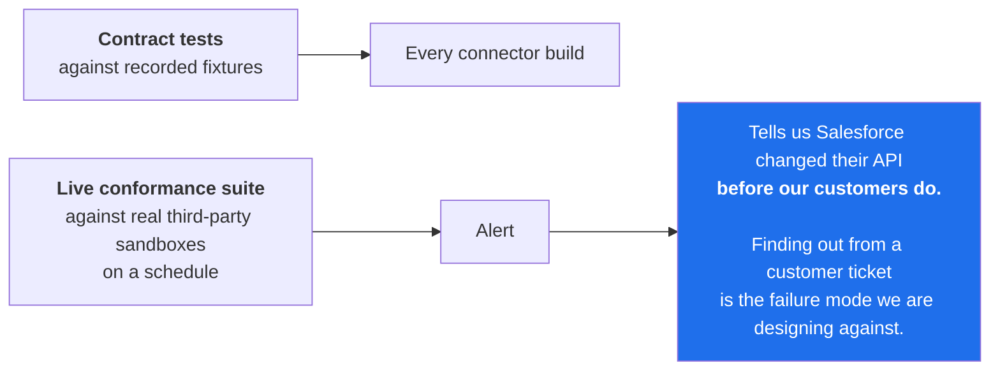
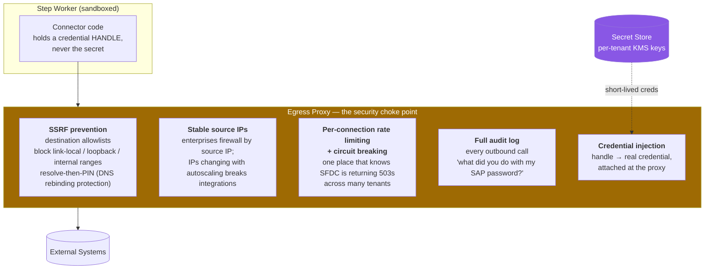
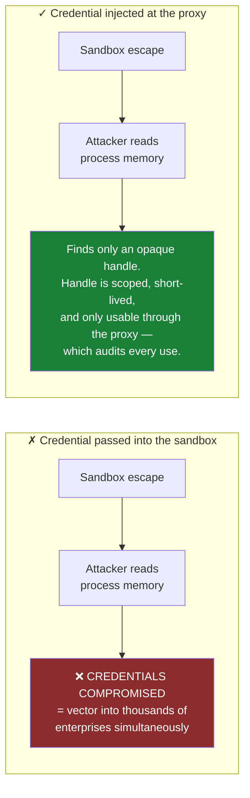
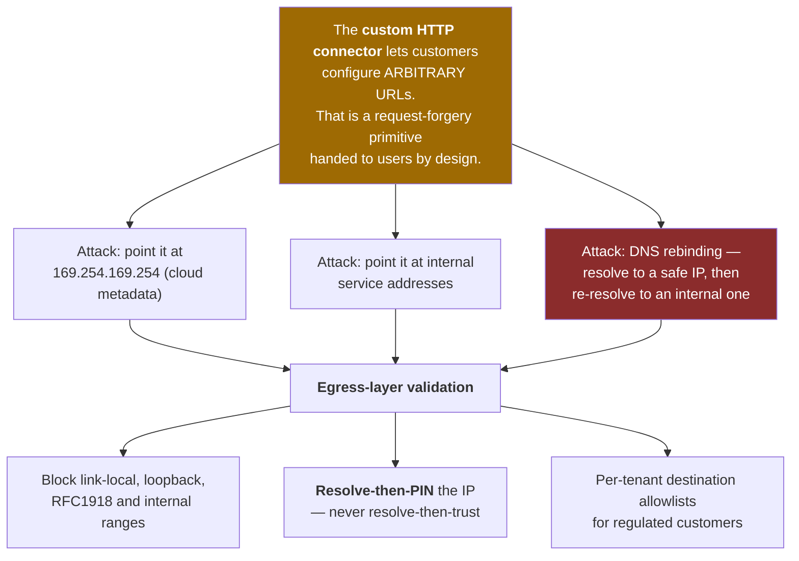
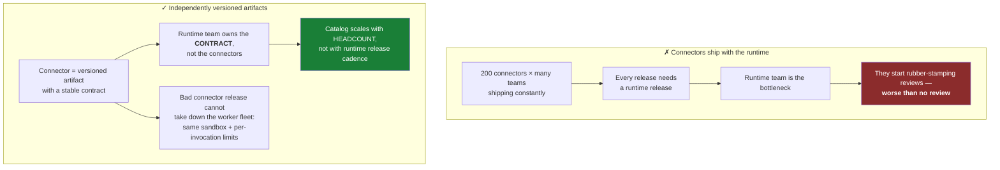
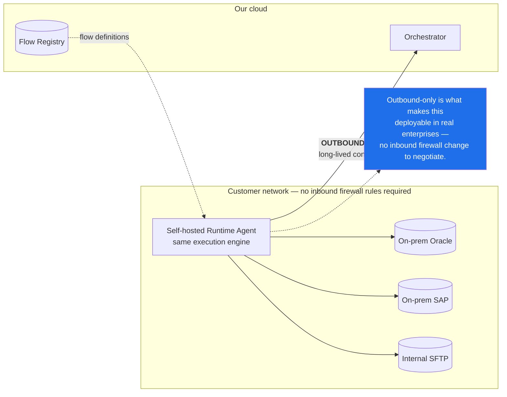

# 07 — Connectors and the Egress Layer

[← Multi-Tenancy](06-multi-tenancy-and-isolation.md) · [Index](README.md) · [Next: Long-Running Flows →](08-long-running-flows-and-scheduling.md)

---

> **The engine is table stakes. The connector catalog is the moat — and the largest ongoing engineering cost.**
> 200 connectors against third-party APIs that change without notice is a permanent maintenance liability.

---

## The connector contract

A connector **declares** as much as possible as data, and writes code only for genuinely custom behaviour.

## Versioning — the dominant long-term maintainability risk

### Testing the catalog

---

## The egress proxy

Easy to omit; **expensive to retrofit.** Connectors do **not** open sockets directly.

### Why credentials never enter connector code's address space

> **Structural mitigation:** sandbox escape ≠ credential compromise. Worth the extra network hop given that
> we are a concentrated store of thousands of enterprises' production credentials.

### The SSRF problem is inherent to the product

---

## Connector isolation and release independence

---

## Self-hosted runtime agent

Many integration targets are on-premises and unreachable from our cloud.

> **Acknowledged gap:** version skew between customer-deployed agents and the control plane is a serious
> long-term operational burden. See [Risks](13-decisions-and-risks.md).
