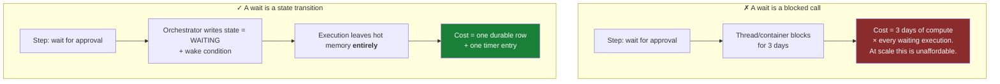
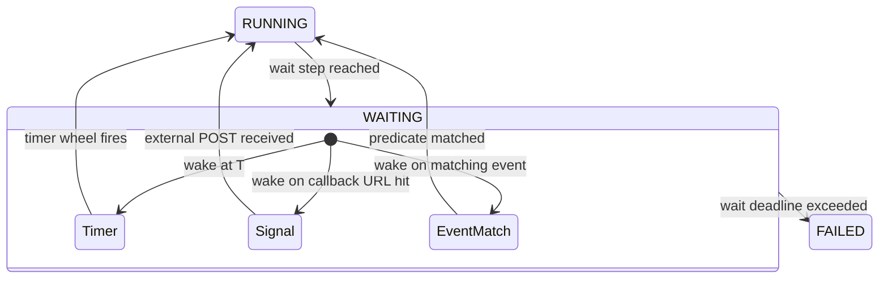
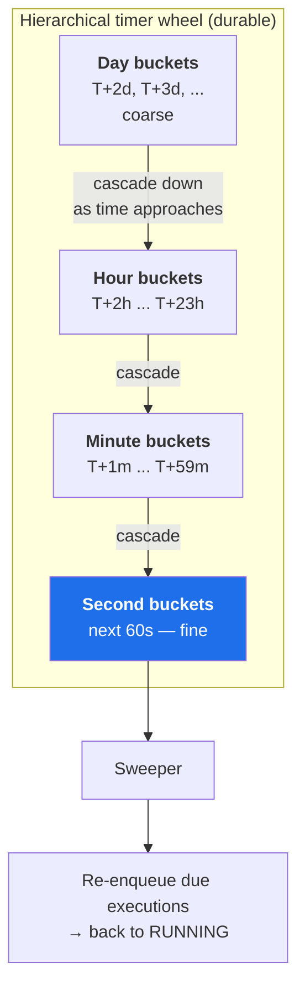
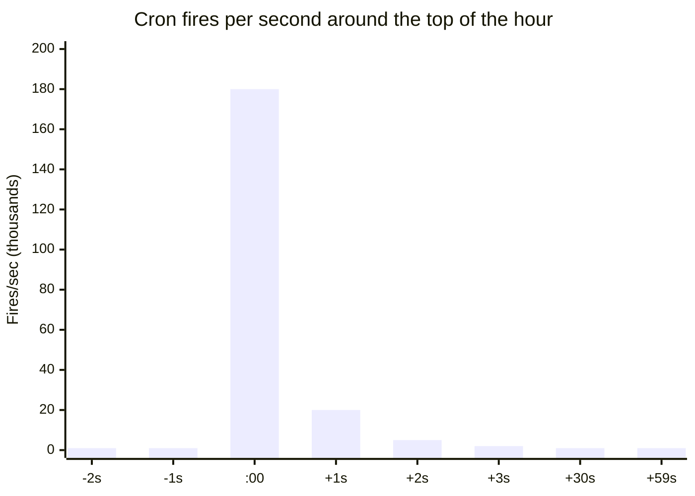
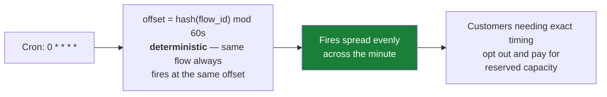
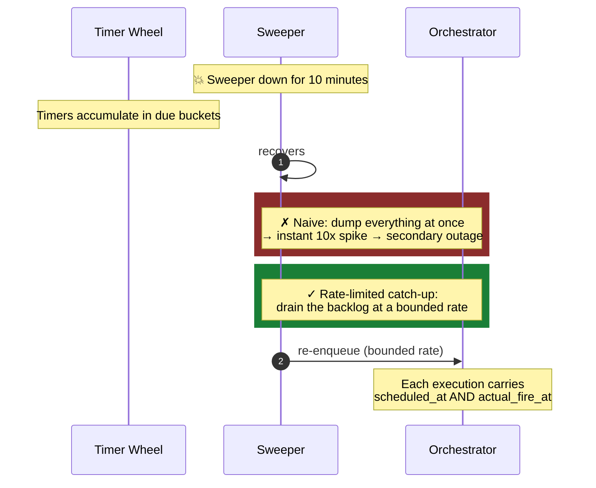
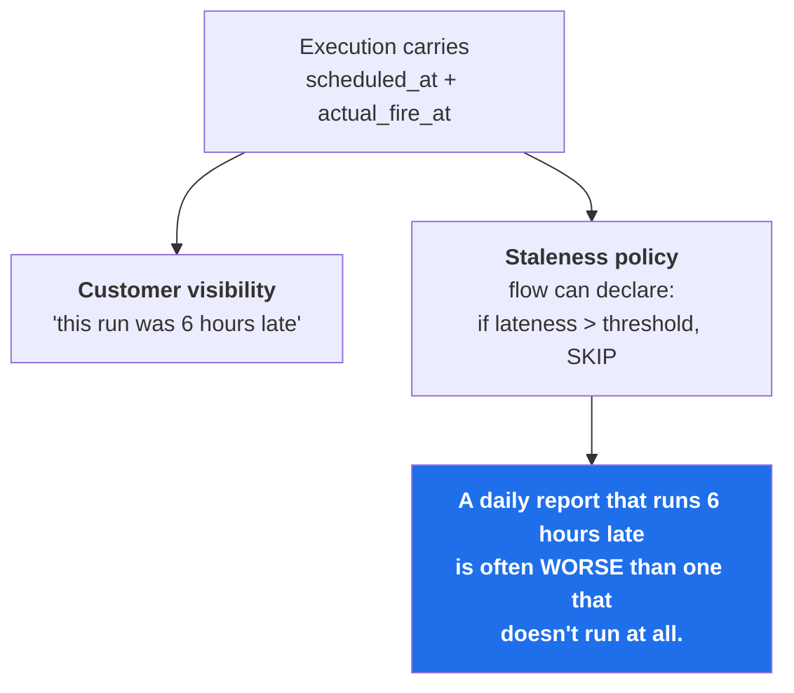
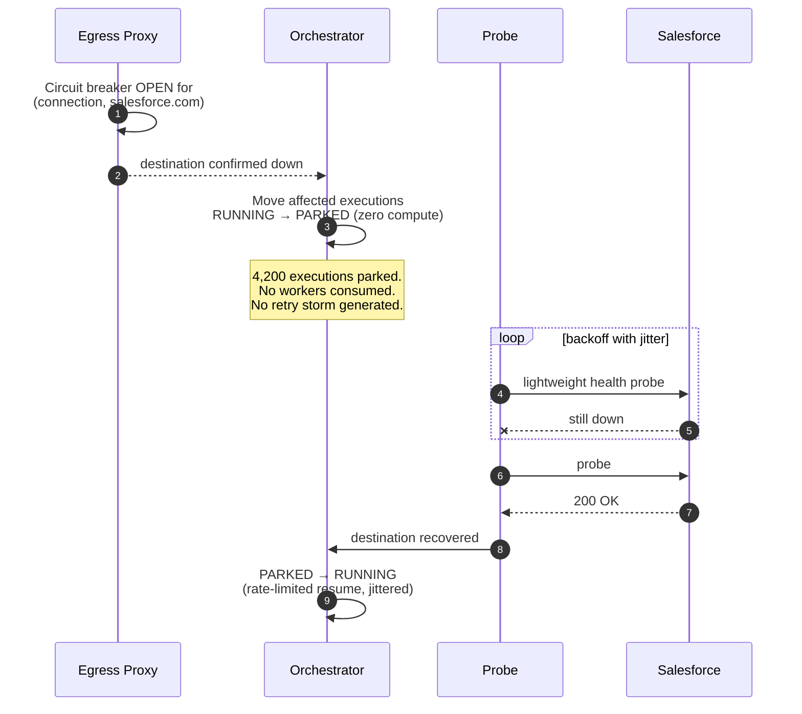

# 08 — Long-Running Flows and Scheduling

[← Connectors and Egress](07-connectors-and-egress.md) · [Index](README.md) · [Next: Resilience →](09-resilience-and-failure-modes.md)

---

## The requirement

> A flow has a step that waits **three days** for human approval.

**Critical property: a waiting execution must consume zero compute.**
If a paused flow holds a thread or a container, the cost model breaks — this is precisely where naive
workflow engines fail economically.

### Wake conditions

---

## Hierarchical timer wheel

Timers are durable and bucketed by fire time, with **coarse buckets far out and fine buckets near-term** —
so we never scan three days of timers to find the next minute's work.

---

## Subtlety 1 — Thundering herds

> Everyone schedules cron at `0 * * * *`.

**Mitigation — deterministic per-flow jitter derived from the flow ID:**

Determinism matters: a random offset each hour makes the schedule unpredictable to the customer and makes
debugging "why did this run at :37?" impossible.

---

## Subtlety 2 — Timer skew during outages

If the sweeper is down for ten minutes, **ten minutes of timers come due at once.**

**Why carry both timestamps:**

---

## Parking: waiting applied to downstream outages

When a destination is confirmed down, executions move to `PARKED` — the same zero-compute mechanism.

> **Customer-visible status:** *"Salesforce is unavailable; 4,200 of your executions are parked and will
> resume automatically."* That one feature deflects an enormous volume of support tickets — and it is cheap,
> because the data already flows through the trace pipeline.

---

## Scheduling components summary

| Component | Responsibility | Key risk | Mitigation |
|---|---|---|---|
| Timer wheel | Durable, bucketed wake times | Scanning cost at long horizons | Hierarchical buckets with cascade |
| Sweeper | Fire due timers | Backlog dump after downtime | Rate-limited catch-up |
| Cron planner | Translate schedules into timers | Thundering herd at round times | Deterministic per-flow jitter |
| Signal receiver | External wake (callback / event) | Unauthenticated wake calls | Signed, single-use callback tokens |
| Parking prober | Detect destination recovery | Probe storm on recovery | Jittered, rate-limited resume |
