# 09 — Resilience and Failure Modes

[← Long-Running Flows](08-long-running-flows-and-scheduling.md) · [Index](README.md) · [Next: Cost and Maintainability →](10-cost-and-maintainability.md)

---

## Failure catalogue

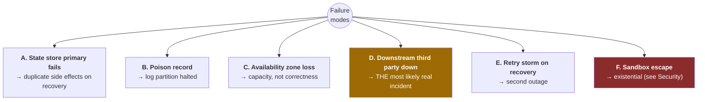

---

## A — Execution state store primary fails

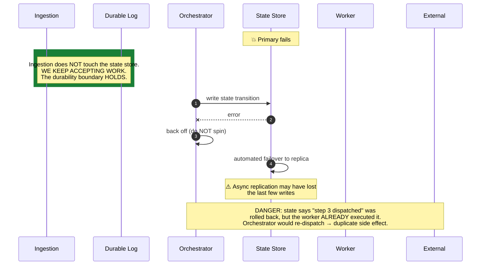

### Recovery: make the ambiguity explicit rather than implicit

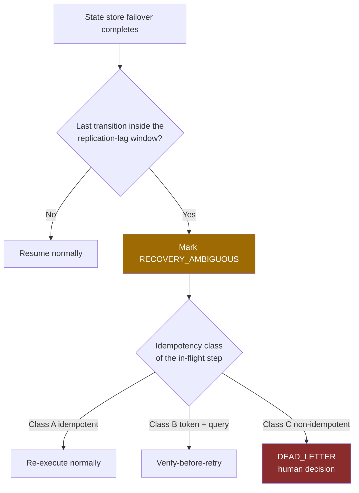

> **"That's a lot of machinery for a rare event."**
>
> It isn't *new* machinery. It is the **same ambiguous-outcome path already required for network timeouts**,
> which happen constantly. Failover recovery just feeds into it. A path exercised daily is one we trust
> during an incident. Building a *separate* mechanism only for failover would not be worth it.

---

## B — Poison record halting a log partition

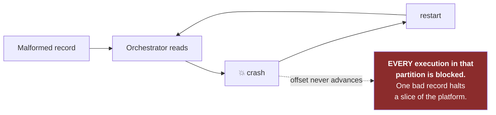

### Mitigations

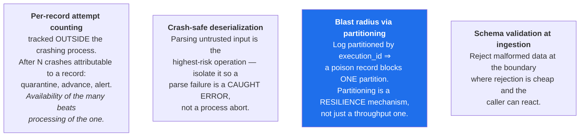

---

## C — Availability zone loss

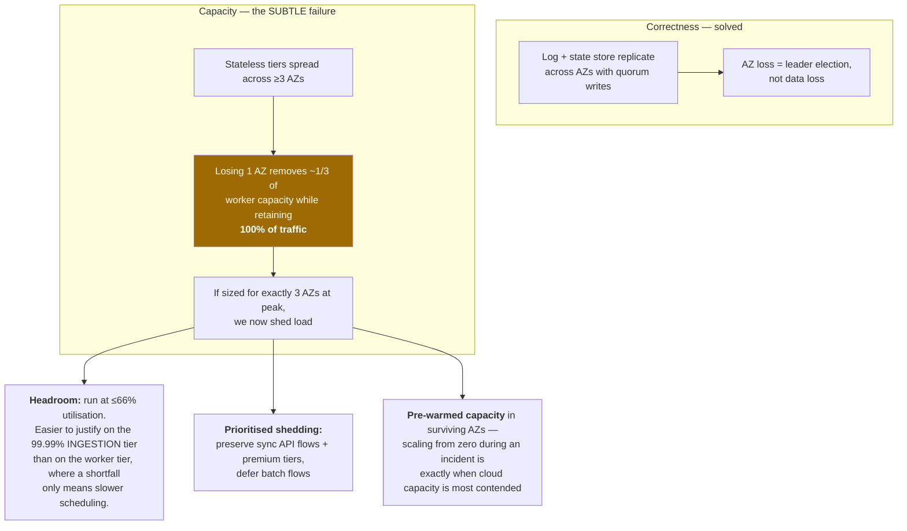

---

## D — Downstream third party down (the most likely real incident)

> Salesforce is down for two hours. A thousand tenants depend on it.

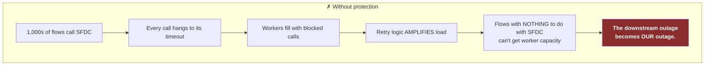

### Protections

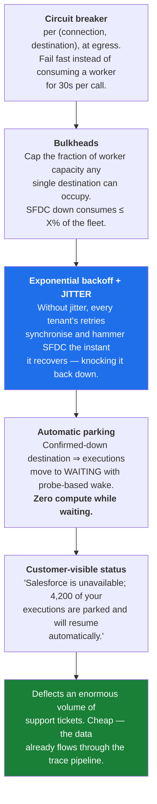

**Jitter is not a nicety here** — it is the difference between a recovery and a second outage.

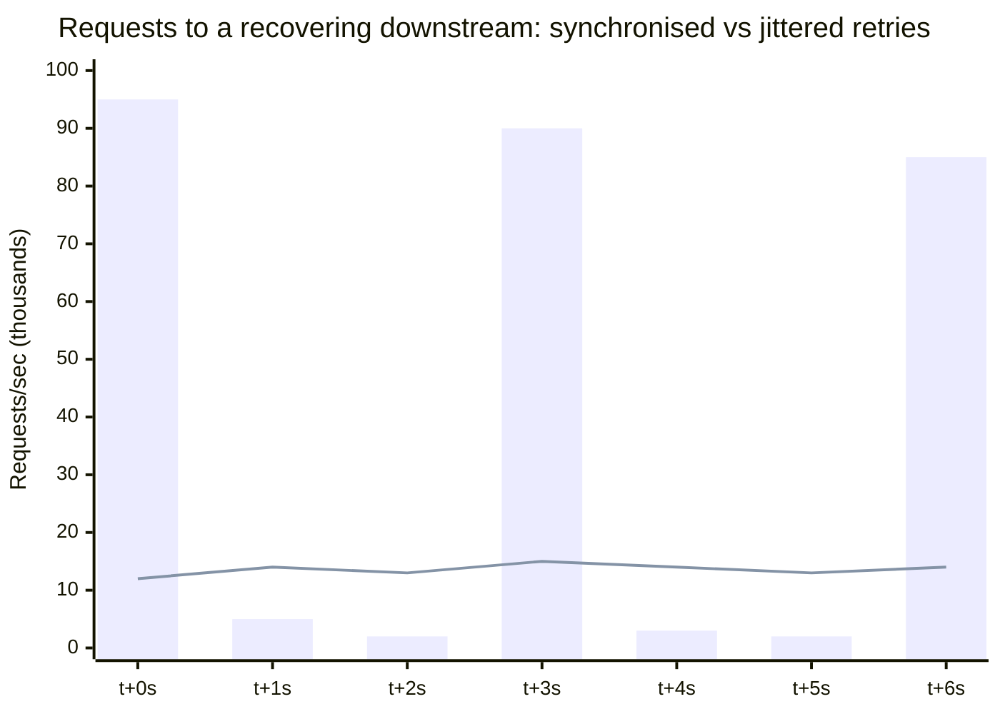

Bars: synchronised retries (repeatedly re-downs the target). Line: jittered retries (smooth recovery).

---

## What breaks first at 10× scale

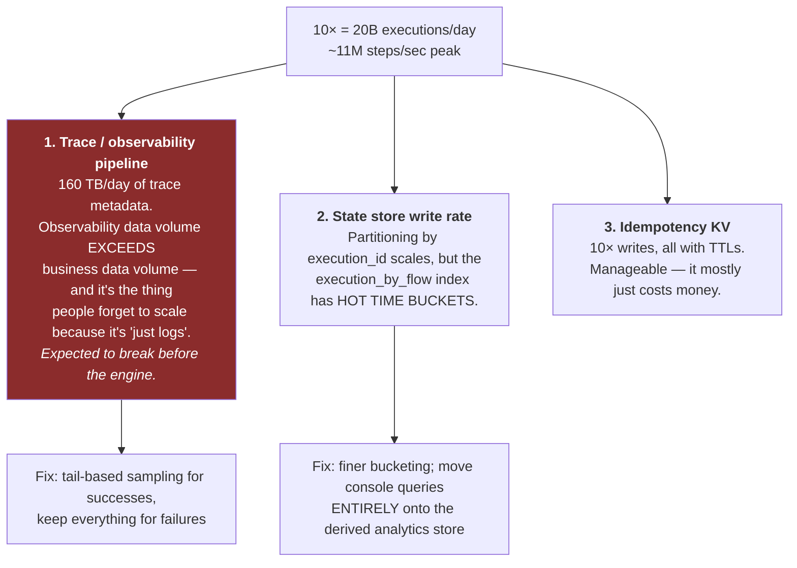

### At 100× — cell-based architecture

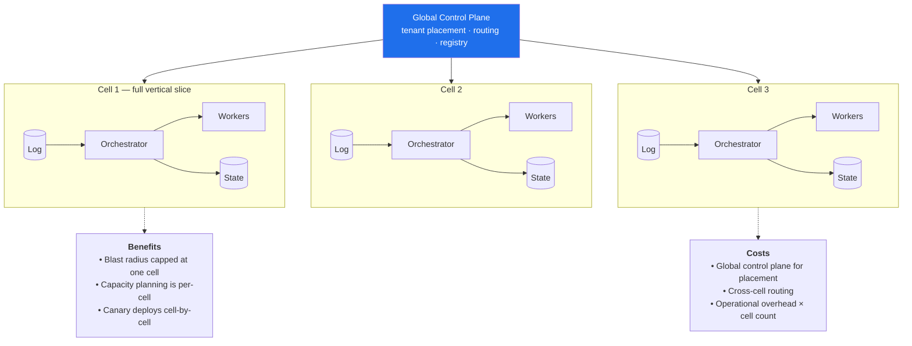

> **Do not build cells on day one.** The trigger is **not** a QPS number. It is:
> *a single incident routinely affecting a majority of tenants*, or
> *the state store partition count becoming operationally unmanageable.*

---

## Resilience mechanism inventory

| Mechanism | Where | Prevents |
|---|---|---|
| Timeouts (per-connector, configurable) | Egress | Unbounded worker occupancy |
| Bounded retries + exponential backoff + **jitter** | Worker / orchestrator | Retry storms, synchronised recovery hammering |
| Circuit breakers per (connection, destination) | Egress | Downstream outage cascading into ours |
| Bulkheads per destination | Worker pool | Fleet exhaustion by one third party |
| Load shedding with `429` + `Retry-After` | Ingestion | Unbounded queue growth, misleading PENDING |
| Admission control / burst credits | Ingestion | Backfill-driven starvation |
| Idempotency keys + dedup KV | Ingestion | Duplicate executions from webhook retries |
| Per-operation idempotency class | Retry engine | Duplicate business side effects |
| Dead-letter with ambiguity flag | Orchestrator | Silent data loss; silent duplication |
| Parking with probe-based wake | Orchestrator | Compute burn during downstream outages |
| Poison-record quarantine | Orchestrator | Partition-wide halt |
| Quorum replication across AZs | Log, state store | Data loss on AZ failure |
| Prioritised shedding + pre-warmed capacity | Worker fleet | Capacity shortfall during AZ loss |
| Reconciler (log ↔ state store) | Background job | Executions lost between tiers |
| Graceful degradation of the console | Read path | Data plane impact from console load |
