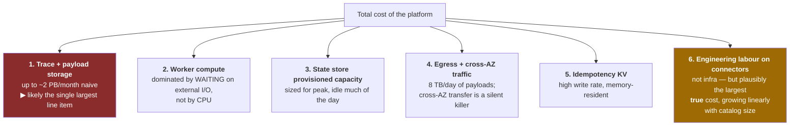
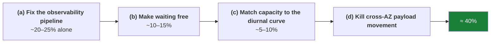
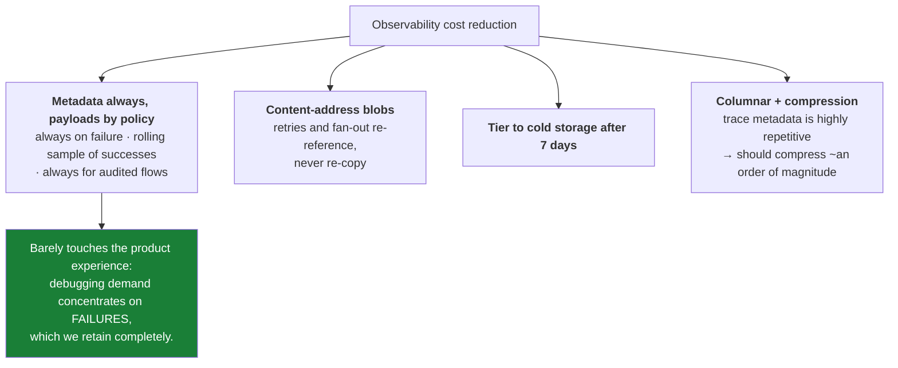
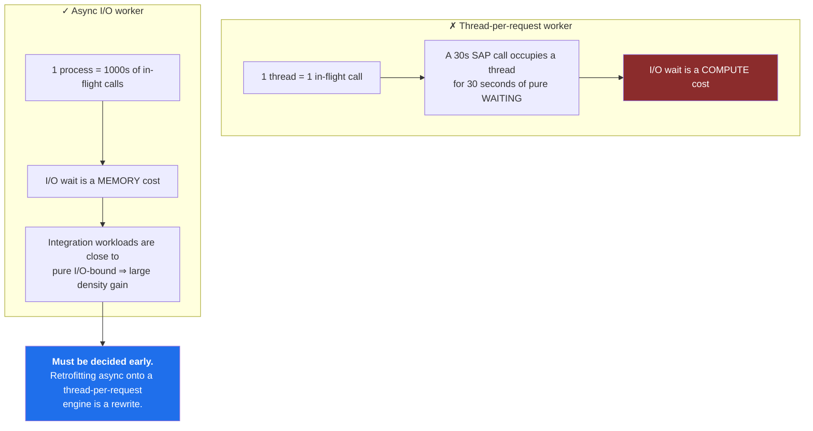
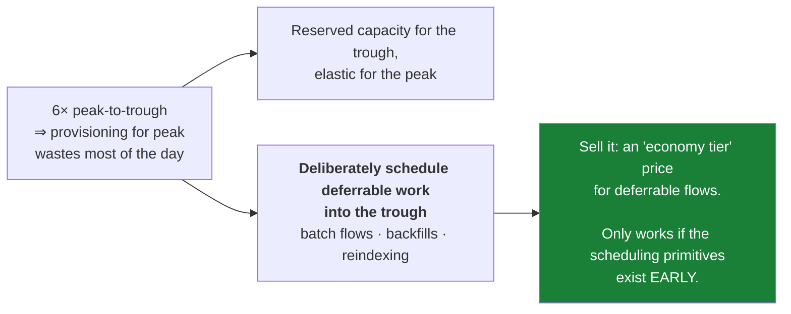
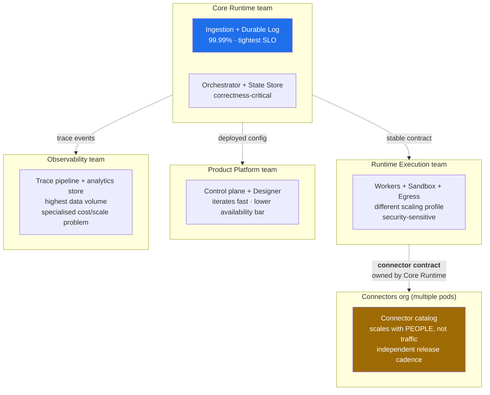
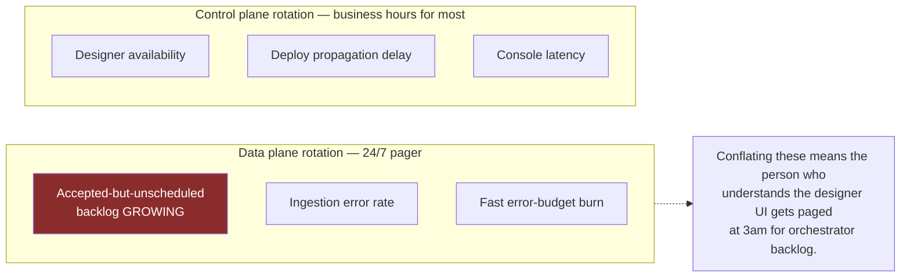
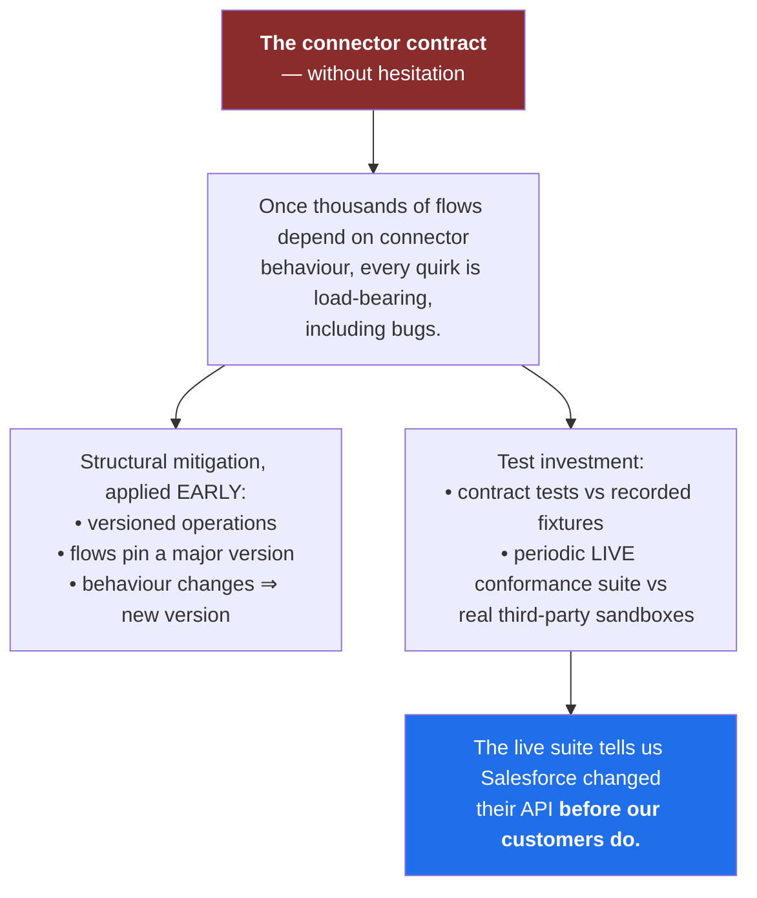

# 10 — Cost and Maintainability

[← Resilience](09-resilience-and-failure-modes.md) · [Index](README.md) · [Next: Security and Operations →](11-security-and-operations.md)

---

## Cost drivers, ranked

---

## Cutting 40% — ordered by value per unit of risk

### (a) Observability pipeline — the biggest single lever

### (b) Make waiting free — an architectural choice, not a tuning knob

### (c) Diurnal capacity matching — a cost lever that is also a product feature

### (d) Cross-AZ payload movement

Payload blobs are fetched **AZ-locally**; the orchestrator→worker path carries **references, not payloads**.
This is why payloads never travel through the state store — a decision that is as much about cost as
about performance.

---

## What we would *not* cut

| Not cut | Why |
|---|---|
| Multi-AZ redundancy on the **ingestion** tier | It protects the durability guarantee, which *is* the product |
| Audit logging | It protects the security posture; also a compliance artifact |
| Failure-path payload retention | Debugging demand is concentrated exactly there |

---

## Ownership boundaries

> **Principle:** split along axes of *differing change rate*, *differing availability requirement*, or
> *differing scaling behaviour* — **not** along nouns in the domain model.

**Why ingestion and orchestrator share a team:** they share a correctness model, even though they are
separate deployables. Splitting them across teams would put a team boundary in the middle of the
durability guarantee.

**Why connectors must be structurally independent:** the catalog grows with headcount. If a connector
release requires a runtime release, the runtime team becomes a bottleneck and eventually starts
rubber-stamping reviews — which is worse than no review.

---

## On-call design

---

## The biggest maintainability risk

