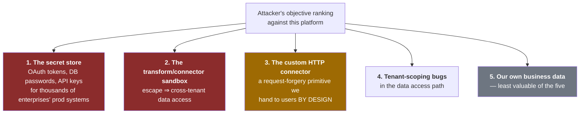
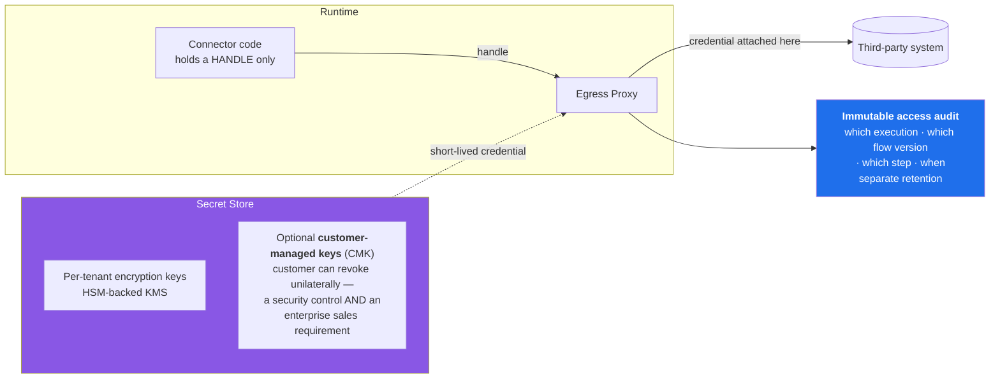
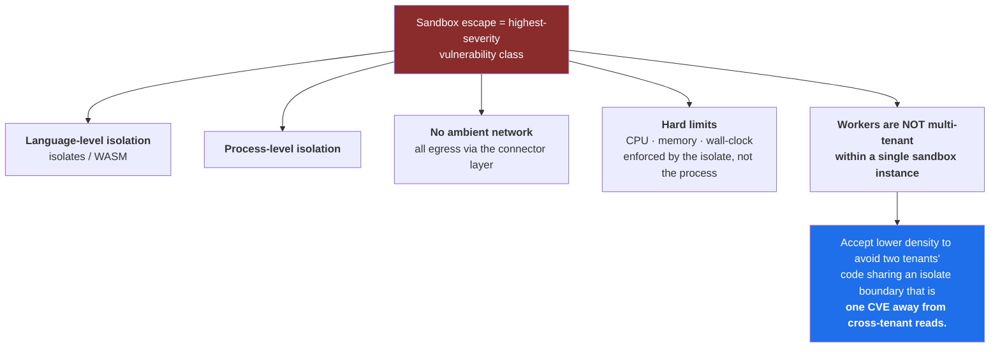
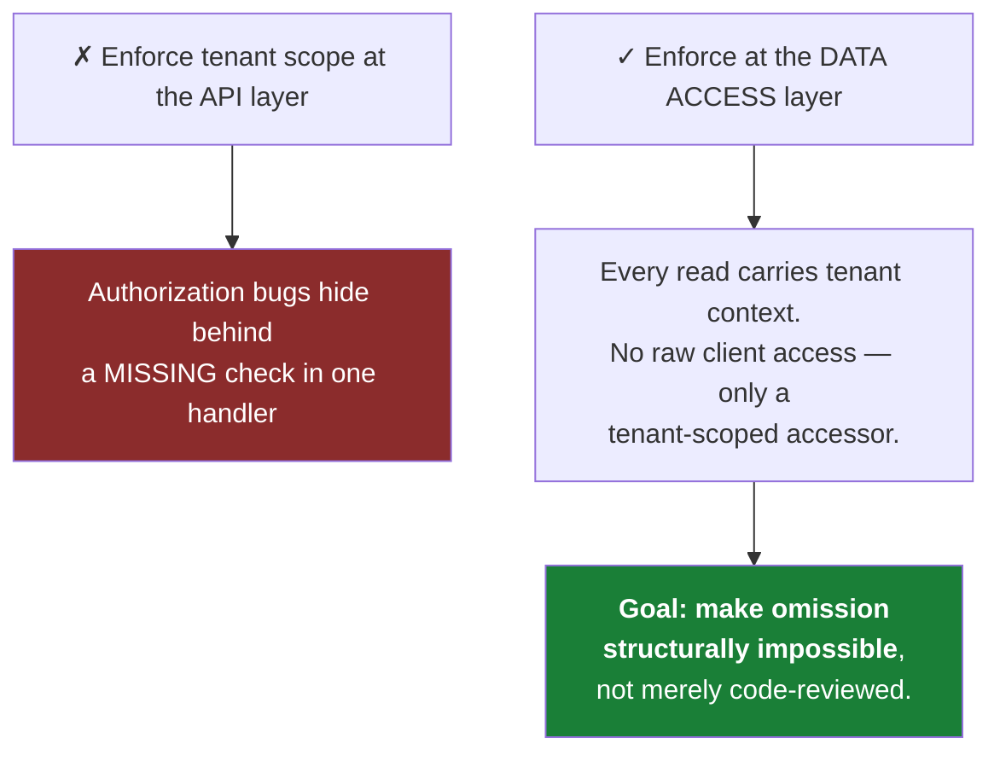
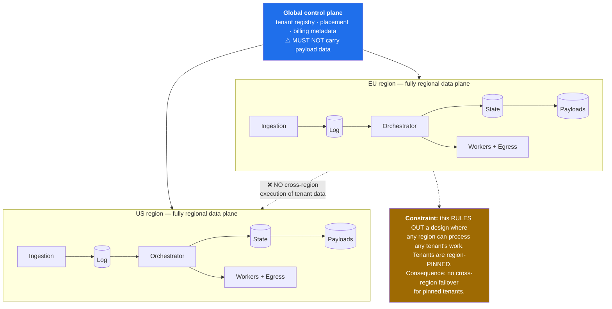
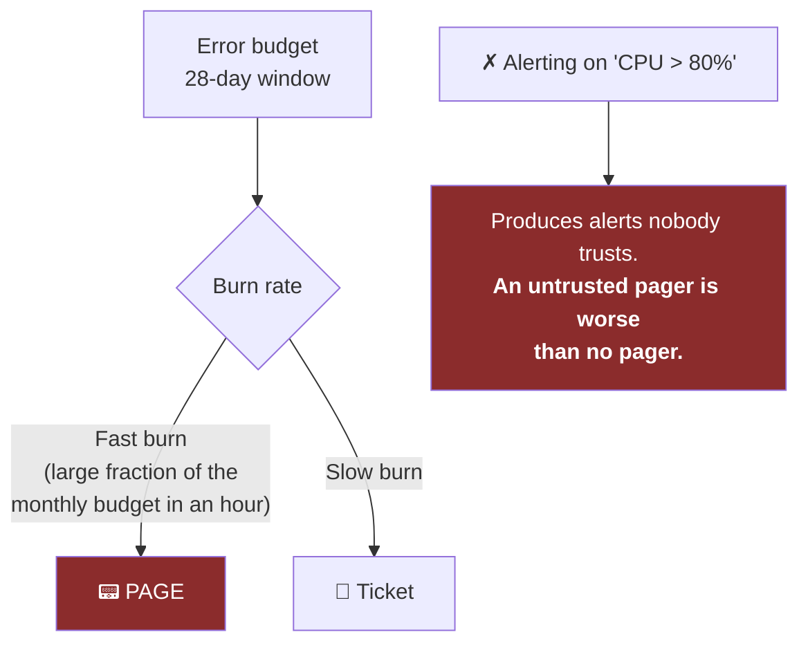
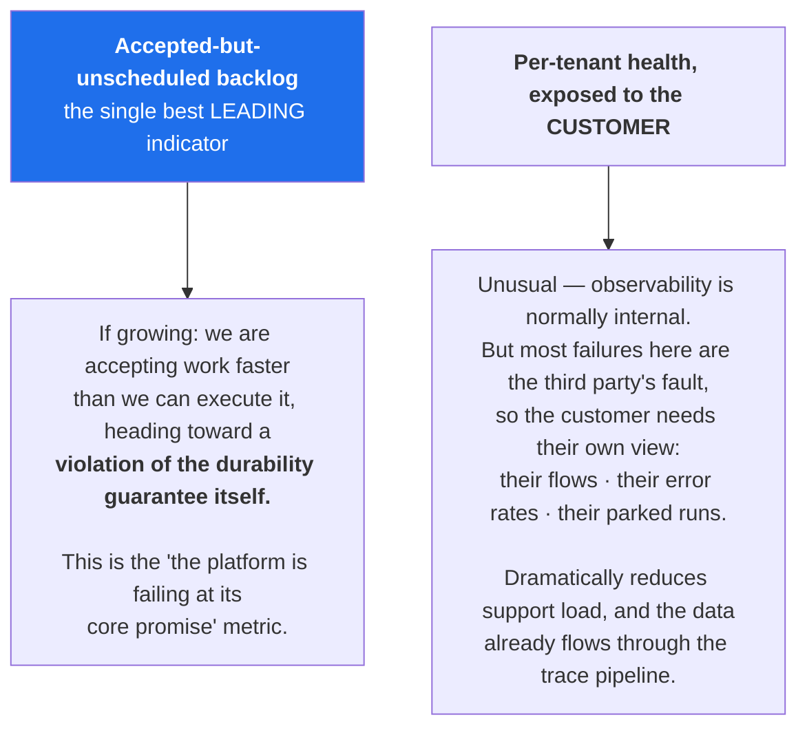
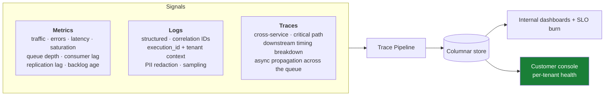
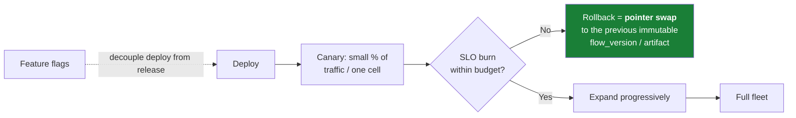

# 11 — Security and Operations

[← Cost and Maintainability](10-cost-and-maintainability.md) · [Index](README.md) · [Next: Evolution Roadmap →](12-evolution-roadmap.md)

---

## The defining security property

> **We are a concentrated store of thousands of enterprises' production credentials.**
>
> A breach of our secret store is worse than a breach of our own data — we would be the vector into
> thousands of enterprises *simultaneously*.

That framing drives every priority below.



---

## 1. Credential handling



**Rules:**
- Per-tenant encryption keys in HSM-backed KMS; CMK offered.
- **Short-lived credentials wherever the third party supports it** — OAuth refresh flows over stored
  long-lived secrets, always.
- Credentials never enter connector code's address space.
- Full, immutable audit log of secret access.

## 2. Customer code execution



## 3. SSRF via the custom HTTP connector

Covered in detail in [Connectors and Egress](07-connectors-and-egress.md#the-ssrf-problem-is-inherent-to-the-product).
Summary: destination validation at the egress layer, block internal ranges, **resolve-then-pin** (not
resolve-then-trust), per-tenant destination allowlists for regulated customers.

## 4. Tenant isolation in the data plane



## 5. Data residency



---

## Observability

### Service level indicators

```text
SLI-1  Trigger ingestion success rate
       (accepted or correctly-rejected) / total
       SLO: 99.99% over 28 days

SLI-2  Scheduling latency
       fraction of accepted executions starting their first step within 15s
       SLO: 99% over 28 days

SLI-3  Platform-attributable execution failure rate
       failures caused by US / total executions
       SLO: < 0.01%
       (EXPLICITLY excludes third-party failures — see attribution rules in doc 01)

SLI-4  Trace visibility latency
       fraction of steps visible in the console within 10s
       SLO: 99%
```

### Alert on burn rate, not on raw metrics



### Two platform-specific signals



### Observability stack



---

## Operational practice

| Practice | Purpose |
|---|---|
| Runbook linked from **every** alert | Removes reasoning-under-pressure during incidents |
| Quarterly game days: AZ loss, state store failover | Exercises the ambiguous-outcome path before it's needed |
| Regular **restore** drills | *A backup you have not restored is a hypothesis* |
| Reconciler: durable log ↔ terminal execution states | Catches anything lost between tiers |
| Canary + cell-by-cell deploys (Stage 4) | Bounds blast radius of a bad release |
| Chaos injection at the egress layer | Validates circuit breakers and bulkheads |

---

## Deployment safety



Immutable, content-hashed versions ([doc 03](03-api-and-data-model.md)) make both deployment and rollback a
pointer swap — the cheapest possible rollback primitive.
