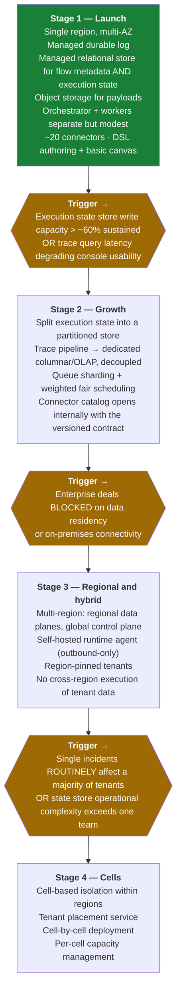
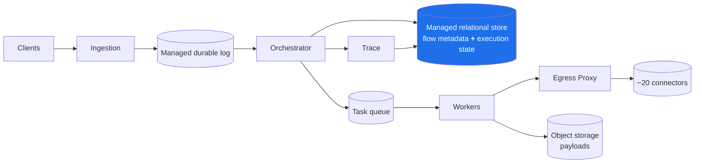
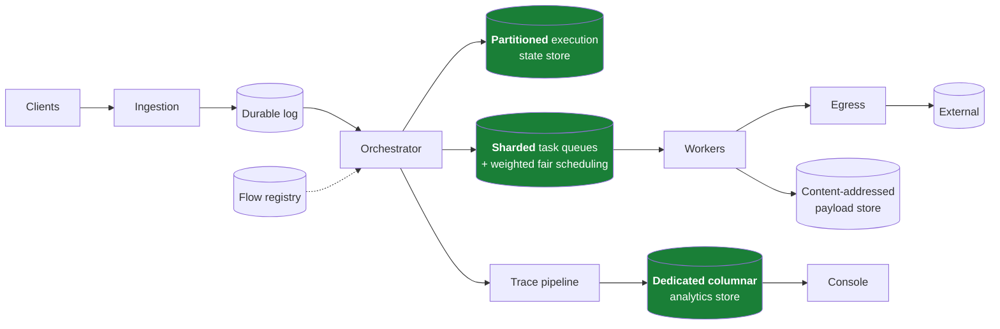
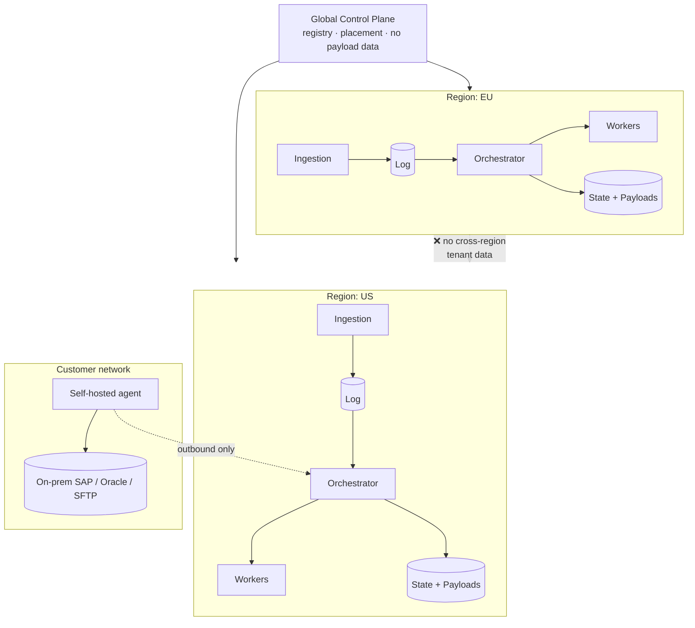
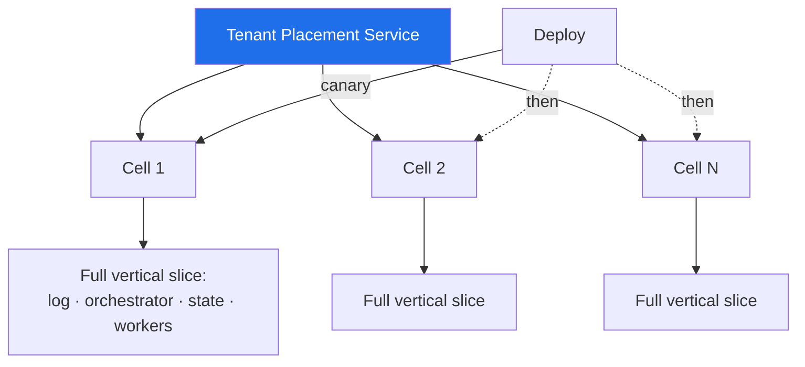
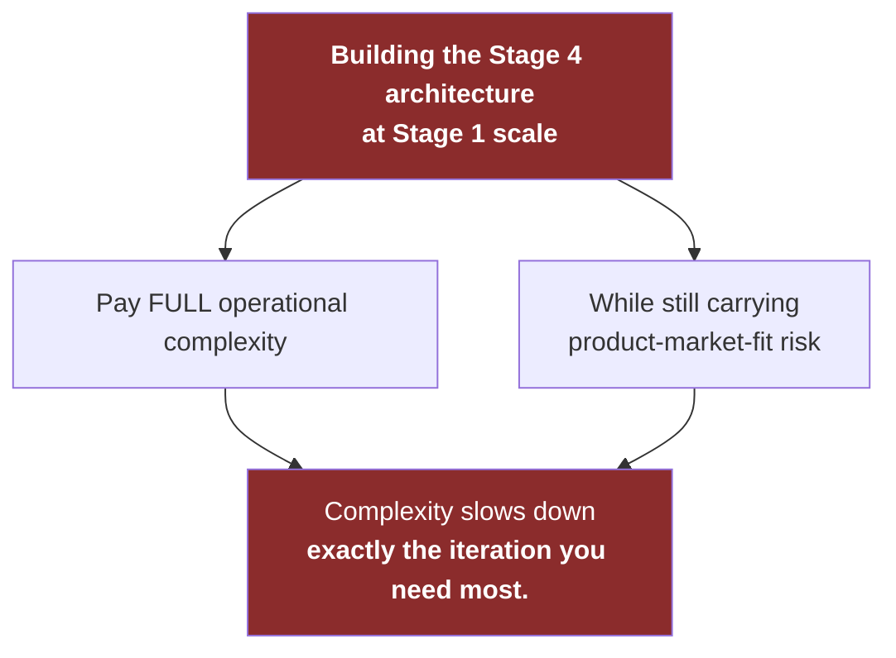
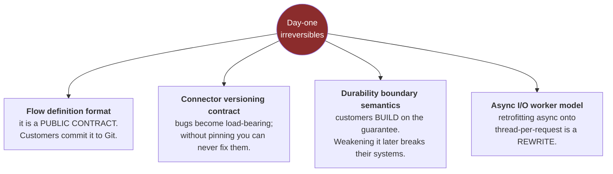
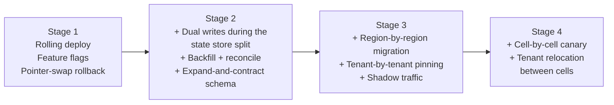

# 12 — Evolution Roadmap

[← Security and Operations](11-security-and-operations.md) · [Index](README.md) · [Next: Decisions and Risks →](13-decisions-and-risks.md)

---

## Stages and their triggers

> Note that **none of the triggers is a QPS number.** Each is an operational or commercial signal.

---

## Stage 1 — Launch

**Ship the durability guarantee and the observability, because those are what people buy.**

## Stage 2 — Growth

Green = what changed. Fair scheduling should land **slightly before** the first noisy-neighbour incident,
not after it.

## Stage 3 — Regional and hybrid

## Stage 4 — Cells

---

## The most common platform failure mode

---

## Day-one irreversibles

These must be right from the start, because retrofitting is prohibitive.

### Safely deferrable

| Deferrable | Why it's safe to defer |
|---|---|
| Multi-region | Regional data planes can be added; tenants start region-pinned to one region trivially |
| Cell-based isolation | An additive layer above an already-partitioned design |
| Visual designer polish | The DSL is the source of truth; the canvas is a renderer |
| Connector SDK for customers | Internal-only catalog first validates the contract |
| Columnar trace store | Trace data is derived and rebuildable |
| Self-hosted agent | Same engine, different deployment topology |

---

## Migration and deployment techniques by stage

The Stage 2 state store split is the riskiest migration: it moves the **source of truth for in-flight work**.
Approach: dual-write to old and new, read from old, reconcile continuously, flip reads behind a flag per
partition, then contract — with the durable log as the safety net throughout, since it can replay anything
lost in the window.
