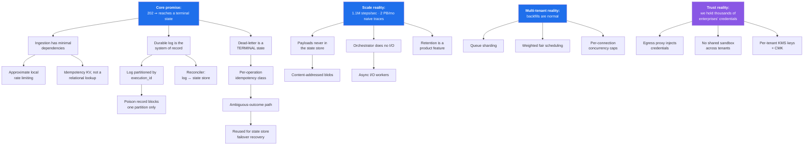
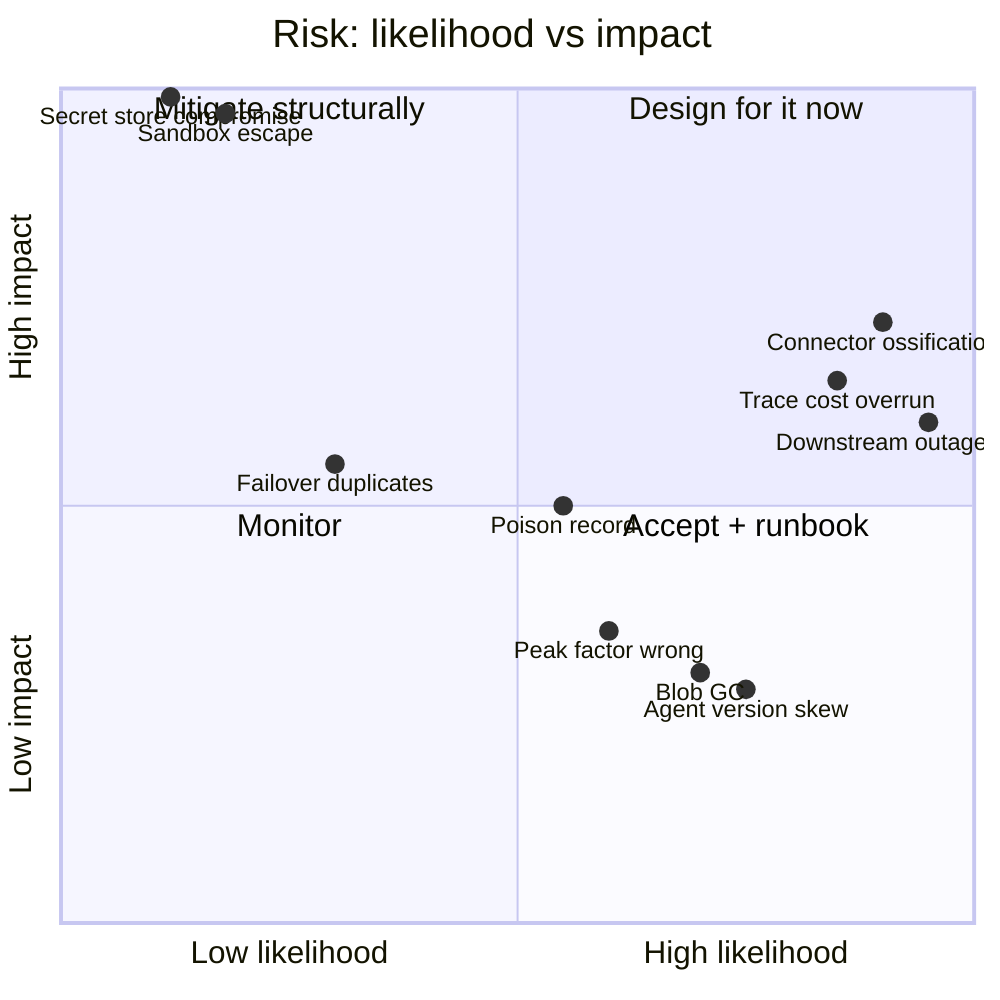
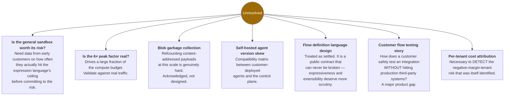

# 13 — Decisions, Risks, and Evaluation

[← Evolution Roadmap](12-evolution-roadmap.md) · [Index](README.md)

---

## Final architecture decisions

| Area | Decision | Reason | Trade-off |
|---|---|---|---|
| Durability boundary | Append to durable log at ingestion, then `202` | Minimal dependencies on the most availability-critical path | Extra hop; log and state store can diverge → needs a reconciler |
| Orchestrator role | State machine only, **no external I/O** | Slow third parties consume elastic worker capacity, not stateful capacity | More components; state transitions cross a network hop |
| Execution partitioning | By `execution_id`, not `tenant_id` | Uniform distribution; no tenant hot partition | Tenant-scoped queries need a separate time-bucketed index |
| Execution semantics | At-least-once steps + per-operation idempotency class | Exactly-once against arbitrary third parties is unachievable | Customers must reason about idempotency; more product surface |
| Fair scheduling | Local weighted deficit round-robin per worker | Avoids consensus on the hot path | Approximate fairness; needs slow shard rebalancing |
| Payload storage | Content-addressed blobs; references in state | Dedup across retries/fan-out; keeps payloads out of the state store and off cross-AZ paths | Blob GC becomes a real problem (refcounting) |
| Trace retention | Metadata always; payloads by policy + sampled | Naive full retention (~2 PB/mo) likely exceeds all compute cost | Cannot inspect payloads of every successful run |
| Transform execution | Restricted expression language default; sandbox as escape hatch | Bounds untrusted-code blast radius for the common case | Power users hit the ceiling; the escape hatch still carries the risk |
| Egress | Central proxy owning credentials, policy, audit | Credentials never in connector address space; SSRF control; stable source IPs | Extra hop on every external call; the proxy is a critical dependency |
| Connector releases | Independently versioned artifacts; flows pin major version | Catalog scales with headcount, not runtime release cadence | Must maintain many connector versions indefinitely |
| Waiting flows | State transition + durable timer wheel; **zero compute** | Long waits are common; blocked compute breaks the cost model | Timer sweeper is a new critical component (herd + skew risks) |
| Multi-region | Regional data planes, global control plane, tenant pinning | Data residency is a hard legal constraint | No cross-region failover for pinned tenants; RTO tied to region recovery |
| Flow definition | Single versioned declarative document; canvas renders it | Avoids permanent lossy round-trip tax between two formats | Designer expressiveness is bounded by the DSL |
| Flow versions | Immutable + content-hashed | Answers "which logic processed this record?"; makes rollback a pointer swap | Version proliferation; storage of every deployed version |
| Quota vs rate limit | Rate limit fast + approximate at the edge; quota exact at the log | Keeps the 99.99% tier free of database dependencies | Bounded quota overshoot is possible |

---

## Decision dependency graph

---

## Risk register

| Risk | Impact | Mitigation |
|---|---|---|
| **Sandbox escape** in customer transform code | Cross-tenant credential/data breach — **existential** | Isolate + process isolation, no ambient network, no credentials in-process, no shared isolates across tenants, external pen-testing |
| **Secret store compromise** | Vector into thousands of enterprises simultaneously | Per-tenant keys, HSM-backed KMS, customer-managed keys, short-lived credentials, immutable access audit |
| **Connector contract ossification** | Cannot fix bugs without breaking production flows | Versioned operations, flows pin major version, contract + live conformance tests from day one |
| **Trace storage cost exceeding revenue** | Negative gross margin on high-volume tenants | Policy-based payload retention, content addressing, columnar compression, tiering; per-tenant cost attribution monitoring |
| **Downstream outage cascading into a platform outage** | Broad customer impact from a failure we don't own | Circuit breakers, per-destination bulkheads, parking with zero compute, jittered backoff, customer-visible status |
| **Poison record stalling a log partition** | A slice of the platform halted | Per-record attempt counting, quarantine and advance, crash-safe deserialization, ingestion schema validation |
| **State store failover → duplicate side effects** | Duplicate business transactions in customer systems | `RECOVERY_AMBIGUOUS` path reused from timeout handling: verify-before-retry or dead-letter |
| **Peak factor estimate (6×) is wrong** | Significant over- or under-provisioning | Validate against real traffic before committing capacity; keep the elastic tier large early |
| **Blob GC / refcounting at scale** | Unbounded storage growth or premature deletion of referenced payloads | Acknowledged as **not yet designed** — see open questions |
| **Self-hosted agent version skew** | Long-term operational burden; control-plane compatibility matrix | Acknowledged as **under-explored** — see open questions |

---

## Open questions and follow-ups

---

## Interview evaluation

### Demonstrated strengths

- Established the **durability boundary** as the product's core promise and consistently derived architecture from it, rather than treating durability as one property among many.
- **Refused to overclaim exactly-once**, explained precisely why it is unachievable, and converted it into a designable per-operation idempotency contract — the discriminating answer for integration platforms.
- Let **capacity math change the design**: the 2 PB/month trace estimate directly produced content-addressing and policy-based retention, rather than being computed and then ignored.
- Correctly identified that **a downstream third-party outage becoming a platform outage** is the most likely real incident, and designed bulkheads and parking specifically for it.
- Separated **orchestration from I/O** with a defended rationale, and reused the resulting ambiguous-outcome path for failover recovery instead of building parallel machinery.
- Named the **connector contract** as the dominant long-term maintainability risk — a non-obvious call that shows experience with platforms past their first year.
- Explicitly listed which decisions must be right on day one and which should be deferred, with **concrete non-QPS triggers** for each evolution stage.

### Missed opportunities

- **Self-hosted runtime agent** under-explored: version skew between customer-deployed agents and the control plane is a serious long-term operational burden that was acknowledged and then set aside.
- **Flow definition language design** treated as settled. Since it is a public contract that can never be broken, its expressiveness and extensibility model deserved more scrutiny.
- **Testing story for customer-authored flows** — how a customer safely tests an integration without hitting production third-party systems — was never raised.
- **Blob garbage collection** for content-addressed payloads acknowledged as a risk but not designed; refcounting at this scale is genuinely hard.
- **Billing and cost attribution per tenant** discussed only in passing, despite being necessary to detect the negative-margin-tenant risk that was itself identified.

### Level assessment

> **Strong L6, with L7 signal in several dimensions.**

Clear end-to-end ownership, quantitative reasoning that *changed decisions*, deep dives into more than three
areas, and correct instincts about where multi-tenant platforms actually fail. The organizational discussion —
ownership boundaries drawn along change rate and availability requirement rather than domain nouns, and the
connector team scaling with headcount — is L7-flavoured. Full L7 would have required more depth on multi-year
migration, build-versus-buy for major subsystems, and cross-business-unit capacity governance.

### Hiring signal

**Hire at L6.** The strongest evidence is the refusal to overclaim exactly-once combined with a concrete
alternative contract, and the recognition that **trace storage rather than compute dominates cost** — both
are judgments that come from *operating* systems like this, not from reading about them. The candidate also
self-corrected on transformation-code risk when challenged, and reasoned rather than deflected.

For L7 consideration, probe: migration strategy from an existing legacy integration platform, and cost
governance across business units.
