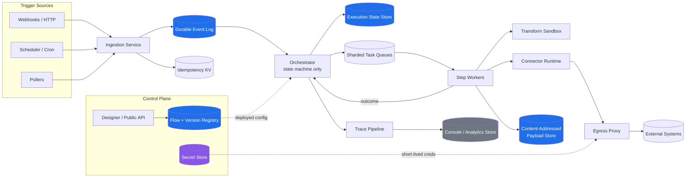
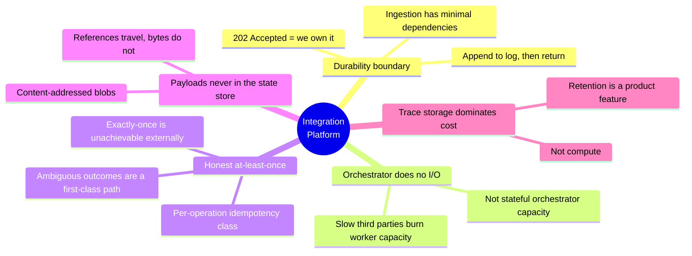

# Integration Platform (iPaaS) — System Design

A from-scratch design for a platform that lets developers and business teams **build, deploy, and monitor
integrations between heterogeneous systems** — conceptually in the space of MuleSoft, Azure Logic Apps, and
Apache Camel, but designed independently.

**Target level:** L6 (Staff Engineer) · **Duration:** 60 minutes · **Scale:** ~5,000 tenants, ~200,000 flows, ~2B executions/day

---

## The one-sentence thesis

> The platform is an **asynchronous durable workflow engine with a connector runtime attached**.
> Once we return `202 Accepted`, the event is ours and **will** reach a terminal state — success, or a terminal
> failure with an inspectable, replayable dead-letter record.

Every structural decision in this design exists to protect that promise.

---

## Document index

| # | Document | Covers |
|---|---|---|
| 01 | [Requirements and Scope](01-requirements-and-scope.md) | Problem framing, P0/P1/P2, NFRs, SLOs |
| 02 | [Capacity Estimation](02-capacity-estimation.md) | Traffic math, storage math, design implications |
| 03 | [APIs and Data Model](03-api-and-data-model.md) | Trigger ingestion, execution control, entity model |
| 04 | [High-Level Architecture](04-high-level-architecture.md) | Component diagram, write/read/async paths |
| 05 | [Execution Semantics](05-execution-semantics.md) | At-least-once, idempotency classes, ambiguous outcomes |
| 06 | [Multi-Tenancy and Isolation](06-multi-tenancy-and-isolation.md) | Noisy neighbor, fair scheduling, bulkheads |
| 07 | [Connectors and Egress](07-connectors-and-egress.md) | Connector contract, egress proxy, SSRF, credentials |
| 08 | [Long-Running Flows and Scheduling](08-long-running-flows-and-scheduling.md) | Timer wheel, zero-compute waits, thundering herds |
| 09 | [Resilience and Failure Modes](09-resilience-and-failure-modes.md) | AZ loss, failover, poison pills, downstream outages |
| 10 | [Cost and Maintainability](10-cost-and-maintainability.md) | Cost drivers, 40% reduction plan, team boundaries |
| 11 | [Security and Operations](11-security-and-operations.md) | Threat model, sandboxing, SLIs/SLOs, alerting |
| 12 | [Evolution Roadmap](12-evolution-roadmap.md) | Stage 1→4, triggers, day-one irreversibles |
| 13 | [Decisions, Risks, and Evaluation](13-decisions-and-risks.md) | Decision table, risk register, level assessment |

---

## System at a glance

Blue = source of truth. Purple = secrets. Grey = derived/rebuildable.

---

## The five decisions that define the design

---

## Quick reference: what this system deliberately does *not* do

- Does **not** promise end-to-end latency — flows call third-party systems we do not control.
- Does **not** claim exactly-once side effects on external systems.
- Does **not** run customer-supplied containers in the shared runtime.
- Does **not** build cell-based isolation or multi-region on day one.
- Does **not** store every intermediate payload for every successful execution.
