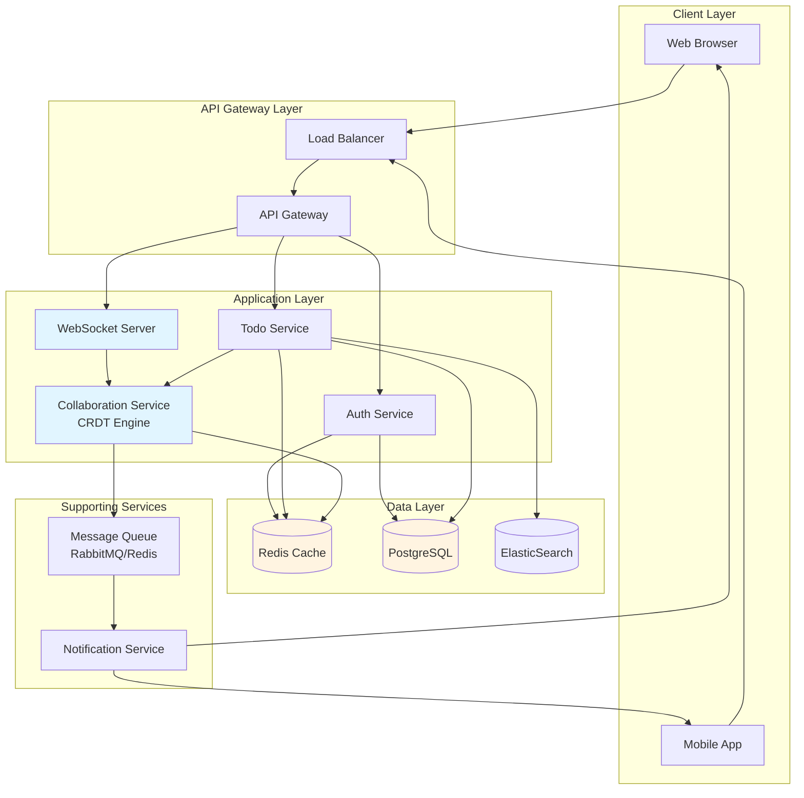
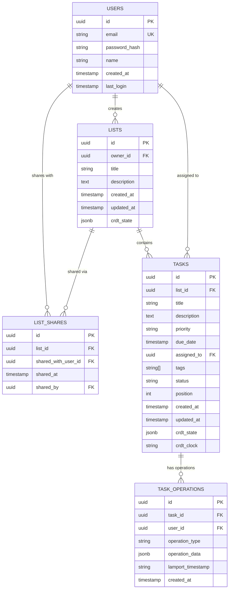
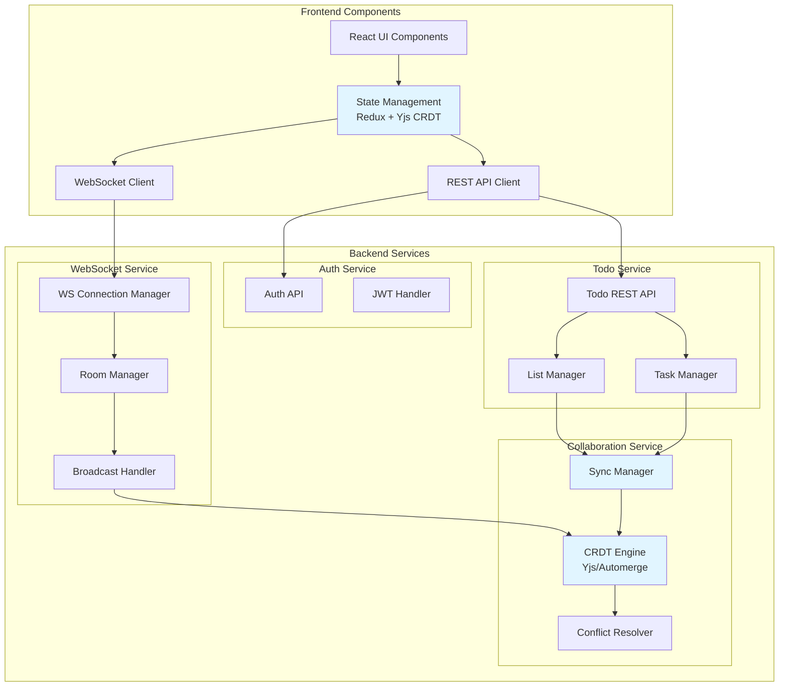
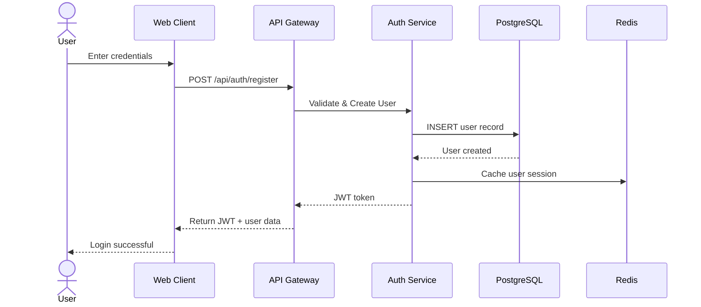
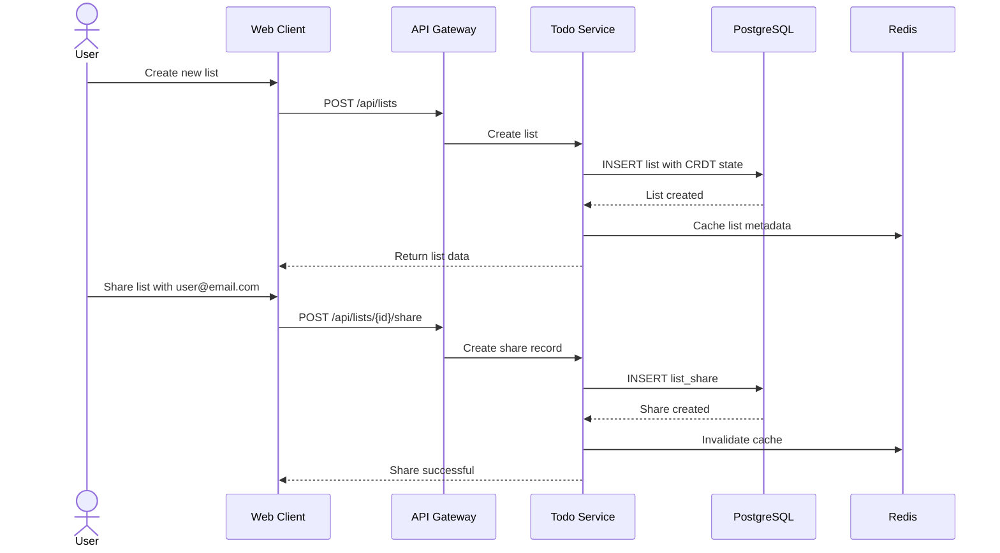
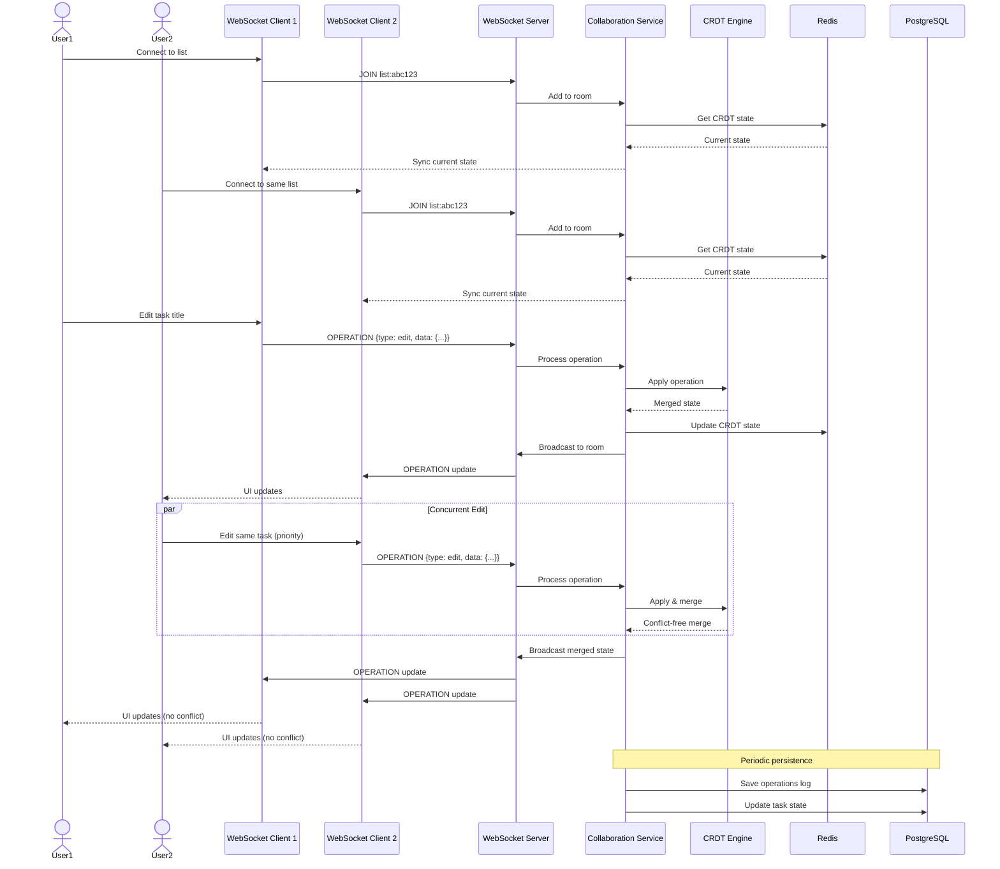
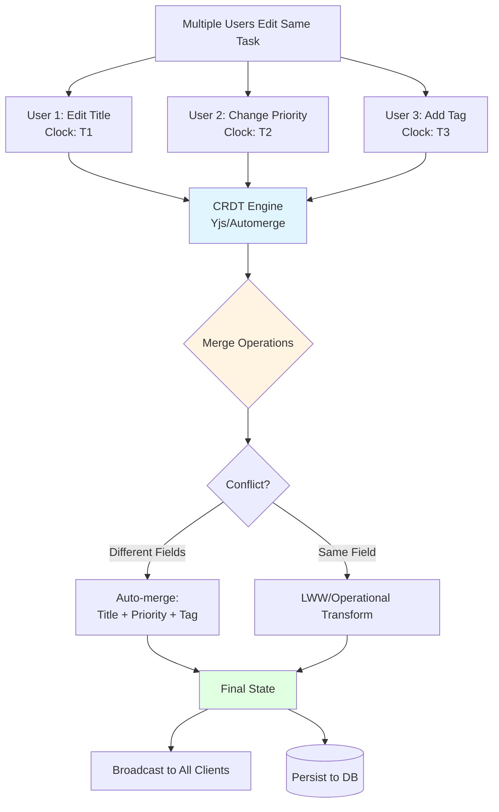
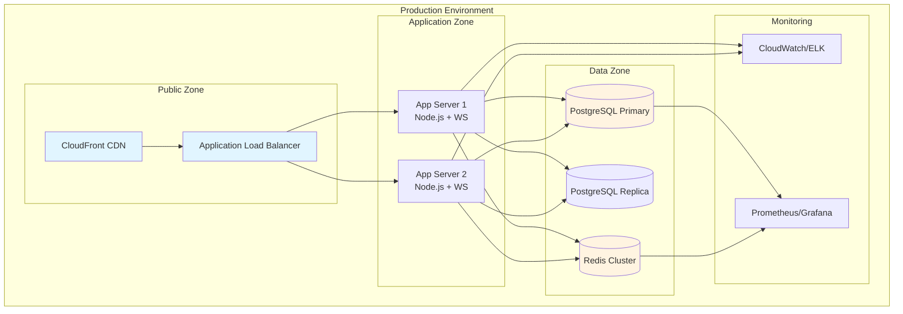

# Collaborative Todo List App - System Design

## Overview
A real-time collaborative todo list application supporting 500-1000 users with concurrent editing capabilities using CRDT for conflict resolution.

## Functional Requirements

### Core Features
1. **User Management**
   - User registration
   - User login/authentication

2. **List Management**
   - Create todo lists
   - Share lists with other users
   - View shared lists

3. **Collaborative Features**
   - Real-time parallel editing by multiple users
   - Simultaneous viewing of lists
   - Conflict-free concurrent updates using CRDT

4. **Task Management**
   - Advanced task properties: title, description, priority, due dates, assignees, tags, status

### Scale
- **Target Users**: 500-1000 customers
- **Concurrent Users**: ~100-200 active users at peak
- **Lists per User**: ~20-50 lists
- **Tasks per List**: ~50-100 tasks

---

## System Architecture

### High-Level Architecture



---

## Database Design

### Schema Design



### Key Design Decisions

1. **CRDT State Storage**: Each task and list stores its CRDT state as JSONB for conflict-free merging
2. **Operation Log**: `TASK_OPERATIONS` table maintains operation history for CRDT synchronization
3. **Lamport Timestamps**: Used for ordering operations in distributed system

---

## Component Architecture



---

## Key Flows

### 1. User Registration & Login



### 2. Create List & Share



### 3. Real-time Collaborative Editing



### 4. CRDT Conflict Resolution Flow



---

## API Design

### Authentication Endpoints

```
POST   /api/auth/register          - Register new user
POST   /api/auth/login             - Login user
POST   /api/auth/logout            - Logout user
GET    /api/auth/me                - Get current user
POST   /api/auth/refresh           - Refresh JWT token
```

### List Management Endpoints

```
GET    /api/lists                  - Get all lists (owned + shared)
POST   /api/lists                  - Create new list
GET    /api/lists/:id              - Get list details
PUT    /api/lists/:id              - Update list
DELETE /api/lists/:id              - Delete list
POST   /api/lists/:id/share        - Share list with user
DELETE /api/lists/:id/share/:userId - Remove share
GET    /api/lists/:id/collaborators - Get list collaborators
```

### Task Management Endpoints

```
GET    /api/lists/:listId/tasks    - Get all tasks in list
POST   /api/lists/:listId/tasks    - Create new task
GET    /api/tasks/:id              - Get task details
PUT    /api/tasks/:id              - Update task
DELETE /api/tasks/:id              - Delete task
PATCH  /api/tasks/:id/status       - Update task status
```

### WebSocket Events

```
Client -> Server:
  - join:list:{listId}              - Join list room
  - leave:list:{listId}             - Leave list room
  - operation                       - Send CRDT operation
  - cursor:position                 - Share cursor position

Server -> Client:
  - sync:state                      - Full state sync
  - operation                       - CRDT operation from other user
  - user:joined                     - User joined list
  - user:left                       - User left list
  - cursor:update                   - Other user's cursor position
```

---

## Technology Stack Recommendations

### Frontend
- **Framework**: React 18+ with TypeScript
- **State Management**: Redux Toolkit + Yjs for CRDT
- **WebSocket**: Socket.io-client
- **UI Library**: Material-UI or Ant Design
- **Real-time Collaboration**: Yjs + y-websocket

### Backend
- **Runtime**: Node.js with Express or NestJS
- **WebSocket**: Socket.io
- **CRDT Library**: Yjs (JavaScript) or Automerge
- **Authentication**: JWT with bcrypt

### Database & Cache
- **Primary DB**: PostgreSQL 14+ (JSONB support for CRDT state)
- **Cache**: Redis 7+ (for sessions, CRDT state, pub/sub)
- **Search**: ElasticSearch 8+ (optional, for task search)

### Infrastructure (Small Scale)
- **Hosting**: Single cloud provider (AWS/GCP/Azure)
- **Compute**:
  - 2-3 application servers (4GB RAM each)
  - 1 PostgreSQL instance (8GB RAM)
  - 1 Redis instance (4GB RAM)
- **Load Balancer**: Cloud provider LB (ALB/Cloud Load Balancer)
- **CDN**: CloudFront/CloudFlare for static assets

---

## CRDT Implementation Details

### Why CRDT for This Scale?

Even with 500-1000 users, CRDT provides:
1. **Offline Support**: Users can work offline and sync later
2. **No Locking**: No need for complex distributed locks
3. **Guaranteed Convergence**: All clients eventually reach same state
4. **Better UX**: No merge conflict dialogs

### Yjs Integration

```javascript
// Example CRDT structure for a task
const taskDoc = new Y.Doc()
const task = taskDoc.getMap('task')

task.set('id', uuid)
task.set('title', new Y.Text('Buy groceries'))
task.set('description', new Y.Text(''))
task.set('priority', 'high')
task.set('tags', new Y.Array(['shopping', 'urgent']))
task.set('status', 'pending')
task.set('assignedTo', userId)
task.set('dueDate', timestamp)

// Sync updates via WebSocket
const wsProvider = new WebsocketProvider(
  'wss://api.todoapp.com/collab',
  `list-${listId}`,
  taskDoc
)
```

### Conflict Resolution Strategy

1. **Different Fields**: Auto-merge (User A edits title, User B edits priority)
2. **Same Text Field**: Operational Transform (both edit description)
3. **Same Primitive Field**: Last-Write-Wins with Lamport timestamp
4. **Array Operations**: CRDT array (insertions/deletions merge)

---

## Scalability Considerations

### Current Scale (500-1000 users)
- **Single Region Deployment**: No need for multi-region
- **Vertical Scaling**: Start with vertical scaling (larger instances)
- **Simple Architecture**: Monolithic application acceptable
- **Database**: Single PostgreSQL instance with read replicas

### Future Scale (10K+ users)
- **Horizontal Scaling**: Add more application servers
- **Database Sharding**: Partition by user_id or list_id
- **Microservices**: Split Auth, Todo, Collaboration services
- **CDN**: Cache static content and API responses
- **Message Queue**: Add RabbitMQ/Kafka for async processing

### Performance Targets
- **API Response Time**: < 200ms (p95)
- **WebSocket Latency**: < 100ms
- **List Load Time**: < 500ms
- **Concurrent Connections**: 200-500 per server

---

## Deployment Architecture



---

## Security Considerations

### Authentication & Authorization
1. **JWT Tokens**: Short-lived access tokens (15 min) + refresh tokens (7 days)
2. **Password Security**: bcrypt with salt rounds >= 10
3. **Rate Limiting**: 100 requests/min per IP
4. **HTTPS Only**: TLS 1.3 for all connections
5. **WebSocket Auth**: Validate JWT on WS connection

### Data Security
1. **Input Validation**: Sanitize all user inputs
2. **SQL Injection**: Use parameterized queries
3. **XSS Prevention**: Content Security Policy headers
4. **CORS**: Whitelist allowed origins
5. **Encryption**: Encrypt sensitive data at rest

### Access Control
1. **List Access**: Verify user owns or has share access
2. **Operation Validation**: Validate user can perform operation
3. **Share Limits**: Limit shares per list (e.g., 50 users)

---

## Monitoring & Observability

### Key Metrics
1. **Application Metrics**
   - API response times (p50, p95, p99)
   - WebSocket connection count
   - Active collaboration sessions
   - CRDT operation throughput

2. **Infrastructure Metrics**
   - CPU/Memory utilization
   - Database query performance
   - Redis cache hit rate
   - Network I/O

3. **Business Metrics**
   - Active users (DAU/MAU)
   - Lists created per day
   - Collaboration sessions per day
   - Average tasks per list

### Logging
- **Structured Logging**: JSON format with correlation IDs
- **Log Levels**: ERROR, WARN, INFO, DEBUG
- **Retention**: 30 days for application logs

### Alerting
- API error rate > 1%
- WebSocket disconnect rate > 5%
- Database connection pool > 80%
- Response time p95 > 500ms

---

## Cost Estimation (Monthly)

### Infrastructure (AWS Example)
- **Application Servers**: 2 x t3.medium = $60
- **Database**: db.t3.medium = $50
- **Redis**: cache.t3.medium = $40
- **Load Balancer**: ALB = $20
- **Data Transfer**: ~$20
- **Monitoring & Logs**: $30

**Total**: ~$220/month for 500-1000 users ($0.22-$0.44 per user/month)

### Scaling Costs
- At 5K users: ~$500/month
- At 10K users: ~$800/month

---

## Development Roadmap

### Phase 1: MVP (4-6 weeks)
- User authentication
- Basic list CRUD
- Simple task management
- Basic sharing (no CRDT yet)

### Phase 2: Real-time Collaboration (4-6 weeks)
- WebSocket integration
- CRDT implementation
- Real-time updates
- Conflict resolution

### Phase 3: Advanced Features (4-6 weeks)
- Advanced task properties
- Search functionality
- User presence indicators
- Offline support

### Phase 4: Production Ready (2-4 weeks)
- Performance optimization
- Security hardening
- Monitoring & alerting
- Load testing

---

## Testing Strategy

### Unit Testing
- Service layer logic
- CRDT operations
- API endpoints
- Utility functions

### Integration Testing
- Database operations
- Redis caching
- WebSocket connections
- CRDT synchronization

### E2E Testing
- User registration flow
- List creation and sharing
- Collaborative editing scenarios
- Conflict resolution

### Performance Testing
- Load testing (500 concurrent users)
- WebSocket stress testing
- Database query optimization
- Cache efficiency

---

## Conclusion

This system design provides a scalable, real-time collaborative todo list application using CRDT for conflict-free concurrent editing. The architecture is optimized for 500-1000 users while maintaining flexibility for future growth.

### Key Highlights
- Real-time collaboration with WebSocket
- CRDT-based conflict resolution (Yjs)
- Simple sharing model
- Advanced task management
- Cost-effective for small-medium scale
- Clear path to scale

### Trade-offs Made
1. **CRDT Complexity**: More complex than simple last-write-wins, but better UX
2. **Simple Sharing**: No role-based permissions for simplicity
3. **Monolithic Architecture**: Easier to manage at this scale
4. **Single Region**: Cost-effective for current scale

This design can be implemented incrementally, starting with MVP and adding real-time features progressively.
