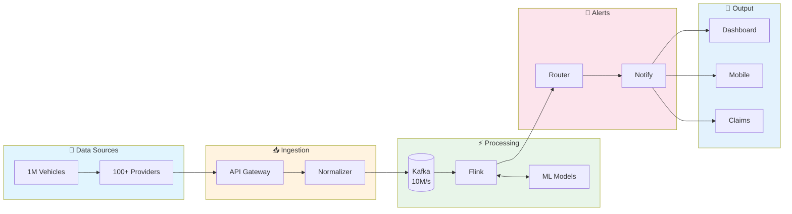
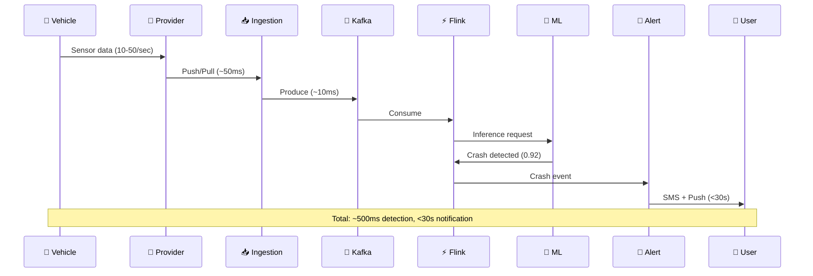

# Trucking Crash Detection & Prediction System

## Overview

A real-time IoT-based system for automated crash detection and prediction for commercial trucking fleets. The system processes telematics sensor data from ~1M vehicles to provide instant crash alerts, predictive warnings, and streamlined claims processing.

## System Architecture (High-Level)

## End-to-End Data Flow

## Business Context

### Problem Statement
- Manual crash detection leads to delayed response times
- Slow claims processing increases costs
- No predictive capabilities for accident prevention
- Multiple telematics providers with no uniform standards

### Goals
1. **Immediate Detection**: Real-time crash detection < 5 seconds from event
2. **Customer Notification**: Alert stakeholders within 30 seconds
3. **Predictive Warnings**: Surface high-risk patterns before incidents
4. **Fast Settlement**: Pre-populated claims to reduce processing time by 60%

## Scale Parameters

| Metric | Value |
|--------|-------|
| Total Policies | 10,000 |
| Total Vehicles | ~1,000,000 |
| Vehicles per Policy | 10-500 (avg: 100) |
| Coverage Area | Continental USA |
| Telematics Providers | 100+ |
| Data Points per Vehicle/Second | 10-50 |

## Documentation Structure

1. [System Architecture](./system-architecture.md) - High-level design and components
2. [Data Ingestion Layer](./data-ingestion.md) - Provider integration strategies
3. [Stream Processing](./stream-processing.md) - Real-time data processing pipeline
4. [ML Pipeline](./ml-pipeline.md) - Crash detection and prediction models
5. [Alert & Notification](./alerts-notifications.md) - Alert routing and delivery
6. [Observability](./observability.md) - Monitoring, logging, alerting, SLAs
7. [Architecture Diagrams](./diagrams/architecture-diagrams.md) - Visual representations

## Quick Links

- [API Contracts](./api-contracts.md)
- [Data Models](./data-models.md)
- [Deployment Strategy](./deployment.md)

