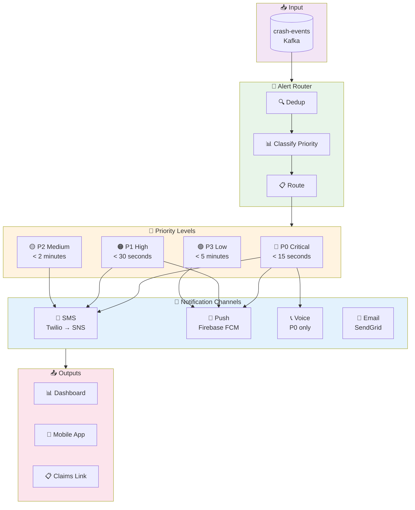
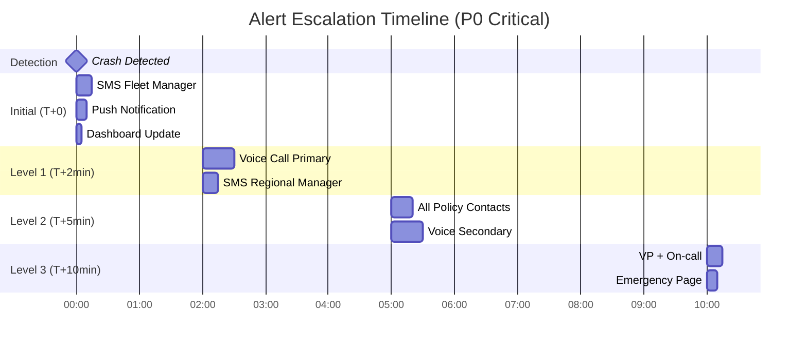

# Alert & Notification System

## Overview

The alert system handles the critical path from crash detection to customer notification. Speed is essential - every second matters in emergency response.

---

## Alert Flow Overview



## Escalation Timeline



---

## Alert Flow Architecture (Detailed)

```
┌─────────────────────────────────────────────────────────────────────────────────────────┐
│                              ALERT PROCESSING PIPELINE                                   │
├─────────────────────────────────────────────────────────────────────────────────────────┤
│                                                                                          │
│  ┌─────────────────┐                                                                     │
│  │ crash-events    │                                                                     │
│  │ (Kafka Topic)   │                                                                     │
│  └────────┬────────┘                                                                     │
│           │                                                                              │
│           ▼                                                                              │
│  ┌─────────────────────────────────────────────────────────────────────────────────┐    │
│  │                         ALERT ROUTER SERVICE                                      │    │
│  │                                                                                   │    │
│  │  ┌─────────────────┐   ┌─────────────────┐   ┌─────────────────┐                 │    │
│  │  │ Deduplication   │──▶│ Priority        │──▶│ Routing         │                 │    │
│  │  │ Check           │   │ Classification  │   │ Rules Engine    │                 │    │
│  │  │ (Redis)         │   │                 │   │                 │                 │    │
│  │  └─────────────────┘   └─────────────────┘   └─────────────────┘                 │    │
│  │                                                                                   │    │
│  │  Dedup Window: 5 minutes per vehicle                                              │    │
│  │  Priority Levels: P0 (Critical), P1 (High), P2 (Medium), P3 (Low)                 │    │
│  │                                                                                   │    │
│  └──────────────────────────────────────────────────────────────┬────────────────────┘    │
│                                                                 │                        │
│                    ┌────────────────────────────────────────────┼───────────────────┐    │
│                    │                                            │                   │    │
│                    ▼                                            ▼                   ▼    │
│  ┌─────────────────────────────┐   ┌─────────────────────────────┐   ┌──────────────────┐│
│  │   CUSTOMER NOTIFICATION     │   │   OPERATIONS CENTER         │   │   CLAIMS         ││
│  │   PATH                      │   │   PATH                       │   │   PATH           ││
│  │                             │   │                              │   │                  ││
│  │   Target: < 30 seconds      │   │   Target: Real-time          │   │   Target: < 5min ││
│  └──────────────┬──────────────┘   └──────────────┬───────────────┘   └────────┬─────────┘│
│                 │                                 │                            │         │
│                 ▼                                 ▼                            ▼         │
│  ┌─────────────────────────────┐   ┌─────────────────────────────┐   ┌──────────────────┐│
│  │   NOTIFICATION DISPATCHER   │   │   DASHBOARD SERVICE         │   │   CLAIMS SERVICE ││
│  │                             │   │                              │   │                  ││
│  │   Channels:                 │   │   • Real-time map updates   │   │   • Pre-populate ││
│  │   • SMS (Primary)           │   │   • WebSocket push          │   │     claim form   ││
│  │   • Push Notification       │   │   • Audit logging           │   │   • Generate     ││
│  │   • Voice Call (P0)         │   │   • Alert acknowledgment    │   │     unique link  ││
│  │   • Email (Backup)          │   │                              │   │   • Attach       ││
│  │                             │   │                              │   │     telemetry    ││
│  └─────────────────────────────┘   └─────────────────────────────┘   └──────────────────┘│
│                                                                                          │
└─────────────────────────────────────────────────────────────────────────────────────────┘
```

---

## Alert Priority Classification

| Priority | Criteria | Response Time | Channels | Example |
|----------|----------|---------------|----------|---------|
| **P0 - Critical** | Confirmed crash, severity ≥3, injury likely | < 15 seconds | SMS + Voice + Push + Dashboard | Severe frontal collision at 60mph |
| **P1 - High** | Confirmed crash, severity 1-2 | < 30 seconds | SMS + Push + Dashboard | Rear-end collision at low speed |
| **P2 - Medium** | Probable crash (confidence 65-85%) | < 2 minutes | SMS + Dashboard | Possible incident, awaiting confirmation |
| **P3 - Low** | Risk alert, near-miss, aggressive driving | < 5 minutes | Push + Dashboard | Multiple hard braking events |

---

## Notification Templates

### SMS Notification (P0/P1)

```
┌─────────────────────────────────────────────────────────────────────────────┐
│  CRASH ALERT - [POLICY_NAME]                                                 │
│                                                                              │
│  🚨 Vehicle [VIN_LAST_6] detected crash at [TIME]                            │
│                                                                              │
│  Location: [ADDRESS/INTERSECTION]                                            │
│  Severity: [HIGH/MEDIUM/LOW]                                                 │
│  Type: [FRONTAL/REAR/SIDE/ROLLOVER]                                          │
│                                                                              │
│  Driver: [DRIVER_NAME] - [DRIVER_PHONE]                                      │
│                                                                              │
│  File Claim: [SHORT_URL]                                                     │
│  (Link expires in 72 hours)                                                  │
│                                                                              │
│  Reply STOP to unsubscribe                                                   │
└─────────────────────────────────────────────────────────────────────────────┘
```

### Push Notification

```json
{
  "title": "🚨 Crash Detected - Fleet Alert",
  "body": "Vehicle ABC-1234 involved in collision near I-95 Exit 42",
  "data": {
    "alert_id": "ALT-20240115-001234",
    "type": "crash_detected",
    "priority": "P0",
    "vehicle_id": "VH-123456",
    "action_url": "crashguard://alerts/ALT-20240115-001234",
    "map_url": "https://maps.example.com/?lat=40.7128&lng=-74.0060",
    "claims_url": "https://claims.example.com/file/abc123"
  },
  "android": {
    "priority": "high",
    "notification": {
      "channel_id": "crash_alerts",
      "sound": "alert_critical.mp3"
    }
  },
  "apns": {
    "headers": {
      "apns-priority": "10"
    },
    "payload": {
      "aps": {
        "sound": "alert_critical.caf",
        "badge": 1
      }
    }
  }
}
```

---

## Notification Service Implementation

```
┌─────────────────────────────────────────────────────────────────────────────┐
│                     NOTIFICATION SERVICE ARCHITECTURE                        │
├─────────────────────────────────────────────────────────────────────────────┤
│                                                                              │
│  ┌────────────────────────────────────────────────────────────────────────┐ │
│  │                    CHANNEL ABSTRACTION LAYER                            │ │
│  │                                                                          │ │
│  │  ┌─────────────┐   ┌─────────────┐   ┌─────────────┐   ┌─────────────┐  │ │
│  │  │ SMS Channel │   │ Push Channel│   │Voice Channel│   │Email Channel│  │ │
│  │  │             │   │             │   │             │   │             │  │ │
│  │  │ Primary:    │   │ Primary:    │   │ Primary:    │   │ Primary:    │  │ │
│  │  │ Twilio      │   │ Firebase    │   │ Twilio      │   │ SendGrid    │  │ │
│  │  │             │   │ FCM         │   │ Voice       │   │             │  │ │
│  │  │ Fallback:   │   │             │   │             │   │ Fallback:   │  │ │
│  │  │ AWS SNS     │   │ Fallback:   │   │ Fallback:   │   │ AWS SES     │  │ │
│  │  │             │   │ APNs Direct │   │ AWS Connect │   │             │  │ │
│  │  └─────────────┘   └─────────────┘   └─────────────┘   └─────────────┘  │ │
│  │                                                                          │ │
│  └────────────────────────────────────────────────────────────────────────┘ │
│                                          │                                   │
│                                          ▼                                   │
│  ┌────────────────────────────────────────────────────────────────────────┐ │
│  │                      DELIVERY TRACKING                                  │ │
│  │                                                                          │ │
│  │  States: QUEUED → SENT → DELIVERED → READ/ACKNOWLEDGED                  │ │
│  │                ↓                                                         │ │
│  │              FAILED → RETRY (up to 3x) → ESCALATE                       │ │
│  │                                                                          │ │
│  │  Stored in: PostgreSQL (notifications table)                            │ │
│  │  TTL: 90 days                                                            │ │
│  │                                                                          │ │
│  └────────────────────────────────────────────────────────────────────────┘ │
│                                                                              │
└─────────────────────────────────────────────────────────────────────────────┘
```

### Notification Service Code

```python
# notification_service.py
from abc import ABC, abstractmethod
from dataclasses import dataclass
from enum import Enum
from typing import List, Optional
import asyncio

class NotificationChannel(Enum):
    SMS = "sms"
    PUSH = "push"
    VOICE = "voice"
    EMAIL = "email"

class DeliveryStatus(Enum):
    QUEUED = "queued"
    SENT = "sent"
    DELIVERED = "delivered"
    FAILED = "failed"
    READ = "read"

@dataclass
class Recipient:
    id: str
    name: str
    phone: Optional[str]
    email: Optional[str]
    push_token: Optional[str]
    preferences: dict  # Channel preferences

@dataclass
class NotificationRequest:
    alert_id: str
    priority: str  # P0, P1, P2, P3
    template: str
    data: dict
    recipients: List[Recipient]
    channels: List[NotificationChannel]

@dataclass
class DeliveryResult:
    recipient_id: str
    channel: NotificationChannel
    status: DeliveryStatus
    provider: str
    external_id: Optional[str]
    error: Optional[str]
    latency_ms: float

class NotificationProvider(ABC):
    @abstractmethod
    async def send(self, recipient: Recipient, message: str, data: dict) -> DeliveryResult:
        pass

class NotificationService:
    def __init__(self):
        self.providers = {
            NotificationChannel.SMS: [TwilioProvider(), SNSProvider()],
            NotificationChannel.PUSH: [FCMProvider(), APNSProvider()],
            NotificationChannel.VOICE: [TwilioVoiceProvider()],
            NotificationChannel.EMAIL: [SendGridProvider(), SESProvider()],
        }
        self.db = NotificationRepository()
        self.metrics = MetricsClient()

    async def send(self, request: NotificationRequest) -> List[DeliveryResult]:
        """Send notifications across multiple channels with fallback."""

        results = []

        # Fan out to all recipients
        tasks = []
        for recipient in request.recipients:
            for channel in self._get_channels_for_priority(request.priority):
                if self._recipient_supports_channel(recipient, channel):
                    task = self._send_with_fallback(
                        recipient, channel, request
                    )
                    tasks.append(task)

        results = await asyncio.gather(*tasks, return_exceptions=True)

        # Track delivery
        await self._track_deliveries(request.alert_id, results)

        return [r for r in results if not isinstance(r, Exception)]

    async def _send_with_fallback(
        self,
        recipient: Recipient,
        channel: NotificationChannel,
        request: NotificationRequest
    ) -> DeliveryResult:
        """Try primary provider, fallback on failure."""

        providers = self.providers[channel]
        message = self._render_template(request.template, channel, request.data)

        for provider in providers:
            try:
                result = await provider.send(recipient, message, request.data)
                if result.status in [DeliveryStatus.SENT, DeliveryStatus.DELIVERED]:
                    self.metrics.increment(
                        "notification_sent",
                        tags={"channel": channel.value, "provider": provider.name}
                    )
                    return result
            except Exception as e:
                self.metrics.increment(
                    "notification_provider_error",
                    tags={"channel": channel.value, "provider": provider.name}
                )
                continue

        # All providers failed
        return DeliveryResult(
            recipient_id=recipient.id,
            channel=channel,
            status=DeliveryStatus.FAILED,
            provider="all",
            external_id=None,
            error="All providers failed",
            latency_ms=0
        )

    def _get_channels_for_priority(self, priority: str) -> List[NotificationChannel]:
        """Determine channels based on priority."""
        if priority == "P0":
            return [
                NotificationChannel.SMS,
                NotificationChannel.PUSH,
                NotificationChannel.VOICE
            ]
        elif priority == "P1":
            return [NotificationChannel.SMS, NotificationChannel.PUSH]
        elif priority == "P2":
            return [NotificationChannel.SMS]
        else:  # P3
            return [NotificationChannel.PUSH]
```

---

## Claims Pre-Population Flow

```
┌─────────────────────────────────────────────────────────────────────────────┐
│                     CLAIMS LINK GENERATION                                   │
├─────────────────────────────────────────────────────────────────────────────┤
│                                                                              │
│  Crash Event                                                                 │
│       │                                                                      │
│       ▼                                                                      │
│  ┌───────────────────────────────────────────────────────────────────────┐  │
│  │                    CLAIMS PRE-POPULATION SERVICE                       │  │
│  │                                                                         │  │
│  │  1. Extract crash data:                                                 │  │
│  │     • Timestamp, location, speed, G-force                               │  │
│  │     • Vehicle details (VIN, make, model)                                │  │
│  │     • Driver details (from policy)                                      │  │
│  │     • Weather conditions (external API)                                 │  │
│  │     • Road conditions (map data)                                        │  │
│  │                                                                         │  │
│  │  2. Fetch related media:                                                │  │
│  │     • Dashcam footage (if available)                                    │  │
│  │     • GPS trace (pre/post incident)                                     │  │
│  │     • Nearby vehicle data                                               │  │
│  │                                                                         │  │
│  │  3. Generate claim draft:                                               │  │
│  │     • Pre-fill form fields                                              │  │
│  │     • Attach evidence package                                           │  │
│  │     • Estimate severity/cost (ML model)                                 │  │
│  │                                                                         │  │
│  │  4. Create secure link:                                                 │  │
│  │     • Unique token (UUID + HMAC signature)                              │  │
│  │     • 72-hour expiry                                                    │  │
│  │     • One-time use option                                               │  │
│  │                                                                         │  │
│  └───────────────────────────────────────────────────────────────────────┘  │
│       │                                                                      │
│       ▼                                                                      │
│  ┌───────────────────────────────────────────────────────────────────────┐  │
│  │                    CLAIM DRAFT STORAGE                                  │  │
│  │                                                                         │  │
│  │  {                                                                      │  │
│  │    "claim_draft_id": "CLM-2024-001234",                                 │  │
│  │    "alert_id": "ALT-20240115-001234",                                   │  │
│  │    "policy_id": "POL-5678",                                             │  │
│  │    "vehicle_id": "VH-123456",                                           │  │
│  │    "status": "draft",                                                   │  │
│  │    "pre_filled_data": {                                                 │  │
│  │      "incident_date": "2024-01-15",                                     │  │
│  │      "incident_time": "14:32:00",                                       │  │
│  │      "location": {                                                      │  │
│  │        "address": "I-95 N near Exit 42, Newark, NJ",                    │  │
│  │        "latitude": 40.7128,                                             │  │
│  │        "longitude": -74.0060                                            │  │
│  │      },                                                                 │  │
│  │      "vehicle": {                                                       │  │
│  │        "vin": "1HGBH41JXMN109186",                                      │  │
│  │        "make": "Freightliner",                                          │  │
│  │        "model": "Cascadia",                                             │  │
│  │        "year": 2022                                                     │  │
│  │      },                                                                 │  │
│  │      "crash_details": {                                                 │  │
│  │        "type": "frontal",                                               │  │
│  │        "estimated_speed": 45,                                           │  │
│  │        "max_g_force": 12.3,                                             │  │
│  │        "severity_estimate": "moderate"                                  │  │
│  │      }                                                                  │  │
│  │    },                                                                   │  │
│  │    "attachments": [                                                     │  │
│  │      {"type": "telemetry", "url": "s3://..."},                          │  │
│  │      {"type": "dashcam", "url": "s3://..."},                            │  │
│  │      {"type": "gps_trace", "url": "s3://..."}                           │  │
│  │    ],                                                                   │  │
│  │    "secure_link": "https://claims.example.com/file/eyJ...",             │  │
│  │    "expires_at": "2024-01-18T14:32:00Z"                                 │  │
│  │  }                                                                      │  │
│  │                                                                         │  │
│  └───────────────────────────────────────────────────────────────────────┘  │
│                                                                              │
└─────────────────────────────────────────────────────────────────────────────┘
```

---

## Dashboard Real-Time Updates

```
┌─────────────────────────────────────────────────────────────────────────────┐
│                     OPERATIONS DASHBOARD ARCHITECTURE                        │
├─────────────────────────────────────────────────────────────────────────────┤
│                                                                              │
│  ┌─────────────────┐        ┌─────────────────┐        ┌─────────────────┐  │
│  │ crash-events    │───────▶│ Dashboard       │───────▶│ WebSocket       │  │
│  │ (Kafka)         │        │ Consumer        │        │ Server          │  │
│  └─────────────────┘        └─────────────────┘        └────────┬────────┘  │
│                                                                  │           │
│                                                                  ▼           │
│                                      ┌───────────────────────────────────┐  │
│                                      │         Browser Clients           │  │
│                                      │                                   │  │
│                                      │  ┌─────────────────────────────┐  │  │
│                                      │  │ Real-Time Map View          │  │  │
│                                      │  │ • Vehicle positions         │  │  │
│                                      │  │ • Crash markers (animated)  │  │  │
│                                      │  │ • Risk heat zones           │  │  │
│                                      │  └─────────────────────────────┘  │  │
│                                      │                                   │  │
│                                      │  ┌─────────────────────────────┐  │  │
│                                      │  │ Alert Feed                  │  │  │
│                                      │  │ • Live alert stream         │  │  │
│                                      │  │ • Acknowledge actions       │  │  │
│                                      │  │ • Escalation timers         │  │  │
│                                      │  └─────────────────────────────┘  │  │
│                                      │                                   │  │
│                                      │  ┌─────────────────────────────┐  │  │
│                                      │  │ Metrics Dashboard           │  │  │
│                                      │  │ • Active vehicles           │  │  │
│                                      │  │ • Alerts today              │  │  │
│                                      │  │ • Average response time     │  │  │
│                                      │  └─────────────────────────────┘  │  │
│                                      │                                   │  │
│                                      └───────────────────────────────────┘  │
│                                                                              │
│  WebSocket Protocol:                                                         │
│  • Connection: wss://dashboard.example.com/ws                                │
│  • Auth: JWT token in query param                                            │
│  • Heartbeat: 30 seconds                                                     │
│  • Reconnect: Exponential backoff (1s, 2s, 4s, max 30s)                     │
│                                                                              │
└─────────────────────────────────────────────────────────────────────────────┘
```

### WebSocket Message Types

```json
// Crash alert message
{
  "type": "crash_alert",
  "timestamp": "2024-01-15T14:32:00Z",
  "data": {
    "alert_id": "ALT-20240115-001234",
    "priority": "P0",
    "vehicle_id": "VH-123456",
    "location": {
      "lat": 40.7128,
      "lng": -74.0060,
      "address": "I-95 N near Exit 42"
    },
    "crash_type": "frontal",
    "severity": 4,
    "policy": {
      "id": "POL-5678",
      "name": "ABC Trucking Co"
    }
  }
}

// Vehicle position update
{
  "type": "vehicle_position",
  "timestamp": "2024-01-15T14:32:05Z",
  "data": {
    "vehicle_id": "VH-123456",
    "lat": 40.7129,
    "lng": -74.0061,
    "speed_mph": 0,
    "heading": 45,
    "status": "stopped"
  }
}

// Alert acknowledgment
{
  "type": "alert_ack",
  "timestamp": "2024-01-15T14:32:30Z",
  "data": {
    "alert_id": "ALT-20240115-001234",
    "acked_by": "operator@example.com",
    "action": "dispatched_emergency"
  }
}
```

---

## Escalation Workflow

```
┌─────────────────────────────────────────────────────────────────────────────┐
│                        ESCALATION TIMELINE                                   │
├─────────────────────────────────────────────────────────────────────────────┤
│                                                                              │
│  T+0: Crash Detected                                                         │
│  ├── Notify: Fleet Manager, Policy Contact                                   │
│  ├── Dashboard: Alert displayed with timer                                   │
│  │                                                                           │
│  T+2min: No Acknowledgment (P0/P1 only)                                      │
│  ├── Escalate: Regional Manager                                              │
│  ├── Voice Call: Primary contact                                             │
│  │                                                                           │
│  T+5min: Still No Response                                                   │
│  ├── Escalate: Operations Director                                           │
│  ├── Notify: All policy contacts                                             │
│  ├── Voice Call: Secondary contacts                                          │
│  │                                                                           │
│  T+10min: Critical Escalation                                                │
│  ├── Escalate: VP Operations + On-call Engineer                              │
│  ├── Auto-page: Emergency response team                                      │
│  │                                                                           │
│  T+15min: Unresolved Critical                                                │
│  └── Executive notification                                                  │
│                                                                              │
└─────────────────────────────────────────────────────────────────────────────┘
```

---

## Notification Preferences Management

```yaml
# Example policy notification preferences
policy_id: "POL-5678"
policy_name: "ABC Trucking Co"

contacts:
  - name: "John Smith"
    role: "Fleet Manager"
    phone: "+1-555-123-4567"
    email: "john@abctrucking.com"
    priority: 1
    channels:
      - sms
      - push
      - voice  # P0 only
    schedules:
      - days: [mon, tue, wed, thu, fri]
        hours: "06:00-22:00"
        timezone: "America/New_York"

  - name: "Jane Doe"
    role: "Operations Manager"
    phone: "+1-555-234-5678"
    email: "jane@abctrucking.com"
    priority: 2
    channels:
      - sms
      - email
    schedules:
      - days: [mon, tue, wed, thu, fri]
        hours: "09:00-18:00"
        timezone: "America/New_York"

escalation_policy:
  p0_timeout_minutes: 2
  p1_timeout_minutes: 5
  p2_timeout_minutes: 15
  max_escalation_level: 3

quiet_hours:
  enabled: false  # Fleet operates 24/7
  # If enabled:
  # hours: "22:00-06:00"
  # override_for: [P0]  # P0 alerts still come through
```

