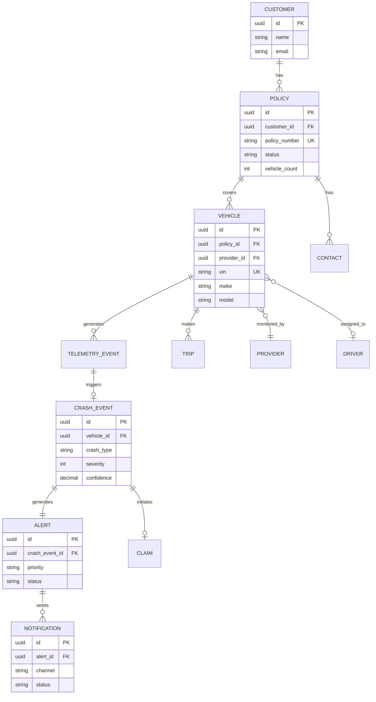
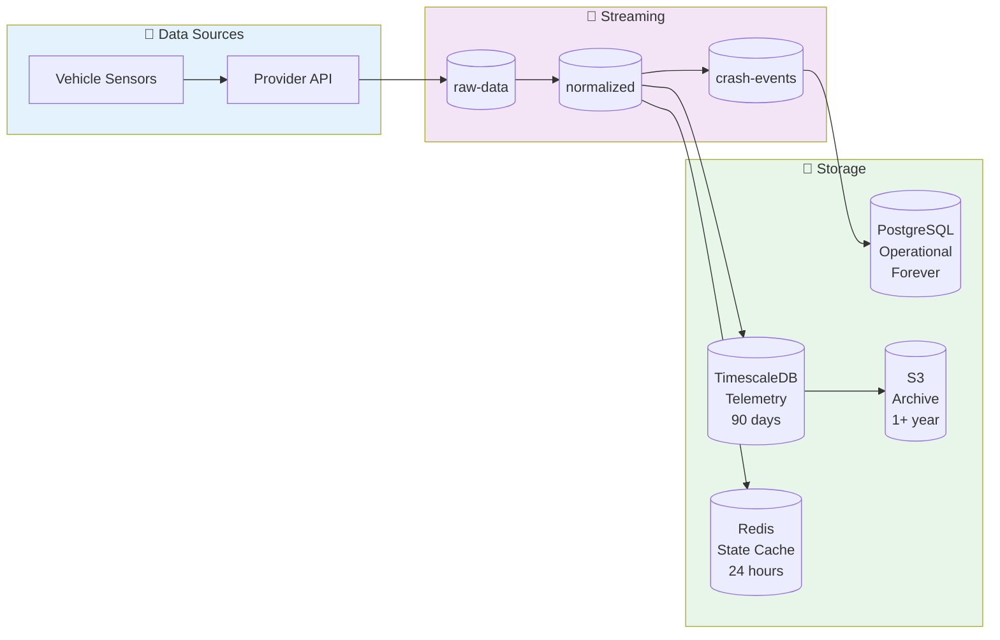

# Data Models

## Overview

This document defines the core data models used throughout the crash detection system.

---

## Entity Relationship Diagram (Mermaid)



## Data Flow Through System



---

## Entity Relationship Diagram (ASCII)

```
┌─────────────────────────────────────────────────────────────────────────────────────────┐
│                              ENTITY RELATIONSHIPS                                        │
├─────────────────────────────────────────────────────────────────────────────────────────┤
│                                                                                          │
│   ┌──────────────┐         ┌──────────────┐         ┌──────────────┐                    │
│   │   Customer   │ 1───N   │    Policy    │ 1───N   │   Vehicle    │                    │
│   │              │────────▶│              │────────▶│              │                    │
│   └──────────────┘         └──────────────┘         └──────────────┘                    │
│                                   │                        │                             │
│                                   │                        │                             │
│                                   │ 1                      │ 1                           │
│                                   │                        │                             │
│                                   ▼                        ▼                             │
│                            ┌──────────────┐         ┌──────────────┐                    │
│                            │   Contact    │         │   Driver     │                    │
│                            │              │         │              │                    │
│                            └──────────────┘         └──────────────┘                    │
│                                                            │                             │
│                                                            │ N                           │
│                                                            │                             │
│   ┌──────────────┐                                         ▼                             │
│   │  Provider    │ 1───N   ┌──────────────┐         ┌──────────────┐                    │
│   │              │────────▶│ TelemetryEvent│◀────N──│    Trip      │                    │
│   └──────────────┘         └──────────────┘         └──────────────┘                    │
│                                   │                                                      │
│                                   │ N                                                    │
│                                   │                                                      │
│                                   ▼                                                      │
│                            ┌──────────────┐         ┌──────────────┐                    │
│                            │ CrashEvent   │ 1───1   │    Alert     │                    │
│                            │              │────────▶│              │                    │
│                            └──────────────┘         └──────────────┘                    │
│                                   │                        │                             │
│                                   │ 1                      │ N                           │
│                                   │                        │                             │
│                                   ▼                        ▼                             │
│                            ┌──────────────┐         ┌──────────────┐                    │
│                            │    Claim     │         │ Notification │                    │
│                            │              │         │              │                    │
│                            └──────────────┘         └──────────────┘                    │
│                                                                                          │
└─────────────────────────────────────────────────────────────────────────────────────────┘
```

---

## Core Entities

### Policy

```sql
CREATE TABLE policies (
    id                  VARCHAR(36) PRIMARY KEY,
    customer_id         VARCHAR(36) NOT NULL REFERENCES customers(id),
    policy_number       VARCHAR(50) UNIQUE NOT NULL,
    name                VARCHAR(255) NOT NULL,
    status              VARCHAR(20) NOT NULL DEFAULT 'active',  -- active, suspended, cancelled
    effective_date      DATE NOT NULL,
    expiration_date     DATE NOT NULL,
    vehicle_count       INTEGER NOT NULL DEFAULT 0,
    tier                VARCHAR(20) NOT NULL DEFAULT 'standard', -- basic, standard, premium
    created_at          TIMESTAMPTZ NOT NULL DEFAULT NOW(),
    updated_at          TIMESTAMPTZ NOT NULL DEFAULT NOW()
);

CREATE INDEX idx_policies_customer ON policies(customer_id);
CREATE INDEX idx_policies_status ON policies(status) WHERE status = 'active';
```

### Vehicle

```sql
CREATE TABLE vehicles (
    id                  VARCHAR(36) PRIMARY KEY,
    policy_id           VARCHAR(36) NOT NULL REFERENCES policies(id),
    provider_id         VARCHAR(36) NOT NULL REFERENCES providers(id),

    -- Identifiers
    vin                 VARCHAR(17) UNIQUE,
    provider_vehicle_id VARCHAR(100) NOT NULL,
    license_plate       VARCHAR(20),

    -- Vehicle info
    make                VARCHAR(50),
    model               VARCHAR(50),
    year                INTEGER,
    vehicle_type        VARCHAR(50),  -- truck, trailer, tractor
    weight_class        VARCHAR(20),  -- light, medium, heavy

    -- Status
    status              VARCHAR(20) NOT NULL DEFAULT 'active',
    last_seen_at        TIMESTAMPTZ,
    data_quality_score  DECIMAL(3,2),

    -- Metadata
    created_at          TIMESTAMPTZ NOT NULL DEFAULT NOW(),
    updated_at          TIMESTAMPTZ NOT NULL DEFAULT NOW(),

    UNIQUE(provider_id, provider_vehicle_id)
);

CREATE INDEX idx_vehicles_policy ON vehicles(policy_id);
CREATE INDEX idx_vehicles_provider ON vehicles(provider_id);
CREATE INDEX idx_vehicles_last_seen ON vehicles(last_seen_at);
```

### Telemetry Event (TimescaleDB Hypertable)

```sql
-- TimescaleDB hypertable for time-series telemetry data
CREATE TABLE telemetry_events (
    event_id            VARCHAR(36) NOT NULL,
    vehicle_id          VARCHAR(36) NOT NULL,
    provider_id         VARCHAR(36) NOT NULL,

    -- Timestamps
    event_time          TIMESTAMPTZ NOT NULL,
    ingestion_time      TIMESTAMPTZ NOT NULL DEFAULT NOW(),

    -- GPS
    latitude            DECIMAL(10, 7),
    longitude           DECIMAL(10, 7),
    altitude_m          DECIMAL(8, 2),
    speed_mps           DECIMAL(6, 2),
    heading_deg         DECIMAL(5, 2),
    gps_accuracy_m      DECIMAL(6, 2),

    -- Accelerometer (g-force)
    accel_x             DECIMAL(6, 3),
    accel_y             DECIMAL(6, 3),
    accel_z             DECIMAL(6, 3),
    accel_magnitude     DECIMAL(6, 3),

    -- Gyroscope (degrees/sec)
    gyro_roll           DECIMAL(7, 3),
    gyro_pitch          DECIMAL(7, 3),
    gyro_yaw            DECIMAL(7, 3),

    -- Vehicle state
    ignition_state      VARCHAR(10),
    odometer_km         DECIMAL(12, 2),
    fuel_level_pct      DECIMAL(5, 2),
    engine_rpm          INTEGER,

    -- Quality
    quality_score       DECIMAL(3, 2),

    PRIMARY KEY (vehicle_id, event_time)
);

-- Convert to hypertable (TimescaleDB)
SELECT create_hypertable('telemetry_events', 'event_time',
    chunk_time_interval => INTERVAL '1 hour',
    partitioning_column => 'vehicle_id',
    number_partitions => 100
);

-- Compression policy (older than 7 days)
ALTER TABLE telemetry_events SET (
    timescaledb.compress,
    timescaledb.compress_segmentby = 'vehicle_id',
    timescaledb.compress_orderby = 'event_time DESC'
);
SELECT add_compression_policy('telemetry_events', INTERVAL '7 days');

-- Retention policy (drop after 90 days)
SELECT add_retention_policy('telemetry_events', INTERVAL '90 days');
```

### Crash Event

```sql
CREATE TABLE crash_events (
    id                  VARCHAR(36) PRIMARY KEY,
    vehicle_id          VARCHAR(36) NOT NULL,
    policy_id           VARCHAR(36) NOT NULL,

    -- Detection info
    detected_at         TIMESTAMPTZ NOT NULL,
    detection_method    VARCHAR(20) NOT NULL,  -- ml_model, rule_based, hybrid
    model_version       VARCHAR(20),
    confidence          DECIMAL(4, 3) NOT NULL,

    -- Crash details
    crash_type          VARCHAR(20) NOT NULL,  -- frontal, rear, side_left, side_right, rollover
    severity            INTEGER NOT NULL CHECK (severity BETWEEN 1 AND 5),
    max_g_force         DECIMAL(6, 2) NOT NULL,
    delta_v_mph         DECIMAL(6, 2),

    -- Location
    latitude            DECIMAL(10, 7) NOT NULL,
    longitude           DECIMAL(10, 7) NOT NULL,
    address             TEXT,
    road_type           VARCHAR(50),

    -- Context
    speed_at_impact_mph DECIMAL(6, 2),
    weather_condition   VARCHAR(50),
    road_condition      VARCHAR(50),

    -- Verification
    status              VARCHAR(20) NOT NULL DEFAULT 'detected',
    -- detected, confirmed, false_positive, under_review
    verified_at         TIMESTAMPTZ,
    verified_by         VARCHAR(100),

    -- Raw data reference
    telemetry_window    JSONB,  -- Reference to raw events

    created_at          TIMESTAMPTZ NOT NULL DEFAULT NOW(),
    updated_at          TIMESTAMPTZ NOT NULL DEFAULT NOW()
);

CREATE INDEX idx_crash_events_vehicle ON crash_events(vehicle_id);
CREATE INDEX idx_crash_events_policy ON crash_events(policy_id);
CREATE INDEX idx_crash_events_detected ON crash_events(detected_at);
CREATE INDEX idx_crash_events_status ON crash_events(status);
```

### Alert

```sql
CREATE TABLE alerts (
    id                  VARCHAR(36) PRIMARY KEY,
    crash_event_id      VARCHAR(36) REFERENCES crash_events(id),
    policy_id           VARCHAR(36) NOT NULL,
    vehicle_id          VARCHAR(36) NOT NULL,

    -- Alert info
    priority            VARCHAR(5) NOT NULL,  -- P0, P1, P2, P3
    alert_type          VARCHAR(30) NOT NULL, -- crash_detected, risk_warning, etc
    title               VARCHAR(255) NOT NULL,
    description         TEXT,

    -- Lifecycle
    status              VARCHAR(20) NOT NULL DEFAULT 'active',
    -- active, acknowledged, resolved, escalated, expired
    created_at          TIMESTAMPTZ NOT NULL DEFAULT NOW(),
    acknowledged_at     TIMESTAMPTZ,
    acknowledged_by     VARCHAR(100),
    resolved_at         TIMESTAMPTZ,
    resolved_by         VARCHAR(100),
    resolution_notes    TEXT,

    -- Escalation
    escalation_level    INTEGER NOT NULL DEFAULT 0,
    escalated_at        TIMESTAMPTZ,
    escalation_deadline TIMESTAMPTZ,

    -- Claims
    claim_id            VARCHAR(36),
    claims_link         VARCHAR(500),
    claims_link_expires TIMESTAMPTZ
);

CREATE INDEX idx_alerts_policy ON alerts(policy_id);
CREATE INDEX idx_alerts_crash ON alerts(crash_event_id);
CREATE INDEX idx_alerts_status ON alerts(status) WHERE status IN ('active', 'escalated');
CREATE INDEX idx_alerts_created ON alerts(created_at);
```

### Notification

```sql
CREATE TABLE notifications (
    id                  VARCHAR(36) PRIMARY KEY,
    alert_id            VARCHAR(36) NOT NULL REFERENCES alerts(id),
    recipient_id        VARCHAR(36) NOT NULL,

    -- Delivery info
    channel             VARCHAR(20) NOT NULL,  -- sms, push, voice, email
    provider            VARCHAR(50) NOT NULL,  -- twilio, fcm, sendgrid
    external_id         VARCHAR(100),          -- Provider's message ID

    -- Content
    template            VARCHAR(50) NOT NULL,
    content             TEXT,

    -- Status
    status              VARCHAR(20) NOT NULL DEFAULT 'queued',
    -- queued, sent, delivered, failed, read
    created_at          TIMESTAMPTZ NOT NULL DEFAULT NOW(),
    sent_at             TIMESTAMPTZ,
    delivered_at        TIMESTAMPTZ,
    read_at             TIMESTAMPTZ,
    failed_at           TIMESTAMPTZ,
    failure_reason      TEXT,

    -- Retry
    retry_count         INTEGER NOT NULL DEFAULT 0,
    next_retry_at       TIMESTAMPTZ
);

CREATE INDEX idx_notifications_alert ON notifications(alert_id);
CREATE INDEX idx_notifications_status ON notifications(status)
    WHERE status IN ('queued', 'sent');
CREATE INDEX idx_notifications_retry ON notifications(next_retry_at)
    WHERE status = 'failed' AND retry_count < 3;
```

---

## Provider Configuration

```sql
CREATE TABLE providers (
    id                  VARCHAR(36) PRIMARY KEY,
    name                VARCHAR(100) NOT NULL,
    code                VARCHAR(50) UNIQUE NOT NULL,  -- samsara, geotab, etc

    -- Integration type
    integration_type    VARCHAR(20) NOT NULL,  -- push, pull, hybrid
    protocol            VARCHAR(20) NOT NULL,  -- rest, webhook, mqtt, grpc

    -- Configuration (encrypted)
    config              JSONB NOT NULL,  -- URLs, credentials ref, etc

    -- Data mapping
    schema_version      VARCHAR(20) NOT NULL,
    field_mapping       JSONB NOT NULL,  -- JSONPath mappings

    -- Rate limiting
    rate_limit_rps      INTEGER NOT NULL DEFAULT 100,
    burst_size          INTEGER NOT NULL DEFAULT 200,

    -- Status
    status              VARCHAR(20) NOT NULL DEFAULT 'active',
    health_status       VARCHAR(20) NOT NULL DEFAULT 'unknown',
    last_health_check   TIMESTAMPTZ,

    -- Stats
    vehicle_count       INTEGER NOT NULL DEFAULT 0,
    events_per_second   DECIMAL(10, 2),

    created_at          TIMESTAMPTZ NOT NULL DEFAULT NOW(),
    updated_at          TIMESTAMPTZ NOT NULL DEFAULT NOW()
);
```

---

## Kafka Topic Schemas (Avro)

### Normalized Telemetry Event

```json
{
  "type": "record",
  "name": "NormalizedTelemetryEvent",
  "namespace": "com.crashguard.telemetry",
  "fields": [
    {"name": "event_id", "type": "string"},
    {"name": "vehicle_id", "type": "string"},
    {"name": "provider_id", "type": "string"},
    {"name": "policy_id", "type": ["null", "string"], "default": null},
    {"name": "event_time", "type": "long", "logicalType": "timestamp-millis"},
    {"name": "ingestion_time", "type": "long", "logicalType": "timestamp-millis"},
    {
      "name": "gps",
      "type": ["null", {
        "type": "record",
        "name": "GpsData",
        "fields": [
          {"name": "latitude", "type": "double"},
          {"name": "longitude", "type": "double"},
          {"name": "altitude_m", "type": ["null", "double"], "default": null},
          {"name": "speed_mps", "type": ["null", "double"], "default": null},
          {"name": "heading_deg", "type": ["null", "double"], "default": null},
          {"name": "accuracy_m", "type": ["null", "double"], "default": null}
        ]
      }],
      "default": null
    },
    {
      "name": "accelerometer",
      "type": ["null", {
        "type": "record",
        "name": "AccelerometerData",
        "fields": [
          {"name": "x_g", "type": "double"},
          {"name": "y_g", "type": "double"},
          {"name": "z_g", "type": "double"},
          {"name": "magnitude_g", "type": ["null", "double"], "default": null}
        ]
      }],
      "default": null
    },
    {
      "name": "gyroscope",
      "type": ["null", {
        "type": "record",
        "name": "GyroscopeData",
        "fields": [
          {"name": "roll_dps", "type": "double"},
          {"name": "pitch_dps", "type": "double"},
          {"name": "yaw_dps", "type": "double"}
        ]
      }],
      "default": null
    },
    {
      "name": "vehicle_state",
      "type": ["null", {
        "type": "record",
        "name": "VehicleState",
        "fields": [
          {"name": "ignition", "type": ["null", "string"], "default": null},
          {"name": "odometer_km", "type": ["null", "double"], "default": null},
          {"name": "fuel_level_pct", "type": ["null", "double"], "default": null},
          {"name": "engine_rpm", "type": ["null", "int"], "default": null}
        ]
      }],
      "default": null
    },
    {"name": "quality_score", "type": "double"}
  ]
}
```

### Crash Event

```json
{
  "type": "record",
  "name": "CrashEvent",
  "namespace": "com.crashguard.crash",
  "fields": [
    {"name": "event_id", "type": "string"},
    {"name": "vehicle_id", "type": "string"},
    {"name": "policy_id", "type": "string"},
    {"name": "detected_at", "type": "long", "logicalType": "timestamp-millis"},
    {"name": "confidence", "type": "double"},
    {"name": "crash_type", "type": {
      "type": "enum",
      "name": "CrashType",
      "symbols": ["FRONTAL", "REAR", "SIDE_LEFT", "SIDE_RIGHT", "ROLLOVER", "UNKNOWN"]
    }},
    {"name": "severity", "type": "int"},
    {"name": "max_g_force", "type": "double"},
    {"name": "delta_v_mph", "type": ["null", "double"], "default": null},
    {"name": "speed_at_impact_mph", "type": ["null", "double"], "default": null},
    {
      "name": "location",
      "type": {
        "type": "record",
        "name": "Location",
        "fields": [
          {"name": "latitude", "type": "double"},
          {"name": "longitude", "type": "double"},
          {"name": "address", "type": ["null", "string"], "default": null}
        ]
      }
    },
    {"name": "model_version", "type": "string"},
    {"name": "detection_method", "type": "string"},
    {
      "name": "raw_events",
      "type": {"type": "array", "items": "NormalizedTelemetryEvent"}
    }
  ]
}
```

---

## Redis Data Structures

### Vehicle State Cache

```
Key: vehicle:state:{vehicle_id}
Type: Hash
TTL: 24 hours (sliding)

Fields:
  current_state: "DRIVING"
  state_since: "2024-01-15T10:30:00Z"
  last_event_time: "2024-01-15T14:32:00Z"
  last_latitude: "40.7128"
  last_longitude: "-74.0060"
  last_speed_mps: "25.4"
  trip_id: "TRIP-abc123"
  driver_id: "DRV-789"
  risk_score: "72"
```

### Deduplication Set

```
Key: dedup:{provider_id}:{YYYYMMDDHH}
Type: Set (or Bloom Filter)
TTL: 2 hours

Members: event_idempotency_keys
```

### Rate Limiter

```
Key: ratelimit:{provider_id}
Type: Hash
TTL: 3600 seconds

Fields:
  tokens: "85.5"
  last_update: "1705329120.456"
```

### Alert Escalation Timer

```
Key: alert:escalation:{alert_id}
Type: String (Sorted Set for multiple alerts)
TTL: Based on priority

Value: escalation_deadline_timestamp
```

---

## Data Retention Policy

| Data Type | Hot Storage | Warm Storage | Cold Storage | Total Retention |
|-----------|-------------|--------------|--------------|-----------------|
| Raw Telemetry | 7 days (TimescaleDB) | 30 days (S3 Parquet) | 1 year (Glacier) | 1 year |
| Crash Events | Forever (PostgreSQL) | - | - | Forever |
| Alerts | 2 years (PostgreSQL) | - | 5 years (Archive) | 7 years |
| Notifications | 90 days (PostgreSQL) | 1 year (S3) | - | 1 year |
| ML Training Data | - | Forever (S3) | - | Forever |
| Audit Logs | 90 days (Elasticsearch) | 1 year (S3) | 6 years (Glacier) | 7 years |

