# Architecture Diagrams (Mermaid)

## 1. System Context Diagram (C4 Level 1)

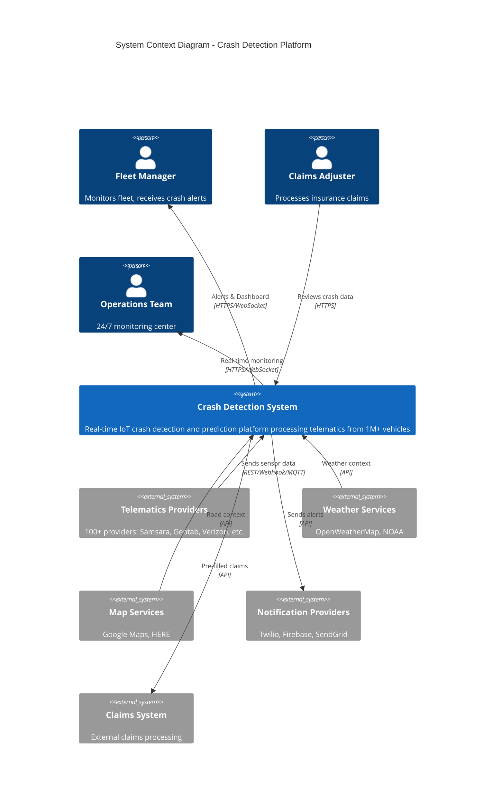
```mermaid
C4Context
    title System Context Diagram - Crash Detection Platform

    Person(fleet_manager, "Fleet Manager", "Monitors fleet, receives crash alerts")
    Person(claims_adjuster, "Claims Adjuster", "Processes insurance claims")
    Person(ops_team, "Operations Team", "24/7 monitoring center")

    System(crash_system, "Crash Detection System", "Real-time IoT crash detection and prediction platform processing telematics from 1M+ vehicles")

    System_Ext(telematics, "Telematics Providers", "100+ providers: Samsara, Geotab, Verizon, etc.")
    System_Ext(weather, "Weather Services", "OpenWeatherMap, NOAA")
    System_Ext(maps, "Map Services", "Google Maps, HERE")
    System_Ext(notify, "Notification Providers", "Twilio, Firebase, SendGrid")
    System_Ext(claims_ext, "Claims System", "External claims processing")

    Rel(telematics, crash_system, "Sends sensor data", "REST/Webhook/MQTT")
    Rel(crash_system, notify, "Sends alerts", "API")
    Rel(crash_system, fleet_manager, "Alerts & Dashboard", "HTTPS/WebSocket")
    Rel(crash_system, ops_team, "Real-time monitoring", "HTTPS/WebSocket")
    Rel(claims_adjuster, crash_system, "Reviews crash data", "HTTPS")
    Rel(crash_system, claims_ext, "Pre-filled claims", "API")
    Rel(weather, crash_system, "Weather context", "API")
    Rel(maps, crash_system, "Road context", "API")
```

---

## 2. High-Level System Architecture

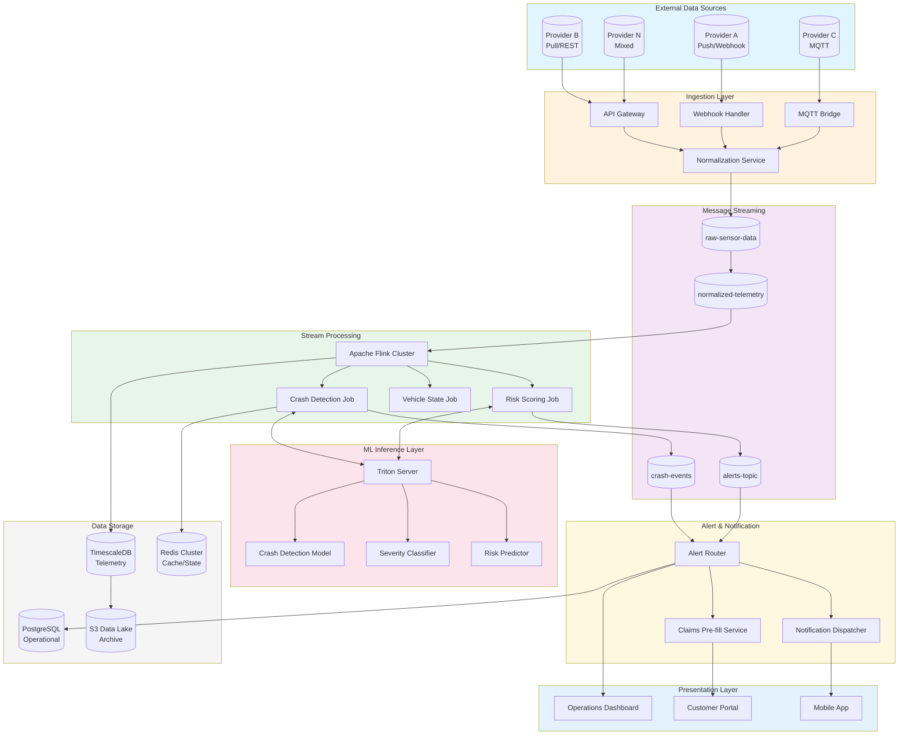
```mermaid
flowchart TB
    subgraph External["External Data Sources"]
        P1[("Provider A<br/>Push/Webhook")]
        P2[("Provider B<br/>Pull/REST")]
        P3[("Provider C<br/>MQTT")]
        PN[("Provider N<br/>Mixed")]
    end

    subgraph Ingestion["Ingestion Layer"]
        GW[API Gateway]
        WH[Webhook Handler]
        MQTT[MQTT Bridge]
        NORM[Normalization Service]
    end

    subgraph Streaming["Message Streaming"]
        K1[(raw-sensor-data)]
        K2[(normalized-telemetry)]
        K3[(crash-events)]
        K4[(alerts-topic)]
    end

    subgraph Processing["Stream Processing"]
        FL[Apache Flink Cluster]
        CD[Crash Detection Job]
        RS[Risk Scoring Job]
        VS[Vehicle State Job]
    end

    subgraph ML["ML Inference Layer"]
        TR[Triton Server]
        M1[Crash Detection Model]
        M2[Severity Classifier]
        M3[Risk Predictor]
    end

    subgraph Alerts["Alert & Notification"]
        AR[Alert Router]
        ND[Notification Dispatcher]
        CP[Claims Pre-fill Service]
    end

    subgraph Storage["Data Storage"]
        TS[(TimescaleDB<br/>Telemetry)]
        PG[(PostgreSQL<br/>Operational)]
        RD[(Redis Cluster<br/>Cache/State)]
        S3[(S3 Data Lake<br/>Archive)]
    end

    subgraph Presentation["Presentation Layer"]
        DB[Operations Dashboard]
        CP2[Customer Portal]
        MA[Mobile App]
    end

    P1 --> WH
    P2 --> GW
    P3 --> MQTT
    PN --> GW

    GW --> NORM
    WH --> NORM
    MQTT --> NORM

    NORM --> K1
    K1 --> K2
    K2 --> FL

    FL --> CD
    FL --> RS
    FL --> VS

    CD <--> TR
    RS <--> TR
    TR --> M1
    TR --> M2
    TR --> M3

    CD --> K3
    RS --> K4

    K3 --> AR
    K4 --> AR
    AR --> ND
    AR --> CP

    FL --> TS
    AR --> PG
    CD --> RD
    TS --> S3

    AR --> DB
    ND --> MA
    CP --> CP2

    style External fill:#e1f5fe
    style Ingestion fill:#fff3e0
    style Streaming fill:#f3e5f5
    style Processing fill:#e8f5e9
    style ML fill:#fce4ec
    style Alerts fill:#fff8e1
    style Storage fill:#f5f5f5
    style Presentation fill:#e3f2fd
```

---

## 3. Data Ingestion Flow

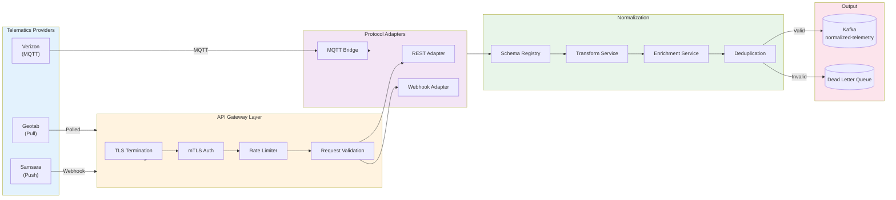
```mermaid
flowchart LR
    subgraph Providers["Telematics Providers"]
        direction TB
        PA["Samsara<br/>(Push)"]
        PB["Geotab<br/>(Pull)"]
        PC["Verizon<br/>(MQTT)"]
    end

    subgraph Gateway["API Gateway Layer"]
        direction TB
        TLS[TLS Termination]
        AUTH[mTLS Auth]
        RATE[Rate Limiter]
        VAL[Request Validation]
    end

    subgraph Adapters["Protocol Adapters"]
        direction TB
        REST[REST Adapter]
        HOOK[Webhook Adapter]
        MQ[MQTT Bridge]
    end

    subgraph Normalize["Normalization"]
        direction TB
        SCHEMA[Schema Registry]
        TRANS[Transform Service]
        ENRICH[Enrichment Service]
        DEDUP[Deduplication]
    end

    subgraph Output["Output"]
        KAFKA[(Kafka<br/>normalized-telemetry)]
        DLQ[(Dead Letter Queue)]
    end

    PA -->|Webhook| Gateway
    PB -->|Polled| Gateway
    PC -->|MQTT| MQ

    Gateway --> TLS --> AUTH --> RATE --> VAL

    VAL --> REST
    VAL --> HOOK
    MQ --> Adapters

    Adapters --> SCHEMA
    SCHEMA --> TRANS
    TRANS --> ENRICH
    ENRICH --> DEDUP

    DEDUP -->|Valid| KAFKA
    DEDUP -->|Invalid| DLQ

    style Providers fill:#e3f2fd
    style Gateway fill:#fff3e0
    style Adapters fill:#f3e5f5
    style Normalize fill:#e8f5e9
    style Output fill:#fce4ec
```

---

## 4. Push vs Pull Integration Models

```mermaid
flowchart TB
    subgraph Push["Push Model (Real-time)"]
        direction LR
        V1[Vehicle] -->|Sensor Data| TP1[Provider]
        TP1 -->|Webhook POST| WH1[Webhook Gateway]
        WH1 -->|<100ms| KP1[Kafka]

        Note1["Latency: <500ms<br/>Providers: Samsara, KeepTruckin"]
    end

    subgraph Pull["Pull Model (Near Real-time)"]
        direction LR
        V2[Vehicle] -->|Sensor Data| TP2[Provider]
        SCHED[Scheduler] -->|Every 5s| POLL[Poller Fleet]
        POLL -->|API Call| TP2
        TP2 -->|Response| POLL
        POLL -->|Batch| KP2[Kafka]

        Note2["Latency: <6s<br/>Providers: Geotab, Omnitracs"]
    end

    subgraph Hybrid["Hybrid Model"]
        direction LR
        V3[Vehicle] -->|Sensor Data| TP3[Provider]
        TP3 -->|Normal: Pull| HP[Hybrid Handler]
        TP3 -->|Alerts: Push| HP
        HP --> KP3[Kafka]

        Note3["Best of both<br/>Provider: Verizon Connect"]
    end

    style Push fill:#e8f5e9
    style Pull fill:#fff3e0
    style Hybrid fill:#e3f2fd
```

---

## 5. Stream Processing Pipeline

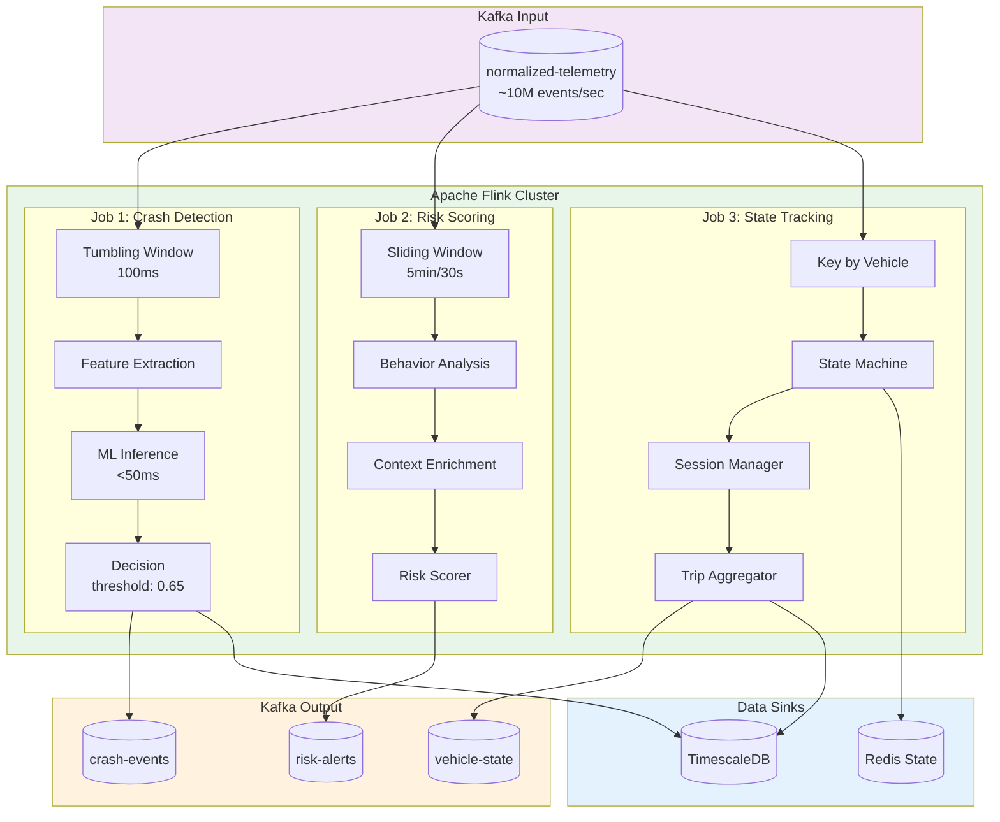
```mermaid
flowchart TB
    subgraph Input["Kafka Input"]
        KT[(normalized-telemetry<br/>~10M events/sec)]
    end

    subgraph Flink["Apache Flink Cluster"]
        direction TB

        subgraph Job1["Job 1: Crash Detection"]
            W1[Tumbling Window<br/>100ms]
            F1[Feature Extraction]
            ML1[ML Inference<br/><50ms]
            D1[Decision<br/>threshold: 0.65]
        end

        subgraph Job2["Job 2: Risk Scoring"]
            W2[Sliding Window<br/>5min/30s]
            BA[Behavior Analysis]
            CTX[Context Enrichment]
            SC[Risk Scorer]
        end

        subgraph Job3["Job 3: State Tracking"]
            KEY[Key by Vehicle]
            SM[State Machine]
            SESS[Session Manager]
            AGG[Trip Aggregator]
        end
    end

    subgraph Output["Kafka Output"]
        KC[(crash-events)]
        KR[(risk-alerts)]
        KS[(vehicle-state)]
    end

    subgraph Sinks["Data Sinks"]
        TS[(TimescaleDB)]
        RD[(Redis State)]
    end

    KT --> W1 --> F1 --> ML1 --> D1 --> KC
    KT --> W2 --> BA --> CTX --> SC --> KR
    KT --> KEY --> SM --> SESS --> AGG --> KS

    D1 --> TS
    SM --> RD
    AGG --> TS

    style Input fill:#f3e5f5
    style Flink fill:#e8f5e9
    style Output fill:#fff3e0
    style Sinks fill:#e3f2fd
```

---

## 6. Crash Detection Algorithm

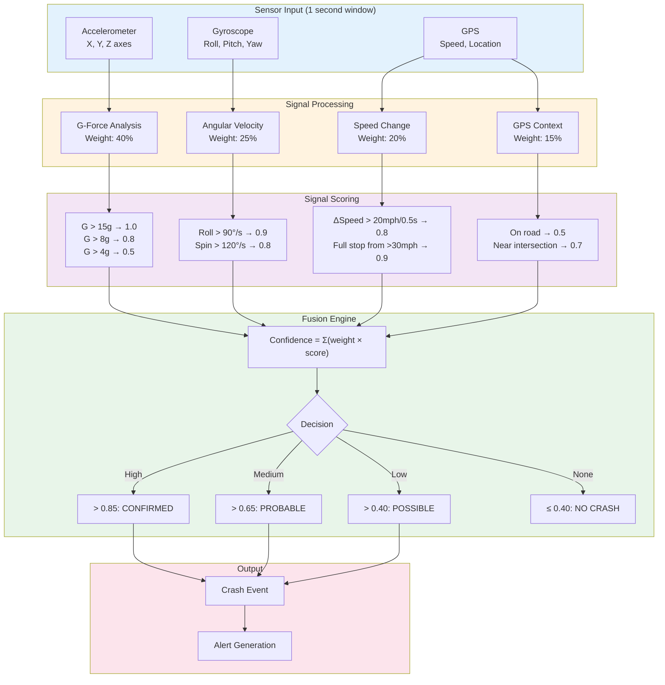
```mermaid
flowchart TB
    subgraph Input["Sensor Input (1 second window)"]
        ACC[Accelerometer<br/>X, Y, Z axes]
        GYRO[Gyroscope<br/>Roll, Pitch, Yaw]
        GPS[GPS<br/>Speed, Location]
    end

    subgraph Signals["Signal Processing"]
        S1[G-Force Analysis<br/>Weight: 40%]
        S2[Angular Velocity<br/>Weight: 25%]
        S3[Speed Change<br/>Weight: 20%]
        S4[GPS Context<br/>Weight: 15%]
    end

    subgraph Scoring["Signal Scoring"]
        SC1["G > 15g → 1.0<br/>G > 8g → 0.8<br/>G > 4g → 0.5"]
        SC2["Roll > 90°/s → 0.9<br/>Spin > 120°/s → 0.8"]
        SC3["ΔSpeed > 20mph/0.5s → 0.8<br/>Full stop from >30mph → 0.9"]
        SC4["On road → 0.5<br/>Near intersection → 0.7"]
    end

    subgraph Fusion["Fusion Engine"]
        CALC["Confidence = Σ(weight × score)"]

        DEC{Decision}

        CONF["> 0.85: CONFIRMED"]
        PROB["> 0.65: PROBABLE"]
        POSS["> 0.40: POSSIBLE"]
        NO["≤ 0.40: NO CRASH"]
    end

    subgraph Output["Output"]
        CRASH[Crash Event]
        ALERT[Alert Generation]
    end

    ACC --> S1 --> SC1
    GYRO --> S2 --> SC2
    GPS --> S3 --> SC3
    GPS --> S4 --> SC4

    SC1 --> CALC
    SC2 --> CALC
    SC3 --> CALC
    SC4 --> CALC

    CALC --> DEC
    DEC -->|High| CONF --> CRASH
    DEC -->|Medium| PROB --> CRASH
    DEC -->|Low| POSS --> CRASH
    DEC -->|None| NO

    CRASH --> ALERT

    style Input fill:#e3f2fd
    style Signals fill:#fff3e0
    style Scoring fill:#f3e5f5
    style Fusion fill:#e8f5e9
    style Output fill:#fce4ec
```

---

## 7. ML Pipeline Architecture

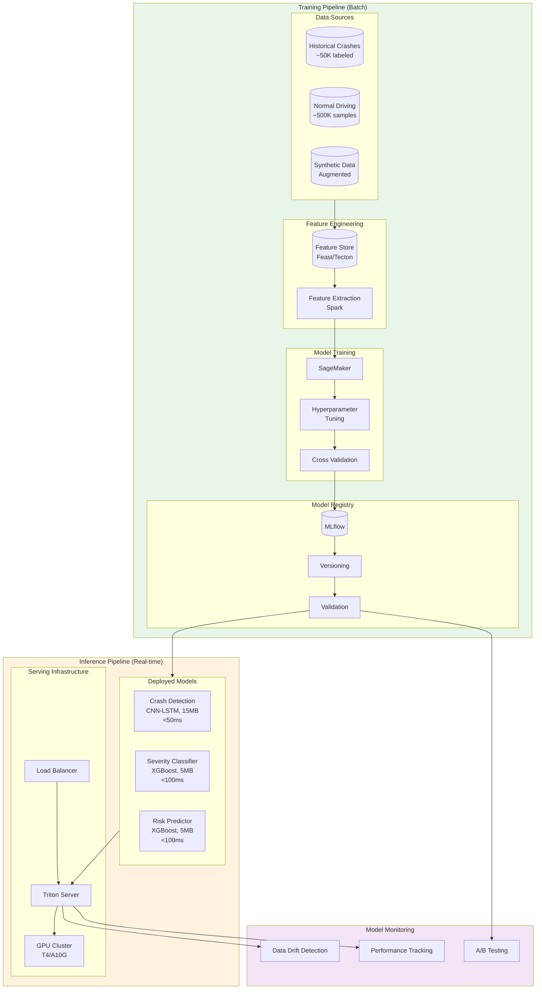
```mermaid
flowchart TB
    subgraph Training["Training Pipeline (Batch)"]
        direction TB

        subgraph Data["Data Sources"]
            HD[(Historical Crashes<br/>~50K labeled)]
            ND[(Normal Driving<br/>~500K samples)]
            SD[(Synthetic Data<br/>Augmented)]
        end

        subgraph Feature["Feature Engineering"]
            FS[(Feature Store<br/>Feast/Tecton)]
            FE[Feature Extraction<br/>Spark]
        end

        subgraph Train["Model Training"]
            SM[SageMaker]
            HP[Hyperparameter<br/>Tuning]
            CV[Cross Validation]
        end

        subgraph Registry["Model Registry"]
            MR[(MLflow)]
            VER[Versioning]
            VAL[Validation]
        end
    end

    subgraph Serving["Inference Pipeline (Real-time)"]
        direction TB

        subgraph Models["Deployed Models"]
            M1[Crash Detection<br/>CNN-LSTM, 15MB<br/><50ms]
            M2[Severity Classifier<br/>XGBoost, 5MB<br/><100ms]
            M3[Risk Predictor<br/>XGBoost, 5MB<br/><100ms]
        end

        subgraph Infra["Serving Infrastructure"]
            TR[Triton Server]
            GPU[GPU Cluster<br/>T4/A10G]
            LB[Load Balancer]
        end
    end

    subgraph Monitor["Model Monitoring"]
        DRIFT[Data Drift Detection]
        PERF[Performance Tracking]
        AB[A/B Testing]
    end

    Data --> FS --> FE --> SM
    SM --> HP --> CV --> MR
    MR --> VER --> VAL --> Models

    Models --> TR --> GPU
    LB --> TR

    TR --> DRIFT
    TR --> PERF
    VAL --> AB

    style Training fill:#e8f5e9
    style Serving fill:#fff3e0
    style Monitor fill:#f3e5f5
```

---

## 8. Alert & Notification Flow

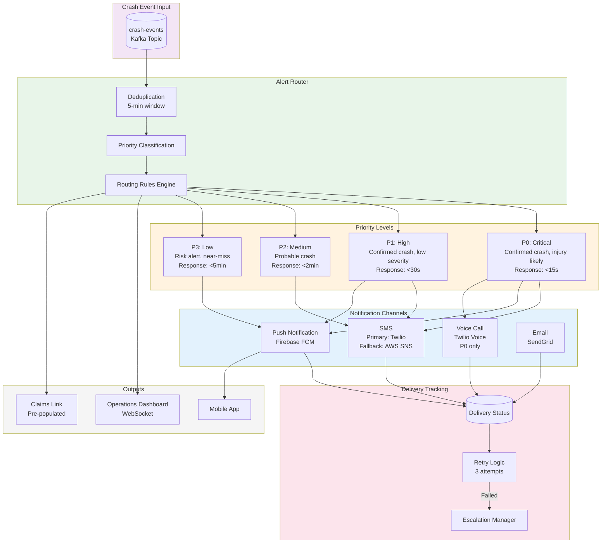
```mermaid
flowchart TB
    subgraph Input["Crash Event Input"]
        KE[(crash-events<br/>Kafka Topic)]
    end

    subgraph Router["Alert Router"]
        DEDUP[Deduplication<br/>5-min window]
        CLASS[Priority Classification]
        ROUTE[Routing Rules Engine]
    end

    subgraph Priority["Priority Levels"]
        P0["P0: Critical<br/>Confirmed crash, injury likely<br/>Response: <15s"]
        P1["P1: High<br/>Confirmed crash, low severity<br/>Response: <30s"]
        P2["P2: Medium<br/>Probable crash<br/>Response: <2min"]
        P3["P3: Low<br/>Risk alert, near-miss<br/>Response: <5min"]
    end

    subgraph Channels["Notification Channels"]
        SMS[SMS<br/>Primary: Twilio<br/>Fallback: AWS SNS]
        PUSH[Push Notification<br/>Firebase FCM]
        VOICE[Voice Call<br/>Twilio Voice<br/>P0 only]
        EMAIL[Email<br/>SendGrid]
    end

    subgraph Delivery["Delivery Tracking"]
        TRACK[(Delivery Status)]
        RETRY[Retry Logic<br/>3 attempts]
        ESC[Escalation Manager]
    end

    subgraph Outputs["Outputs"]
        DASH[Operations Dashboard<br/>WebSocket]
        MOBILE[Mobile App]
        CLAIMS[Claims Link<br/>Pre-populated]
    end

    KE --> DEDUP --> CLASS --> ROUTE

    ROUTE --> P0 --> SMS & PUSH & VOICE
    ROUTE --> P1 --> SMS & PUSH
    ROUTE --> P2 --> SMS
    ROUTE --> P3 --> PUSH

    SMS --> TRACK
    PUSH --> TRACK
    VOICE --> TRACK
    EMAIL --> TRACK

    TRACK --> RETRY
    RETRY -->|Failed| ESC

    ROUTE --> DASH
    PUSH --> MOBILE
    ROUTE --> CLAIMS

    style Input fill:#f3e5f5
    style Router fill:#e8f5e9
    style Priority fill:#fff3e0
    style Channels fill:#e3f2fd
    style Delivery fill:#fce4ec
    style Outputs fill:#f5f5f5
```

---

## 9. Vehicle State Machine

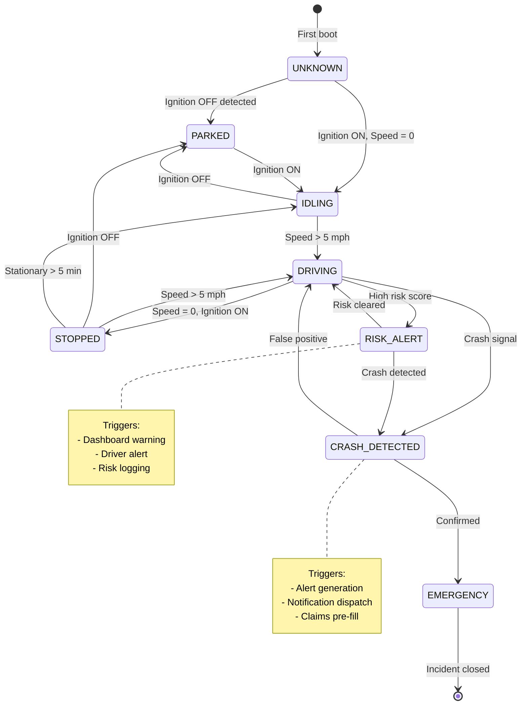
```mermaid
stateDiagram-v2
    [*] --> UNKNOWN: First boot

    UNKNOWN --> PARKED: Ignition OFF detected
    UNKNOWN --> IDLING: Ignition ON, Speed = 0

    PARKED --> IDLING: Ignition ON

    IDLING --> DRIVING: Speed > 5 mph
    IDLING --> PARKED: Ignition OFF

    DRIVING --> STOPPED: Speed = 0, Ignition ON
    DRIVING --> CRASH_DETECTED: Crash signal
    DRIVING --> RISK_ALERT: High risk score

    STOPPED --> DRIVING: Speed > 5 mph
    STOPPED --> PARKED: Ignition OFF
    STOPPED --> IDLING: Stationary > 5 min

    CRASH_DETECTED --> EMERGENCY: Confirmed
    CRASH_DETECTED --> DRIVING: False positive

    RISK_ALERT --> DRIVING: Risk cleared
    RISK_ALERT --> CRASH_DETECTED: Crash detected

    EMERGENCY --> [*]: Incident closed

    note right of CRASH_DETECTED
        Triggers:
        - Alert generation
        - Notification dispatch
        - Claims pre-fill
    end note

    note right of RISK_ALERT
        Triggers:
        - Dashboard warning
        - Driver alert
        - Risk logging
    end note
```

---

## 10. Notification Escalation Timeline

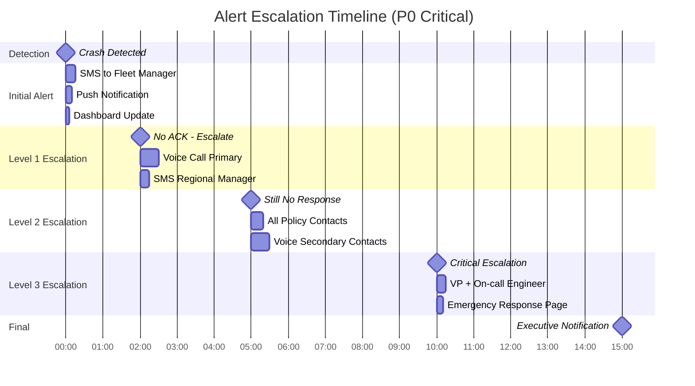
```mermaid
gantt
    title Alert Escalation Timeline (P0 Critical)
    dateFormat mm:ss
    axisFormat %M:%S

    section Detection
    Crash Detected           :milestone, m1, 00:00, 0s

    section Initial Alert
    SMS to Fleet Manager     :a1, 00:00, 15s
    Push Notification        :a2, 00:00, 10s
    Dashboard Update         :a3, 00:00, 5s

    section Level 1 Escalation
    No ACK - Escalate        :milestone, m2, 02:00, 0s
    Voice Call Primary       :b1, 02:00, 30s
    SMS Regional Manager     :b2, 02:00, 15s

    section Level 2 Escalation
    Still No Response        :milestone, m3, 05:00, 0s
    All Policy Contacts      :c1, 05:00, 20s
    Voice Secondary Contacts :c2, 05:00, 30s

    section Level 3 Escalation
    Critical Escalation      :milestone, m4, 10:00, 0s
    VP + On-call Engineer    :d1, 10:00, 15s
    Emergency Response Page  :d2, 10:00, 10s

    section Final
    Executive Notification   :milestone, m5, 15:00, 0s
```

---

## 11. Data Flow Sequence

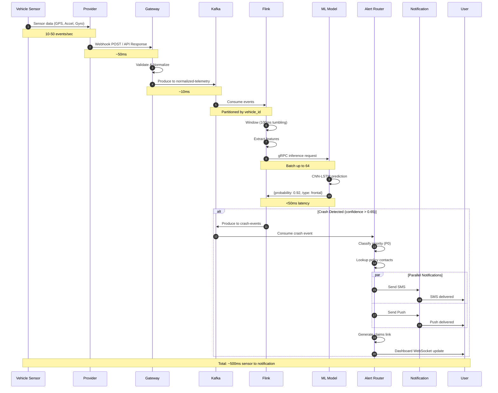
```mermaid
sequenceDiagram
    autonumber
    participant V as Vehicle Sensor
    participant P as Provider
    participant G as Gateway
    participant K as Kafka
    participant F as Flink
    participant M as ML Model
    participant A as Alert Router
    participant N as Notification
    participant U as User

    V->>P: Sensor data (GPS, Accel, Gyro)
    Note over V,P: 10-50 events/sec

    P->>G: Webhook POST / API Response
    Note over P,G: ~50ms

    G->>G: Validate & Normalize
    G->>K: Produce to normalized-telemetry
    Note over G,K: ~10ms

    K->>F: Consume events
    Note over K,F: Partitioned by vehicle_id

    F->>F: Window (100ms tumbling)
    F->>F: Extract features

    F->>M: gRPC inference request
    Note over F,M: Batch up to 64

    M->>M: CNN-LSTM prediction
    M->>F: {probability: 0.92, type: frontal}
    Note over M,F: <50ms latency

    alt Crash Detected (confidence > 0.65)
        F->>K: Produce to crash-events
        K->>A: Consume crash event
        A->>A: Classify priority (P0)
        A->>A: Lookup policy contacts

        par Parallel Notifications
            A->>N: Send SMS
            N->>U: SMS delivered
            and
            A->>N: Send Push
            N->>U: Push delivered
        end

        A->>A: Generate claims link
        A->>U: Dashboard WebSocket update
    end

    Note over V,U: Total: ~500ms sensor to notification
```

---

## 12. Multi-Region Deployment

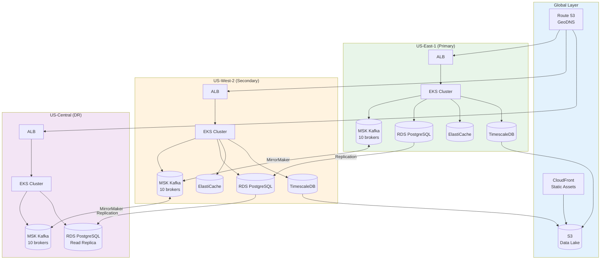
```mermaid
flowchart TB
    subgraph Global["Global Layer"]
        DNS[Route 53<br/>GeoDNS]
        CDN[CloudFront<br/>Static Assets]
        S3G[(S3<br/>Data Lake)]
    end

    subgraph East["US-East-1 (Primary)"]
        direction TB
        ALB1[ALB]
        EKS1[EKS Cluster]
        MSK1[(MSK Kafka<br/>10 brokers)]
        RDS1[(RDS PostgreSQL)]
        EC1[(ElastiCache)]
        TS1[(TimescaleDB)]
    end

    subgraph West["US-West-2 (Secondary)"]
        direction TB
        ALB2[ALB]
        EKS2[EKS Cluster]
        MSK2[(MSK Kafka<br/>10 brokers)]
        RDS2[(RDS PostgreSQL)]
        EC2[(ElastiCache)]
        TS2[(TimescaleDB)]
    end

    subgraph Central["US-Central (DR)"]
        direction TB
        ALB3[ALB]
        EKS3[EKS Cluster]
        MSK3[(MSK Kafka<br/>10 brokers)]
        RDS3[(RDS PostgreSQL<br/>Read Replica)]
    end

    DNS --> ALB1 & ALB2 & ALB3
    CDN --> S3G

    ALB1 --> EKS1
    EKS1 --> MSK1
    EKS1 --> RDS1
    EKS1 --> EC1
    EKS1 --> TS1

    ALB2 --> EKS2
    EKS2 --> MSK2
    EKS2 --> RDS2
    EKS2 --> EC2
    EKS2 --> TS2

    ALB3 --> EKS3
    EKS3 --> MSK3
    EKS3 --> RDS3

    MSK1 <-->|MirrorMaker| MSK2
    MSK2 <-->|MirrorMaker| MSK3
    RDS1 -->|Replication| RDS2
    RDS2 -->|Replication| RDS3

    TS1 --> S3G
    TS2 --> S3G

    style Global fill:#e3f2fd
    style East fill:#e8f5e9
    style West fill:#fff3e0
    style Central fill:#f3e5f5
```

---

## 13. Observability Stack

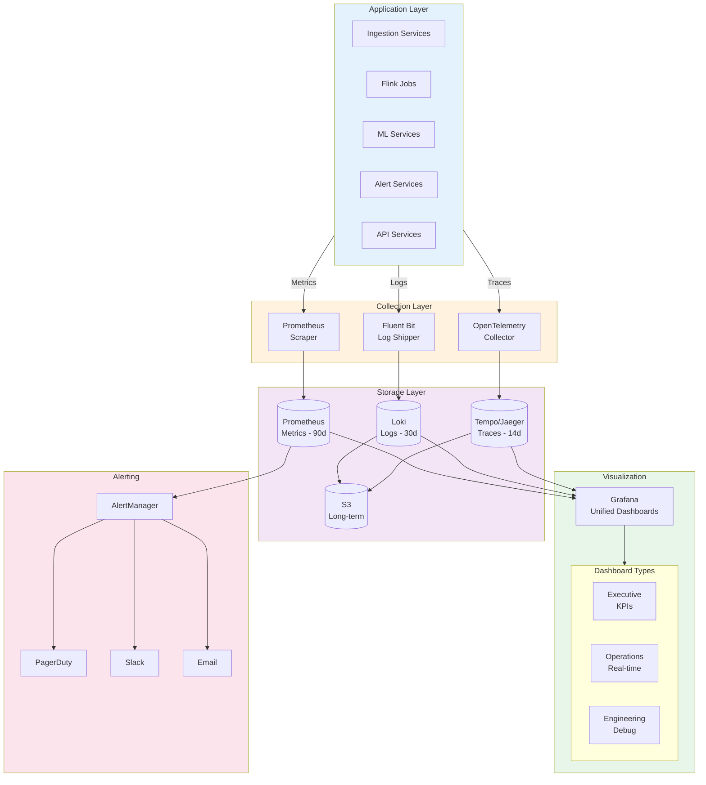
```mermaid
flowchart TB
    subgraph Apps["Application Layer"]
        ING[Ingestion Services]
        FLK[Flink Jobs]
        MLS[ML Services]
        ALT[Alert Services]
        API[API Services]
    end

    subgraph Collection["Collection Layer"]
        OTEL[OpenTelemetry<br/>Collector]
        FB[Fluent Bit<br/>Log Shipper]
        PROM[Prometheus<br/>Scraper]
    end

    subgraph Storage["Storage Layer"]
        TEMPO[(Tempo/Jaeger<br/>Traces - 14d)]
        LOKI[(Loki<br/>Logs - 30d)]
        PROMS[(Prometheus<br/>Metrics - 90d)]
        S3L[(S3<br/>Long-term)]
    end

    subgraph Viz["Visualization"]
        GRAF[Grafana<br/>Unified Dashboards]

        subgraph Dashboards["Dashboard Types"]
            EXEC[Executive<br/>KPIs]
            OPS[Operations<br/>Real-time]
            ENG[Engineering<br/>Debug]
        end
    end

    subgraph Alerting["Alerting"]
        AM[AlertManager]
        PD[PagerDuty]
        SL[Slack]
        EM[Email]
    end

    Apps -->|Traces| OTEL
    Apps -->|Logs| FB
    Apps -->|Metrics| PROM

    OTEL --> TEMPO
    FB --> LOKI
    PROM --> PROMS

    TEMPO --> S3L
    LOKI --> S3L

    TEMPO --> GRAF
    LOKI --> GRAF
    PROMS --> GRAF

    GRAF --> Dashboards

    PROMS --> AM
    AM --> PD & SL & EM

    style Apps fill:#e3f2fd
    style Collection fill:#fff3e0
    style Storage fill:#f3e5f5
    style Viz fill:#e8f5e9
    style Alerting fill:#fce4ec
```

---

## 14. SLA Monitoring Dashboard

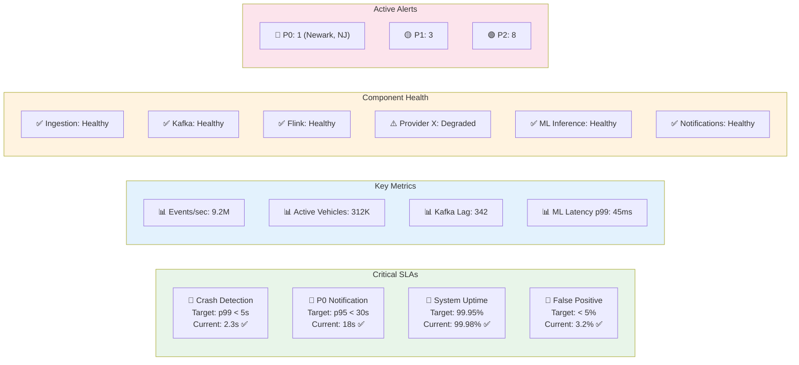
```mermaid
flowchart LR
    subgraph SLAs["Critical SLAs"]
        direction TB
        SLA1["🎯 Crash Detection<br/>Target: p99 < 5s<br/>Current: 2.3s ✅"]
        SLA2["🎯 P0 Notification<br/>Target: p95 < 30s<br/>Current: 18s ✅"]
        SLA3["🎯 System Uptime<br/>Target: 99.95%<br/>Current: 99.98% ✅"]
        SLA4["🎯 False Positive<br/>Target: < 5%<br/>Current: 3.2% ✅"]
    end

    subgraph Metrics["Key Metrics"]
        direction TB
        M1["📊 Events/sec: 9.2M"]
        M2["📊 Active Vehicles: 312K"]
        M3["📊 Kafka Lag: 342"]
        M4["📊 ML Latency p99: 45ms"]
    end

    subgraph Health["Component Health"]
        direction TB
        H1["✅ Ingestion: Healthy"]
        H2["✅ Kafka: Healthy"]
        H3["✅ Flink: Healthy"]
        H4["⚠️ Provider X: Degraded"]
        H5["✅ ML Inference: Healthy"]
        H6["✅ Notifications: Healthy"]
    end

    subgraph Alerts["Active Alerts"]
        direction TB
        A1["🔴 P0: 1 (Newark, NJ)"]
        A2["🟡 P1: 3"]
        A3["🟢 P2: 8"]
    end

    style SLAs fill:#e8f5e9
    style Metrics fill:#e3f2fd
    style Health fill:#fff3e0
    style Alerts fill:#fce4ec
```

---

## 15. Data Model ER Diagram

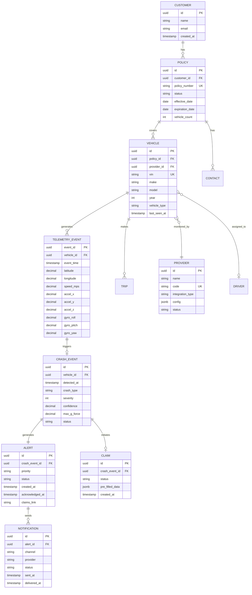
```mermaid
erDiagram
    CUSTOMER ||--o{ POLICY : has
    POLICY ||--o{ VEHICLE : covers
    POLICY ||--o{ CONTACT : has
    VEHICLE ||--o{ TELEMETRY_EVENT : generates
    VEHICLE ||--o{ TRIP : makes
    VEHICLE }o--|| PROVIDER : monitored_by
    VEHICLE }o--o| DRIVER : assigned_to

    TELEMETRY_EVENT ||--o| CRASH_EVENT : triggers
    CRASH_EVENT ||--|| ALERT : generates
    ALERT ||--o{ NOTIFICATION : sends
    CRASH_EVENT ||--o| CLAIM : initiates

    CUSTOMER {
        uuid id PK
        string name
        string email
        timestamp created_at
    }

    POLICY {
        uuid id PK
        uuid customer_id FK
        string policy_number UK
        string status
        date effective_date
        date expiration_date
        int vehicle_count
    }

    VEHICLE {
        uuid id PK
        uuid policy_id FK
        uuid provider_id FK
        string vin UK
        string make
        string model
        int year
        string vehicle_type
        timestamp last_seen_at
    }

    PROVIDER {
        uuid id PK
        string name
        string code UK
        string integration_type
        jsonb config
        string status
    }

    TELEMETRY_EVENT {
        uuid event_id PK
        uuid vehicle_id FK
        timestamp event_time
        decimal latitude
        decimal longitude
        decimal speed_mps
        decimal accel_x
        decimal accel_y
        decimal accel_z
        decimal gyro_roll
        decimal gyro_pitch
        decimal gyro_yaw
    }

    CRASH_EVENT {
        uuid id PK
        uuid vehicle_id FK
        timestamp detected_at
        string crash_type
        int severity
        decimal confidence
        decimal max_g_force
        string status
    }

    ALERT {
        uuid id PK
        uuid crash_event_id FK
        string priority
        string status
        timestamp created_at
        timestamp acknowledged_at
        string claims_link
    }

    NOTIFICATION {
        uuid id PK
        uuid alert_id FK
        string channel
        string provider
        string status
        timestamp sent_at
        timestamp delivered_at
    }

    CLAIM {
        uuid id PK
        uuid crash_event_id FK
        string status
        jsonb pre_filled_data
        timestamp created_at
    }
```

---

## 16. Failure Handling & Circuit Breaker

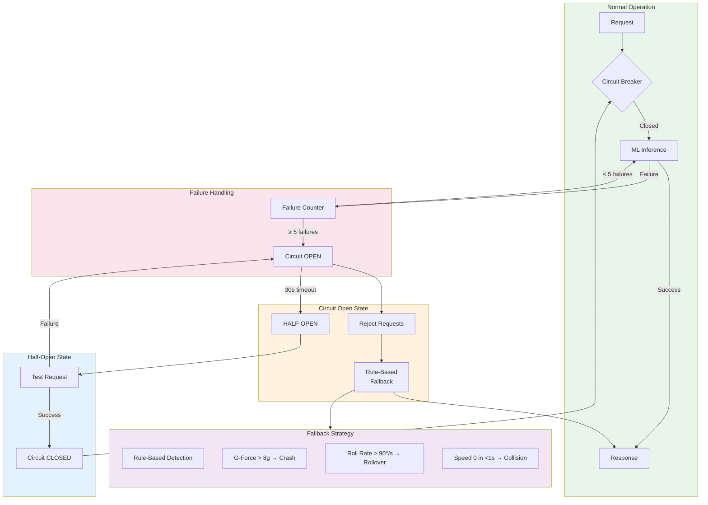
```mermaid
flowchart TB
    subgraph Normal["Normal Operation"]
        REQ[Request] --> CB{Circuit Breaker}
        CB -->|Closed| ML[ML Inference]
        ML -->|Success| RES[Response]
    end

    subgraph Failure["Failure Handling"]
        ML -->|Failure| COUNT[Failure Counter]
        COUNT -->|< 5 failures| ML
        COUNT -->|≥ 5 failures| OPEN[Circuit OPEN]
    end

    subgraph Open["Circuit Open State"]
        OPEN --> REJECT[Reject Requests]
        REJECT --> FALLBACK[Rule-Based<br/>Fallback]
        FALLBACK --> RES

        OPEN -->|30s timeout| HALF[HALF-OPEN]
    end

    subgraph HalfOpen["Half-Open State"]
        HALF --> TEST[Test Request]
        TEST -->|Success| CLOSE[Circuit CLOSED]
        TEST -->|Failure| OPEN
        CLOSE --> CB
    end

    subgraph Fallback["Fallback Strategy"]
        direction TB
        F1["Rule-Based Detection"]
        F2["G-Force > 8g → Crash"]
        F3["Roll Rate > 90°/s → Rollover"]
        F4["Speed 0 in <1s → Collision"]
    end

    FALLBACK --> Fallback

    style Normal fill:#e8f5e9
    style Failure fill:#fce4ec
    style Open fill:#fff3e0
    style HalfOpen fill:#e3f2fd
    style Fallback fill:#f3e5f5
```

---

## 17. Claims Pre-Population Flow

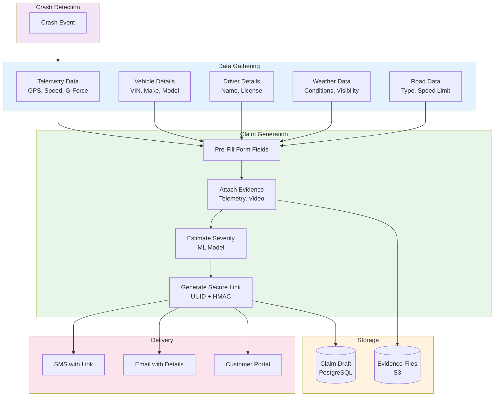
```mermaid
flowchart TB
    subgraph Input["Crash Detection"]
        CE[Crash Event]
    end

    subgraph Gather["Data Gathering"]
        direction TB
        TD[Telemetry Data<br/>GPS, Speed, G-Force]
        VD[Vehicle Details<br/>VIN, Make, Model]
        DD[Driver Details<br/>Name, License]
        WD[Weather Data<br/>Conditions, Visibility]
        RD[Road Data<br/>Type, Speed Limit]
    end

    subgraph Generate["Claim Generation"]
        direction TB
        PF[Pre-Fill Form Fields]
        AT[Attach Evidence<br/>Telemetry, Video]
        ES[Estimate Severity<br/>ML Model]
        GL[Generate Secure Link<br/>UUID + HMAC]
    end

    subgraph Store["Storage"]
        CD[(Claim Draft<br/>PostgreSQL)]
        S3[(Evidence Files<br/>S3)]
    end

    subgraph Deliver["Delivery"]
        SMS[SMS with Link]
        EMAIL[Email with Details]
        PORTAL[Customer Portal]
    end

    CE --> Gather
    TD & VD & DD & WD & RD --> PF
    PF --> AT --> ES --> GL

    GL --> CD
    AT --> S3

    GL --> SMS & EMAIL & PORTAL

    style Input fill:#f3e5f5
    style Gather fill:#e3f2fd
    style Generate fill:#e8f5e9
    style Store fill:#fff3e0
    style Deliver fill:#fce4ec
```

---

## 18. Kafka Topic Architecture

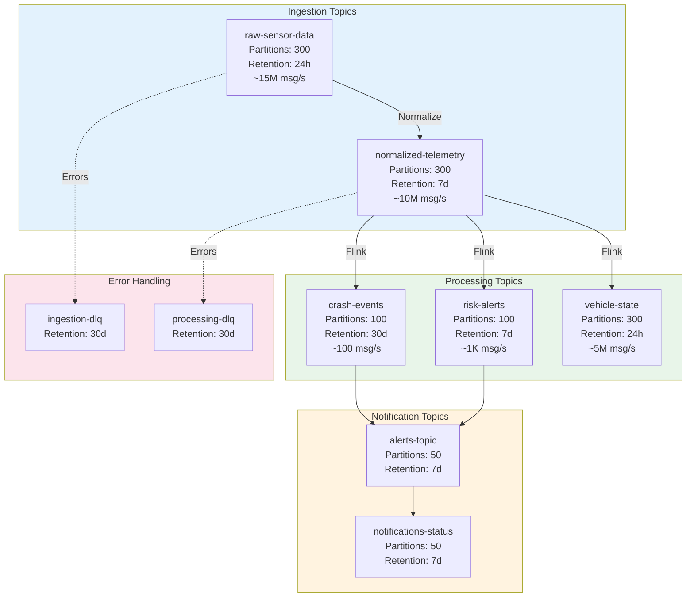
```mermaid
flowchart TB
    subgraph Ingestion["Ingestion Topics"]
        T1["raw-sensor-data<br/>Partitions: 300<br/>Retention: 24h<br/>~15M msg/s"]
        T2["normalized-telemetry<br/>Partitions: 300<br/>Retention: 7d<br/>~10M msg/s"]
    end

    subgraph Processing["Processing Topics"]
        T3["crash-events<br/>Partitions: 100<br/>Retention: 30d<br/>~100 msg/s"]
        T4["risk-alerts<br/>Partitions: 100<br/>Retention: 7d<br/>~1K msg/s"]
        T5["vehicle-state<br/>Partitions: 300<br/>Retention: 24h<br/>~5M msg/s"]
    end

    subgraph Notification["Notification Topics"]
        T6["alerts-topic<br/>Partitions: 50<br/>Retention: 7d"]
        T7["notifications-status<br/>Partitions: 50<br/>Retention: 7d"]
    end

    subgraph Error["Error Handling"]
        T8["ingestion-dlq<br/>Retention: 30d"]
        T9["processing-dlq<br/>Retention: 30d"]
    end

    T1 -->|Normalize| T2
    T2 -->|Flink| T3 & T4 & T5
    T3 --> T6
    T4 --> T6
    T6 --> T7

    T1 -.->|Errors| T8
    T2 -.->|Errors| T9

    style Ingestion fill:#e3f2fd
    style Processing fill:#e8f5e9
    style Notification fill:#fff3e0
    style Error fill:#fce4ec
```

---

## Usage Notes

### Rendering Mermaid Diagrams

These diagrams can be rendered in:
- **GitHub**: Automatically renders in markdown files
- **GitLab**: Automatically renders in markdown files
- **VS Code**: Install "Markdown Preview Mermaid Support" extension
- **Confluence**: Use Mermaid macro
- **Notion**: Paste code blocks with mermaid language
- **Online**: Use [Mermaid Live Editor](https://mermaid.live/)

### Customization

Modify the `style` declarations to change colors:
```mermaid
%%{init: {'theme': 'base', 'themeVariables': { 'primaryColor': '#e8f5e9'}}}%%
```
