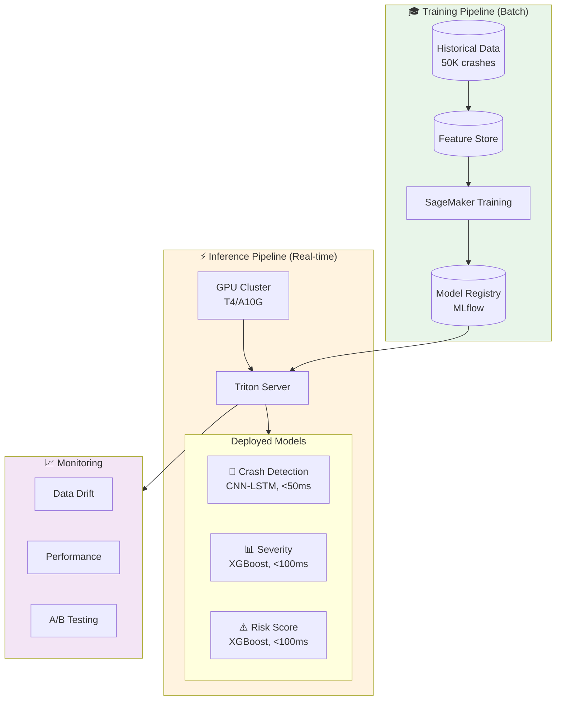
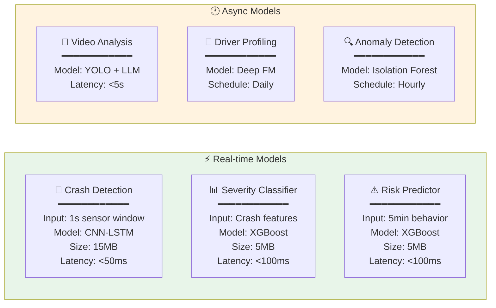

# ML Pipeline

## Overview

The ML pipeline provides intelligent crash detection and risk prediction beyond rule-based systems. It consists of real-time inference models and batch training pipelines.

---

## ML Pipeline Overview



## Model Architecture Comparison



---

## Model Architecture Detail

```
┌─────────────────────────────────────────────────────────────────────────────────────────┐
│                              ML MODEL ARCHITECTURE                                       │
├─────────────────────────────────────────────────────────────────────────────────────────┤
│                                                                                          │
│  ┌────────────────────────────────────────────────────────────────────────────────────┐ │
│  │                         REAL-TIME INFERENCE MODELS                                  │ │
│  │                                                                                      │ │
│  │  ┌─────────────────────┐    ┌─────────────────────┐    ┌─────────────────────┐     │ │
│  │  │  CRASH DETECTION    │    │  SEVERITY           │    │  RISK PREDICTION    │     │ │
│  │  │  MODEL              │    │  CLASSIFIER         │    │  MODEL              │     │ │
│  │  │                     │    │                     │    │                     │     │ │
│  │  │  Input:             │    │  Input:             │    │  Input:             │     │ │
│  │  │  • 1s sensor window │    │  • Crash features   │    │  • 5min behavior    │     │ │
│  │  │  • 10 Hz sampling   │    │  • Speed at impact  │    │  • Weather context  │     │ │
│  │  │  • 6-axis IMU       │    │  • Vehicle type     │    │  • Road type        │     │ │
│  │  │                     │    │  • GPS context      │    │  • Driver history   │     │ │
│  │  │  Output:            │    │                     │    │                     │     │ │
│  │  │  • Crash probability│    │  Output:            │    │  Output:            │     │ │
│  │  │  • Crash type       │    │  • Severity 1-5     │    │  • Risk score 0-100 │     │ │
│  │  │                     │    │  • Injury probable  │    │  • Risk factors     │     │ │
│  │  │  Latency: <50ms     │    │  • Tow required     │    │                     │     │ │
│  │  │  Model: CNN-LSTM    │    │                     │    │  Latency: <100ms    │     │ │
│  │  │  Size: 15MB         │    │  Latency: <100ms    │    │  Model: XGBoost     │     │ │
│  │  │                     │    │  Model: XGBoost     │    │  Size: 5MB          │     │ │
│  │  └─────────────────────┘    └─────────────────────┘    └─────────────────────┘     │ │
│  │                                                                                      │ │
│  └────────────────────────────────────────────────────────────────────────────────────┘ │
│                                                                                          │
│  ┌────────────────────────────────────────────────────────────────────────────────────┐ │
│  │                         ASYNC/BATCH MODELS                                          │ │
│  │                                                                                      │ │
│  │  ┌─────────────────────┐    ┌─────────────────────┐    ┌─────────────────────┐     │ │
│  │  │  VIDEO ANALYSIS     │    │  DRIVER PROFILING   │    │  ANOMALY DETECTION  │     │ │
│  │  │  (Dashcam)          │    │                     │    │                     │     │ │
│  │  │                     │    │  Input:             │    │  Input:             │     │ │
│  │  │  Input:             │    │  • 30-day history   │    │  • Vehicle baseline │     │ │
│  │  │  • Video clip       │    │  • Trip patterns    │    │  • Fleet baseline   │     │ │
│  │  │  • Pre/post crash   │    │  • Behavior stats   │    │  • Provider data    │     │ │
│  │  │                     │    │                     │    │                     │     │ │
│  │  │  Output:            │    │  Output:            │    │  Output:            │     │ │
│  │  │  • Fault analysis   │    │  • Risk tier        │    │  • Anomaly score    │     │ │
│  │  │  • Object detection │    │  • Recommendations  │    │  • Alert triggers   │     │ │
│  │  │  • Scene context    │    │                     │    │                     │     │ │
│  │  │                     │    │  Latency: Async     │    │  Latency: Async     │     │ │
│  │  │  Latency: <5s       │    │  Model: Deep FM     │    │  Model: Isolation   │     │ │
│  │  │  Model: YOLO + LLM  │    │                     │    │  Forest             │     │ │
│  │  └─────────────────────┘    └─────────────────────┘    └─────────────────────┘     │ │
│  │                                                                                      │ │
│  └────────────────────────────────────────────────────────────────────────────────────┘ │
│                                                                                          │
└─────────────────────────────────────────────────────────────────────────────────────────┘
```

---

## Crash Detection Model Details

### Input Feature Engineering

```
┌─────────────────────────────────────────────────────────────────────────────┐
│                     CRASH DETECTION FEATURES                                 │
├─────────────────────────────────────────────────────────────────────────────┤
│                                                                              │
│  RAW SENSOR DATA (1 second window @ 10Hz = 10 samples)                       │
│  ┌─────────────────────────────────────────────────────────────────────────┐│
│  │  Accelerometer (3 channels):                                            ││
│  │  • X: Longitudinal [-16g to +16g]                                       ││
│  │  • Y: Lateral [-16g to +16g]                                            ││
│  │  • Z: Vertical [-16g to +16g]                                           ││
│  │                                                                         ││
│  │  Gyroscope (3 channels):                                                ││
│  │  • Roll: [-250 to +250 °/s]                                             ││
│  │  • Pitch: [-250 to +250 °/s]                                            ││
│  │  • Yaw: [-250 to +250 °/s]                                              ││
│  │                                                                         ││
│  │  Shape: (10 timesteps × 6 channels) = 60 raw features                   ││
│  └─────────────────────────────────────────────────────────────────────────┘│
│                                                                              │
│  DERIVED FEATURES                                                            │
│  ┌─────────────────────────────────────────────────────────────────────────┐│
│  │                                                                         ││
│  │  Statistical Features (per channel):                                    ││
│  │  • Mean, Std, Min, Max                                                  ││
│  │  • Skewness, Kurtosis                                                   ││
│  │  • Zero-crossing rate                                                   ││
│  │  • Peak count                                                           ││
│  │                                                                         ││
│  │  Composite Features:                                                    ││
│  │  • Total G-force magnitude: √(x² + y² + z²)                             ││
│  │  • Delta-V (velocity change estimate)                                   ││
│  │  • Principal Direction of Force (PDF)                                   ││
│  │  • Rotational energy: √(roll² + pitch² + yaw²)                          ││
│  │                                                                         ││
│  │  Frequency Domain (FFT):                                                ││
│  │  • Dominant frequencies (crash vs normal patterns)                      ││
│  │  • Spectral energy distribution                                         ││
│  │                                                                         ││
│  │  Context Features:                                                      ││
│  │  • Speed at window start                                                ││
│  │  • Speed delta across window                                            ││
│  │  • Heading change                                                       ││
│  │                                                                         ││
│  │  Total Features: ~120 engineered features                               ││
│  └─────────────────────────────────────────────────────────────────────────┘│
│                                                                              │
└─────────────────────────────────────────────────────────────────────────────┘
```

### Model Architecture

```python
# crash_detection_model.py
import tensorflow as tf
from tensorflow.keras import layers, Model

def build_crash_detection_model(input_shape=(10, 6), num_features=120):
    """
    Hybrid CNN-LSTM model for crash detection.

    Input: 1-second window of 6-axis sensor data @ 10Hz
    Output: Crash probability, Crash type classification
    """

    # Branch 1: Raw sensor data (CNN-LSTM)
    sensor_input = layers.Input(shape=input_shape, name='sensor_input')

    # 1D CNN for local pattern extraction
    x = layers.Conv1D(64, kernel_size=3, activation='relu', padding='same')(sensor_input)
    x = layers.BatchNormalization()(x)
    x = layers.Conv1D(128, kernel_size=3, activation='relu', padding='same')(x)
    x = layers.BatchNormalization()(x)
    x = layers.MaxPooling1D(pool_size=2)(x)

    # LSTM for temporal patterns
    x = layers.LSTM(64, return_sequences=True)(x)
    x = layers.LSTM(32)(x)
    x = layers.Dropout(0.3)(x)

    # Branch 2: Engineered features (Dense)
    feature_input = layers.Input(shape=(num_features,), name='feature_input')
    y = layers.Dense(64, activation='relu')(feature_input)
    y = layers.BatchNormalization()(y)
    y = layers.Dropout(0.2)(y)
    y = layers.Dense(32, activation='relu')(y)

    # Merge branches
    merged = layers.concatenate([x, y])
    z = layers.Dense(64, activation='relu')(merged)
    z = layers.Dropout(0.3)(z)
    z = layers.Dense(32, activation='relu')(z)

    # Outputs
    crash_prob = layers.Dense(1, activation='sigmoid', name='crash_probability')(z)
    crash_type = layers.Dense(5, activation='softmax', name='crash_type')(z)
    # Types: frontal, rear, side_left, side_right, rollover

    model = Model(
        inputs=[sensor_input, feature_input],
        outputs=[crash_prob, crash_type]
    )

    model.compile(
        optimizer=tf.keras.optimizers.Adam(learning_rate=0.001),
        loss={
            'crash_probability': 'binary_crossentropy',
            'crash_type': 'categorical_crossentropy'
        },
        loss_weights={'crash_probability': 1.0, 'crash_type': 0.5},
        metrics={
            'crash_probability': ['accuracy', tf.keras.metrics.AUC()],
            'crash_type': ['accuracy']
        }
    )

    return model
```

---

## Training Pipeline

```
┌─────────────────────────────────────────────────────────────────────────────────────────┐
│                              TRAINING PIPELINE                                           │
├─────────────────────────────────────────────────────────────────────────────────────────┤
│                                                                                          │
│  ┌────────────────┐    ┌────────────────┐    ┌────────────────┐    ┌────────────────┐   │
│  │ DATA SOURCES   │───▶│ FEATURE STORE  │───▶│ TRAINING JOB   │───▶│ MODEL REGISTRY │   │
│  └────────────────┘    └────────────────┘    └────────────────┘    └────────────────┘   │
│                                                                                          │
│  Data Sources:                                                                           │
│  ┌─────────────────────────────────────────────────────────────────────────────────────┐│
│  │                                                                                     ││
│  │  Historical Crashes (Labeled)                                                       ││
│  │  • Police reports with timestamps                                                   ││
│  │  • Insurance claims data                                                            ││
│  │  • ~50,000 confirmed crash events                                                   ││
│  │                                                                                     ││
│  │  Normal Driving (Negative Samples)                                                  ││
│  │  • Random sampling from telemetry                                                   ││
│  │  • Hard negatives (hard braking, rough roads)                                       ││
│  │  • ~500,000 non-crash events                                                        ││
│  │                                                                                     ││
│  │  Synthetic Data                                                                     ││
│  │  • Augmented crash patterns                                                         ││
│  │  • Simulated edge cases                                                             ││
│  │                                                                                     ││
│  └─────────────────────────────────────────────────────────────────────────────────────┘│
│                                                                                          │
│  Feature Store (Feast/Tecton):                                                           │
│  ┌─────────────────────────────────────────────────────────────────────────────────────┐│
│  │                                                                                     ││
│  │  Offline Store: S3 + Parquet                                                        ││
│  │  • Historical features for training                                                 ││
│  │  • Batch feature computation (Spark)                                                ││
│  │                                                                                     ││
│  │  Online Store: Redis Cluster                                                        ││
│  │  • Real-time features for inference                                                 ││
│  │  • Sub-millisecond lookups                                                          ││
│  │                                                                                     ││
│  │  Feature Groups:                                                                    ││
│  │  • vehicle_features (type, weight, sensors)                                         ││
│  │  • driver_features (history, risk profile)                                          ││
│  │  • context_features (weather, road, time)                                           ││
│  │                                                                                     ││
│  └─────────────────────────────────────────────────────────────────────────────────────┘│
│                                                                                          │
│  Training Job (SageMaker/Vertex AI):                                                     │
│  ┌─────────────────────────────────────────────────────────────────────────────────────┐│
│  │                                                                                     ││
│  │  Schedule: Weekly retraining                                                        ││
│  │  Infrastructure: 4x V100 GPUs                                                       ││
│  │  Duration: ~4 hours                                                                 ││
│  │                                                                                     ││
│  │  Process:                                                                           ││
│  │  1. Pull features from offline store                                                ││
│  │  2. Train/validation/test split (70/15/15)                                          ││
│  │  3. Hyperparameter tuning (Optuna)                                                  ││
│  │  4. Cross-validation (5-fold)                                                       ││
│  │  5. Threshold optimization (F1 score)                                               ││
│  │  6. Model validation against holdout                                                ││
│  │                                                                                     ││
│  └─────────────────────────────────────────────────────────────────────────────────────┘│
│                                                                                          │
│  Model Registry (MLflow):                                                                │
│  ┌─────────────────────────────────────────────────────────────────────────────────────┐│
│  │                                                                                     ││
│  │  Stages: Development → Staging → Production                                         ││
│  │                                                                                     ││
│  │  Tracked Artifacts:                                                                 ││
│  │  • Model weights (.h5, .pt)                                                         ││
│  │  • Feature transformers (scalers, encoders)                                         ││
│  │  • Threshold configurations                                                         ││
│  │  • Training metrics and parameters                                                  ││
│  │  • Data lineage (dataset versions)                                                  ││
│  │                                                                                     ││
│  │  Promotion Criteria:                                                                ││
│  │  • Precision ≥ 95% (minimize false positives)                                       ││
│  │  • Recall ≥ 92% (catch real crashes)                                                ││
│  │  • Latency p99 ≤ 50ms                                                               ││
│  │  • A/B test validation                                                              ││
│  │                                                                                     ││
│  └─────────────────────────────────────────────────────────────────────────────────────┘│
│                                                                                          │
└─────────────────────────────────────────────────────────────────────────────────────────┘
```

---

## Model Serving Infrastructure

```
┌─────────────────────────────────────────────────────────────────────────────────────────┐
│                           MODEL SERVING ARCHITECTURE                                     │
├─────────────────────────────────────────────────────────────────────────────────────────┤
│                                                                                          │
│  ┌──────────────────────────────────────────────────────────────────────────────────┐   │
│  │                         TRITON INFERENCE SERVER CLUSTER                           │   │
│  │                                                                                   │   │
│  │   ┌────────────────┐   ┌────────────────┐   ┌────────────────┐                   │   │
│  │   │ GPU Node 1     │   │ GPU Node 2     │   │ GPU Node N     │                   │   │
│  │   │ (T4/A10G)      │   │ (T4/A10G)      │   │ (T4/A10G)      │                   │   │
│  │   │                │   │                │   │                │                   │   │
│  │   │ Models:        │   │ Models:        │   │ Models:        │                   │   │
│  │   │ • crash_v3     │   │ • crash_v3     │   │ • crash_v3     │                   │   │
│  │   │ • severity_v2  │   │ • severity_v2  │   │ • severity_v2  │                   │   │
│  │   │ • risk_v4      │   │ • risk_v4      │   │ • risk_v4      │                   │   │
│  │   └────────────────┘   └────────────────┘   └────────────────┘                   │   │
│  │                                                                                   │   │
│  │   Features:                                                                       │   │
│  │   • Dynamic batching (batch size 1-64)                                            │   │
│  │   • Model versioning and A/B testing                                              │   │
│  │   • Concurrent model execution                                                    │   │
│  │   • GPU memory optimization                                                       │   │
│  │                                                                                   │   │
│  └──────────────────────────────────────────────────────────────────────────────────┘   │
│                                          │                                               │
│                                          ▼                                               │
│  ┌──────────────────────────────────────────────────────────────────────────────────┐   │
│  │                           INFERENCE GATEWAY                                       │   │
│  │                                                                                   │   │
│  │   • gRPC endpoints for Flink jobs                                                 │   │
│  │   • Connection pooling                                                            │   │
│  │   • Circuit breaker (fallback to rules)                                           │   │
│  │   • Request/response logging                                                      │   │
│  │   • Latency tracking                                                              │   │
│  │                                                                                   │   │
│  └──────────────────────────────────────────────────────────────────────────────────┘   │
│                                                                                          │
└─────────────────────────────────────────────────────────────────────────────────────────┘
```

### Inference Request Flow

```python
# inference_client.py
from dataclasses import dataclass
from typing import List, Tuple
import numpy as np
import grpc
import tritonclient.grpc as triton

@dataclass
class CrashPrediction:
    probability: float
    crash_type: str
    confidence: float
    model_version: str
    latency_ms: float

class CrashDetectionClient:
    def __init__(self, triton_url: str = "triton:8001"):
        self.client = triton.InferenceServerClient(url=triton_url)
        self.model_name = "crash_detection"

    def predict(self, sensor_data: np.ndarray, features: np.ndarray) -> CrashPrediction:
        """
        Run crash detection inference.

        Args:
            sensor_data: Shape (1, 10, 6) - 1 second of 6-axis sensor data
            features: Shape (1, 120) - Engineered features

        Returns:
            CrashPrediction with probability and type
        """
        import time
        start = time.perf_counter()

        # Prepare inputs
        inputs = [
            triton.InferInput("sensor_input", sensor_data.shape, "FP32"),
            triton.InferInput("feature_input", features.shape, "FP32"),
        ]
        inputs[0].set_data_from_numpy(sensor_data.astype(np.float32))
        inputs[1].set_data_from_numpy(features.astype(np.float32))

        # Prepare outputs
        outputs = [
            triton.InferRequestedOutput("crash_probability"),
            triton.InferRequestedOutput("crash_type"),
        ]

        # Run inference
        response = self.client.infer(
            model_name=self.model_name,
            inputs=inputs,
            outputs=outputs,
        )

        latency = (time.perf_counter() - start) * 1000

        prob = response.as_numpy("crash_probability")[0][0]
        crash_types = ["frontal", "rear", "side_left", "side_right", "rollover"]
        type_probs = response.as_numpy("crash_type")[0]
        predicted_type = crash_types[np.argmax(type_probs)]

        return CrashPrediction(
            probability=float(prob),
            crash_type=predicted_type,
            confidence=float(np.max(type_probs)),
            model_version=self._get_model_version(),
            latency_ms=latency
        )

    def _get_model_version(self) -> str:
        metadata = self.client.get_model_metadata(self.model_name)
        return metadata.versions[0]
```

---

## Model Monitoring

```
┌─────────────────────────────────────────────────────────────────────────────┐
│                        MODEL MONITORING                                      │
├─────────────────────────────────────────────────────────────────────────────┤
│                                                                              │
│  PERFORMANCE METRICS (Real-time)                                             │
│  ┌─────────────────────────────────────────────────────────────────────────┐│
│  │                                                                         ││
│  │  Latency:                                                               ││
│  │  • p50: < 20ms                                                          ││
│  │  • p95: < 40ms                                                          ││
│  │  • p99: < 50ms                                                          ││
│  │  Alert: p99 > 75ms for 5 minutes                                        ││
│  │                                                                         ││
│  │  Throughput:                                                            ││
│  │  • Target: 100K inferences/second                                       ││
│  │  Alert: < 80K/s sustained                                               ││
│  │                                                                         ││
│  │  Error Rate:                                                            ││
│  │  • Target: < 0.01%                                                      ││
│  │  Alert: > 0.1% errors                                                   ││
│  │                                                                         ││
│  └─────────────────────────────────────────────────────────────────────────┘│
│                                                                              │
│  DATA DRIFT DETECTION (Hourly)                                               │
│  ┌─────────────────────────────────────────────────────────────────────────┐│
│  │                                                                         ││
│  │  Feature Drift:                                                         ││
│  │  • Population Stability Index (PSI) per feature                         ││
│  │  • Alert: PSI > 0.2 (significant drift)                                 ││
│  │                                                                         ││
│  │  Prediction Drift:                                                      ││
│  │  • Distribution of prediction scores                                    ││
│  │  • Alert: KL divergence > threshold                                     ││
│  │                                                                         ││
│  │  Label Drift (delayed ground truth):                                    ││
│  │  • Compare predictions vs confirmed crashes                             ││
│  │  • Alert: Precision/Recall degradation > 5%                             ││
│  │                                                                         ││
│  └─────────────────────────────────────────────────────────────────────────┘│
│                                                                              │
│  BUSINESS METRICS (Daily)                                                    │
│  ┌─────────────────────────────────────────────────────────────────────────┐│
│  │                                                                         ││
│  │  Detection Accuracy:                                                    ││
│  │  • True Positive Rate (crashes caught)                                  ││
│  │  • False Positive Rate (false alarms)                                   ││
│  │  • Time to Detection (vs actual crash time)                             ││
│  │                                                                         ││
│  │  Business Impact:                                                       ││
│  │  • Claims initiated via system                                          ││
│  │  • Average response time improvement                                    ││
│  │  • Customer satisfaction scores                                         ││
│  │                                                                         ││
│  └─────────────────────────────────────────────────────────────────────────┘│
│                                                                              │
└─────────────────────────────────────────────────────────────────────────────┘
```

---

## Fallback Strategy

When ML models are unavailable or slow, the system falls back to rule-based detection:

```python
# fallback_detector.py
from dataclasses import dataclass
from typing import Optional

@dataclass
class RuleBasedResult:
    is_crash: bool
    crash_type: Optional[str]
    confidence: float
    rule_triggered: str

class RuleBasedCrashDetector:
    """Fallback crash detection using deterministic rules."""

    # Thresholds based on NHTSA crash pulse data
    G_FORCE_DEFINITE = 15.0    # g
    G_FORCE_PROBABLE = 8.0     # g
    G_FORCE_POSSIBLE = 4.0     # g
    ROLL_RATE_THRESHOLD = 90.0  # degrees/sec
    SPEED_DROP_THRESHOLD = 20.0 # mph in 0.5s

    def detect(self, sensor_window: dict) -> RuleBasedResult:
        """
        Apply rule-based crash detection.

        Args:
            sensor_window: Dict containing accelerometer, gyroscope, speed data
        """
        max_g = self._calculate_max_g_force(sensor_window['accelerometer'])
        max_roll = self._calculate_max_roll_rate(sensor_window['gyroscope'])
        speed_drop = self._calculate_speed_drop(sensor_window['speed'])

        # Rule 1: Extreme G-force (definite crash)
        if max_g >= self.G_FORCE_DEFINITE:
            return RuleBasedResult(
                is_crash=True,
                crash_type=self._determine_type(sensor_window),
                confidence=0.95,
                rule_triggered="extreme_g_force"
            )

        # Rule 2: High G-force + sudden stop
        if max_g >= self.G_FORCE_PROBABLE and speed_drop >= self.SPEED_DROP_THRESHOLD:
            return RuleBasedResult(
                is_crash=True,
                crash_type=self._determine_type(sensor_window),
                confidence=0.85,
                rule_triggered="high_g_with_stop"
            )

        # Rule 3: Rollover detection
        if max_roll >= self.ROLL_RATE_THRESHOLD and max_g >= self.G_FORCE_POSSIBLE:
            return RuleBasedResult(
                is_crash=True,
                crash_type="rollover",
                confidence=0.80,
                rule_triggered="rollover_detected"
            )

        # Rule 4: Moderate G-force (possible crash)
        if max_g >= self.G_FORCE_POSSIBLE:
            return RuleBasedResult(
                is_crash=True,
                crash_type=self._determine_type(sensor_window),
                confidence=0.50,
                rule_triggered="moderate_g_force"
            )

        return RuleBasedResult(
            is_crash=False,
            crash_type=None,
            confidence=0.0,
            rule_triggered="none"
        )
```

