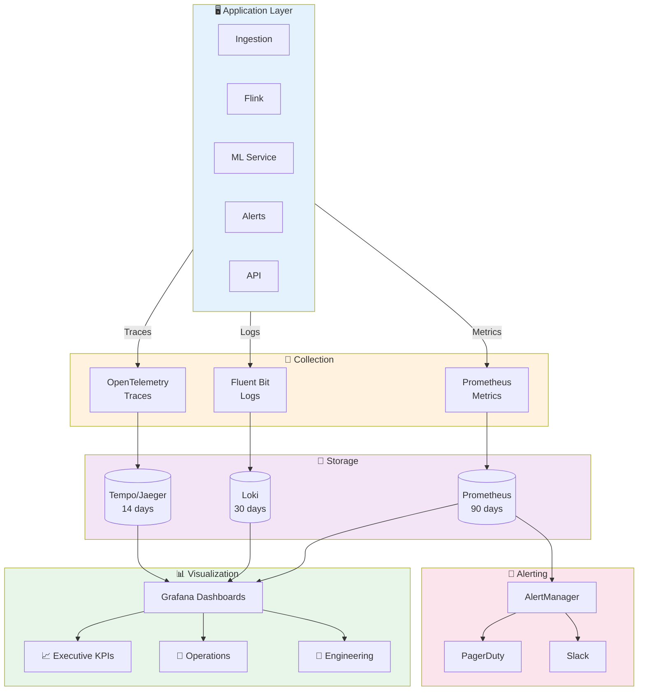
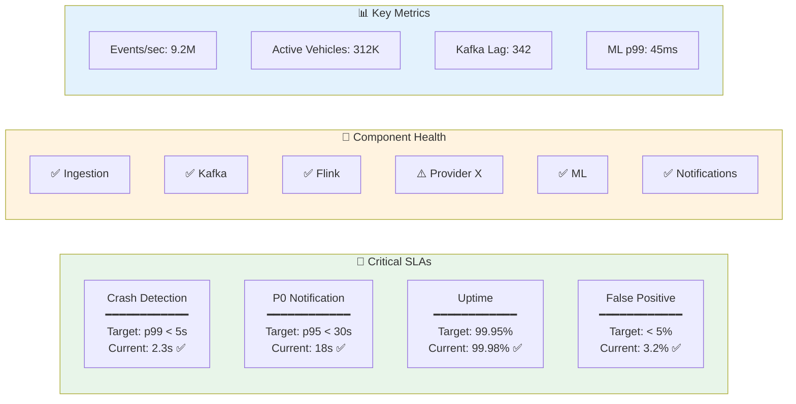

# Observability

## Overview

Comprehensive observability is critical for a real-time safety system. This document covers monitoring, logging, alerting, and SLA definitions.

---

## Observability Stack Overview



## SLA Dashboard



---

## Observability Architecture (Detailed)

```
┌─────────────────────────────────────────────────────────────────────────────────────────┐
│                           OBSERVABILITY STACK                                            │
├─────────────────────────────────────────────────────────────────────────────────────────┤
│                                                                                          │
│                              APPLICATION LAYER                                           │
│  ┌──────────────┐ ┌──────────────┐ ┌──────────────┐ ┌──────────────┐ ┌──────────────┐   │
│  │ Ingestion    │ │ Stream       │ │ ML Inference │ │ Alert        │ │ Dashboard    │   │
│  │ Services     │ │ Processing   │ │ Service      │ │ Router       │ │ API          │   │
│  └──────┬───────┘ └──────┬───────┘ └──────┬───────┘ └──────┬───────┘ └──────┬───────┘   │
│         │                │                │                │                │           │
│         └────────────────┴────────────────┴────────────────┴────────────────┘           │
│                                          │                                               │
│  ┌───────────────────────────────────────┼───────────────────────────────────────────┐  │
│  │                         COLLECTION LAYER                                           │  │
│  │                                                                                     │  │
│  │  ┌─────────────────┐   ┌─────────────────┐   ┌─────────────────┐                   │  │
│  │  │ OpenTelemetry   │   │ Fluent Bit      │   │ Prometheus      │                   │  │
│  │  │ Collector       │   │ (Log Shipper)   │   │ (Metrics Scrape)│                   │  │
│  │  │                 │   │                 │   │                 │                   │  │
│  │  │ • Traces        │   │ • Structured    │   │ • Application   │                   │  │
│  │  │ • Spans         │   │   JSON logs     │   │   metrics       │                   │  │
│  │  │ • Context       │   │ • Container     │   │ • System        │                   │  │
│  │  │   propagation   │   │   logs          │   │   metrics       │                   │  │
│  │  └────────┬────────┘   └────────┬────────┘   └────────┬────────┘                   │  │
│  │           │                     │                     │                             │  │
│  └───────────┼─────────────────────┼─────────────────────┼─────────────────────────────┘  │
│              │                     │                     │                               │
│  ┌───────────┼─────────────────────┼─────────────────────┼─────────────────────────────┐  │
│  │           ▼                     ▼                     ▼      STORAGE LAYER          │  │
│  │  ┌─────────────────┐   ┌─────────────────┐   ┌─────────────────┐                   │  │
│  │  │ Jaeger/Tempo    │   │ Loki /          │   │ Prometheus      │                   │  │
│  │  │ (Trace Storage) │   │ Elasticsearch   │   │ (Time Series)   │                   │  │
│  │  │                 │   │ (Log Storage)   │   │                 │                   │  │
│  │  │ Retention: 14d  │   │ Retention: 30d  │   │ Retention: 90d  │                   │  │
│  │  └────────┬────────┘   └────────┬────────┘   └────────┬────────┘                   │  │
│  │           │                     │                     │                             │  │
│  └───────────┼─────────────────────┼─────────────────────┼─────────────────────────────┘  │
│              │                     │                     │                               │
│  ┌───────────┼─────────────────────┼─────────────────────┼─────────────────────────────┐  │
│  │           └─────────────────────┼─────────────────────┘      VISUALIZATION          │  │
│  │                                 ▼                                                    │  │
│  │                    ┌─────────────────────────┐                                       │  │
│  │                    │       GRAFANA           │                                       │  │
│  │                    │                         │                                       │  │
│  │                    │  • Unified dashboards   │                                       │  │
│  │                    │  • Alerting rules       │                                       │  │
│  │                    │  • Trace correlation    │                                       │  │
│  │                    │  • Log exploration      │                                       │  │
│  │                    └─────────────────────────┘                                       │  │
│  │                                                                                      │  │
│  └──────────────────────────────────────────────────────────────────────────────────────┘  │
│                                                                                          │
└─────────────────────────────────────────────────────────────────────────────────────────┘
```

---

## Key Metrics

### 1. Ingestion Metrics

| Metric Name | Type | Labels | Description |
|-------------|------|--------|-------------|
| `ingestion_events_total` | Counter | provider, region, status | Total events ingested |
| `ingestion_events_rate` | Gauge | provider, region | Events per second |
| `ingestion_latency_seconds` | Histogram | provider, quantile | Time from provider to Kafka |
| `ingestion_errors_total` | Counter | provider, error_type | Ingestion failures |
| `provider_api_latency_seconds` | Histogram | provider, endpoint | API call latency (pull model) |
| `provider_availability` | Gauge | provider | Provider health (0 or 1) |
| `dedup_events_total` | Counter | provider | Duplicate events dropped |
| `dlq_events_total` | Counter | provider, reason | Events sent to DLQ |

### 2. Stream Processing Metrics

| Metric Name | Type | Labels | Description |
|-------------|------|--------|-------------|
| `flink_events_processed_total` | Counter | job, operator | Events processed |
| `flink_processing_latency_ms` | Histogram | job, quantile | End-to-end latency |
| `flink_backpressure_ratio` | Gauge | job, task | Backpressure indicator |
| `kafka_consumer_lag` | Gauge | topic, consumer_group | Messages behind |
| `kafka_consumer_offset` | Gauge | topic, partition | Current offset |
| `window_events_count` | Histogram | job, window_type | Events per window |
| `checkpoint_duration_ms` | Histogram | job | Checkpoint time |
| `checkpoint_failures_total` | Counter | job | Failed checkpoints |

### 3. ML Inference Metrics

| Metric Name | Type | Labels | Description |
|-------------|------|--------|-------------|
| `ml_inference_latency_ms` | Histogram | model, version | Inference latency |
| `ml_inference_total` | Counter | model, version | Total inferences |
| `ml_inference_errors_total` | Counter | model, error_type | Inference failures |
| `ml_prediction_distribution` | Histogram | model | Prediction score distribution |
| `ml_crash_detections_total` | Counter | crash_type, severity | Crashes detected |
| `ml_false_positives_total` | Counter | model | Confirmed false positives |
| `ml_model_version` | Gauge | model | Current model version |
| `gpu_utilization_percent` | Gauge | node, gpu_id | GPU usage |
| `gpu_memory_used_bytes` | Gauge | node, gpu_id | GPU memory usage |

### 4. Alert & Notification Metrics

| Metric Name | Type | Labels | Description |
|-------------|------|--------|-------------|
| `alerts_generated_total` | Counter | priority, type | Alerts created |
| `alert_detection_to_notify_seconds` | Histogram | priority, quantile | Time from crash to notification |
| `notification_sent_total` | Counter | channel, provider | Notifications sent |
| `notification_delivered_total` | Counter | channel, provider | Confirmed deliveries |
| `notification_failed_total` | Counter | channel, provider, reason | Failed notifications |
| `notification_latency_seconds` | Histogram | channel | Time to send |
| `alert_acknowledged_total` | Counter | priority | Alerts acknowledged |
| `alert_escalation_total` | Counter | priority, level | Escalations triggered |
| `claims_link_generated_total` | Counter | - | Pre-filled claims created |
| `claims_link_clicked_total` | Counter | - | Claims links accessed |

### 5. System Health Metrics

| Metric Name | Type | Labels | Description |
|-------------|------|--------|-------------|
| `active_vehicles` | Gauge | region | Vehicles reporting data |
| `vehicles_with_data_gap` | Gauge | region, provider | Vehicles with stale data |
| `system_availability` | Gauge | component | Component uptime (0-1) |
| `api_requests_total` | Counter | endpoint, method, status | API requests |
| `api_latency_seconds` | Histogram | endpoint | API response time |
| `redis_operations_total` | Counter | operation, status | Redis operations |
| `db_query_latency_seconds` | Histogram | query_type | Database latency |

---

## Prometheus Alert Rules

```yaml
# prometheus/alerts/crash-detection.yml
groups:
  - name: crash_detection_critical
    rules:
      # SLA: Crash detection within 5 seconds
      - alert: CrashDetectionLatencyHigh
        expr: |
          histogram_quantile(0.99,
            rate(flink_processing_latency_ms_bucket{job="crash-detection"}[5m])
          ) > 5000
        for: 2m
        labels:
          severity: critical
          team: platform
        annotations:
          summary: "Crash detection p99 latency > 5 seconds"
          description: "Processing latency is {{ $value }}ms, SLA requires < 5000ms"
          runbook: "https://wiki.example.com/runbooks/crash-detection-latency"

      # SLA: Notification within 30 seconds
      - alert: NotificationLatencyHigh
        expr: |
          histogram_quantile(0.95,
            rate(alert_detection_to_notify_seconds_bucket{priority="P0"}[5m])
          ) > 30
        for: 2m
        labels:
          severity: critical
          team: platform
        annotations:
          summary: "P0 notification latency exceeds 30 seconds SLA"
          description: "Time from crash detection to notification is {{ $value }}s"

      # ML inference availability
      - alert: MLInferenceUnavailable
        expr: |
          sum(rate(ml_inference_errors_total[5m]))
          / sum(rate(ml_inference_total[5m])) > 0.01
        for: 1m
        labels:
          severity: critical
          team: ml
        annotations:
          summary: "ML inference error rate > 1%"
          description: "Error rate is {{ $value | humanizePercentage }}"

  - name: crash_detection_warning
    rules:
      # Kafka consumer lag
      - alert: KafkaConsumerLagHigh
        expr: kafka_consumer_lag{topic="normalized-telemetry"} > 10000
        for: 5m
        labels:
          severity: warning
          team: platform
        annotations:
          summary: "Kafka consumer lag is high"
          description: "Consumer group {{ $labels.consumer_group }} has lag of {{ $value }}"

      # Provider health
      - alert: ProviderAPIUnhealthy
        expr: provider_availability == 0
        for: 5m
        labels:
          severity: warning
          team: integrations
        annotations:
          summary: "Telematics provider {{ $labels.provider }} is unhealthy"
          description: "No successful responses from provider for 5 minutes"

      # GPU utilization
      - alert: GPUUtilizationLow
        expr: avg(gpu_utilization_percent) < 20
        for: 15m
        labels:
          severity: warning
          team: ml
        annotations:
          summary: "GPU utilization is low, possible over-provisioning"

  - name: data_quality
    rules:
      - alert: HighDuplicateRate
        expr: |
          sum(rate(dedup_events_total[5m]))
          / sum(rate(ingestion_events_total[5m])) > 0.1
        for: 10m
        labels:
          severity: warning
          team: data
        annotations:
          summary: "Duplicate event rate > 10%"

      - alert: VehicleDataGap
        expr: vehicles_with_data_gap > 1000
        for: 10m
        labels:
          severity: warning
          team: integrations
        annotations:
          summary: "{{ $value }} vehicles have data gaps"
```

---

## Logging Strategy

### Structured Log Format

```json
{
  "timestamp": "2024-01-15T14:32:00.123Z",
  "level": "INFO",
  "service": "crash-detection-flink",
  "trace_id": "abc123def456",
  "span_id": "789ghi",
  "message": "Crash detected",
  "context": {
    "vehicle_id": "VH-123456",
    "policy_id": "POL-5678",
    "provider_id": "samsara",
    "region": "us-east-1"
  },
  "event": {
    "type": "crash_detection",
    "crash_type": "frontal",
    "confidence": 0.92,
    "max_g_force": 12.3,
    "latitude": 40.7128,
    "longitude": -74.0060
  },
  "metrics": {
    "processing_latency_ms": 45,
    "model_version": "v3.2.1"
  }
}
```

### Log Levels by Category

| Category | Level | Retention | Example |
|----------|-------|-----------|---------|
| Crash events | INFO | 1 year | Crash detected, severity, location |
| Alert lifecycle | INFO | 90 days | Alert created, sent, acknowledged |
| ML predictions | DEBUG | 30 days | Individual inference results |
| Ingestion events | DEBUG | 7 days | Event received, validated |
| API requests | INFO | 30 days | Request/response logs |
| Errors | ERROR | 90 days | All errors with stack traces |
| Security events | INFO | 1 year | Auth failures, permission denials |

### Log Aggregation Queries (Loki/LogQL)

```logql
# Find all crash events for a vehicle
{service="crash-detection-flink"}
  | json
  | context_vehicle_id="VH-123456"
  | event_type="crash_detection"

# Track alert from detection to notification
{service=~"crash-detection.*|alert-router|notification-service"}
  | json
  | trace_id="abc123def456"

# Find provider errors
{service="ingestion-service"}
  | json
  | level="ERROR"
  | context_provider_id="samsara"
  | line_format "{{.timestamp}} {{.message}}: {{.error}}"

# Calculate error rate by service
sum(rate({level="ERROR"}[5m])) by (service)
```

---

## Distributed Tracing

### Trace Context Propagation

```
┌─────────────────────────────────────────────────────────────────────────────┐
│                     END-TO-END TRACE EXAMPLE                                 │
├─────────────────────────────────────────────────────────────────────────────┤
│                                                                              │
│  Trace ID: abc123def456                                                      │
│  Duration: 487ms                                                             │
│                                                                              │
│  ├─ Span: ingestion.receive (15ms)                                           │
│  │   Service: ingestion-gateway                                              │
│  │   Provider: samsara                                                       │
│  │   Events: 50                                                              │
│  │                                                                           │
│  ├─ Span: ingestion.validate (8ms)                                           │
│  │   Service: validation-service                                             │
│  │   Valid: 48, Invalid: 2                                                   │
│  │                                                                           │
│  ├─ Span: kafka.produce (12ms)                                               │
│  │   Topic: normalized-telemetry                                             │
│  │   Partition: 42                                                           │
│  │                                                                           │
│  ├─ Span: flink.process (45ms)                                               │
│  │   Service: crash-detection-flink                                          │
│  │   Window: 100ms tumbling                                                  │
│  │                                                                           │
│  │   ├─ Span: ml.inference (32ms)                                            │
│  │   │   Model: crash_detection_v3                                           │
│  │   │   Confidence: 0.92                                                    │
│  │   │                                                                       │
│  │   └─ Span: flink.emit (5ms)                                               │
│  │       Topic: crash-events                                                 │
│  │                                                                           │
│  ├─ Span: alert.route (25ms)                                                 │
│  │   Service: alert-router                                                   │
│  │   Priority: P0                                                            │
│  │   Alert ID: ALT-20240115-001234                                           │
│  │                                                                           │
│  └─ Span: notification.send (380ms)                                          │
│      Service: notification-service                                           │
│      Channels: [SMS, PUSH]                                                   │
│                                                                              │
│      ├─ Span: sms.send (320ms)                                               │
│      │   Provider: twilio                                                    │
│      │   Status: delivered                                                   │
│      │                                                                       │
│      └─ Span: push.send (45ms)                                               │
│          Provider: fcm                                                       │
│          Status: sent                                                        │
│                                                                              │
└─────────────────────────────────────────────────────────────────────────────┘
```

### OpenTelemetry Instrumentation

```python
# tracing.py
from opentelemetry import trace
from opentelemetry.sdk.trace import TracerProvider
from opentelemetry.sdk.trace.export import BatchSpanProcessor
from opentelemetry.exporter.otlp.proto.grpc.trace_exporter import OTLPSpanExporter
from opentelemetry.instrumentation.kafka import KafkaInstrumentor
from opentelemetry.instrumentation.redis import RedisInstrumentor

def configure_tracing(service_name: str):
    """Configure OpenTelemetry tracing."""

    provider = TracerProvider(
        resource=Resource.create({
            "service.name": service_name,
            "service.version": os.getenv("APP_VERSION", "unknown"),
            "deployment.environment": os.getenv("ENVIRONMENT", "dev"),
        })
    )

    exporter = OTLPSpanExporter(
        endpoint=os.getenv("OTEL_EXPORTER_ENDPOINT", "otel-collector:4317"),
        insecure=True
    )

    provider.add_span_processor(BatchSpanProcessor(exporter))
    trace.set_tracer_provider(provider)

    # Auto-instrument libraries
    KafkaInstrumentor().instrument()
    RedisInstrumentor().instrument()

    return trace.get_tracer(service_name)

# Usage
tracer = configure_tracing("crash-detection")

@tracer.start_as_current_span("process_crash_event")
def process_crash_event(event: CrashEvent):
    span = trace.get_current_span()
    span.set_attribute("vehicle_id", event.vehicle_id)
    span.set_attribute("crash_type", event.crash_type)
    span.set_attribute("confidence", event.confidence)

    # ... processing logic
```

---

## SLA Definitions

### Tier 1: Critical Path SLAs

| SLA | Target | Measurement | Alert Threshold |
|-----|--------|-------------|-----------------|
| **Crash Detection Latency** | p99 < 5 seconds | Time from sensor event to crash-events topic | p99 > 5s for 2 min |
| **Notification Delivery (P0)** | p95 < 30 seconds | Time from crash detection to SMS delivered | p95 > 30s for 2 min |
| **Notification Delivery (P1)** | p95 < 60 seconds | Time from crash detection to notification sent | p95 > 60s for 5 min |
| **System Availability** | 99.95% uptime | Crash detection + notification path available | < 99.9% over 1 hour |
| **ML Inference Availability** | 99.9% uptime | ML service responding to requests | < 99.5% over 5 min |

### Tier 2: Data Quality SLAs

| SLA | Target | Measurement | Alert Threshold |
|-----|--------|-------------|-----------------|
| **Data Freshness** | 95% vehicles < 30s stale | Age of last telemetry per vehicle | < 90% for 10 min |
| **Ingestion Success Rate** | > 99.5% | Events successfully ingested / total received | < 99% for 5 min |
| **False Positive Rate** | < 5% | False crash alerts / total alerts (7-day rolling) | > 8% for 24 hours |
| **False Negative Rate** | < 3% | Missed crashes / actual crashes (confirmed) | > 5% for 24 hours |

### Tier 3: Performance SLAs

| SLA | Target | Measurement | Alert Threshold |
|-----|--------|-------------|-----------------|
| **API Response Time** | p95 < 200ms | Dashboard/Claims API latency | p95 > 500ms for 5 min |
| **Throughput Capacity** | > 10M events/sec | Peak ingestion capacity | < 8M/sec sustained |
| **Kafka Consumer Lag** | < 5000 messages | Lag on critical topics | > 10000 for 5 min |
| **ML Inference Latency** | p99 < 50ms | Single inference request time | p99 > 100ms for 5 min |

---

## Dashboard Templates

### Executive Dashboard

```
┌─────────────────────────────────────────────────────────────────────────────┐
│                     CRASH DETECTION - EXECUTIVE VIEW                         │
├─────────────────────────────────────────────────────────────────────────────┤
│                                                                              │
│  ┌─────────────┐  ┌─────────────┐  ┌─────────────┐  ┌─────────────┐         │
│  │ ACTIVE      │  │ CRASHES     │  │ AVG NOTIFY  │  │ CLAIMS      │         │
│  │ VEHICLES    │  │ TODAY       │  │ TIME        │  │ INITIATED   │         │
│  │             │  │             │  │             │  │             │         │
│  │   312,847   │  │     23      │  │    18s      │  │     19      │         │
│  │   ▲ 2.1%    │  │   ▼ 12%     │  │   ▼ 22%     │  │   ▲ 15%     │         │
│  └─────────────┘  └─────────────┘  └─────────────┘  └─────────────┘         │
│                                                                              │
│  ┌────────────────────────────────────────┐  ┌────────────────────────────┐ │
│  │ CRASH TRENDS (7 DAY)                   │  │ NOTIFICATION SLA           │ │
│  │                                        │  │                            │ │
│  │   30 ┤        ╭╮                       │  │  Target: 30s │ Actual: 18s │ │
│  │   20 ┤  ╭╮   ╭╯│                       │  │  ████████████░░░░ 95.2%    │ │
│  │   10 ┤╭─╯╰───╯ ╰──╮                    │  │                            │ │
│  │    0 ┼────────────┴────                │  │  Within SLA: 98.7%         │ │
│  │      Mon Tue Wed Thu Fri Sat Sun       │  │                            │ │
│  └────────────────────────────────────────┘  └────────────────────────────┘ │
│                                                                              │
│  ┌────────────────────────────────────────────────────────────────────────┐ │
│  │ CRASH MAP - LAST 24 HOURS                                              │ │
│  │                                                                        │ │
│  │      [Interactive USA Map with crash markers]                          │ │
│  │                                                                        │ │
│  │      ● P0 (3)    ● P1 (8)    ● P2 (12)                                 │ │
│  └────────────────────────────────────────────────────────────────────────┘ │
│                                                                              │
└─────────────────────────────────────────────────────────────────────────────┘
```

### Operations Dashboard

```
┌─────────────────────────────────────────────────────────────────────────────┐
│                     CRASH DETECTION - OPERATIONS VIEW                        │
├─────────────────────────────────────────────────────────────────────────────┤
│                                                                              │
│  PIPELINE HEALTH                                                             │
│  ┌─────────────────────────────────────────────────────────────────────────┐│
│  │                                                                         ││
│  │  Ingestion ──▶ Kafka ──▶ Flink ──▶ ML ──▶ Alerts ──▶ Notifications      ││
│  │     ✓ OK       ✓ OK     ✓ OK    ✓ OK    ✓ OK        ✓ OK                ││
│  │    9.2M/s      lag:342  45ms   32ms    25ms        320ms                ││
│  │                                                                         ││
│  └─────────────────────────────────────────────────────────────────────────┘│
│                                                                              │
│  PROVIDER STATUS                        RESOURCE UTILIZATION                 │
│  ┌─────────────────────────────────┐   ┌─────────────────────────────────┐  │
│  │ Provider      │ Status │ Events │   │ Component      │ CPU  │ Memory │  │
│  │ Samsara       │   ✓    │ 2.1M/s │   │ Flink Cluster  │ 67%  │ 78%    │  │
│  │ Geotab        │   ✓    │ 1.8M/s │   │ ML Inference   │ 45%  │ 82%    │  │
│  │ Verizon       │   ✓    │ 1.5M/s │   │ Kafka Brokers  │ 52%  │ 71%    │  │
│  │ KeepTruckin   │   ⚠    │ 0.9M/s │   │ Redis Cluster  │ 38%  │ 65%    │  │
│  │ Omnitracs     │   ✓    │ 0.8M/s │   │ API Gateway    │ 23%  │ 45%    │  │
│  └─────────────────────────────────┘   └─────────────────────────────────┘  │
│                                                                              │
│  ACTIVE ALERTS                                                               │
│  ┌─────────────────────────────────────────────────────────────────────────┐│
│  │ Time     │ Priority │ Vehicle    │ Type     │ Status      │ Actions    ││
│  │ 14:32:15 │ P0       │ VH-123456  │ Frontal  │ Notified    │ [View]     ││
│  │ 14:28:42 │ P1       │ VH-789012  │ Rear     │ Acknowledged│ [View]     ││
│  │ 14:15:03 │ P2       │ VH-345678  │ Side     │ Pending     │ [Ack]      ││
│  └─────────────────────────────────────────────────────────────────────────┘│
│                                                                              │
└─────────────────────────────────────────────────────────────────────────────┘
```

---

## Runbook Quick Reference

### High Priority Incidents

| Alert | Initial Response | Escalation |
|-------|------------------|------------|
| `CrashDetectionLatencyHigh` | 1. Check Flink job status<br>2. Check Kafka lag<br>3. Check ML inference health | If not resolved in 5 min, escalate to on-call lead |
| `NotificationLatencyHigh` | 1. Check notification service logs<br>2. Verify provider status (Twilio, FCM)<br>3. Check queue depth | Escalate immediately for P0 |
| `MLInferenceUnavailable` | 1. Check Triton server status<br>2. Verify GPU health<br>3. Fallback to rule-based detection | Escalate to ML team |

### Incident Severity Levels

| Level | Response Time | Example |
|-------|---------------|---------|
| SEV1 | < 15 min | Complete crash detection failure |
| SEV2 | < 30 min | Single provider ingestion down |
| SEV3 | < 2 hours | Notification delays (< 2x SLA) |
| SEV4 | < 24 hours | Dashboard performance degradation |

---

## Capacity Planning Metrics

```yaml
# Monthly review metrics
capacity_metrics:
  - name: peak_events_per_second
    current: 9.2M
    threshold: 12M  # 75% of max capacity
    action: "Scale Kafka partitions and Flink slots"

  - name: storage_growth_rate
    current: 260TB/day
    projection_90_days: 23.4PB
    threshold: 80% of provisioned
    action: "Expand S3/Glacier storage"

  - name: gpu_inference_utilization
    current: 45%
    threshold: 70%
    action: "Add inference nodes to cluster"

  - name: kafka_partition_count
    current: 300
    threshold: 85% saturation
    action: "Increase partitions, rebalance consumers"
```

