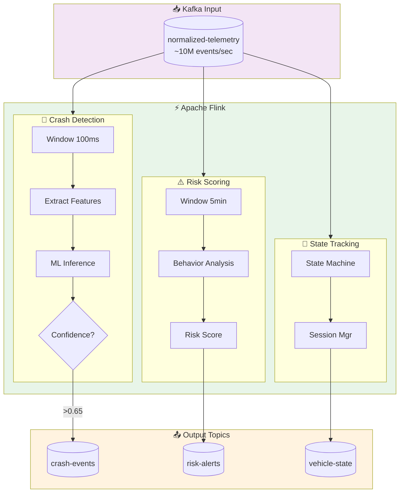
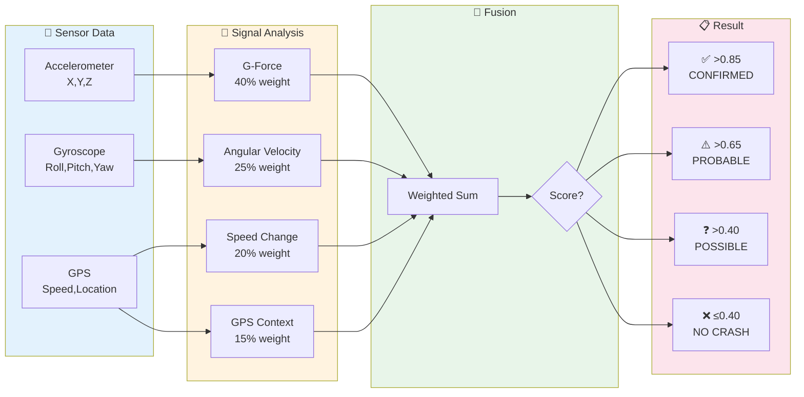

# Stream Processing Layer

## Overview

The stream processing layer is responsible for real-time analysis of telemetry data to detect crashes, predict risks, and trigger alerts. This is the core of the crash detection system.

---

## Processing Pipeline Overview



## Crash Detection Signal Flow



---

## Processing Pipeline Architecture (Detailed)

```
┌─────────────────────────────────────────────────────────────────────────────────────────┐
│                            STREAM PROCESSING PIPELINE                                    │
├─────────────────────────────────────────────────────────────────────────────────────────┤
│                                                                                          │
│  ┌─────────────────┐                                                                     │
│  │ normalized-     │                                                                     │
│  │ telemetry       │                                                                     │
│  │ (Kafka Topic)   │                                                                     │
│  └────────┬────────┘                                                                     │
│           │                                                                              │
│           ▼                                                                              │
│  ┌─────────────────────────────────────────────────────────────────────────────────┐    │
│  │                         FLINK STREAMING JOBS                                      │    │
│  │                                                                                   │    │
│  │  ┌─────────────────────────────────────────────────────────────────────────────┐ │    │
│  │  │                    JOB 1: CRASH DETECTION (Critical Path)                   │ │    │
│  │  │                                                                             │ │    │
│  │  │  ┌───────────┐    ┌───────────┐    ┌───────────┐    ┌───────────┐          │ │    │
│  │  │  │ Tumbling  │───▶│ G-Force   │───▶│ Pattern   │───▶│ Severity  │          │ │    │
│  │  │  │ Window    │    │ Threshold │    │ Matcher   │    │ Classifier│          │ │    │
│  │  │  │ (100ms)   │    │ Filter    │    │           │    │           │          │ │    │
│  │  │  └───────────┘    └───────────┘    └───────────┘    └───────────┘          │ │    │
│  │  │                                                                             │ │    │
│  │  │  Latency Target: < 200ms end-to-end                                         │ │    │
│  │  └─────────────────────────────────────────────────────────────────────────────┘ │    │
│  │                                        │                                          │    │
│  │  ┌─────────────────────────────────────┼─────────────────────────────────────────┐│    │
│  │  │                    JOB 2: RISK SCORING (Parallel)                             ││    │
│  │  │                                                                               ││    │
│  │  │  ┌───────────┐    ┌───────────┐    ┌───────────┐    ┌───────────┐            ││    │
│  │  │  │ Sliding   │───▶│ Driving   │───▶│ Context   │───▶│ Risk      │            ││    │
│  │  │  │ Window    │    │ Behavior  │    │ Enrichment│    │ Scorer    │            ││    │
│  │  │  │ (5 min)   │    │ Analysis  │    │ (Weather) │    │           │            ││    │
│  │  │  └───────────┘    └───────────┘    └───────────┘    └───────────┘            ││    │
│  │  │                                                                               ││    │
│  │  │  Latency Target: < 2s                                                         ││    │
│  │  └─────────────────────────────────────┬─────────────────────────────────────────┘│    │
│  │                                        │                                          │    │
│  │  ┌─────────────────────────────────────┼─────────────────────────────────────────┐│    │
│  │  │                    JOB 3: VEHICLE STATE TRACKING                              ││    │
│  │  │                                                                               ││    │
│  │  │  ┌───────────┐    ┌───────────┐    ┌───────────┐    ┌───────────┐            ││    │
│  │  │  │ Key by    │───▶│ State     │───▶│ Session   │───▶│ Trip      │            ││    │
│  │  │  │ Vehicle   │    │ Machine   │    │ Manager   │    │ Aggregator│            ││    │
│  │  │  │           │    │           │    │           │    │           │            ││    │
│  │  │  └───────────┘    └───────────┘    └───────────┘    └───────────┘            ││    │
│  │  │                                                                               ││    │
│  │  └───────────────────────────────────────────────────────────────────────────────┘│    │
│  │                                                                                   │    │
│  └─────────────────────────────────────────────────────────────────────────────────┘    │
│                                        │                                                 │
│           ┌────────────────────────────┼────────────────────────────────┐               │
│           ▼                            ▼                                ▼               │
│  ┌─────────────────┐        ┌─────────────────┐              ┌─────────────────┐        │
│  │ crash-events    │        │ risk-alerts     │              │ vehicle-state   │        │
│  │ (Kafka Topic)   │        │ (Kafka Topic)   │              │ (Kafka Topic)   │        │
│  └─────────────────┘        └─────────────────┘              └─────────────────┘        │
│                                                                                          │
└─────────────────────────────────────────────────────────────────────────────────────────┘
```

---

## Crash Detection Algorithm

### Multi-Signal Fusion Approach

```
┌─────────────────────────────────────────────────────────────────────────────┐
│                     CRASH DETECTION SIGNAL FUSION                            │
├─────────────────────────────────────────────────────────────────────────────┤
│                                                                              │
│     SIGNAL 1: G-FORCE THRESHOLD                                              │
│     ┌─────────────────────────────────────────────────────────────────────┐ │
│     │  Impact Detection:                                                   │ │
│     │  • Magnitude > 4g → Possible crash                                   │ │
│     │  • Magnitude > 8g → Probable crash                                   │ │
│     │  • Magnitude > 15g → Definite severe crash                           │ │
│     │                                                                       │ │
│     │  Direction Analysis:                                                  │ │
│     │  • Frontal: Large negative X                                         │ │
│     │  • Rear: Large positive X                                            │ │
│     │  • Side: Large Y (+ or -)                                            │ │
│     │  • Rollover: Large Z deviation                                       │ │
│     └─────────────────────────────────────────────────────────────────────┘ │
│                              │                                               │
│                              ▼                                               │
│     SIGNAL 2: ANGULAR VELOCITY (GYROSCOPE)                                   │
│     ┌─────────────────────────────────────────────────────────────────────┐ │
│     │  Rollover Detection:                                                  │ │
│     │  • Roll rate > 90°/sec sustained → Possible rollover                 │ │
│     │  • Combined with Z-axis accel change → Confirmed rollover            │ │
│     │                                                                       │ │
│     │  Spin Detection:                                                      │ │
│     │  • Yaw rate > 120°/sec → Possible spin-out                           │ │
│     │  • With lateral acceleration → Confirmed loss of control             │ │
│     └─────────────────────────────────────────────────────────────────────┘ │
│                              │                                               │
│                              ▼                                               │
│     SIGNAL 3: SPEED CHANGE                                                   │
│     ┌─────────────────────────────────────────────────────────────────────┐ │
│     │  Sudden Deceleration:                                                 │ │
│     │  • Speed drop > 20 mph in < 0.5s → Possible crash                    │ │
│     │  • Speed to 0 in < 1s from > 30 mph → Probable crash                 │ │
│     │                                                                       │ │
│     │  Combined with GPS stationary → Stopped suddenly                      │ │
│     └─────────────────────────────────────────────────────────────────────┘ │
│                              │                                               │
│                              ▼                                               │
│     SIGNAL 4: GPS ANALYSIS                                                   │
│     ┌─────────────────────────────────────────────────────────────────────┐ │
│     │  Location Context:                                                    │ │
│     │  • On roadway vs off-road                                            │ │
│     │  • Near intersection (higher likelihood)                             │ │
│     │  • Highway vs local road                                             │ │
│     │                                                                       │ │
│     │  Movement Pattern:                                                    │ │
│     │  • Stationary after high-speed travel                                │ │
│     │  • Erratic path before stopping                                      │ │
│     └─────────────────────────────────────────────────────────────────────┘ │
│                              │                                               │
│                              ▼                                               │
│     ┌─────────────────────────────────────────────────────────────────────┐ │
│     │                    FUSION DECISION ENGINE                            │ │
│     │                                                                       │ │
│     │  Confidence Score = Σ(signal_weight × signal_confidence)              │ │
│     │                                                                       │ │
│     │  Weights:                                                             │ │
│     │  • G-Force: 0.40                                                      │ │
│     │  • Gyroscope: 0.25                                                    │ │
│     │  • Speed Change: 0.20                                                 │ │
│     │  • GPS Context: 0.15                                                  │ │
│     │                                                                       │ │
│     │  Decision Thresholds:                                                 │ │
│     │  • Score > 0.85 → CRASH_CONFIRMED                                     │ │
│     │  • Score > 0.65 → CRASH_PROBABLE (verify with driver)                │ │
│     │  • Score > 0.40 → CRASH_POSSIBLE (monitor closely)                   │ │
│     │  • Score ≤ 0.40 → NO_CRASH                                            │ │
│     └─────────────────────────────────────────────────────────────────────┘ │
│                                                                              │
└─────────────────────────────────────────────────────────────────────────────┘
```

### Flink Job Implementation (Pseudocode)

```java
// CrashDetectionJob.java
public class CrashDetectionJob {

    public static void main(String[] args) throws Exception {
        StreamExecutionEnvironment env = StreamExecutionEnvironment.getExecutionEnvironment();

        // Configure for low latency
        env.setBufferTimeout(10); // 10ms buffer timeout
        env.enableCheckpointing(1000); // 1 second checkpoint interval
        env.getCheckpointConfig().setMinPauseBetweenCheckpoints(500);

        // Source: Normalized telemetry from Kafka
        KafkaSource<TelemetryEvent> source = KafkaSource.<TelemetryEvent>builder()
            .setBootstrapServers("kafka:9092")
            .setTopics("normalized-telemetry")
            .setGroupId("crash-detection-v1")
            .setStartingOffsets(OffsetsInitializer.latest())
            .setValueOnlyDeserializer(new TelemetryEventDeserializer())
            .build();

        DataStream<TelemetryEvent> telemetry = env.fromSource(
            source,
            WatermarkStrategy.<TelemetryEvent>forBoundedOutOfOrderness(Duration.ofMillis(100))
                .withTimestampAssigner((event, timestamp) -> event.getTimestamp()),
            "Telemetry Source"
        );

        // Process by vehicle
        DataStream<CrashEvent> crashes = telemetry
            .keyBy(TelemetryEvent::getVehicleId)
            .window(TumblingEventTimeWindows.of(Time.milliseconds(100)))
            .process(new CrashDetectionFunction())
            .filter(result -> result.getConfidence() > 0.65);

        // Enrich with vehicle/policy info
        DataStream<EnrichedCrashEvent> enrichedCrashes = crashes
            .map(new VehicleEnrichmentFunction())  // Async lookup from cache
            .process(new SeverityClassificationFunction());

        // Sink to crash-events topic
        KafkaSink<EnrichedCrashEvent> sink = KafkaSink.<EnrichedCrashEvent>builder()
            .setBootstrapServers("kafka:9092")
            .setRecordSerializer(KafkaRecordSerializationSchema.builder()
                .setTopic("crash-events")
                .setValueSerializationSchema(new CrashEventSerializer())
                .build())
            .setDeliverGuarantee(DeliveryGuarantee.AT_LEAST_ONCE)
            .build();

        enrichedCrashes.sinkTo(sink);

        env.execute("Crash Detection Pipeline");
    }
}

// CrashDetectionFunction.java
public class CrashDetectionFunction
    extends ProcessWindowFunction<TelemetryEvent, CrashEvent, String, TimeWindow> {

    private static final double G_FORCE_THRESHOLD_POSSIBLE = 4.0;
    private static final double G_FORCE_THRESHOLD_PROBABLE = 8.0;
    private static final double ROLL_RATE_THRESHOLD = 90.0; // degrees/sec

    @Override
    public void process(String vehicleId, Context context,
            Iterable<TelemetryEvent> events, Collector<CrashEvent> out) {

        List<TelemetryEvent> eventList = Lists.newArrayList(events);
        if (eventList.isEmpty()) return;

        // Calculate signals
        double maxGForce = calculateMaxGForce(eventList);
        double maxRollRate = calculateMaxRollRate(eventList);
        SpeedChange speedChange = analyzeSpeedChange(eventList);
        GpsContext gpsContext = analyzeGpsContext(eventList);

        // Fusion scoring
        double gForceScore = scoreGForce(maxGForce);
        double gyroScore = scoreGyroscope(maxRollRate);
        double speedScore = scoreSpeedChange(speedChange);
        double gpsScore = scoreGpsContext(gpsContext);

        double confidence = 0.40 * gForceScore
                         + 0.25 * gyroScore
                         + 0.20 * speedScore
                         + 0.15 * gpsScore;

        if (confidence > 0.40) {
            CrashType type = determineCrashType(maxGForce, maxRollRate, speedChange);
            TelemetryEvent lastEvent = eventList.get(eventList.size() - 1);

            out.collect(CrashEvent.builder()
                .eventId(UUID.randomUUID().toString())
                .vehicleId(vehicleId)
                .timestamp(lastEvent.getTimestamp())
                .confidence(confidence)
                .crashType(type)
                .maxGForce(maxGForce)
                .location(lastEvent.getGps())
                .rawEvents(eventList)
                .build());
        }
    }

    private double scoreGForce(double gForce) {
        if (gForce >= 15.0) return 1.0;
        if (gForce >= 8.0) return 0.8;
        if (gForce >= 4.0) return 0.5;
        if (gForce >= 2.0) return 0.2;
        return 0.0;
    }
}
```

---

## Risk Scoring Pipeline

### Predictive Risk Factors

```
┌─────────────────────────────────────────────────────────────────────────────┐
│                     RISK SCORING COMPONENTS                                  │
├─────────────────────────────────────────────────────────────────────────────┤
│                                                                              │
│  DRIVING BEHAVIOR SIGNALS (Real-time)                                        │
│  ┌─────────────────────────────────────────────────────────────────────────┐│
│  │                                                                         ││
│  │  Hard Braking Events         │  Score: 0-100                            ││
│  │  • Deceleration > 0.4g       │  • < 2/hour: 100                         ││
│  │  • 5-min rolling count       │  • 2-5/hour: 75                          ││
│  │                              │  • > 5/hour: 25                          ││
│  │                                                                         ││
│  │  Harsh Acceleration          │  Score: 0-100                            ││
│  │  • Acceleration > 0.3g       │  • < 3/hour: 100                         ││
│  │  • 5-min rolling count       │  • 3-6/hour: 75                          ││
│  │                              │  • > 6/hour: 25                          ││
│  │                                                                         ││
│  │  Speeding                    │  Score: 0-100                            ││
│  │  • % time > speed limit      │  • < 5%: 100                             ││
│  │  • Speed limit from maps     │  • 5-15%: 75                             ││
│  │                              │  • > 15%: 25                             ││
│  │                                                                         ││
│  │  Cornering                   │  Score: 0-100                            ││
│  │  • Lateral G-force > 0.2g    │  • < 1/hour: 100                         ││
│  │  • High-speed turns          │  • 1-3/hour: 75                          ││
│  │                              │  • > 3/hour: 25                          ││
│  │                                                                         ││
│  └─────────────────────────────────────────────────────────────────────────┘│
│                                                                              │
│  CONTEXTUAL RISK FACTORS (Enrichment)                                        │
│  ┌─────────────────────────────────────────────────────────────────────────┐│
│  │                                                                         ││
│  │  Weather Conditions          │  Risk Multiplier                         ││
│  │  • Rain                      │  × 1.5                                   ││
│  │  • Snow/Ice                  │  × 2.5                                   ││
│  │  • Fog                       │  × 1.8                                   ││
│  │                                                                         ││
│  │  Time of Day                 │  Risk Multiplier                         ││
│  │  • Night (10pm-5am)          │  × 1.6                                   ││
│  │  • Rush hour                 │  × 1.2                                   ││
│  │                                                                         ││
│  │  Road Type                   │  Risk Multiplier                         ││
│  │  • Highway                   │  × 1.3 (high speed)                      ││
│  │  • Urban                     │  × 1.4 (complex)                         ││
│  │                                                                         ││
│  │  Driver Hours (HOS)          │  Risk Multiplier                         ││
│  │  • > 8 hours driving         │  × 1.5                                   ││
│  │  • > 11 hours on duty        │  × 2.0                                   ││
│  │                                                                         ││
│  └─────────────────────────────────────────────────────────────────────────┘│
│                                                                              │
│  COMPOSITE RISK SCORE                                                        │
│  ┌─────────────────────────────────────────────────────────────────────────┐│
│  │                                                                         ││
│  │  BaseRisk = (Braking×0.25 + Accel×0.20 + Speed×0.30 + Corner×0.25)     ││
│  │                                                                         ││
│  │  AdjustedRisk = BaseRisk × Weather × TimeOfDay × Road × DriverHours     ││
│  │                                                                         ││
│  │  FinalScore = 100 - AdjustedRisk (inverted, 0=high risk, 100=safe)      ││
│  │                                                                         ││
│  │  Alert Thresholds:                                                       ││
│  │  • Score < 30: CRITICAL - Immediate intervention                        ││
│  │  • Score < 50: WARNING - Monitor closely                                ││
│  │  • Score < 70: CAUTION - Log and track                                  ││
│  │                                                                         ││
│  └─────────────────────────────────────────────────────────────────────────┘│
│                                                                              │
└─────────────────────────────────────────────────────────────────────────────┘
```

---

## Vehicle State Machine

```
┌─────────────────────────────────────────────────────────────────────────────┐
│                        VEHICLE STATE MACHINE                                 │
├─────────────────────────────────────────────────────────────────────────────┤
│                                                                              │
│     ┌───────────┐                                                            │
│     │  UNKNOWN  │ ◄───────────────────── Initial state                       │
│     └─────┬─────┘                                                            │
│           │ First telemetry received                                         │
│           ▼                                                                  │
│     ┌───────────┐      ignition=on       ┌───────────┐                       │
│     │  PARKED   │ ──────────────────────▶│  IDLING   │                       │
│     └───────────┘                        └─────┬─────┘                       │
│           ▲                                    │ speed > 5 mph               │
│           │                                    ▼                             │
│           │ ignition=off            ┌───────────────────┐                    │
│           │                         │     DRIVING       │                    │
│           │                         │  (Trip in progress)                    │
│           │                         └─────────┬─────────┘                    │
│           │                                   │                              │
│           │         ┌─────────────────────────┼─────────────────────────┐    │
│           │         │                         │                         │    │
│           │         ▼                         ▼                         ▼    │
│           │ ┌───────────────┐    ┌───────────────────┐    ┌───────────────┐  │
│           │ │ STOPPED       │    │ CRASH_DETECTED    │    │ RISK_ALERT    │  │
│           │ │ (temporary)   │    │ (emergency)       │    │ (warning)     │  │
│           │ └───────┬───────┘    └───────────────────┘    └───────────────┘  │
│           │         │                                                        │
│           └─────────┘                                                        │
│                                                                              │
│  State Stored: Redis (vehicle_id -> VehicleState)                            │
│  TTL: 24 hours from last update                                              │
│  Updates: Every telemetry event                                              │
│                                                                              │
└─────────────────────────────────────────────────────────────────────────────┘
```

### State Schema

```json
{
  "vehicle_id": "VH-123456",
  "current_state": "DRIVING",
  "state_since": "2024-01-15T10:30:00Z",
  "current_trip": {
    "trip_id": "TRIP-abc123",
    "start_time": "2024-01-15T08:00:00Z",
    "start_location": {
      "latitude": 40.7128,
      "longitude": -74.0060
    },
    "distance_km": 245.6,
    "duration_minutes": 180,
    "driver_id": "DRV-789"
  },
  "risk_score": {
    "current": 72,
    "trend": "declining",
    "alerts_today": 2
  },
  "last_event": {
    "timestamp": "2024-01-15T11:30:00Z",
    "gps": {
      "latitude": 41.8781,
      "longitude": -87.6298,
      "speed_mps": 25.4
    }
  }
}
```

---

## Window Strategies

| Window Type | Use Case | Configuration |
|-------------|----------|---------------|
| Tumbling 100ms | Crash detection | Non-overlapping, event-time |
| Sliding 5min/30s | Risk scoring | 5-min window, 30s slide |
| Session (gap 5min) | Trip detection | Ends after 5min of no data |
| Global + Trigger | Hourly aggregations | Custom trigger on hour boundary |

---

## Late Data Handling

```
┌─────────────────────────────────────────────────────────────────────────────┐
│                        LATE DATA STRATEGY                                    │
├─────────────────────────────────────────────────────────────────────────────┤
│                                                                              │
│  Watermark Strategy: BoundedOutOfOrderness(100ms)                            │
│                                                                              │
│  Late events (up to 5 seconds):                                              │
│  ┌─────────────────────────────────────────────────────────────────────────┐│
│  │  • Allowed lateness: 5 seconds                                          ││
│  │  • Side output for late events                                          ││
│  │  • Reprocess if material (crash detection)                              ││
│  │  • Aggregate-only for analytics                                         ││
│  └─────────────────────────────────────────────────────────────────────────┘│
│                                                                              │
│  Very late events (> 5 seconds):                                             │
│  ┌─────────────────────────────────────────────────────────────────────────┐│
│  │  • Route to late-events topic                                           ││
│  │  • Batch reprocessing (hourly)                                          ││
│  │  • Update historical analytics                                          ││
│  │  • Do NOT re-trigger alerts                                             ││
│  └─────────────────────────────────────────────────────────────────────────┘│
│                                                                              │
└─────────────────────────────────────────────────────────────────────────────┘
```

---

## Scaling Considerations

### Parallelism Configuration

| Component | Parallelism | Partitioning Strategy |
|-----------|-------------|----------------------|
| Kafka Topics | 300 partitions | vehicle_id hash |
| Crash Detection Job | 150 slots | Key by vehicle_id |
| Risk Scoring Job | 100 slots | Key by vehicle_id |
| State Tracking Job | 150 slots | Key by vehicle_id |

### Checkpointing

```yaml
# flink-conf.yaml
state.backend: rocksdb
state.backend.incremental: true
state.checkpoints.dir: s3://flink-checkpoints/
execution.checkpointing.interval: 1000ms
execution.checkpointing.min-pause: 500ms
execution.checkpointing.max-concurrent-checkpoints: 1
execution.checkpointing.prefer-checkpoint-for-recovery: true
```

