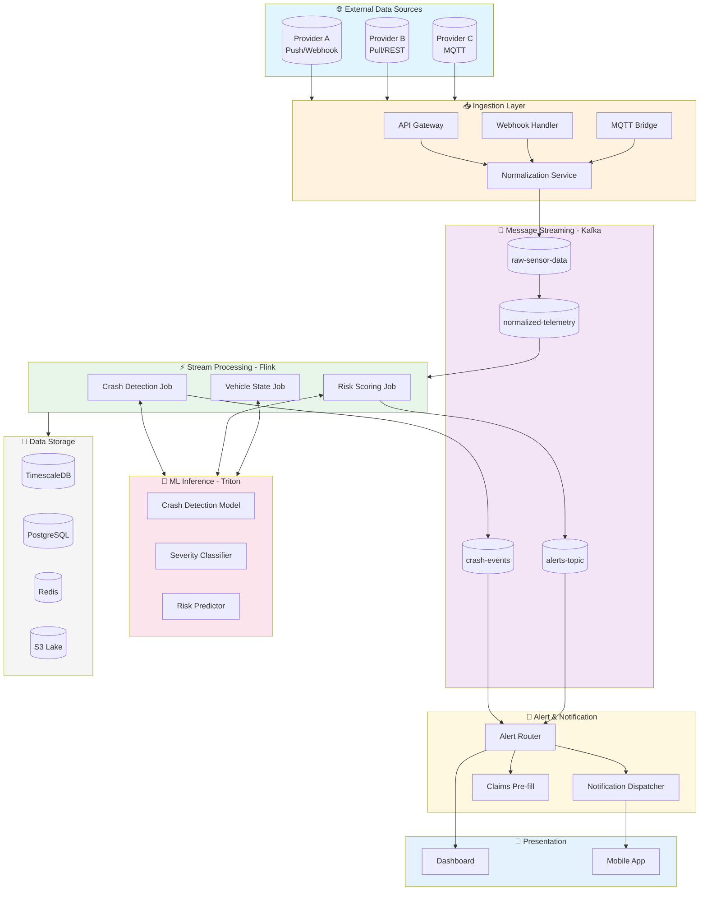

# System Architecture

## High-Level Architecture Overview

### Mermaid Diagram



### ASCII Diagram

```
┌─────────────────────────────────────────────────────────────────────────────────────────┐
│                              EXTERNAL DATA SOURCES                                       │
├─────────────────────────────────────────────────────────────────────────────────────────┤
│  ┌─────────────────┐  ┌─────────────────┐  ┌─────────────────┐  ┌─────────────────┐     │
│  │  Provider A     │  │  Provider B     │  │  Provider C     │  │  Provider N     │     │
│  │  (Push/Webhook) │  │  (Pull/REST)    │  │  (Push/MQTT)    │  │  (Mixed)        │     │
│  └────────┬────────┘  └────────┬────────┘  └────────┬────────┘  └────────┬────────┘     │
└───────────┼─────────────────────┼─────────────────────┼─────────────────────┼───────────┘
            │                     │                     │                     │
            ▼                     ▼                     ▼                     ▼
┌─────────────────────────────────────────────────────────────────────────────────────────┐
│                           INGESTION LAYER (Edge + Cloud)                                 │
├─────────────────────────────────────────────────────────────────────────────────────────┤
│  ┌──────────────────────┐    ┌──────────────────────┐    ┌──────────────────────┐       │
│  │   Webhook Gateway    │    │   API Poller Fleet   │    │   MQTT Broker        │       │
│  │   (Push Handlers)    │    │   (Pull Schedulers)  │    │   Cluster            │       │
│  └──────────┬───────────┘    └──────────┬───────────┘    └──────────┬───────────┘       │
│             │                           │                           │                   │
│             └───────────────────────────┼───────────────────────────┘                   │
│                                         ▼                                               │
│  ┌────────────────────────────────────────────────────────────────────────────────────┐ │
│  │                    DATA NORMALIZATION & VALIDATION SERVICE                         │ │
│  │   • Schema Registry        • Format Conversion       • Deduplication              │ │
│  │   • Provider Adapters      • Data Enrichment         • Validation Rules          │ │
│  └────────────────────────────────────────────────────────────────────────────────────┘ │
└─────────────────────────────────────────────────────────────────────────────────────────┘
                                          │
                                          ▼
┌─────────────────────────────────────────────────────────────────────────────────────────┐
│                              MESSAGE STREAMING LAYER                                     │
├─────────────────────────────────────────────────────────────────────────────────────────┤
│  ┌────────────────────────────────────────────────────────────────────────────────────┐ │
│  │                         Apache Kafka / AWS Kinesis                                  │ │
│  │  ┌────────────┐ ┌────────────┐ ┌────────────┐ ┌────────────┐ ┌────────────┐        │ │
│  │  │raw-sensor  │ │normalized- │ │crash-      │ │alerts-     │ │claims-     │        │ │
│  │  │-data       │ │telemetry   │ │events      │ │topic       │ │topic       │        │ │
│  │  └────────────┘ └────────────┘ └────────────┘ └────────────┘ └────────────┘        │ │
│  └────────────────────────────────────────────────────────────────────────────────────┘ │
└─────────────────────────────────────────────────────────────────────────────────────────┘
                                          │
                        ┌─────────────────┴─────────────────┐
                        ▼                                   ▼
┌─────────────────────────────────────┐    ┌─────────────────────────────────────┐
│      STREAM PROCESSING LAYER        │    │         BATCH PROCESSING LAYER      │
├─────────────────────────────────────┤    ├─────────────────────────────────────┤
│  Apache Flink / Kafka Streams       │    │  Apache Spark / Databricks          │
│  ┌───────────────────────────────┐  │    │  ┌───────────────────────────────┐  │
│  │ Real-Time Crash Detection     │  │    │  │ Model Training Pipeline       │  │
│  │ • G-Force Anomaly Detection   │  │    │  │ • Historical Analysis         │  │
│  │ • Gyroscope Pattern Matching  │  │    │  │ • Feature Engineering         │  │
│  │ • GPS Sudden Stop Detection   │  │    │  │ • Model Validation            │  │
│  │ • Multi-Sensor Correlation    │  │    │  └───────────────────────────────┘  │
│  └───────────────────────────────┘  │    │  ┌───────────────────────────────┐  │
│  ┌───────────────────────────────┐  │    │  │ Risk Analytics                │  │
│  │ Predictive Risk Scoring       │  │    │  │ • Policy-level risk           │  │
│  │ • Fatigue Detection           │  │    │  │ • Fleet scoring               │  │
│  │ • Aggressive Driving Alerts   │  │    │  │ • Trend analysis              │  │
│  │ • Weather + Traffic Context   │  │    │  └───────────────────────────────┘  │
│  └───────────────────────────────┘  │    └─────────────────────────────────────┘
└─────────────────────────────────────┘
                        │
                        ▼
┌─────────────────────────────────────────────────────────────────────────────────────────┐
│                              ML INFERENCE LAYER                                          │
├─────────────────────────────────────────────────────────────────────────────────────────┤
│  ┌──────────────────┐  ┌──────────────────┐  ┌──────────────────┐  ┌──────────────────┐ │
│  │ Crash Detection  │  │ Severity         │  │ Predictive Risk  │  │ Image/Video      │ │
│  │ Model (RT)       │  │ Classification   │  │ Scoring          │  │ Analysis         │ │
│  │ Latency: <100ms  │  │ Latency: <500ms  │  │ Latency: <200ms  │  │ Latency: <2s     │ │
│  └──────────────────┘  └──────────────────┘  └──────────────────┘  └──────────────────┘ │
│                                                                                          │
│  Model Serving: AWS SageMaker / TensorFlow Serving / Seldon Core                        │
└─────────────────────────────────────────────────────────────────────────────────────────┘
                        │
                        ▼
┌─────────────────────────────────────────────────────────────────────────────────────────┐
│                           ALERT & NOTIFICATION ENGINE                                    │
├─────────────────────────────────────────────────────────────────────────────────────────┤
│  ┌──────────────────┐  ┌──────────────────┐  ┌──────────────────┐  ┌──────────────────┐ │
│  │ Alert Router     │  │ Notification     │  │ Escalation       │  │ Claims Pre-      │ │
│  │ & Dedup          │  │ Dispatcher       │  │ Manager          │  │ Population       │ │
│  │ • Priority Queue │  │ • SMS/Push/Email │  │ • SLA Tracking   │  │ Service          │ │
│  └──────────────────┘  └──────────────────┘  └──────────────────┘  └──────────────────┘ │
└─────────────────────────────────────────────────────────────────────────────────────────┘
                        │
                        ▼
┌─────────────────────────────────────────────────────────────────────────────────────────┐
│                              PRESENTATION LAYER                                          │
├─────────────────────────────────────────────────────────────────────────────────────────┤
│  ┌──────────────────┐  ┌──────────────────┐  ┌──────────────────┐  ┌──────────────────┐ │
│  │ Operations       │  │ Customer         │  │ Claims           │  │ Mobile App       │ │
│  │ Dashboard        │  │ Portal           │  │ Portal           │  │ (Push Alerts)    │ │
│  │ (Real-time Map)  │  │ (Fleet View)     │  │ (Pre-filled)     │  │                  │ │
│  └──────────────────┘  └──────────────────┘  └──────────────────┘  └──────────────────┘ │
└─────────────────────────────────────────────────────────────────────────────────────────┘
```

## Core Components

### 1. Ingestion Layer
Handles heterogeneous data sources with different protocols and formats.

**Components:**
- **Webhook Gateway**: Receives push data from providers
- **API Poller Fleet**: Scheduled pulls from provider APIs
- **MQTT Broker Cluster**: Handles IoT protocol connections
- **Protocol Adapters**: Translates provider-specific formats

### 2. Normalization Layer
Converts varied provider schemas to canonical format.

**Responsibilities:**
- Schema validation and transformation
- Deduplication (idempotency keys)
- Data enrichment (vehicle metadata, policy info)
- Quality scoring

### 3. Streaming Platform
Apache Kafka/AWS Kinesis for reliable message transport.

**Topic Strategy:**
- `raw-sensor-data`: Ingested data (high volume)
- `normalized-telemetry`: Validated, enriched data
- `crash-events`: Confirmed crash detections
- `risk-alerts`: Predictive warnings
- `claims-events`: Claims initiation triggers

### 4. Stream Processing
Real-time analytics on sensor data streams.

**Processing Jobs:**
- Crash detection algorithms
- Anomaly detection
- Risk scoring
- Geo-fencing

### 5. ML Inference Layer
Deployed models for real-time predictions.

**Models:**
- Crash detection (accelerometer + gyroscope patterns)
- Severity classification
- Driver behavior scoring
- Predictive risk assessment

### 6. Alert Engine
Routes and dispatches alerts based on severity and type.

### 7. Presentation Layer
User interfaces for different stakeholders.

---

## Data Flow Patterns

### Push Model Flow (Real-time)
```
Provider → Webhook → Validate → Kafka → Flink → Model → Alert
         (< 100ms)  (< 50ms)   (< 10ms) (< 50ms) (< 100ms) (< 200ms)

Total Latency Target: < 500ms for crash detection
```

### Pull Model Flow (Near Real-time)
```
Scheduler → Poll API → Validate → Kafka → Flink → Model → Alert
(every 5s)  (< 1s)     (< 50ms)   (< 10ms) (< 50ms) (< 100ms) (< 200ms)

Total Latency Target: < 6s for crash detection
```

---

## Deployment Topology

### Multi-Region Active-Active
```
                    ┌─────────────────────────┐
                    │     Global DNS/LB       │
                    │   (Route 53 / Cloudflare)│
                    └───────────┬─────────────┘
            ┌───────────────────┼───────────────────┐
            ▼                   ▼                   ▼
    ┌───────────────┐   ┌───────────────┐   ┌───────────────┐
    │   US-East     │   │   US-Central  │   │   US-West     │
    │   Region      │   │   Region      │   │   Region      │
    ├───────────────┤   ├───────────────┤   ├───────────────┤
    │ • Ingestion   │   │ • Ingestion   │   │ • Ingestion   │
    │ • Processing  │   │ • Processing  │   │ • Processing  │
    │ • ML Serving  │   │ • ML Serving  │   │ • ML Serving  │
    │ • Alerting    │   │ • Alerting    │   │ • Alerting    │
    └───────────────┘   └───────────────┘   └───────────────┘
            │                   │                   │
            └───────────────────┼───────────────────┘
                                ▼
                    ┌─────────────────────────┐
                    │  Cross-Region Replication│
                    │  (Kafka MirrorMaker)     │
                    └─────────────────────────┘
```

**Rationale:**
- Vehicles distributed across continental USA
- Minimize latency by regional processing
- Fault tolerance for regional outages
- Data residency compliance

---

## Technology Stack

| Layer | Primary Technology | Alternative |
|-------|-------------------|-------------|
| Ingestion Gateway | Kong / AWS API Gateway | Nginx + Custom |
| Message Queue | Apache Kafka | AWS Kinesis |
| Stream Processing | Apache Flink | Kafka Streams |
| Batch Processing | Apache Spark | Databricks |
| ML Training | SageMaker / Vertex AI | MLflow + Kubeflow |
| ML Serving | TensorFlow Serving | Seldon Core |
| Time-Series DB | TimescaleDB / InfluxDB | Apache Druid |
| Object Storage | S3 | GCS |
| Caching | Redis Cluster | Memcached |
| Container Orchestration | Kubernetes (EKS) | ECS |
| Service Mesh | Istio | Linkerd |
| Observability | Prometheus + Grafana | Datadog |

---

## Capacity Planning

### Data Volume Estimates

| Metric | Calculation | Value |
|--------|-------------|-------|
| Vehicles | Given | 1,000,000 |
| Active % (peak) | Estimate | 30% |
| Active Vehicles | 1M × 0.3 | 300,000 |
| Data Points/Vehicle/Sec | Given | 30 avg |
| Events/Second (peak) | 300K × 30 | 9,000,000 |
| Avg Event Size | Estimate | 500 bytes |
| Throughput (peak) | 9M × 500B | ~4.5 GB/s |
| Daily Data Volume | ~3 GB/s avg × 86400 | ~260 TB/day |

### Infrastructure Sizing

| Component | Sizing | Notes |
|-----------|--------|-------|
| Kafka Brokers | 30 nodes (10/region) | 3 replicas, 7-day retention |
| Flink TaskManagers | 50 nodes (17/region) | 32 cores, 128GB RAM each |
| ML Inference | 60 GPU nodes (20/region) | A10G or T4 GPUs |
| TimescaleDB | 15 nodes (5/region) | Sharded by vehicle_id |
| Redis Cluster | 12 nodes (4/region) | Vehicle state cache |
| API Gateway | Auto-scaled | 100K RPS capacity |

---

## Security Architecture

### Defense in Depth
```
┌─────────────────────────────────────────────────────────────────┐
│  Layer 1: Network Security                                       │
│  • VPC isolation  • Security Groups  • WAF  • DDoS Protection   │
├─────────────────────────────────────────────────────────────────┤
│  Layer 2: Identity & Access                                      │
│  • mTLS for providers  • API Keys  • OAuth 2.0  • IAM Roles     │
├─────────────────────────────────────────────────────────────────┤
│  Layer 3: Data Security                                          │
│  • Encryption at rest (AES-256)  • TLS 1.3 in transit           │
│  • Field-level encryption for PII  • Key rotation               │
├─────────────────────────────────────────────────────────────────┤
│  Layer 4: Application Security                                   │
│  • Input validation  • Rate limiting  • Audit logging           │
└─────────────────────────────────────────────────────────────────┘
```

### Provider Authentication
- **mTLS**: Mutual TLS for webhook providers
- **API Keys**: Rotatable keys with scopes
- **IP Allowlisting**: Provider IP ranges
- **Signature Verification**: HMAC signing for payloads

---

## Failure Modes & Mitigation

| Failure Mode | Impact | Mitigation |
|--------------|--------|------------|
| Provider API Down | Data gaps | Retry with backoff, alert ops |
| Kafka Partition Failure | Processing delay | 3x replication, automatic failover |
| ML Model Latency Spike | Delayed detection | Fallback to rule-based detection |
| Regional Outage | Service degradation | Cross-region failover |
| Notification Service Down | Alert delivery failure | Multi-provider fallback (Twilio → SNS) |

---

## Cost Considerations

### Monthly Cost Estimate (AWS)

| Component | Specs | Estimated Cost |
|-----------|-------|----------------|
| Kafka (MSK) | 30 brokers | $45,000 |
| EC2 (Flink) | 50 × r6i.4xlarge | $75,000 |
| GPU Inference | 60 × g4dn.xlarge | $40,000 |
| S3 Storage | 8 PB cumulative | $180,000 |
| Data Transfer | ~500 TB egress | $45,000 |
| Managed Services | Various | $30,000 |
| **Total** | | **~$415,000/month** |

*Note: Significant optimization possible with reserved instances and spot for batch workloads*

