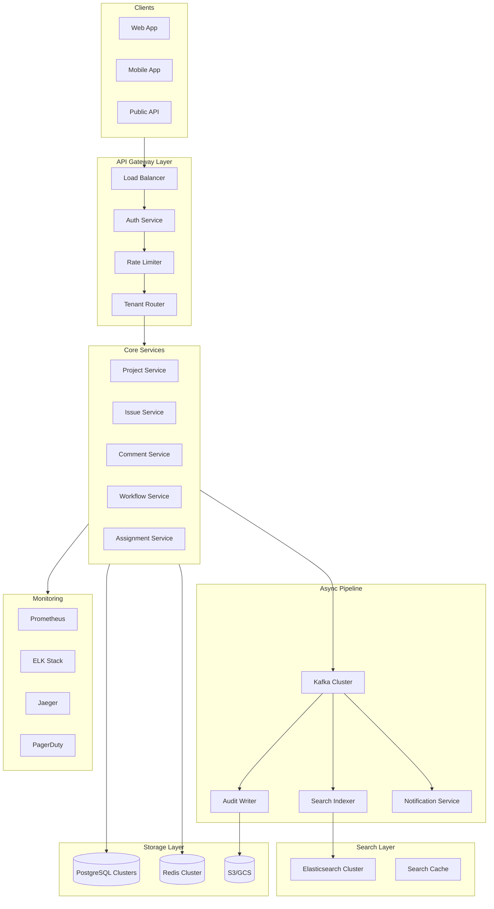
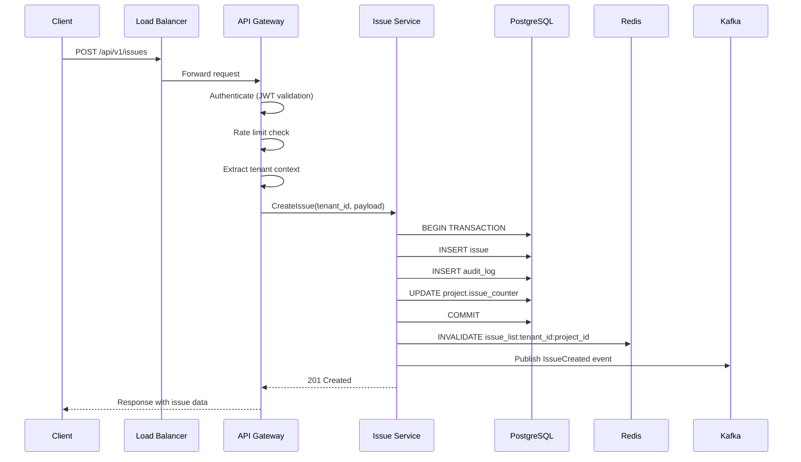
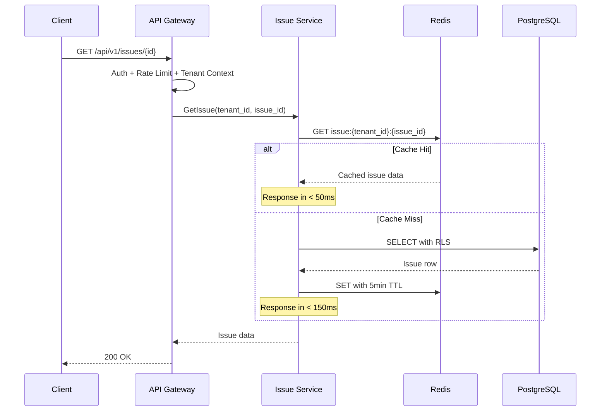
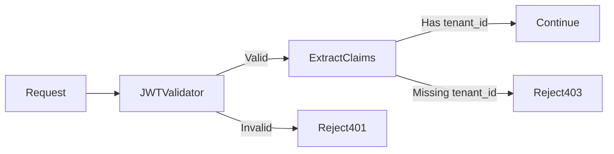
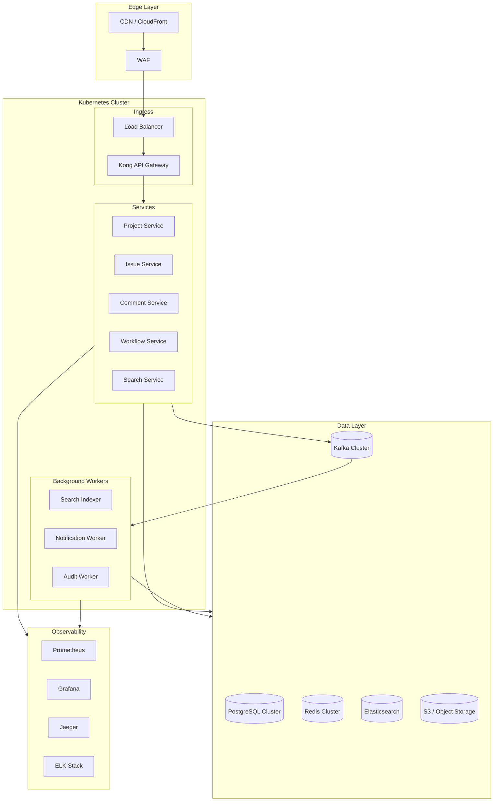
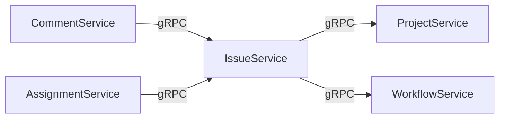
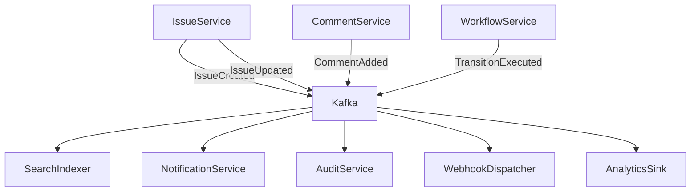

# High-Level Architecture

[← Back to README](./README.md)

## System Architecture Diagram



## Component Overview

| Layer | Components | Purpose |
|-------|------------|---------|
| **Clients** | Web, Mobile, Public API | User interfaces and integrations |
| **API Gateway** | Load Balancer, Auth, Rate Limiter, Tenant Router | Request routing, authentication, throttling |
| **Core Services** | Project, Issue, Comment, Workflow, Assignment | Business logic and data operations |
| **Async Pipeline** | Kafka, Indexer, Audit Writer, Notifications | Event processing and async operations |
| **Search Layer** | Elasticsearch, Search Cache | Full-text search and caching |
| **Storage** | PostgreSQL, Redis, S3/GCS | Persistent storage and caching |
| **Observability** | Prometheus, ELK, Jaeger, PagerDuty | Monitoring, logging, tracing, alerting |

## Request Flow

### Write Request (Create Issue)



### Read Request (Get Issue)



## API Gateway Responsibilities

### 1. Load Balancing

- Round-robin distribution across service instances
- Health check-based routing
- Connection draining for graceful shutdowns

### 2. Authentication



Supported auth methods:
- **Bearer Token (JWT)**: Primary method for API access
- **API Key**: For service-to-service and integrations
- **OAuth2**: For third-party app authorization

### 3. Rate Limiting

| Tier | Requests/min | Burst | Scope |
|------|--------------|-------|-------|
| Free | 100 | 20 | Per user |
| Standard | 1,000 | 100 | Per user |
| Enterprise | 10,000 | 1,000 | Per tenant |

Rate limiting implemented via Redis with sliding window algorithm:

```lua
-- Redis Lua script for sliding window rate limiting
local key = KEYS[1]
local window = tonumber(ARGV[1])
local limit = tonumber(ARGV[2])
local now = tonumber(ARGV[3])

redis.call('ZREMRANGEBYSCORE', key, 0, now - window)
local count = redis.call('ZCARD', key)

if count < limit then
    redis.call('ZADD', key, now, now .. ':' .. math.random())
    redis.call('EXPIRE', key, window / 1000)
    return 1
else
    return 0
end
```

### 4. Tenant Routing

See [Multi-Tenancy Strategy](./02-multi-tenancy-strategy.md) for detailed tenant routing logic.

## Infrastructure Diagram



## Service Communication

### Synchronous (gRPC/REST)

Used for:
- User-facing API requests
- Queries requiring immediate response
- Cross-service data lookups



### Asynchronous (Kafka Events)

Used for:
- Search index updates
- Audit logging
- Notifications
- Webhooks
- Analytics



## Next

[Multi-Tenancy Strategy →](./02-multi-tenancy-strategy.md)
