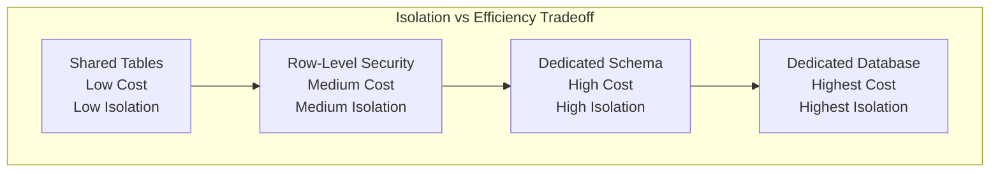
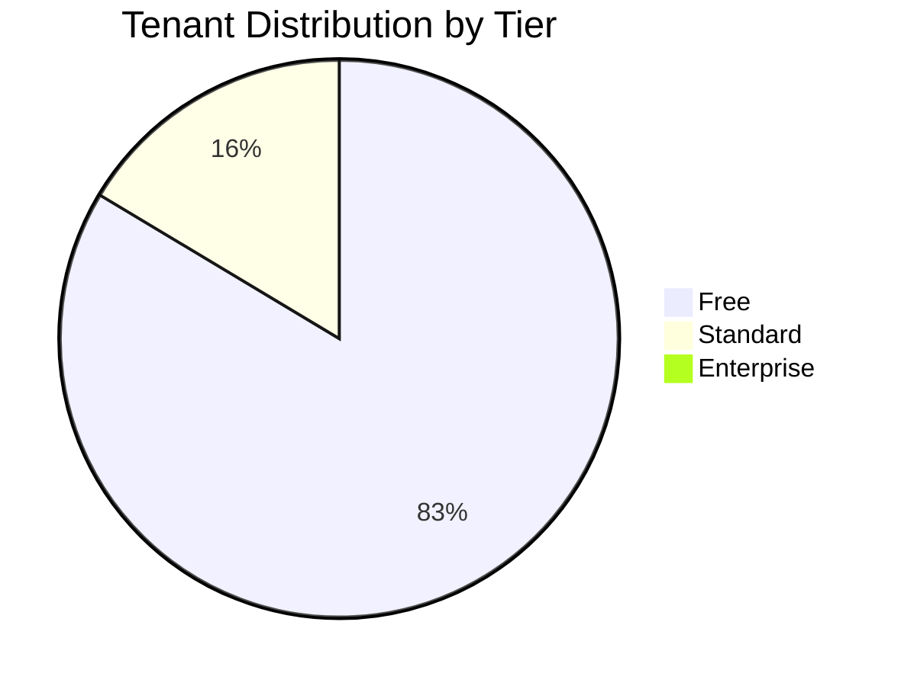
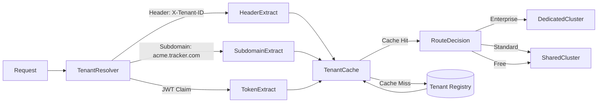
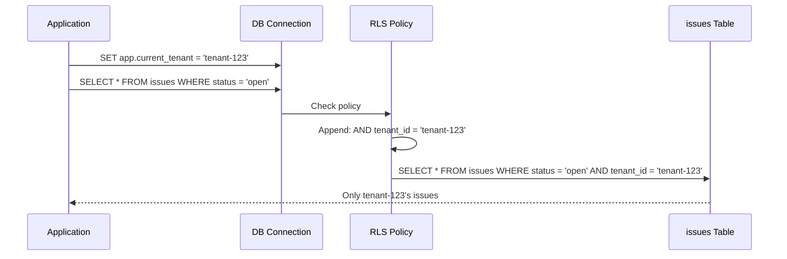
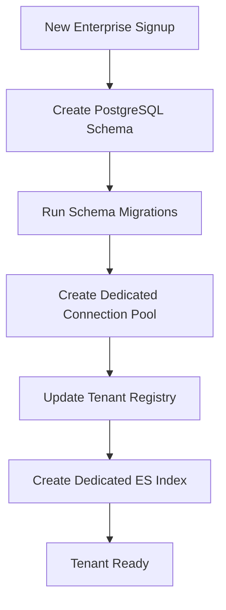
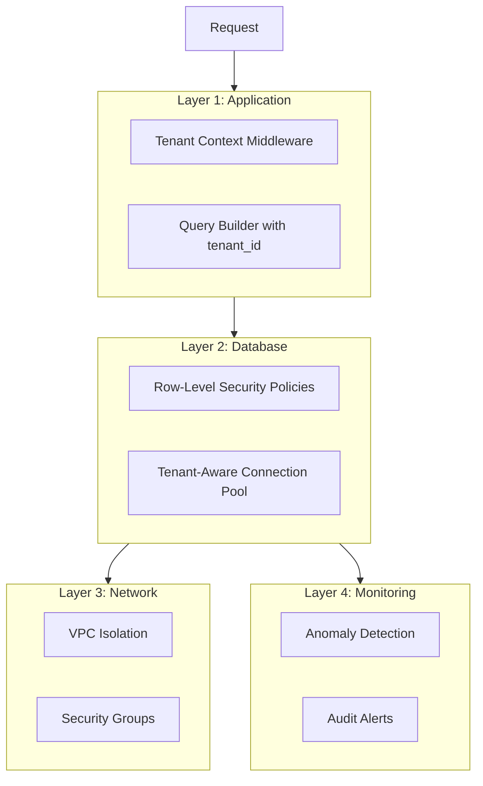

# Multi-Tenancy Strategy

[← Back to README](./README.md) | [← Previous: Architecture](./01-high-level-architecture.md)

## Data Isolation Model: Hybrid Approach

We use a tiered multi-tenancy model based on customer tier to optimize for both isolation requirements and operational efficiency:

| Tenant Tier | Strategy | Isolation Level | Description |
|-------------|----------|-----------------|-------------|
| **Enterprise (Whales)** | Dedicated Schema | Strong | Own PostgreSQL schema per tenant, dedicated connection pools |
| **Standard** | Shared Schema + Row-Level Security | Medium | `tenant_id` column with RLS policies |
| **Free/Trial** | Shared Everything | Basic | Shared tables with tenant_id filtering |

## Why Hybrid Multi-Tenancy?



**Rationale:**
- **Enterprise customers** pay premium prices and require strong isolation guarantees (compliance, security audits)
- **Standard customers** need good isolation but can share infrastructure for cost efficiency
- **Free/trial users** generate minimal revenue; maximize density to control costs

## Tenant Distribution



| Tier | Count | % of Tenants | % of Revenue | % of Data |
|------|-------|--------------|--------------|-----------|
| Free | 250,000 | 83.3% | 0% | 5% |
| Standard | 49,000 | 16.3% | 40% | 35% |
| Enterprise | 1,000 | 0.4% | 60% | 60% |

## Tenant Routing Architecture



## Tenant Resolution Methods

| Method | Use Case | Priority | Example |
|--------|----------|----------|---------|
| **JWT Claim** | API requests with bearer token | 1 (highest) | `{"tenant_id": "uuid"}` in JWT payload |
| **X-Tenant-ID Header** | Service-to-service calls | 2 | `X-Tenant-ID: uuid` |
| **Subdomain** | Web app access | 3 | `acme.tracker.com` |
| **Path Prefix** | Public API | 4 | `/v1/tenants/{id}/issues` |

## Tenant Context Propagation

### Middleware Implementation

```go
// TenantMiddleware extracts and propagates tenant context
func TenantMiddleware(next http.Handler) http.Handler {
    return http.HandlerFunc(func(w http.ResponseWriter, r *http.Request) {
        tenantID, err := resolveTenant(r)
        if err != nil {
            http.Error(w, "Invalid tenant", http.StatusUnauthorized)
            return
        }

        // Validate tenant exists and is active
        tenant, err := tenantCache.Get(tenantID)
        if err != nil || tenant.Status != "active" {
            http.Error(w, "Tenant not found or inactive", http.StatusForbidden)
            return
        }

        // Add tenant to context
        ctx := context.WithValue(r.Context(), TenantKey, tenant)

        // Add trace headers for observability
        ctx = context.WithValue(ctx, "tenant_tier", tenant.Tier)

        next.ServeHTTP(w, r.WithContext(ctx))
    })
}

func resolveTenant(r *http.Request) (string, error) {
    // Priority 1: JWT claim
    if claims := r.Context().Value(JWTClaimsKey); claims != nil {
        if tenantID := claims.(jwt.MapClaims)["tenant_id"]; tenantID != nil {
            return tenantID.(string), nil
        }
    }

    // Priority 2: Header
    if tenantID := r.Header.Get("X-Tenant-ID"); tenantID != "" {
        return tenantID, nil
    }

    // Priority 3: Subdomain
    host := r.Host
    if parts := strings.Split(host, "."); len(parts) >= 3 {
        subdomain := parts[0]
        if tenant, err := tenantCache.GetBySlug(subdomain); err == nil {
            return tenant.ID, nil
        }
    }

    return "", errors.New("unable to resolve tenant")
}
```

### Database Connection with Tenant Context

```go
// GetConnection returns a connection with tenant context set
func (p *TenantAwarePool) GetConnection(ctx context.Context) (*sql.Conn, error) {
    tenant := ctx.Value(TenantKey).(*Tenant)

    // Enterprise tenants get dedicated pool
    if tenant.Tier == "enterprise" {
        pool := p.dedicatedPools[tenant.ID]
        conn, err := pool.Conn(ctx)
        if err != nil {
            return nil, err
        }
        // Set search_path for schema isolation
        _, err = conn.ExecContext(ctx,
            fmt.Sprintf("SET search_path TO %s, public", tenant.DBSchema))
        return conn, err
    }

    // Shared pool for standard/free
    conn, err := p.sharedPool.Conn(ctx)
    if err != nil {
        return nil, err
    }

    // Set session variable for RLS
    _, err = conn.ExecContext(ctx,
        "SET app.current_tenant = $1", tenant.ID)
    if err != nil {
        conn.Close()
        return nil, err
    }

    return conn, nil
}
```

## Row-Level Security (RLS)

### Policy Definition

```sql
-- Enable RLS on all tenant-scoped tables
ALTER TABLE issues ENABLE ROW LEVEL SECURITY;
ALTER TABLE issues FORCE ROW LEVEL SECURITY;  -- Apply even to table owners

ALTER TABLE comments ENABLE ROW LEVEL SECURITY;
ALTER TABLE comments FORCE ROW LEVEL SECURITY;

ALTER TABLE projects ENABLE ROW LEVEL SECURITY;
ALTER TABLE projects FORCE ROW LEVEL SECURITY;

ALTER TABLE issue_history ENABLE ROW LEVEL SECURITY;
ALTER TABLE issue_history FORCE ROW LEVEL SECURITY;

-- Create isolation policies
CREATE POLICY tenant_isolation_issues ON issues
    FOR ALL
    USING (tenant_id = current_setting('app.current_tenant', true)::uuid);

CREATE POLICY tenant_isolation_comments ON comments
    FOR ALL
    USING (tenant_id = current_setting('app.current_tenant', true)::uuid);

CREATE POLICY tenant_isolation_projects ON projects
    FOR ALL
    USING (tenant_id = current_setting('app.current_tenant', true)::uuid);

CREATE POLICY tenant_isolation_history ON issue_history
    FOR ALL
    USING (tenant_id = current_setting('app.current_tenant', true)::uuid);

-- Superuser/admin bypass for migrations and maintenance
CREATE POLICY admin_bypass_issues ON issues
    FOR ALL
    TO admin_role
    USING (true);
```

### How RLS Works



## Schema Isolation (Enterprise)

For enterprise tenants, we use dedicated PostgreSQL schemas:

```sql
-- Create schema for new enterprise tenant
CREATE SCHEMA tenant_acme_corp;

-- Create tables in tenant schema
CREATE TABLE tenant_acme_corp.issues (
    -- Same structure as shared issues table
    id UUID PRIMARY KEY DEFAULT gen_random_uuid(),
    project_id UUID NOT NULL,
    issue_number BIGINT NOT NULL,
    title VARCHAR(500) NOT NULL,
    -- ... rest of columns
);

-- Grant access to application role
GRANT USAGE ON SCHEMA tenant_acme_corp TO app_role;
GRANT ALL ON ALL TABLES IN SCHEMA tenant_acme_corp TO app_role;
```

### Schema Provisioning Flow



## Connection Pool Strategy

| Tier | Pool Type | Min Connections | Max Connections |
|------|-----------|-----------------|-----------------|
| Enterprise | Dedicated per tenant | 5 | 50 |
| Standard | Shared pool | N/A | N/A |
| Free | Shared pool | N/A | N/A |
| Shared Pool Total | - | 100 | 500 |

## Tenant Isolation Safeguards

Defense-in-depth approach to prevent cross-tenant data access:



### Safeguards Summary

| Layer | Safeguard | Description |
|-------|-----------|-------------|
| Application | Tenant Context Middleware | Extracts and validates tenant on every request |
| Application | Query Builder | Automatically injects tenant_id in all queries |
| ORM | Query Scope | Global scope adds tenant filter to all models |
| Database | Row-Level Security | PostgreSQL enforces tenant isolation at DB level |
| Database | Connection Pool | Enterprise tenants use isolated connection pools |
| Network | VPC Peering | Enterprise tenants can have dedicated VPC |
| Monitoring | Anomaly Detection | Alerts on unusual cross-tenant access patterns |
| Audit | Access Logging | All data access logged for forensic analysis |

## Tenant Registry

```sql
CREATE TABLE tenants (
    id UUID PRIMARY KEY DEFAULT gen_random_uuid(),
    slug VARCHAR(63) UNIQUE NOT NULL,
    name VARCHAR(255) NOT NULL,
    tier VARCHAR(20) NOT NULL DEFAULT 'free'
        CHECK (tier IN ('free', 'standard', 'enterprise')),
    status VARCHAR(20) NOT NULL DEFAULT 'active'
        CHECK (status IN ('active', 'suspended', 'deleted')),

    -- Routing information
    shard_key VARCHAR(16) NOT NULL,
    db_schema VARCHAR(63),  -- For enterprise: 'tenant_acme_corp'
    db_cluster VARCHAR(63),  -- For enterprise: 'enterprise-cluster-1'

    -- Configuration
    settings JSONB DEFAULT '{}',
    feature_flags JSONB DEFAULT '{}',
    limits JSONB DEFAULT '{
        "max_users": 10,
        "max_projects": 5,
        "max_issues": 10000,
        "api_rate_limit": 100
    }',

    -- Billing
    stripe_customer_id VARCHAR(255),
    plan_id VARCHAR(50),

    -- Timestamps
    created_at TIMESTAMPTZ DEFAULT NOW(),
    updated_at TIMESTAMPTZ DEFAULT NOW(),
    deleted_at TIMESTAMPTZ
);

CREATE INDEX idx_tenants_slug ON tenants(slug);
CREATE INDEX idx_tenants_tier ON tenants(tier);
CREATE INDEX idx_tenants_status ON tenants(status);
```

## Tenant Caching

```go
type TenantCache struct {
    redis   *redis.Client
    localTTL time.Duration
    local   *lru.Cache
}

func (c *TenantCache) Get(tenantID string) (*Tenant, error) {
    // Check local cache first (10ms TTL to handle bursts)
    if tenant, ok := c.local.Get(tenantID); ok {
        return tenant.(*Tenant), nil
    }

    // Check Redis
    data, err := c.redis.Get(ctx, "tenant:"+tenantID).Bytes()
    if err == nil {
        var tenant Tenant
        json.Unmarshal(data, &tenant)
        c.local.Add(tenantID, &tenant)
        return &tenant, nil
    }

    // Fetch from database
    tenant, err := c.fetchFromDB(tenantID)
    if err != nil {
        return nil, err
    }

    // Cache in Redis (5 min TTL)
    data, _ = json.Marshal(tenant)
    c.redis.Set(ctx, "tenant:"+tenantID, data, 5*time.Minute)
    c.local.Add(tenantID, tenant)

    return tenant, nil
}
```

## Next

[Core Services Design →](./03-core-services-design.md)
