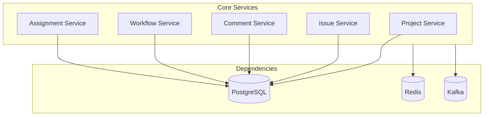
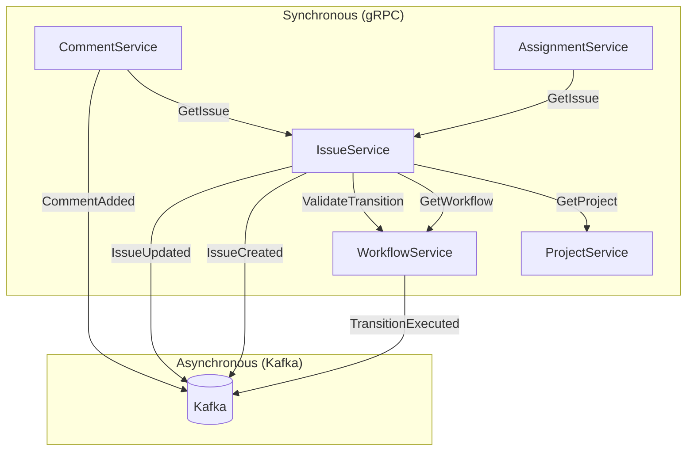
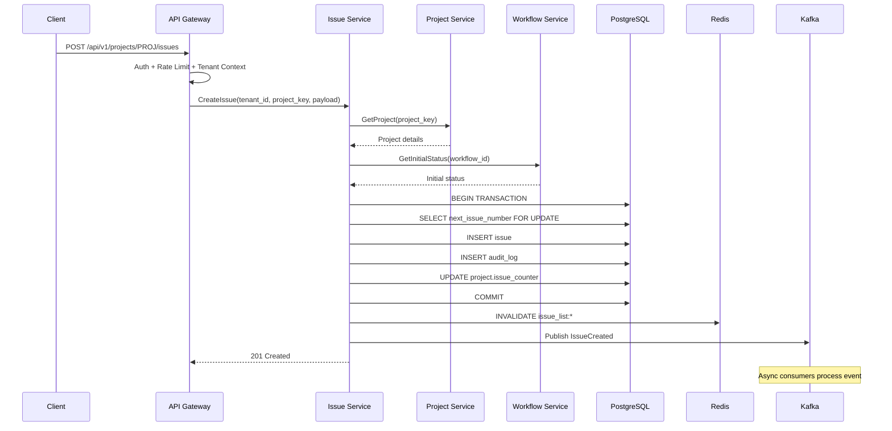
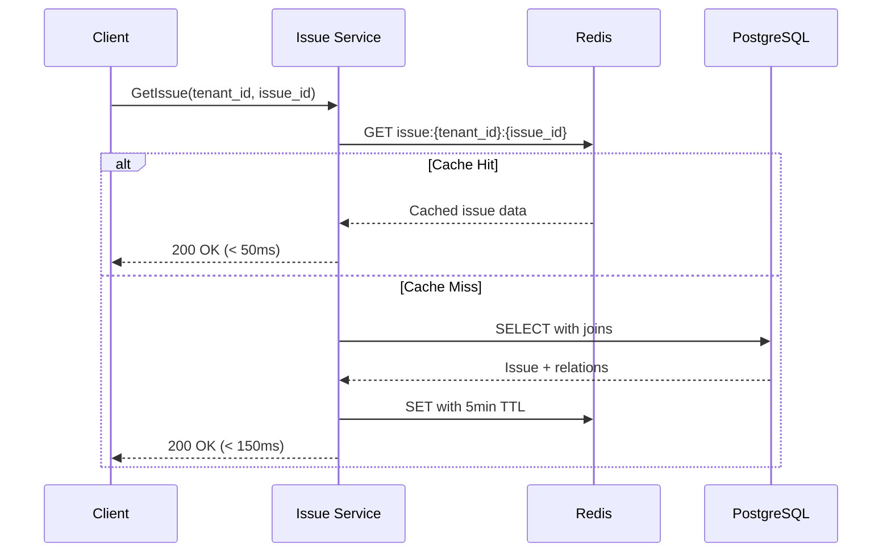
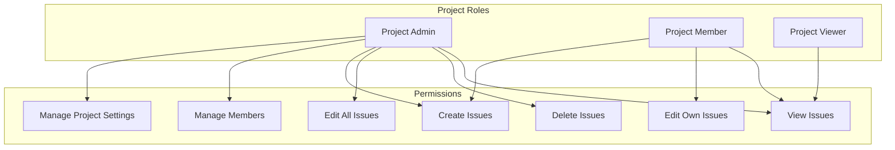
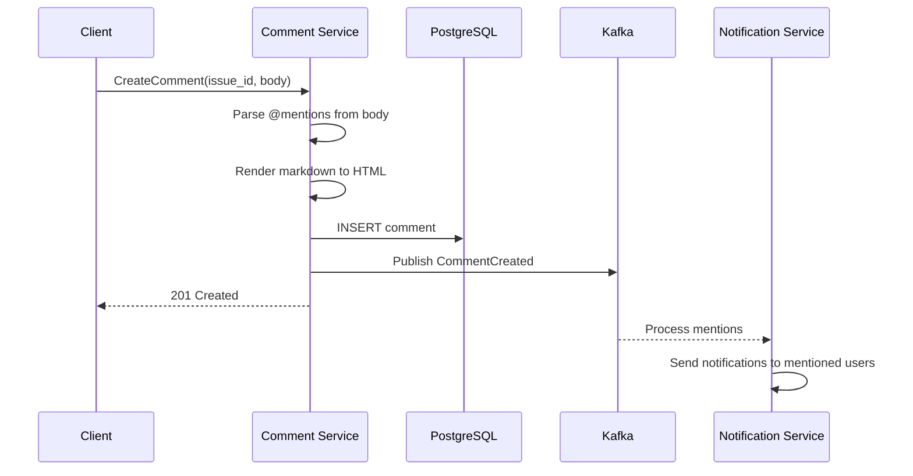
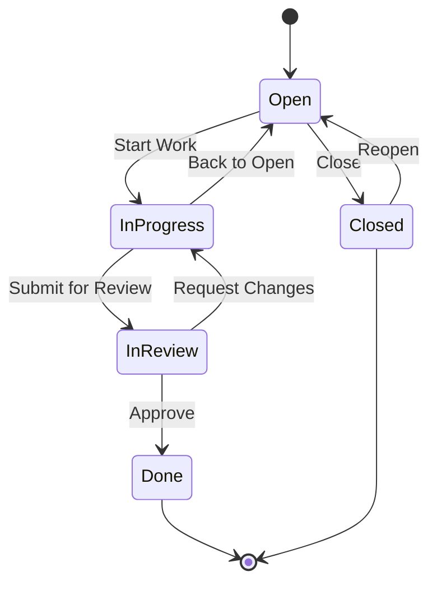
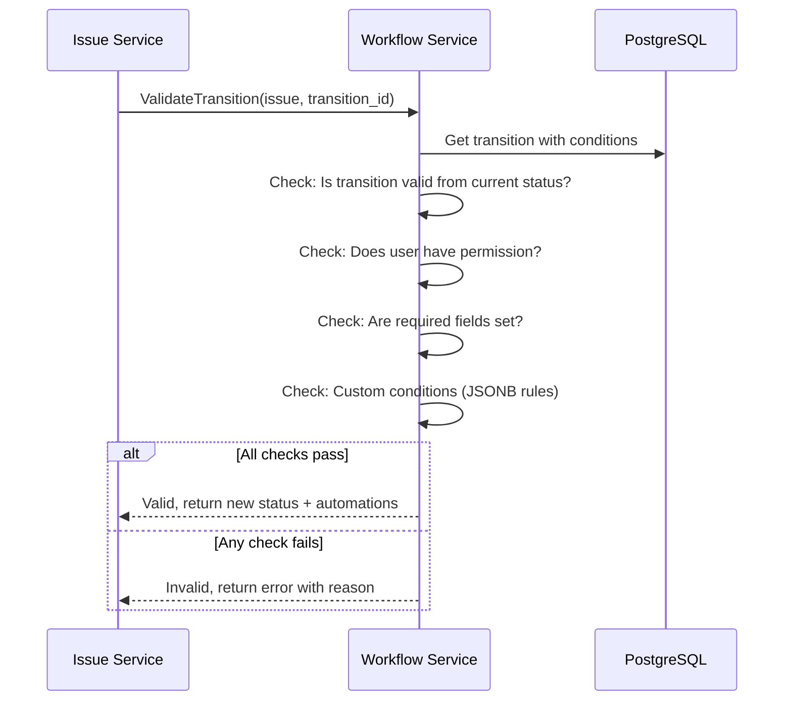
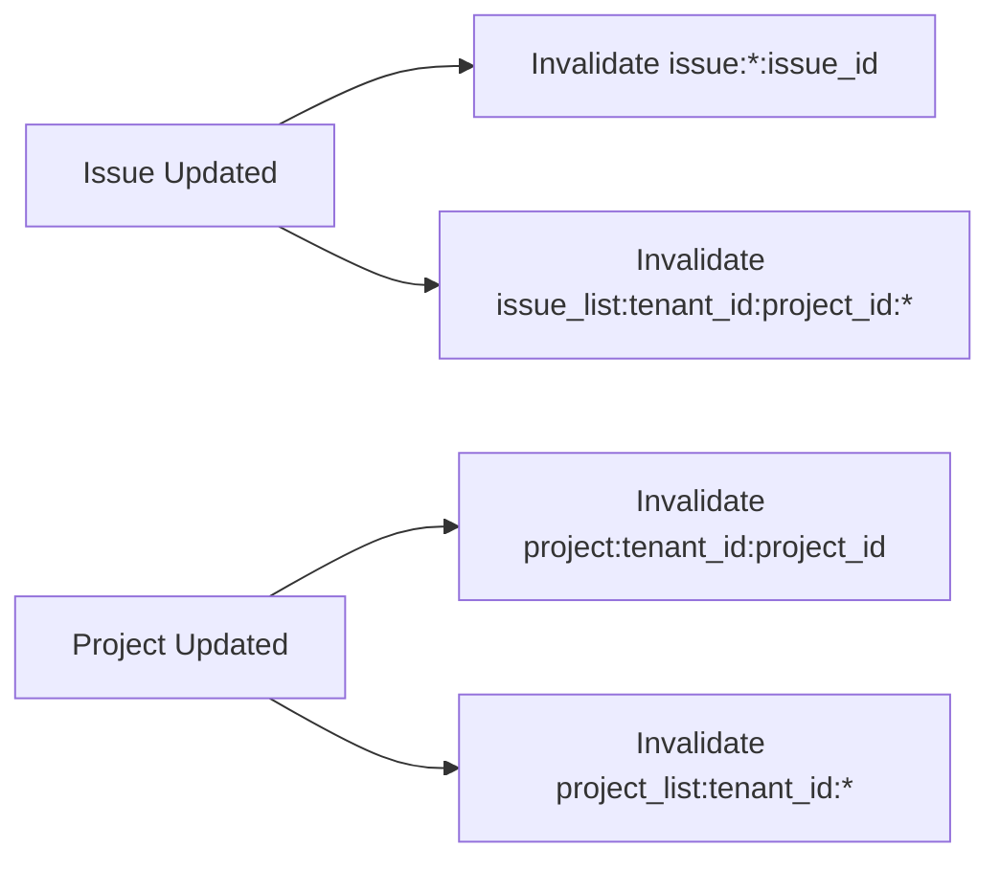

# Core Services Design

[← Back to README](./README.md) | [← Previous: Multi-Tenancy](./02-multi-tenancy-strategy.md)

## Service Overview



## Service Responsibilities

| Service | Responsibilities | Database | Cache Strategy |
|---------|-----------------|----------|----------------|
| **Project Service** | CRUD projects, members, permissions, settings | PostgreSQL | Write-through (5min TTL) |
| **Issue Service** | CRUD issues, attachments, labels, milestones | PostgreSQL | Write-behind, invalidation |
| **Comment Service** | Comments, mentions, reactions | PostgreSQL | Read-through (2min TTL) |
| **Workflow Service** | State machine, transitions, automations | PostgreSQL | Warm cache on startup |
| **Assignment Service** | Assignees, watchers, teams | PostgreSQL | Event-driven invalidation |

## Service Communication Patterns



---

## Issue Service (Core Service)

The Issue Service is the heart of the system, handling the most critical and frequent operations.

### Responsibilities

- Create, read, update, delete issues
- Manage issue attachments
- Handle labels and milestones
- Maintain issue hierarchy (parent/child, epics)
- Publish events for all changes

### Issue Create Flow



### Issue Read Flow (Optimized for p95 < 200ms)



### API Contracts

#### Create Issue

```http
POST /api/v1/projects/{project_key}/issues
Content-Type: application/json
Authorization: Bearer {token}

{
  "title": "Login button not working on Safari",
  "description": "Users report the login button is unresponsive on Safari 17...",
  "type": "bug",
  "priority": 2,
  "assignee_id": "user-uuid",
  "labels": ["frontend", "critical"],
  "due_date": "2026-01-20",
  "custom_fields": {
    "browser": "Safari 17.0",
    "os": "macOS Sonoma"
  }
}
```

#### Response

```json
{
  "id": "issue-uuid",
  "project_id": "project-uuid",
  "issue_number": 1234,
  "key": "PROJ-1234",
  "title": "Login button not working on Safari",
  "description": "Users report the login button is unresponsive...",
  "type": "bug",
  "priority": 2,
  "status": {
    "id": "status-uuid",
    "name": "Open",
    "category": "todo"
  },
  "reporter": {
    "id": "user-uuid",
    "name": "Jane Doe",
    "email": "jane@example.com",
    "avatar_url": "https://..."
  },
  "assignee": {
    "id": "user-uuid",
    "name": "John Smith",
    "email": "john@example.com",
    "avatar_url": "https://..."
  },
  "labels": ["frontend", "critical"],
  "due_date": "2026-01-20",
  "custom_fields": {
    "browser": "Safari 17.0",
    "os": "macOS Sonoma"
  },
  "created_at": "2026-01-12T10:30:00Z",
  "updated_at": "2026-01-12T10:30:00Z"
}
```

#### List Issues

```http
GET /api/v1/projects/{project_key}/issues?
  status=open,in_progress&
  assignee=me&
  priority=1,2&
  labels=critical&
  sort=-updated_at&
  page=1&
  limit=50
```

#### Update Issue

```http
PATCH /api/v1/issues/{issue_id}
Content-Type: application/json

{
  "status_id": "new-status-uuid",
  "assignee_id": "new-assignee-uuid",
  "priority": 1
}
```

#### Transition Issue (Workflow)

```http
POST /api/v1/issues/{issue_id}/transitions/{transition_id}
Content-Type: application/json

{
  "comment": "Moving to in progress",
  "fields": {
    "resolution": null
  }
}
```

---

## Project Service

### Responsibilities

- Manage projects (CRUD)
- Handle project members and permissions
- Configure project settings
- Manage project-level labels and milestones

### Project Permissions Model



### API Contracts

#### Create Project

```http
POST /api/v1/projects
Content-Type: application/json

{
  "key": "PROJ",
  "name": "My Project",
  "description": "Project description",
  "workflow_id": "workflow-uuid",
  "lead_id": "user-uuid"
}
```

#### Add Project Member

```http
POST /api/v1/projects/{project_id}/members
Content-Type: application/json

{
  "user_id": "user-uuid",
  "role": "member"
}
```

---

## Comment Service

### Responsibilities

- Create, update, delete comments
- Handle threaded replies
- Process @mentions
- Manage reactions

### Comment with Mentions Flow



### API Contracts

#### Create Comment

```http
POST /api/v1/issues/{issue_id}/comments
Content-Type: application/json

{
  "body": "I've looked into this. @john can you check the Safari logs?",
  "parent_id": null
}
```

#### Response

```json
{
  "id": "comment-uuid",
  "issue_id": "issue-uuid",
  "body": "I've looked into this. @john can you check the Safari logs?",
  "body_html": "<p>I've looked into this. <span class=\"mention\" data-user-id=\"john-uuid\">@john</span> can you check the Safari logs?</p>",
  "author": {
    "id": "user-uuid",
    "name": "Jane Doe",
    "avatar_url": "https://..."
  },
  "mentions": ["john-uuid"],
  "reactions": {},
  "created_at": "2026-01-12T11:00:00Z",
  "updated_at": "2026-01-12T11:00:00Z"
}
```

#### Add Reaction

```http
POST /api/v1/comments/{comment_id}/reactions
Content-Type: application/json

{
  "emoji": "👍"
}
```

---

## Workflow Service

### Responsibilities

- Define workflow states and transitions
- Validate state transitions
- Execute transition automations
- Enforce transition conditions

### Workflow State Machine



### Transition Validation Flow



### Transition Conditions Schema

```json
{
  "conditions": {
    "required_fields": ["resolution"],
    "permissions": ["project.issues.transition"],
    "custom_rules": [
      {
        "field": "priority",
        "operator": "lte",
        "value": 2
      }
    ]
  },
  "automations": {
    "set_fields": {
      "resolved_at": "{{now}}"
    },
    "add_labels": ["resolved"],
    "notify_users": ["reporter", "watchers"],
    "trigger_webhook": "on-issue-resolved"
  }
}
```

### API Contracts

#### Get Workflow

```http
GET /api/v1/workflows/{workflow_id}
```

#### Response

```json
{
  "id": "workflow-uuid",
  "name": "Default Bug Workflow",
  "statuses": [
    {
      "id": "status-1",
      "name": "Open",
      "category": "todo",
      "is_initial": true,
      "color": "#3498db"
    },
    {
      "id": "status-2",
      "name": "In Progress",
      "category": "in_progress",
      "color": "#f39c12"
    },
    {
      "id": "status-3",
      "name": "Done",
      "category": "done",
      "is_final": true,
      "color": "#27ae60"
    }
  ],
  "transitions": [
    {
      "id": "transition-1",
      "name": "Start Work",
      "from_status_id": "status-1",
      "to_status_id": "status-2"
    },
    {
      "id": "transition-2",
      "name": "Complete",
      "from_status_id": "status-2",
      "to_status_id": "status-3",
      "conditions": {
        "required_fields": ["resolution"]
      }
    }
  ]
}
```

#### Get Available Transitions

```http
GET /api/v1/issues/{issue_id}/transitions
```

```json
{
  "transitions": [
    {
      "id": "transition-2",
      "name": "Complete",
      "to_status": {
        "id": "status-3",
        "name": "Done"
      },
      "available": true,
      "conditions_met": true
    }
  ]
}
```

---

## Assignment Service

### Responsibilities

- Manage issue assignees
- Handle issue watchers
- Team-based assignments
- Auto-assignment rules

### API Contracts

#### Assign Issue

```http
PUT /api/v1/issues/{issue_id}/assignee
Content-Type: application/json

{
  "user_id": "user-uuid"
}
```

#### Add Watcher

```http
POST /api/v1/issues/{issue_id}/watchers
Content-Type: application/json

{
  "user_id": "user-uuid"
}
```

#### Get Watchers

```http
GET /api/v1/issues/{issue_id}/watchers
```

```json
{
  "watchers": [
    {
      "id": "user-uuid",
      "name": "Jane Doe",
      "email": "jane@example.com",
      "added_at": "2026-01-12T10:00:00Z"
    }
  ]
}
```

---

## Caching Strategies

### Cache Key Patterns

```
issue:{tenant_id}:{issue_id}              # Single issue
issue_list:{tenant_id}:{project_id}:{page} # Paginated list
project:{tenant_id}:{project_id}          # Project details
workflow:{workflow_id}                     # Workflow (tenant-agnostic)
user:{user_id}                            # User details
```

### Cache Invalidation



### Cache Configuration

| Entity | TTL | Strategy | Invalidation |
|--------|-----|----------|--------------|
| Issue | 5 min | Read-through | On update, delete |
| Issue List | 2 min | Read-through | On any issue change in project |
| Project | 5 min | Write-through | On update |
| Workflow | 1 hour | Warm on startup | On update |
| User | 10 min | Read-through | On update |

---

## Error Handling

### Standard Error Response

```json
{
  "error": {
    "code": "ISSUE_NOT_FOUND",
    "message": "Issue with ID 'xyz' not found",
    "details": {
      "issue_id": "xyz"
    },
    "request_id": "req-uuid",
    "documentation_url": "https://docs.tracker.com/errors/ISSUE_NOT_FOUND"
  }
}
```

### Error Codes

| Code | HTTP Status | Description |
|------|-------------|-------------|
| `ISSUE_NOT_FOUND` | 404 | Issue does not exist |
| `PROJECT_NOT_FOUND` | 404 | Project does not exist |
| `INVALID_TRANSITION` | 400 | Workflow transition not allowed |
| `PERMISSION_DENIED` | 403 | User lacks required permission |
| `VALIDATION_ERROR` | 400 | Request payload validation failed |
| `RATE_LIMITED` | 429 | Too many requests |
| `TENANT_SUSPENDED` | 403 | Tenant account is suspended |

## Next

[Data Modeling →](./04-data-modeling.md)
