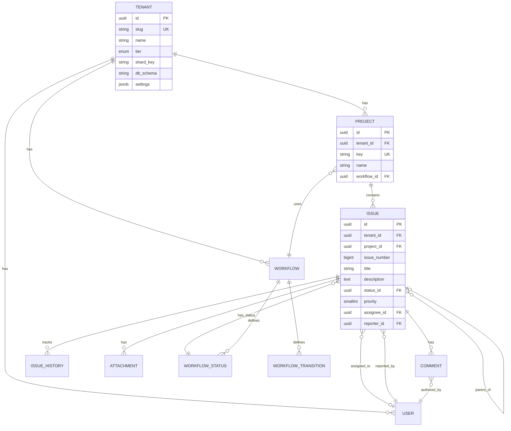
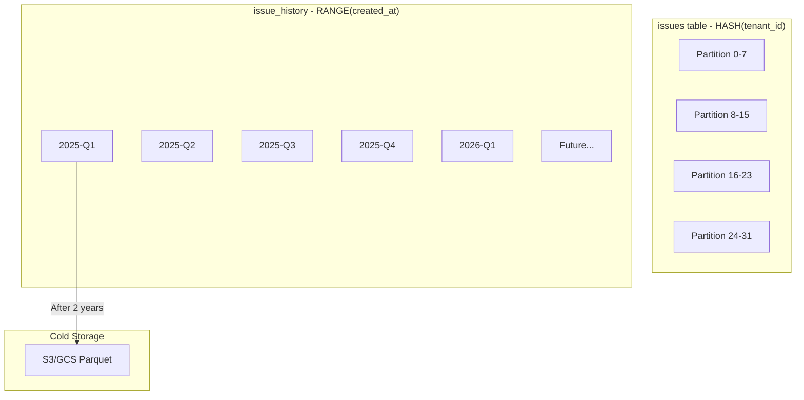

# Data Modeling

[← Back to README](./README.md) | [← Previous: Core Services](./03-core-services-design.md)

## Entity Relationship Diagram



---

## Core Schema Design

### Tenant Registry

```sql
-- ============================================
-- TENANT REGISTRY (Separate database)
-- ============================================

CREATE TABLE tenants (
    id UUID PRIMARY KEY DEFAULT gen_random_uuid(),
    slug VARCHAR(63) UNIQUE NOT NULL,
    name VARCHAR(255) NOT NULL,
    tier VARCHAR(20) NOT NULL DEFAULT 'free'
        CHECK (tier IN ('free', 'standard', 'enterprise')),
    status VARCHAR(20) NOT NULL DEFAULT 'active'
        CHECK (status IN ('active', 'suspended', 'deleted')),

    -- Routing information
    shard_key VARCHAR(16) NOT NULL,
    db_schema VARCHAR(63),  -- For enterprise: 'tenant_acme_corp'
    db_cluster VARCHAR(63),  -- For enterprise: 'enterprise-cluster-1'

    -- Configuration
    settings JSONB DEFAULT '{}',
    feature_flags JSONB DEFAULT '{}',
    limits JSONB DEFAULT '{
        "max_users": 10,
        "max_projects": 5,
        "max_issues": 10000,
        "api_rate_limit": 100
    }',

    -- Billing
    stripe_customer_id VARCHAR(255),
    plan_id VARCHAR(50),

    -- Timestamps
    created_at TIMESTAMPTZ DEFAULT NOW(),
    updated_at TIMESTAMPTZ DEFAULT NOW(),
    deleted_at TIMESTAMPTZ
);

CREATE INDEX idx_tenants_slug ON tenants(slug);
CREATE INDEX idx_tenants_tier ON tenants(tier);
CREATE INDEX idx_tenants_status ON tenants(status);
```

### Users

```sql
-- ============================================
-- USERS
-- ============================================

CREATE TABLE users (
    id UUID PRIMARY KEY DEFAULT gen_random_uuid(),
    tenant_id UUID NOT NULL REFERENCES tenants(id),
    email VARCHAR(255) NOT NULL,
    name VARCHAR(255) NOT NULL,
    avatar_url TEXT,
    role VARCHAR(50) NOT NULL DEFAULT 'member'
        CHECK (role IN ('owner', 'admin', 'member', 'viewer')),
    settings JSONB DEFAULT '{}',
    last_active_at TIMESTAMPTZ,
    created_at TIMESTAMPTZ DEFAULT NOW(),
    updated_at TIMESTAMPTZ DEFAULT NOW(),
    UNIQUE(tenant_id, email)
);

CREATE INDEX idx_users_tenant ON users(tenant_id);
CREATE INDEX idx_users_email ON users(tenant_id, email);
```

### Workflows

```sql
-- ============================================
-- WORKFLOWS
-- ============================================

CREATE TABLE workflows (
    id UUID PRIMARY KEY DEFAULT gen_random_uuid(),
    tenant_id UUID NOT NULL REFERENCES tenants(id),
    name VARCHAR(255) NOT NULL,
    description TEXT,
    is_default BOOLEAN DEFAULT FALSE,
    created_at TIMESTAMPTZ DEFAULT NOW(),
    updated_at TIMESTAMPTZ DEFAULT NOW(),
    UNIQUE(tenant_id, name)
);

CREATE TABLE workflow_statuses (
    id UUID PRIMARY KEY DEFAULT gen_random_uuid(),
    workflow_id UUID NOT NULL REFERENCES workflows(id) ON DELETE CASCADE,
    name VARCHAR(100) NOT NULL,
    category VARCHAR(20) NOT NULL
        CHECK (category IN ('todo', 'in_progress', 'done')),
    color VARCHAR(7),  -- Hex color code
    position SMALLINT NOT NULL,
    is_initial BOOLEAN DEFAULT FALSE,
    is_final BOOLEAN DEFAULT FALSE,
    created_at TIMESTAMPTZ DEFAULT NOW(),
    UNIQUE(workflow_id, name),
    UNIQUE(workflow_id, position)
);

CREATE TABLE workflow_transitions (
    id UUID PRIMARY KEY DEFAULT gen_random_uuid(),
    workflow_id UUID NOT NULL REFERENCES workflows(id) ON DELETE CASCADE,
    from_status_id UUID REFERENCES workflow_statuses(id),  -- NULL = any status
    to_status_id UUID NOT NULL REFERENCES workflow_statuses(id),
    name VARCHAR(100) NOT NULL,
    conditions JSONB DEFAULT '{}',   -- Permission rules, field requirements
    automations JSONB DEFAULT '{}',  -- Actions on transition
    created_at TIMESTAMPTZ DEFAULT NOW()
);

CREATE INDEX idx_transitions_from ON workflow_transitions(from_status_id);
CREATE INDEX idx_transitions_to ON workflow_transitions(to_status_id);
```

### Projects

```sql
-- ============================================
-- PROJECTS
-- ============================================

CREATE TABLE projects (
    id UUID PRIMARY KEY DEFAULT gen_random_uuid(),
    tenant_id UUID NOT NULL REFERENCES tenants(id),
    key VARCHAR(10) NOT NULL,  -- e.g., "PROJ", "BUG"
    name VARCHAR(255) NOT NULL,
    description TEXT,
    workflow_id UUID NOT NULL REFERENCES workflows(id),
    lead_id UUID REFERENCES users(id),
    issue_counter BIGINT DEFAULT 0,  -- For sequential issue numbers
    settings JSONB DEFAULT '{}',
    archived_at TIMESTAMPTZ,
    created_at TIMESTAMPTZ DEFAULT NOW(),
    updated_at TIMESTAMPTZ DEFAULT NOW(),
    UNIQUE(tenant_id, key)
);

CREATE INDEX idx_projects_tenant ON projects(tenant_id);
```

### Issues (Partitioned)

```sql
-- ============================================
-- ISSUES (Partitioned by tenant_id for performance)
-- ============================================

CREATE TABLE issues (
    id UUID NOT NULL DEFAULT gen_random_uuid(),
    tenant_id UUID NOT NULL,
    project_id UUID NOT NULL,
    issue_number BIGINT NOT NULL,  -- Per-project sequential (PROJ-123)

    -- Core fields
    title VARCHAR(500) NOT NULL,
    description TEXT,
    description_html TEXT,  -- Pre-rendered for performance

    -- Classification
    issue_type VARCHAR(50) NOT NULL DEFAULT 'task'
        CHECK (issue_type IN ('bug', 'task', 'story', 'epic', 'subtask')),
    priority SMALLINT NOT NULL DEFAULT 3 CHECK (priority BETWEEN 1 AND 5),

    -- Status
    status_id UUID NOT NULL,
    resolution VARCHAR(50),  -- 'fixed', 'wontfix', 'duplicate', etc.

    -- People
    reporter_id UUID NOT NULL,
    assignee_id UUID,

    -- Hierarchy
    parent_issue_id UUID,
    epic_id UUID,

    -- Metadata
    labels JSONB DEFAULT '[]',
    custom_fields JSONB DEFAULT '{}',

    -- Planning
    due_date DATE,
    estimated_hours DECIMAL(10,2),
    story_points SMALLINT,
    sprint_id UUID,

    -- Timestamps
    created_at TIMESTAMPTZ DEFAULT NOW(),
    updated_at TIMESTAMPTZ DEFAULT NOW(),
    resolved_at TIMESTAMPTZ,

    -- Constraints
    PRIMARY KEY (id, tenant_id),
    UNIQUE(project_id, issue_number)
) PARTITION BY HASH (tenant_id);

-- Create 32 partitions for even distribution
CREATE TABLE issues_p0 PARTITION OF issues FOR VALUES WITH (MODULUS 32, REMAINDER 0);
CREATE TABLE issues_p1 PARTITION OF issues FOR VALUES WITH (MODULUS 32, REMAINDER 1);
CREATE TABLE issues_p2 PARTITION OF issues FOR VALUES WITH (MODULUS 32, REMAINDER 2);
CREATE TABLE issues_p3 PARTITION OF issues FOR VALUES WITH (MODULUS 32, REMAINDER 3);
CREATE TABLE issues_p4 PARTITION OF issues FOR VALUES WITH (MODULUS 32, REMAINDER 4);
CREATE TABLE issues_p5 PARTITION OF issues FOR VALUES WITH (MODULUS 32, REMAINDER 5);
CREATE TABLE issues_p6 PARTITION OF issues FOR VALUES WITH (MODULUS 32, REMAINDER 6);
CREATE TABLE issues_p7 PARTITION OF issues FOR VALUES WITH (MODULUS 32, REMAINDER 7);
CREATE TABLE issues_p8 PARTITION OF issues FOR VALUES WITH (MODULUS 32, REMAINDER 8);
CREATE TABLE issues_p9 PARTITION OF issues FOR VALUES WITH (MODULUS 32, REMAINDER 9);
CREATE TABLE issues_p10 PARTITION OF issues FOR VALUES WITH (MODULUS 32, REMAINDER 10);
CREATE TABLE issues_p11 PARTITION OF issues FOR VALUES WITH (MODULUS 32, REMAINDER 11);
CREATE TABLE issues_p12 PARTITION OF issues FOR VALUES WITH (MODULUS 32, REMAINDER 12);
CREATE TABLE issues_p13 PARTITION OF issues FOR VALUES WITH (MODULUS 32, REMAINDER 13);
CREATE TABLE issues_p14 PARTITION OF issues FOR VALUES WITH (MODULUS 32, REMAINDER 14);
CREATE TABLE issues_p15 PARTITION OF issues FOR VALUES WITH (MODULUS 32, REMAINDER 15);
CREATE TABLE issues_p16 PARTITION OF issues FOR VALUES WITH (MODULUS 32, REMAINDER 16);
CREATE TABLE issues_p17 PARTITION OF issues FOR VALUES WITH (MODULUS 32, REMAINDER 17);
CREATE TABLE issues_p18 PARTITION OF issues FOR VALUES WITH (MODULUS 32, REMAINDER 18);
CREATE TABLE issues_p19 PARTITION OF issues FOR VALUES WITH (MODULUS 32, REMAINDER 19);
CREATE TABLE issues_p20 PARTITION OF issues FOR VALUES WITH (MODULUS 32, REMAINDER 20);
CREATE TABLE issues_p21 PARTITION OF issues FOR VALUES WITH (MODULUS 32, REMAINDER 21);
CREATE TABLE issues_p22 PARTITION OF issues FOR VALUES WITH (MODULUS 32, REMAINDER 22);
CREATE TABLE issues_p23 PARTITION OF issues FOR VALUES WITH (MODULUS 32, REMAINDER 23);
CREATE TABLE issues_p24 PARTITION OF issues FOR VALUES WITH (MODULUS 32, REMAINDER 24);
CREATE TABLE issues_p25 PARTITION OF issues FOR VALUES WITH (MODULUS 32, REMAINDER 25);
CREATE TABLE issues_p26 PARTITION OF issues FOR VALUES WITH (MODULUS 32, REMAINDER 26);
CREATE TABLE issues_p27 PARTITION OF issues FOR VALUES WITH (MODULUS 32, REMAINDER 27);
CREATE TABLE issues_p28 PARTITION OF issues FOR VALUES WITH (MODULUS 32, REMAINDER 28);
CREATE TABLE issues_p29 PARTITION OF issues FOR VALUES WITH (MODULUS 32, REMAINDER 29);
CREATE TABLE issues_p30 PARTITION OF issues FOR VALUES WITH (MODULUS 32, REMAINDER 30);
CREATE TABLE issues_p31 PARTITION OF issues FOR VALUES WITH (MODULUS 32, REMAINDER 31);
```

### Issue History (Time-Partitioned)

```sql
-- ============================================
-- ISSUE HISTORY (Audit Trail) - Partitioned by time
-- ============================================

CREATE TABLE issue_history (
    id UUID NOT NULL DEFAULT gen_random_uuid(),
    tenant_id UUID NOT NULL,
    issue_id UUID NOT NULL,
    user_id UUID NOT NULL,

    field_name VARCHAR(100) NOT NULL,
    old_value JSONB,
    new_value JSONB,
    change_type VARCHAR(20) NOT NULL
        CHECK (change_type IN ('create', 'update', 'delete')),

    -- Request context for debugging
    request_id UUID,
    ip_address INET,
    user_agent TEXT,

    created_at TIMESTAMPTZ NOT NULL DEFAULT NOW(),

    PRIMARY KEY (id, created_at)
) PARTITION BY RANGE (created_at);

-- Create quarterly partitions
CREATE TABLE issue_history_2025_q1 PARTITION OF issue_history
    FOR VALUES FROM ('2025-01-01') TO ('2025-04-01');
CREATE TABLE issue_history_2025_q2 PARTITION OF issue_history
    FOR VALUES FROM ('2025-04-01') TO ('2025-07-01');
CREATE TABLE issue_history_2025_q3 PARTITION OF issue_history
    FOR VALUES FROM ('2025-07-01') TO ('2025-10-01');
CREATE TABLE issue_history_2025_q4 PARTITION OF issue_history
    FOR VALUES FROM ('2025-10-01') TO ('2026-01-01');
CREATE TABLE issue_history_2026_q1 PARTITION OF issue_history
    FOR VALUES FROM ('2026-01-01') TO ('2026-04-01');
CREATE TABLE issue_history_2026_q2 PARTITION OF issue_history
    FOR VALUES FROM ('2026-04-01') TO ('2026-07-01');
```

### Comments

```sql
-- ============================================
-- COMMENTS
-- ============================================

CREATE TABLE comments (
    id UUID PRIMARY KEY DEFAULT gen_random_uuid(),
    tenant_id UUID NOT NULL,
    issue_id UUID NOT NULL,
    parent_id UUID REFERENCES comments(id),  -- For threaded comments

    author_id UUID NOT NULL,
    body TEXT NOT NULL,
    body_html TEXT,  -- Pre-rendered markdown

    mentions UUID[] DEFAULT '{}',  -- User IDs mentioned
    reactions JSONB DEFAULT '{}',  -- {"👍": ["user1", "user2"]}

    is_internal BOOLEAN DEFAULT FALSE,  -- Internal notes
    is_resolution BOOLEAN DEFAULT FALSE,  -- Resolution comment

    edited_at TIMESTAMPTZ,
    created_at TIMESTAMPTZ DEFAULT NOW(),
    updated_at TIMESTAMPTZ DEFAULT NOW(),
    deleted_at TIMESTAMPTZ  -- Soft delete
);

CREATE INDEX idx_comments_issue ON comments(issue_id, created_at);
CREATE INDEX idx_comments_author ON comments(author_id);
```

### Attachments

```sql
-- ============================================
-- ATTACHMENTS
-- ============================================

CREATE TABLE attachments (
    id UUID PRIMARY KEY DEFAULT gen_random_uuid(),
    tenant_id UUID NOT NULL,
    issue_id UUID NOT NULL,
    comment_id UUID REFERENCES comments(id),

    uploader_id UUID NOT NULL,
    filename VARCHAR(255) NOT NULL,
    content_type VARCHAR(100) NOT NULL,
    size_bytes BIGINT NOT NULL,
    storage_key TEXT NOT NULL,  -- S3/GCS path

    thumbnail_key TEXT,  -- For images
    metadata JSONB DEFAULT '{}',  -- dimensions, duration, etc.

    created_at TIMESTAMPTZ DEFAULT NOW(),
    deleted_at TIMESTAMPTZ
);

CREATE INDEX idx_attachments_issue ON attachments(issue_id);
```

### Labels

```sql
-- ============================================
-- LABELS
-- ============================================

CREATE TABLE labels (
    id UUID PRIMARY KEY DEFAULT gen_random_uuid(),
    tenant_id UUID NOT NULL,
    project_id UUID REFERENCES projects(id),  -- NULL = org-wide label

    name VARCHAR(100) NOT NULL,
    color VARCHAR(7) NOT NULL,  -- Hex color
    description TEXT,

    created_at TIMESTAMPTZ DEFAULT NOW(),
    UNIQUE(tenant_id, project_id, name)
);
```

---

## Partitioning Strategy



### Why HASH Partitioning for Issues?

| Factor | HASH Partitioning | RANGE Partitioning |
|--------|-------------------|-------------------|
| Query pattern | Tenant-scoped queries | Time-range queries |
| Data distribution | Even across partitions | Can be skewed |
| Partition pruning | Yes, with tenant_id | Yes, with time range |
| Hotspot avoidance | Prevents whale tenant hotspots | N/A |

### Why RANGE Partitioning for History?

| Factor | Benefit |
|--------|---------|
| Time-based queries | Efficient for "last 30 days" queries |
| Data lifecycle | Easy to archive old partitions |
| Maintenance | Drop old partitions without affecting new data |
| Write performance | All writes go to latest partition |

---

## Indexes

```sql
-- ============================================
-- INDEXES FOR COMMON QUERY PATTERNS
-- ============================================

-- Issue list queries (most common)
CREATE INDEX idx_issues_tenant_project ON issues(tenant_id, project_id);
CREATE INDEX idx_issues_tenant_status ON issues(tenant_id, status_id);
CREATE INDEX idx_issues_tenant_assignee ON issues(tenant_id, assignee_id)
    WHERE assignee_id IS NOT NULL;
CREATE INDEX idx_issues_tenant_updated ON issues(tenant_id, updated_at DESC);
CREATE INDEX idx_issues_tenant_created ON issues(tenant_id, created_at DESC);

-- Filter by type and priority
CREATE INDEX idx_issues_type ON issues(tenant_id, issue_type);
CREATE INDEX idx_issues_priority ON issues(tenant_id, priority)
    WHERE priority <= 2;  -- High priority issues

-- Hierarchy queries
CREATE INDEX idx_issues_parent ON issues(parent_issue_id)
    WHERE parent_issue_id IS NOT NULL;
CREATE INDEX idx_issues_epic ON issues(epic_id)
    WHERE epic_id IS NOT NULL;

-- Full-text search fallback (when Elasticsearch is down)
CREATE INDEX idx_issues_title_gin ON issues
    USING gin(to_tsvector('english', title));
CREATE INDEX idx_issues_description_gin ON issues
    USING gin(to_tsvector('english', description))
    WHERE description IS NOT NULL;

-- History queries
CREATE INDEX idx_history_issue ON issue_history(issue_id, created_at DESC);
CREATE INDEX idx_history_user ON issue_history(user_id, created_at DESC);
CREATE INDEX idx_history_tenant ON issue_history(tenant_id, created_at DESC);
```

### Index Analysis

| Index | Query Pattern | Expected Improvement |
|-------|---------------|---------------------|
| `idx_issues_tenant_project` | List issues by project | 100x |
| `idx_issues_tenant_assignee` | My assigned issues | 50x |
| `idx_issues_tenant_updated` | Recent activity | 20x |
| `idx_issues_title_gin` | Full-text search fallback | 10x |

---

## Row-Level Security (RLS)

```sql
-- Enable RLS on all tenant-scoped tables
ALTER TABLE issues ENABLE ROW LEVEL SECURITY;
ALTER TABLE issues FORCE ROW LEVEL SECURITY;

ALTER TABLE comments ENABLE ROW LEVEL SECURITY;
ALTER TABLE comments FORCE ROW LEVEL SECURITY;

ALTER TABLE projects ENABLE ROW LEVEL SECURITY;
ALTER TABLE projects FORCE ROW LEVEL SECURITY;

ALTER TABLE issue_history ENABLE ROW LEVEL SECURITY;
ALTER TABLE issue_history FORCE ROW LEVEL SECURITY;

-- Create isolation policies
CREATE POLICY tenant_isolation_issues ON issues
    FOR ALL
    USING (tenant_id = current_setting('app.current_tenant', true)::uuid);

CREATE POLICY tenant_isolation_comments ON comments
    FOR ALL
    USING (tenant_id = current_setting('app.current_tenant', true)::uuid);

CREATE POLICY tenant_isolation_projects ON projects
    FOR ALL
    USING (tenant_id = current_setting('app.current_tenant', true)::uuid);

CREATE POLICY tenant_isolation_history ON issue_history
    FOR ALL
    USING (tenant_id = current_setting('app.current_tenant', true)::uuid);

-- Admin bypass for migrations
CREATE POLICY admin_bypass_issues ON issues
    FOR ALL
    TO admin_role
    USING (true);
```

---

## Issue Number Generation

Sequential issue numbers (PROJ-123) require atomic generation:

```sql
-- Atomic issue number generation using advisory locks
CREATE OR REPLACE FUNCTION next_issue_number(p_project_id UUID)
RETURNS BIGINT AS $$
DECLARE
    v_next_number BIGINT;
BEGIN
    -- Acquire advisory lock for this project
    PERFORM pg_advisory_xact_lock(hashtext(p_project_id::text));

    -- Increment and return
    UPDATE projects
    SET issue_counter = issue_counter + 1,
        updated_at = NOW()
    WHERE id = p_project_id
    RETURNING issue_counter INTO v_next_number;

    RETURN v_next_number;
END;
$$ LANGUAGE plpgsql;

-- Usage in application:
-- SELECT next_issue_number('project-uuid') as issue_number;
```

### Alternative: Optimistic Locking

For high-throughput projects, use optimistic locking:

```sql
-- Optimistic approach with retry
CREATE OR REPLACE FUNCTION next_issue_number_optimistic(
    p_project_id UUID,
    p_max_retries INT DEFAULT 5
)
RETURNS BIGINT AS $$
DECLARE
    v_current BIGINT;
    v_next BIGINT;
    v_retries INT := 0;
BEGIN
    LOOP
        -- Read current value
        SELECT issue_counter INTO v_current
        FROM projects WHERE id = p_project_id;

        v_next := v_current + 1;

        -- Attempt update with version check
        UPDATE projects
        SET issue_counter = v_next,
            updated_at = NOW()
        WHERE id = p_project_id
          AND issue_counter = v_current;

        IF FOUND THEN
            RETURN v_next;
        END IF;

        v_retries := v_retries + 1;
        IF v_retries >= p_max_retries THEN
            RAISE EXCEPTION 'Failed to acquire issue number after % retries', p_max_retries;
        END IF;

        -- Brief pause before retry
        PERFORM pg_sleep(0.01 * v_retries);
    END LOOP;
END;
$$ LANGUAGE plpgsql;
```

---

## Data Types Reference

### Priority Levels

| Value | Name | Description |
|-------|------|-------------|
| 1 | Critical | System down, major impact |
| 2 | High | Significant impact, workaround exists |
| 3 | Medium | Moderate impact (default) |
| 4 | Low | Minor impact |
| 5 | Lowest | Nice to have |

### Issue Types

| Type | Description | Icon |
|------|-------------|------|
| `bug` | Software defect | 🐛 |
| `task` | Work item | ✅ |
| `story` | User story | 📖 |
| `epic` | Large feature | ⚡ |
| `subtask` | Child of another issue | 📎 |

### Status Categories

| Category | Description | Color |
|----------|-------------|-------|
| `todo` | Not started | Blue |
| `in_progress` | Being worked on | Yellow |
| `done` | Completed | Green |

---

## Next

[Search Infrastructure →](./05-search-infrastructure.md)
