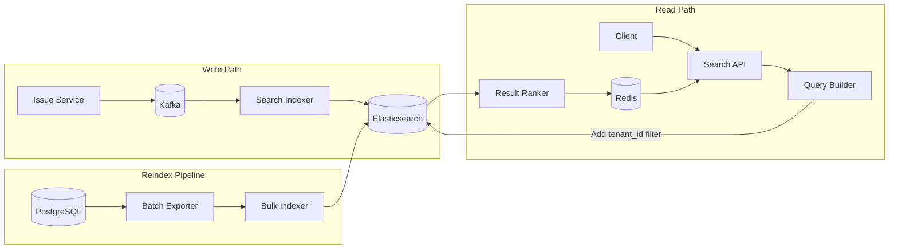
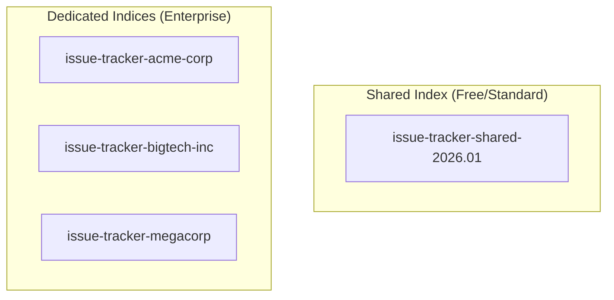
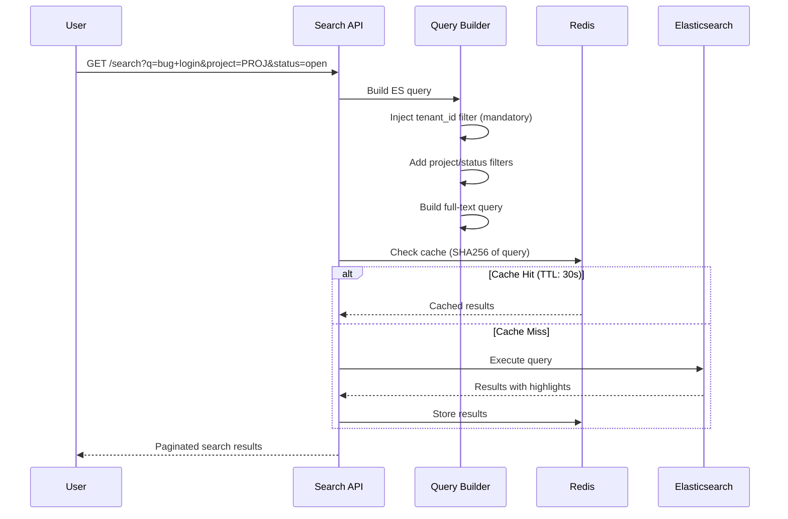
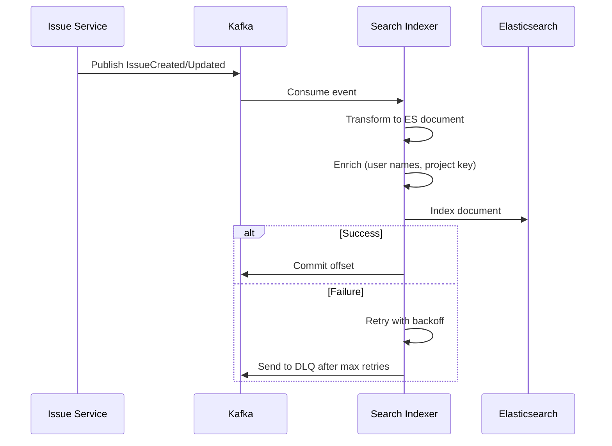
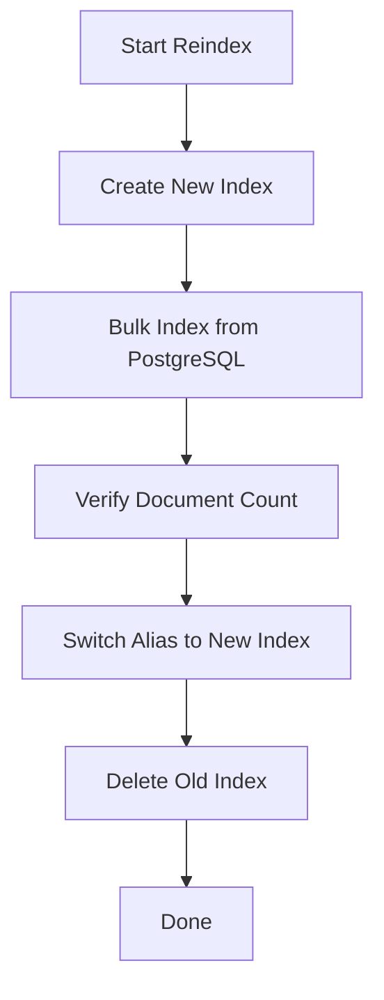

# Search Infrastructure

[← Back to README](./README.md) | [← Previous: Data Modeling](./04-data-modeling.md)

## Search Requirements

| Requirement | Target | Notes |
|-------------|--------|-------|
| Search latency p95 | < 500ms | Including network |
| Indexing lag | < 5 seconds | From write to searchable |
| Query types | Full-text, filters, facets | Boolean, phrase, fuzzy |
| Result freshness | Near real-time | Eventual consistency acceptable |

## Search Architecture



---

## Elasticsearch Index Design

### Index Settings

```json
{
  "settings": {
    "number_of_shards": 10,
    "number_of_replicas": 2,
    "refresh_interval": "1s",
    "index.max_result_window": 10000,
    "analysis": {
      "analyzer": {
        "autocomplete": {
          "type": "custom",
          "tokenizer": "standard",
          "filter": ["lowercase", "autocomplete_filter"]
        },
        "autocomplete_search": {
          "type": "custom",
          "tokenizer": "standard",
          "filter": ["lowercase"]
        },
        "code_analyzer": {
          "type": "custom",
          "tokenizer": "standard",
          "filter": ["lowercase", "word_delimiter_graph"]
        }
      },
      "filter": {
        "autocomplete_filter": {
          "type": "edge_ngram",
          "min_gram": 2,
          "max_gram": 20
        }
      }
    }
  }
}
```

### Index Mappings

```json
{
  "mappings": {
    "properties": {
      "tenant_id": {
        "type": "keyword",
        "doc_values": true
      },
      "project_id": {
        "type": "keyword",
        "doc_values": true
      },
      "project_key": {
        "type": "keyword"
      },
      "issue_number": {
        "type": "long"
      },
      "issue_key": {
        "type": "keyword"
      },
      "title": {
        "type": "text",
        "analyzer": "english",
        "fields": {
          "keyword": {
            "type": "keyword",
            "ignore_above": 500
          },
          "autocomplete": {
            "type": "text",
            "analyzer": "autocomplete",
            "search_analyzer": "autocomplete_search"
          }
        }
      },
      "description": {
        "type": "text",
        "analyzer": "english"
      },
      "status": {
        "type": "keyword"
      },
      "status_category": {
        "type": "keyword"
      },
      "issue_type": {
        "type": "keyword"
      },
      "priority": {
        "type": "integer"
      },
      "labels": {
        "type": "keyword"
      },
      "assignee_id": {
        "type": "keyword"
      },
      "assignee_name": {
        "type": "text",
        "fields": {
          "keyword": { "type": "keyword" }
        }
      },
      "reporter_id": {
        "type": "keyword"
      },
      "reporter_name": {
        "type": "text",
        "fields": {
          "keyword": { "type": "keyword" }
        }
      },
      "created_at": {
        "type": "date"
      },
      "updated_at": {
        "type": "date"
      },
      "resolved_at": {
        "type": "date"
      },
      "due_date": {
        "type": "date"
      },
      "custom_fields": {
        "type": "object",
        "enabled": true
      },
      "comments": {
        "type": "nested",
        "properties": {
          "id": { "type": "keyword" },
          "body": { "type": "text", "analyzer": "english" },
          "author_id": { "type": "keyword" },
          "created_at": { "type": "date" }
        }
      }
    }
  }
}
```

---

## Index Strategy

### Per-Tenant vs Shared Index



| Tenant Tier | Index Strategy | Rationale |
|-------------|----------------|-----------|
| Free/Standard | Shared index with `tenant_id` filter | Cost efficient, good isolation via query |
| Enterprise | Dedicated index per tenant | Complete isolation, custom settings, compliance |

### Index Naming Convention

```
issue-tracker-{scope}-{date}

Examples:
- issue-tracker-shared-2026.01      # Shared monthly index
- issue-tracker-acme-corp           # Enterprise dedicated
- issue-tracker-shared-2026.02      # Next month's shared
```

### Index Lifecycle Management (ILM)

```json
{
  "policy": {
    "phases": {
      "hot": {
        "actions": {
          "rollover": {
            "max_size": "50gb",
            "max_age": "30d"
          }
        }
      },
      "warm": {
        "min_age": "30d",
        "actions": {
          "shrink": { "number_of_shards": 2 },
          "forcemerge": { "max_num_segments": 1 },
          "allocate": {
            "require": { "data": "warm" }
          }
        }
      },
      "delete": {
        "min_age": "365d",
        "actions": {
          "delete": {}
        }
      }
    }
  }
}
```

---

## Search Query Flow



---

## Query Examples

### Basic Full-Text Search

```json
{
  "query": {
    "bool": {
      "filter": [
        { "term": { "tenant_id": "tenant-uuid" } }
      ],
      "must": [
        {
          "multi_match": {
            "query": "login button not working",
            "fields": ["title^3", "description", "comments.body"],
            "type": "best_fields",
            "fuzziness": "AUTO"
          }
        }
      ]
    }
  },
  "highlight": {
    "fields": {
      "title": {},
      "description": { "fragment_size": 150 }
    }
  },
  "from": 0,
  "size": 20
}
```

### Filtered Search

```json
{
  "query": {
    "bool": {
      "filter": [
        { "term": { "tenant_id": "tenant-uuid" } },
        { "term": { "project_key": "PROJ" } },
        { "term": { "status_category": "todo" } },
        { "terms": { "priority": [1, 2] } },
        { "terms": { "labels": ["critical", "frontend"] } }
      ],
      "must": [
        {
          "multi_match": {
            "query": "login",
            "fields": ["title^3", "description"]
          }
        }
      ]
    }
  },
  "sort": [
    { "_score": "desc" },
    { "updated_at": "desc" }
  ]
}
```

### Autocomplete Search

```json
{
  "query": {
    "bool": {
      "filter": [
        { "term": { "tenant_id": "tenant-uuid" } }
      ],
      "must": [
        {
          "match": {
            "title.autocomplete": {
              "query": "log",
              "operator": "and"
            }
          }
        }
      ]
    }
  },
  "_source": ["issue_key", "title", "status"],
  "size": 10
}
```

### Search with Facets (Aggregations)

```json
{
  "query": {
    "bool": {
      "filter": [
        { "term": { "tenant_id": "tenant-uuid" } },
        { "term": { "project_key": "PROJ" } }
      ],
      "must": [
        { "match": { "title": "bug" } }
      ]
    }
  },
  "aggs": {
    "by_status": {
      "terms": { "field": "status", "size": 10 }
    },
    "by_assignee": {
      "terms": { "field": "assignee_id", "size": 10 }
    },
    "by_priority": {
      "terms": { "field": "priority", "size": 5 }
    },
    "by_label": {
      "terms": { "field": "labels", "size": 20 }
    }
  },
  "size": 0
}
```

### Nested Comment Search

```json
{
  "query": {
    "bool": {
      "filter": [
        { "term": { "tenant_id": "tenant-uuid" } }
      ],
      "must": [
        {
          "nested": {
            "path": "comments",
            "query": {
              "match": {
                "comments.body": "workaround"
              }
            },
            "inner_hits": {
              "highlight": {
                "fields": {
                  "comments.body": {}
                }
              }
            }
          }
        }
      ]
    }
  }
}
```

---

## Write Path (Indexing)

### Event-Driven Indexing



### Search Indexer Implementation

```go
type SearchIndexer struct {
    consumer *kafka.Consumer
    esClient *elasticsearch.Client
    enricher *Enricher
}

func (si *SearchIndexer) ProcessEvent(event IssueEvent) error {
    // Transform event to ES document
    doc := si.transformToDocument(event)

    // Enrich with denormalized data
    doc = si.enricher.Enrich(doc, event)

    // Determine index name
    indexName := si.getIndexName(event.TenantID, event.TenantTier)

    // Index document
    _, err := si.esClient.Index(
        indexName,
        esutil.NewJSONReader(doc),
        si.esClient.Index.WithDocumentID(event.IssueID),
        si.esClient.Index.WithRefresh("false"), // Don't force refresh
    )

    return err
}

func (si *SearchIndexer) transformToDocument(event IssueEvent) map[string]interface{} {
    return map[string]interface{}{
        "tenant_id":    event.TenantID,
        "project_id":   event.ProjectID,
        "project_key":  event.ProjectKey,
        "issue_number": event.IssueNumber,
        "issue_key":    fmt.Sprintf("%s-%d", event.ProjectKey, event.IssueNumber),
        "title":        event.Title,
        "description":  event.Description,
        "status":       event.Status,
        "priority":     event.Priority,
        "labels":       event.Labels,
        "assignee_id":  event.AssigneeID,
        "reporter_id":  event.ReporterID,
        "created_at":   event.CreatedAt,
        "updated_at":   event.UpdatedAt,
    }
}
```

### Bulk Indexing for Backfill

```go
func (si *SearchIndexer) BulkIndex(issues []Issue) error {
    bi, err := esutil.NewBulkIndexer(esutil.BulkIndexerConfig{
        Client:        si.esClient,
        NumWorkers:    4,
        FlushBytes:    5 * 1024 * 1024, // 5MB
        FlushInterval: 30 * time.Second,
    })
    if err != nil {
        return err
    }
    defer bi.Close(context.Background())

    for _, issue := range issues {
        doc := si.transformIssue(issue)
        data, _ := json.Marshal(doc)

        bi.Add(context.Background(), esutil.BulkIndexerItem{
            Action:     "index",
            Index:      si.getIndexName(issue.TenantID, issue.TenantTier),
            DocumentID: issue.ID,
            Body:       bytes.NewReader(data),
        })
    }

    return nil
}
```

---

## Fallback to Database Search

When Elasticsearch is degraded, fallback to PostgreSQL full-text search:

### Fallback Detection

```go
func (s *SearchService) Search(ctx context.Context, req SearchRequest) (*SearchResult, error) {
    // Check circuit breaker
    if s.esCircuitBreaker.IsOpen() {
        return s.searchDatabase(ctx, req)
    }

    result, err := s.searchElasticsearch(ctx, req)
    if err != nil {
        s.esCircuitBreaker.RecordFailure()

        // Fallback to database
        return s.searchDatabase(ctx, req)
    }

    s.esCircuitBreaker.RecordSuccess()
    return result, nil
}
```

### Database Full-Text Query

```sql
-- Fallback search using PostgreSQL GIN indexes
WITH search_results AS (
    SELECT
        id,
        title,
        description,
        ts_rank(
            setweight(to_tsvector('english', title), 'A') ||
            setweight(to_tsvector('english', COALESCE(description, '')), 'B'),
            websearch_to_tsquery('english', $1)
        ) AS rank
    FROM issues
    WHERE tenant_id = $2
      AND project_id = $3
      AND (
          to_tsvector('english', title) ||
          to_tsvector('english', COALESCE(description, ''))
      ) @@ websearch_to_tsquery('english', $1)
    ORDER BY rank DESC
    LIMIT $4 OFFSET $5
)
SELECT * FROM search_results;
```

### Feature Comparison

| Feature | Elasticsearch | PostgreSQL Fallback |
|---------|--------------|---------------------|
| Full-text search | ✅ | ✅ |
| Fuzzy matching | ✅ | ❌ |
| Autocomplete | ✅ | ❌ |
| Faceted search | ✅ | Manual |
| Highlighting | ✅ | Manual |
| Performance | Fast | Slower |
| Comment search | ✅ | Requires JOIN |

---

## Search Caching

### Cache Key Strategy

```
search:{tenant_id}:{hash(query)}

Where hash = SHA256(JSON.stringify(query))
```

### Cache Configuration

| Query Type | TTL | Rationale |
|------------|-----|-----------|
| Full-text search | 30s | Results change frequently |
| Filtered list | 60s | More stable results |
| Autocomplete | 5min | Rarely changes |
| Aggregations | 2min | Counts change with activity |

### Cache Invalidation

```go
func (s *SearchService) InvalidateCache(tenantID, projectID string) {
    // Invalidate all search caches for this project
    pattern := fmt.Sprintf("search:%s:*", tenantID)
    keys, _ := s.redis.Keys(ctx, pattern).Result()

    for _, key := range keys {
        s.redis.Del(ctx, key)
    }
}
```

---

## Reindexing Strategy

### Full Reindex (Rare)



### Partial Reindex (Common)

```bash
# Reindex issues updated in last hour
curl -X POST "http://search-indexer.internal/reindex" \
  -H "Content-Type: application/json" \
  -d '{
    "tenant_id": "tenant-uuid",
    "since": "2026-01-12T09:00:00Z",
    "batch_size": 1000
  }'
```

### Reindex Monitoring

| Metric | Alert Threshold |
|--------|-----------------|
| Reindex lag (Kafka consumer) | > 10,000 messages |
| Reindex errors | > 1% |
| Document count drift | > 1% difference from PostgreSQL |

---

## Next

[Event-Driven Pipeline →](./06-event-driven-pipeline.md)
