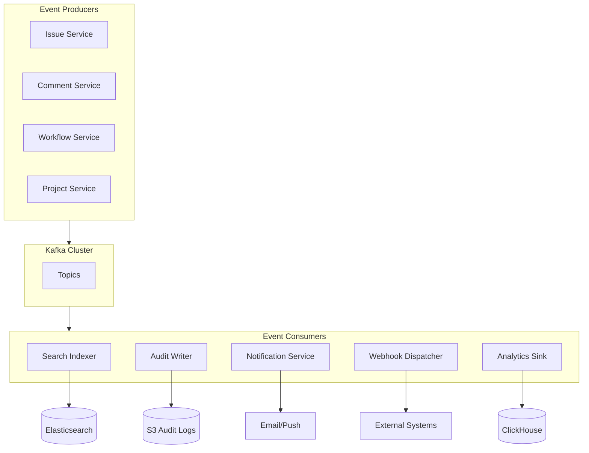
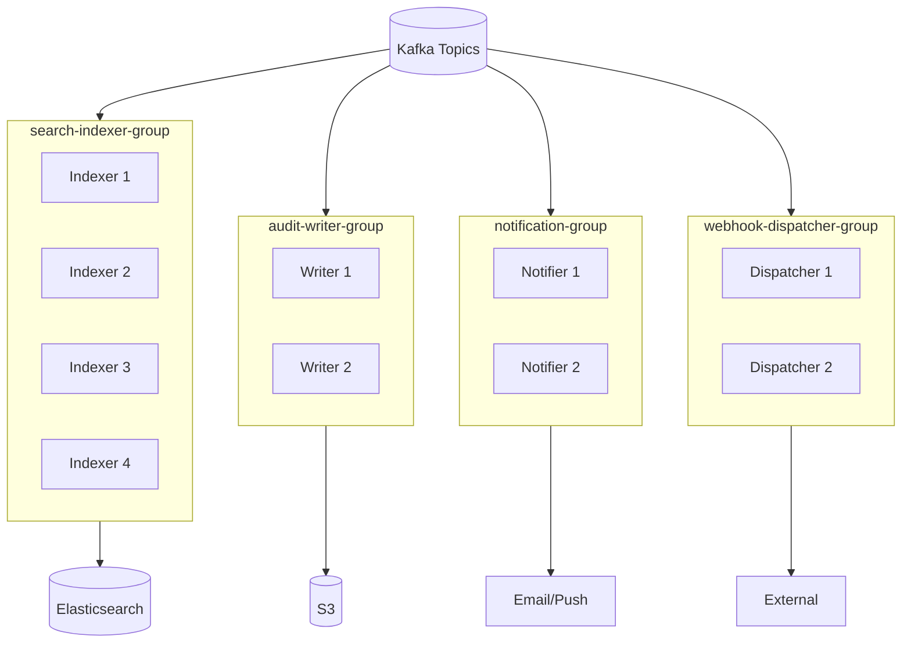
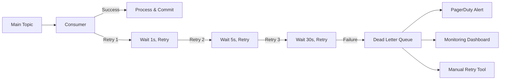

# Event-Driven Pipeline

[← Back to README](./README.md) | [← Previous: Search Infrastructure](./05-search-infrastructure.md)

## Overview

The event-driven pipeline enables:
- **Async processing**: Search indexing, notifications, webhooks
- **Decoupling**: Services don't need direct dependencies
- **Audit trail**: Complete history of all changes
- **Replay capability**: Reprocess events if needed



---

## Kafka Topic Design

| Topic | Partition Key | Partitions | Retention | Purpose |
|-------|---------------|------------|-----------|---------|
| `issues.created` | tenant_id | 16 | 7 days | New issue events |
| `issues.updated` | tenant_id | 16 | 7 days | Field change events |
| `issues.deleted` | tenant_id | 8 | 7 days | Soft delete events |
| `issues.transitions` | tenant_id | 16 | 7 days | Workflow transitions |
| `comments.created` | tenant_id | 8 | 7 days | New comments |
| `comments.updated` | tenant_id | 8 | 7 days | Comment edits |
| `search.reindex` | issue_id | 8 | 3 days | Triggered reindex requests |
| `audit.events` | tenant_id | 32 | 30 days | All auditable actions |
| `notifications.email` | user_id | 16 | 3 days | Email notifications |
| `notifications.push` | user_id | 8 | 1 day | Push notifications |
| `webhooks.outbound` | tenant_id | 8 | 7 days | Webhook deliveries |

### Topic Configuration

```yaml
# Kafka topic configuration
topics:
  issues.created:
    partitions: 16
    replication_factor: 3
    config:
      retention.ms: 604800000  # 7 days
      cleanup.policy: delete
      min.insync.replicas: 2

  audit.events:
    partitions: 32
    replication_factor: 3
    config:
      retention.ms: 2592000000  # 30 days
      cleanup.policy: delete
      min.insync.replicas: 2
```

---

## Event Schema (CloudEvents-compatible)

### Base Event Structure

```json
{
  "specversion": "1.0",
  "id": "550e8400-e29b-41d4-a716-446655440000",
  "type": "com.issuetracker.issue.updated",
  "source": "/tenants/tenant-uuid/projects/proj-uuid/issues/issue-uuid",
  "subject": "PROJ-1234",
  "time": "2026-01-12T10:30:00.000Z",
  "datacontenttype": "application/json",
  "data": {
    // Event-specific payload
  }
}
```

### Issue Created Event

```json
{
  "specversion": "1.0",
  "id": "evt-uuid",
  "type": "com.issuetracker.issue.created",
  "source": "/tenants/tenant-uuid/projects/proj-uuid/issues/issue-uuid",
  "subject": "PROJ-1234",
  "time": "2026-01-12T10:30:00.000Z",
  "datacontenttype": "application/json",
  "data": {
    "tenant_id": "tenant-uuid",
    "project_id": "proj-uuid",
    "project_key": "PROJ",
    "issue_id": "issue-uuid",
    "issue_key": "PROJ-1234",
    "issue_number": 1234,
    "title": "Login button not working on Safari",
    "description": "Users report...",
    "issue_type": "bug",
    "priority": 2,
    "status_id": "status-uuid",
    "status_name": "Open",
    "reporter_id": "user-uuid",
    "assignee_id": "user-uuid-2",
    "labels": ["frontend", "critical"],
    "created_at": "2026-01-12T10:30:00.000Z",
    "actor": {
      "user_id": "user-uuid",
      "name": "Jane Doe",
      "email": "jane@example.com",
      "ip_address": "10.0.0.1"
    },
    "metadata": {
      "request_id": "req-uuid",
      "trace_id": "trace-uuid",
      "source": "web_app"
    }
  }
}
```

### Issue Updated Event

```json
{
  "specversion": "1.0",
  "id": "evt-uuid",
  "type": "com.issuetracker.issue.updated",
  "source": "/tenants/tenant-uuid/projects/proj-uuid/issues/issue-uuid",
  "subject": "PROJ-1234",
  "time": "2026-01-12T11:00:00.000Z",
  "datacontenttype": "application/json",
  "data": {
    "tenant_id": "tenant-uuid",
    "project_id": "proj-uuid",
    "issue_id": "issue-uuid",
    "issue_key": "PROJ-1234",
    "version": 5,
    "changes": [
      {
        "field": "status_id",
        "old_value": { "id": "status-1", "name": "Open" },
        "new_value": { "id": "status-2", "name": "In Progress" }
      },
      {
        "field": "assignee_id",
        "old_value": null,
        "new_value": { "id": "user-uuid", "name": "John Smith" }
      }
    ],
    "actor": {
      "user_id": "user-uuid",
      "name": "Jane Doe",
      "ip_address": "10.0.0.1"
    },
    "metadata": {
      "request_id": "req-uuid",
      "trace_id": "trace-uuid",
      "source": "api"
    }
  }
}
```

### Comment Created Event

```json
{
  "specversion": "1.0",
  "id": "evt-uuid",
  "type": "com.issuetracker.comment.created",
  "source": "/tenants/tenant-uuid/issues/issue-uuid/comments/comment-uuid",
  "subject": "PROJ-1234",
  "time": "2026-01-12T11:30:00.000Z",
  "datacontenttype": "application/json",
  "data": {
    "tenant_id": "tenant-uuid",
    "issue_id": "issue-uuid",
    "issue_key": "PROJ-1234",
    "comment_id": "comment-uuid",
    "body": "I've investigated this issue...",
    "mentions": ["user-uuid-1", "user-uuid-2"],
    "is_internal": false,
    "actor": {
      "user_id": "user-uuid",
      "name": "Jane Doe"
    }
  }
}
```

---

## Consumer Groups



### Consumer Configuration

| Consumer Group | Instances | Topics | Processing Guarantee |
|---------------|-----------|--------|---------------------|
| `search-indexer-group` | 8 | `issues.*`, `comments.*` | At-least-once |
| `audit-writer-group` | 4 | `audit.events` | Exactly-once (Kafka txn) |
| `notification-group` | 4 | `*.created`, `*.updated` | At-least-once |
| `webhook-dispatcher-group` | 4 | `webhooks.outbound` | At-least-once |
| `analytics-sink-group` | 2 | All topics | At-least-once |

### Processing Guarantees

| Consumer | Semantics | Idempotency Strategy |
|----------|-----------|----------------------|
| Search Indexer | At-least-once | Version field in ES document |
| Audit Writer | Exactly-once | Kafka transactions |
| Notification Service | At-least-once | Dedup by event_id + user_id in Redis |
| Webhook Dispatcher | At-least-once | Include idempotency key in payload |
| Analytics Sink | At-least-once | Dedup in ClickHouse by event_id |

---

## Event Producer Implementation

```go
type EventPublisher struct {
    producer *kafka.Producer
    tracer   trace.Tracer
}

func (ep *EventPublisher) PublishIssueCreated(ctx context.Context, issue *Issue, actor *User) error {
    event := CloudEvent{
        SpecVersion:     "1.0",
        ID:              uuid.New().String(),
        Type:            "com.issuetracker.issue.created",
        Source:          fmt.Sprintf("/tenants/%s/projects/%s/issues/%s",
                            issue.TenantID, issue.ProjectID, issue.ID),
        Subject:         issue.Key,
        Time:            time.Now().UTC(),
        DataContentType: "application/json",
        Data: IssueCreatedData{
            TenantID:    issue.TenantID,
            ProjectID:   issue.ProjectID,
            IssueID:     issue.ID,
            IssueKey:    issue.Key,
            Title:       issue.Title,
            Description: issue.Description,
            Priority:    issue.Priority,
            StatusID:    issue.StatusID,
            ReporterID:  issue.ReporterID,
            AssigneeID:  issue.AssigneeID,
            Labels:      issue.Labels,
            CreatedAt:   issue.CreatedAt,
            Actor: ActorInfo{
                UserID:    actor.ID,
                Name:      actor.Name,
                Email:     actor.Email,
                IPAddress: getIPFromContext(ctx),
            },
            Metadata: EventMetadata{
                RequestID: getRequestIDFromContext(ctx),
                TraceID:   getTraceIDFromContext(ctx),
                Source:    getSourceFromContext(ctx),
            },
        },
    }

    data, err := json.Marshal(event)
    if err != nil {
        return fmt.Errorf("marshal event: %w", err)
    }

    return ep.producer.Produce(&kafka.Message{
        TopicPartition: kafka.TopicPartition{
            Topic:     StringPtr("issues.created"),
            Partition: kafka.PartitionAny,
        },
        Key:   []byte(issue.TenantID),  // Partition by tenant for ordering
        Value: data,
        Headers: []kafka.Header{
            {Key: "event_type", Value: []byte("issue.created")},
            {Key: "tenant_id", Value: []byte(issue.TenantID)},
            {Key: "trace_id", Value: []byte(getTraceIDFromContext(ctx))},
        },
    }, nil)
}
```

---

## Event Consumer Implementation

### Search Indexer Consumer

```go
type SearchIndexerConsumer struct {
    consumer *kafka.Consumer
    esClient *elasticsearch.Client
    metrics  *prometheus.Registry
}

func (c *SearchIndexerConsumer) Run(ctx context.Context) error {
    c.consumer.SubscribeTopics([]string{
        "issues.created",
        "issues.updated",
        "issues.deleted",
        "comments.created",
        "comments.updated",
    }, nil)

    for {
        select {
        case <-ctx.Done():
            return nil
        default:
            msg, err := c.consumer.ReadMessage(100 * time.Millisecond)
            if err != nil {
                if err.(kafka.Error).Code() == kafka.ErrTimedOut {
                    continue
                }
                return err
            }

            if err := c.processMessage(ctx, msg); err != nil {
                c.handleError(msg, err)
                continue
            }

            c.consumer.CommitMessage(msg)
        }
    }
}

func (c *SearchIndexerConsumer) processMessage(ctx context.Context, msg *kafka.Message) error {
    var event CloudEvent
    if err := json.Unmarshal(msg.Value, &event); err != nil {
        return fmt.Errorf("unmarshal event: %w", err)
    }

    switch event.Type {
    case "com.issuetracker.issue.created":
        return c.handleIssueCreated(ctx, event)
    case "com.issuetracker.issue.updated":
        return c.handleIssueUpdated(ctx, event)
    case "com.issuetracker.issue.deleted":
        return c.handleIssueDeleted(ctx, event)
    case "com.issuetracker.comment.created":
        return c.handleCommentCreated(ctx, event)
    default:
        log.Warn("Unknown event type", "type", event.Type)
        return nil
    }
}

func (c *SearchIndexerConsumer) handleIssueUpdated(ctx context.Context, event CloudEvent) error {
    var data IssueUpdatedData
    if err := mapstructure.Decode(event.Data, &data); err != nil {
        return err
    }

    // Build partial update document
    doc := map[string]interface{}{
        "updated_at": event.Time,
    }

    for _, change := range data.Changes {
        switch change.Field {
        case "title":
            doc["title"] = change.NewValue
        case "description":
            doc["description"] = change.NewValue
        case "status_id":
            doc["status"] = change.NewValue.(map[string]interface{})["name"]
            doc["status_id"] = change.NewValue.(map[string]interface{})["id"]
        case "priority":
            doc["priority"] = change.NewValue
        case "assignee_id":
            if change.NewValue != nil {
                doc["assignee_id"] = change.NewValue.(map[string]interface{})["id"]
                doc["assignee_name"] = change.NewValue.(map[string]interface{})["name"]
            } else {
                doc["assignee_id"] = nil
                doc["assignee_name"] = nil
            }
        case "labels":
            doc["labels"] = change.NewValue
        }
    }

    // Use version for optimistic concurrency
    _, err := c.esClient.Update(
        c.getIndexName(data.TenantID),
        data.IssueID,
        esutil.NewJSONReader(map[string]interface{}{"doc": doc}),
        c.esClient.Update.WithIfSeqNo(data.Version-1),
    )

    return err
}
```

---

## Dead Letter Queue (DLQ) Handling



### DLQ Consumer

```go
func (c *DLQProcessor) ProcessDLQ(ctx context.Context) {
    for msg := range c.dlqMessages {
        // Log for investigation
        log.Error("DLQ message",
            "topic", msg.OriginalTopic,
            "partition", msg.OriginalPartition,
            "offset", msg.OriginalOffset,
            "error", msg.LastError,
            "attempts", msg.Attempts,
        )

        // Store in database for investigation
        c.storeDLQMessage(msg)

        // Alert if critical topic
        if isCriticalTopic(msg.OriginalTopic) {
            c.alerter.SendAlert(AlertDLQMessage{
                Topic:   msg.OriginalTopic,
                Error:   msg.LastError,
                EventID: msg.EventID,
            })
        }
    }
}
```

### Manual Retry Tool

```bash
# Retry single message
./dlq-tool retry --event-id=evt-uuid

# Retry all messages for tenant
./dlq-tool retry --tenant-id=tenant-uuid --since=2026-01-12

# Retry all messages from topic
./dlq-tool retry --topic=issues.updated --limit=1000
```

---

## Event Ordering Guarantees

### Per-Tenant Ordering

Events for the same tenant are ordered because we use `tenant_id` as partition key:

```
Partition 0: tenant-a.event1, tenant-a.event2, tenant-a.event3
Partition 1: tenant-b.event1, tenant-b.event2
Partition 2: tenant-c.event1, tenant-c.event2
```

### Per-Issue Ordering (When Needed)

For strict per-issue ordering (e.g., version conflicts), use compound key:

```go
key := fmt.Sprintf("%s:%s", issue.TenantID, issue.ID)
```

---

## Monitoring

### Key Metrics

```yaml
# Consumer lag
kafka_consumer_lag:
  labels: [consumer_group, topic, partition]

# Processing rate
events_processed_total:
  labels: [consumer_group, event_type, status]

# Processing latency
event_processing_duration_seconds:
  labels: [consumer_group, event_type]

# DLQ messages
dlq_messages_total:
  labels: [topic, error_type]
```

### Alerting Rules

```yaml
groups:
  - name: kafka-consumers
    rules:
      - alert: ConsumerLagHigh
        expr: kafka_consumer_group_lag > 10000
        for: 5m
        labels:
          severity: warning

      - alert: DLQMessagesAccumulating
        expr: increase(dlq_messages_total[1h]) > 100
        labels:
          severity: critical
```

---

## Next

[Audit Trail System →](./07-audit-trail-system.md)
