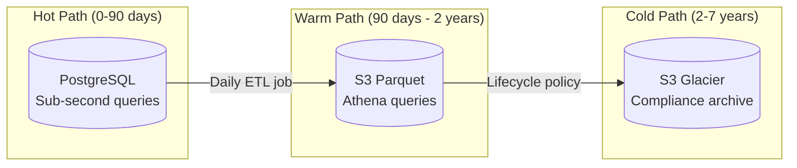

# Audit Trail System

[← Back to README](./README.md) | [← Previous: Event Pipeline](./06-event-driven-pipeline.md)

## Audit Requirements

| Requirement | Description |
|-------------|-------------|
| **Completeness** | Every state change must be recorded |
| **Immutability** | Audit logs cannot be modified or deleted |
| **Queryability** | Fast queries for compliance and debugging |
| **Retention** | 7 years for compliance (configurable per tenant) |
| **Searchability** | Full-text search across audit logs |

---

## Audit Log Storage Tiers



### Storage Tier Details

| Tier | Storage | Query Latency | Cost | Use Case |
|------|---------|---------------|------|----------|
| Hot | PostgreSQL | < 100ms | $$$ | Recent activity, debugging |
| Warm | S3 Parquet + Athena | 5-30s | $$ | Historical analysis, compliance reports |
| Cold | S3 Glacier | Minutes-hours | $ | Long-term compliance archive |

---

## Audit Event Structure

```json
{
  "id": "audit-uuid",
  "timestamp": "2026-01-12T10:30:00.000Z",
  "tenant_id": "tenant-uuid",

  "actor": {
    "type": "user",
    "id": "user-uuid",
    "email": "jane@example.com",
    "name": "Jane Doe",
    "ip_address": "10.0.0.1",
    "user_agent": "Mozilla/5.0 (Macintosh; Intel Mac OS X 10_15_7)...",
    "auth_method": "oauth2",
    "session_id": "session-uuid"
  },

  "action": "issue.update",
  "outcome": "success",

  "resource": {
    "type": "issue",
    "id": "issue-uuid",
    "key": "PROJ-1234",
    "project_id": "project-uuid",
    "project_key": "PROJ"
  },

  "changes": [
    {
      "field": "status",
      "old_value": "open",
      "new_value": "in_progress"
    },
    {
      "field": "assignee_id",
      "old_value": null,
      "new_value": "user-uuid-2"
    }
  ],

  "context": {
    "request_id": "req-uuid",
    "trace_id": "trace-uuid",
    "source": "web_app",
    "api_version": "v1"
  }
}
```

---

## PostgreSQL Schema (Hot Storage)

```sql
CREATE TABLE audit_logs (
    id UUID PRIMARY KEY DEFAULT gen_random_uuid(),
    timestamp TIMESTAMPTZ NOT NULL DEFAULT NOW(),
    tenant_id UUID NOT NULL,

    -- Actor information
    actor_type VARCHAR(20) NOT NULL,  -- 'user', 'system', 'api_key'
    actor_id UUID,
    actor_email VARCHAR(255),
    actor_name VARCHAR(255),
    actor_ip INET,
    actor_user_agent TEXT,
    actor_auth_method VARCHAR(50),
    actor_session_id UUID,

    -- Action
    action VARCHAR(100) NOT NULL,  -- 'issue.create', 'issue.update', etc.
    outcome VARCHAR(20) NOT NULL DEFAULT 'success',  -- 'success', 'failure'

    -- Resource
    resource_type VARCHAR(50) NOT NULL,
    resource_id UUID NOT NULL,
    resource_key VARCHAR(100),
    resource_project_id UUID,

    -- Changes (JSONB for flexibility)
    changes JSONB DEFAULT '[]',

    -- Context
    request_id UUID,
    trace_id VARCHAR(100),
    source VARCHAR(50),
    api_version VARCHAR(10),

    -- For quick filtering
    created_at DATE NOT NULL DEFAULT CURRENT_DATE
) PARTITION BY RANGE (created_at);

-- Create monthly partitions
CREATE TABLE audit_logs_2026_01 PARTITION OF audit_logs
    FOR VALUES FROM ('2026-01-01') TO ('2026-02-01');
CREATE TABLE audit_logs_2026_02 PARTITION OF audit_logs
    FOR VALUES FROM ('2026-02-01') TO ('2026-03-01');
-- ... continue for each month

-- Indexes for common queries
CREATE INDEX idx_audit_tenant_time ON audit_logs(tenant_id, timestamp DESC);
CREATE INDEX idx_audit_resource ON audit_logs(resource_type, resource_id, timestamp DESC);
CREATE INDEX idx_audit_actor ON audit_logs(actor_id, timestamp DESC);
CREATE INDEX idx_audit_action ON audit_logs(action, timestamp DESC);

-- GIN index for changes search
CREATE INDEX idx_audit_changes ON audit_logs USING gin(changes);
```

---

## Audit Writer Consumer

```go
type AuditWriter struct {
    consumer *kafka.Consumer
    db       *sql.DB
    s3Client *s3.Client
    buffer   *AuditBuffer
}

func (aw *AuditWriter) Run(ctx context.Context) error {
    aw.consumer.SubscribeTopics([]string{"audit.events"}, nil)

    // Use Kafka transactions for exactly-once
    for {
        select {
        case <-ctx.Done():
            return aw.flush()
        default:
            msg, err := aw.consumer.ReadMessage(100 * time.Millisecond)
            if err != nil {
                continue
            }

            var event AuditEvent
            json.Unmarshal(msg.Value, &event)

            aw.buffer.Add(event)

            // Batch write every 100 events or 1 second
            if aw.buffer.ShouldFlush() {
                if err := aw.flush(); err != nil {
                    return err
                }
                aw.consumer.Commit()
            }
        }
    }
}

func (aw *AuditWriter) flush() error {
    events := aw.buffer.Drain()
    if len(events) == 0 {
        return nil
    }

    // Batch insert to PostgreSQL
    tx, _ := aw.db.Begin()
    defer tx.Rollback()

    stmt, _ := tx.Prepare(pq.CopyIn("audit_logs",
        "id", "timestamp", "tenant_id",
        "actor_type", "actor_id", "actor_email",
        "action", "outcome",
        "resource_type", "resource_id", "resource_key",
        "changes", "request_id", "trace_id", "source",
    ))

    for _, event := range events {
        stmt.Exec(
            event.ID, event.Timestamp, event.TenantID,
            event.Actor.Type, event.Actor.ID, event.Actor.Email,
            event.Action, event.Outcome,
            event.Resource.Type, event.Resource.ID, event.Resource.Key,
            event.Changes, event.Context.RequestID, event.Context.TraceID, event.Context.Source,
        )
    }

    stmt.Close()
    return tx.Commit()
}
```

---

## Data Lifecycle Management

### Daily ETL to S3 Parquet

```python
# Airflow DAG for audit data archival
from airflow import DAG
from airflow.operators.python import PythonOperator
from datetime import datetime, timedelta

def export_to_parquet(execution_date):
    """Export previous day's audit logs to S3 Parquet."""
    date_str = execution_date.strftime('%Y-%m-%d')

    query = f"""
        SELECT * FROM audit_logs
        WHERE created_at = '{date_str}'
    """

    df = pd.read_sql(query, db_connection)

    # Partition by tenant for efficient querying
    for tenant_id in df['tenant_id'].unique():
        tenant_df = df[df['tenant_id'] == tenant_id]

        path = f"s3://audit-archive/{tenant_id}/year={execution_date.year}/month={execution_date.month:02d}/day={execution_date.day:02d}/audit.parquet"

        tenant_df.to_parquet(path, compression='snappy')

dag = DAG(
    'audit_archival',
    schedule_interval='0 2 * * *',  # 2 AM daily
    start_date=datetime(2026, 1, 1),
)

export_task = PythonOperator(
    task_id='export_to_parquet',
    python_callable=export_to_parquet,
    dag=dag,
)
```

### S3 Lifecycle Policy

```json
{
  "Rules": [
    {
      "ID": "AuditWarmToGlacier",
      "Status": "Enabled",
      "Filter": {
        "Prefix": "audit-archive/"
      },
      "Transitions": [
        {
          "Days": 730,
          "StorageClass": "GLACIER"
        }
      ],
      "Expiration": {
        "Days": 2555
      }
    }
  ]
}
```

### PostgreSQL Partition Cleanup

```sql
-- Drop partitions older than 90 days
DO $$
DECLARE
    partition_name TEXT;
    drop_date DATE := CURRENT_DATE - INTERVAL '90 days';
BEGIN
    FOR partition_name IN
        SELECT tablename
        FROM pg_tables
        WHERE tablename LIKE 'audit_logs_%'
          AND tablename < 'audit_logs_' || to_char(drop_date, 'YYYY_MM')
    LOOP
        EXECUTE format('DROP TABLE IF EXISTS %I', partition_name);
        RAISE NOTICE 'Dropped partition: %', partition_name;
    END LOOP;
END $$;
```

---

## Audit Query API

### API Endpoint

```http
GET /api/v1/audit?
  tenant_id=xxx&
  resource_type=issue&
  resource_id=xxx&
  from=2026-01-01T00:00:00Z&
  to=2026-01-12T23:59:59Z&
  actor_id=xxx&
  action=issue.update&
  page=1&
  limit=50

Authorization: Bearer {token}
```

### Response

```json
{
  "data": [
    {
      "id": "audit-uuid",
      "timestamp": "2026-01-12T10:30:00.000Z",
      "actor": {
        "id": "user-uuid",
        "name": "Jane Doe",
        "email": "jane@example.com"
      },
      "action": "issue.update",
      "outcome": "success",
      "resource": {
        "type": "issue",
        "id": "issue-uuid",
        "key": "PROJ-1234"
      },
      "changes": [
        {
          "field": "status",
          "old_value": "open",
          "new_value": "in_progress"
        }
      ]
    }
  ],
  "pagination": {
    "page": 1,
    "limit": 50,
    "total": 1234,
    "has_more": true
  }
}
```

### Query Implementation

```go
func (s *AuditService) Query(ctx context.Context, req AuditQueryRequest) (*AuditQueryResult, error) {
    // Determine storage tier based on date range
    if req.From.After(time.Now().AddDate(0, 0, -90)) {
        // Query PostgreSQL (hot path)
        return s.queryPostgres(ctx, req)
    } else if req.From.After(time.Now().AddDate(-2, 0, 0)) {
        // Query S3 via Athena (warm path)
        return s.queryAthena(ctx, req)
    } else {
        // Query Glacier (cold path) - requires restore first
        return nil, errors.New("data in cold storage, submit restore request")
    }
}

func (s *AuditService) queryPostgres(ctx context.Context, req AuditQueryRequest) (*AuditQueryResult, error) {
    query := `
        SELECT * FROM audit_logs
        WHERE tenant_id = $1
          AND timestamp BETWEEN $2 AND $3
    `
    args := []interface{}{req.TenantID, req.From, req.To}

    if req.ResourceType != "" {
        query += " AND resource_type = $" + strconv.Itoa(len(args)+1)
        args = append(args, req.ResourceType)
    }
    if req.ResourceID != "" {
        query += " AND resource_id = $" + strconv.Itoa(len(args)+1)
        args = append(args, req.ResourceID)
    }
    if req.ActorID != "" {
        query += " AND actor_id = $" + strconv.Itoa(len(args)+1)
        args = append(args, req.ActorID)
    }
    if req.Action != "" {
        query += " AND action = $" + strconv.Itoa(len(args)+1)
        args = append(args, req.Action)
    }

    query += " ORDER BY timestamp DESC LIMIT $" + strconv.Itoa(len(args)+1) + " OFFSET $" + strconv.Itoa(len(args)+2)
    args = append(args, req.Limit, (req.Page-1)*req.Limit)

    rows, err := s.db.QueryContext(ctx, query, args...)
    // ... process rows
}
```

---

## Athena Integration (Warm Path)

### Athena Table Definition

```sql
CREATE EXTERNAL TABLE audit_logs (
    id STRING,
    timestamp TIMESTAMP,
    tenant_id STRING,
    actor_type STRING,
    actor_id STRING,
    actor_email STRING,
    actor_name STRING,
    action STRING,
    outcome STRING,
    resource_type STRING,
    resource_id STRING,
    resource_key STRING,
    changes STRING,
    request_id STRING,
    trace_id STRING,
    source STRING
)
PARTITIONED BY (
    tenant STRING,
    year INT,
    month INT,
    day INT
)
STORED AS PARQUET
LOCATION 's3://audit-archive/'
TBLPROPERTIES ('parquet.compression'='SNAPPY');
```

### Athena Query Example

```sql
SELECT *
FROM audit_logs
WHERE tenant = 'tenant-uuid'
  AND year = 2025
  AND month BETWEEN 1 AND 6
  AND action = 'issue.update'
  AND resource_type = 'issue'
ORDER BY timestamp DESC
LIMIT 100;
```

---

## Compliance Export

### Export for Legal/Compliance

```http
POST /api/v1/audit/export
Content-Type: application/json
Authorization: Bearer {admin-token}

{
  "tenant_id": "tenant-uuid",
  "from": "2025-01-01T00:00:00Z",
  "to": "2025-12-31T23:59:59Z",
  "format": "csv",
  "include_pii": true,
  "callback_url": "https://compliance.example.com/webhook"
}
```

### Export Job

```go
func (s *AuditService) ExportAuditLogs(ctx context.Context, req ExportRequest) (*ExportJob, error) {
    job := &ExportJob{
        ID:        uuid.New().String(),
        Status:    "pending",
        TenantID:  req.TenantID,
        CreatedAt: time.Now(),
    }

    // Save job to database
    s.db.Create(job)

    // Queue async export
    s.queue.Publish("audit.export", job)

    return job, nil
}

func (w *ExportWorker) ProcessExport(job *ExportJob) error {
    // Query all audit logs for date range
    // Write to CSV/JSON file in S3
    // Encrypt file
    // Notify callback URL

    outputPath := fmt.Sprintf("s3://audit-exports/%s/%s.csv.gpg",
        job.TenantID, job.ID)

    // ... export logic

    // Callback
    http.Post(job.CallbackURL, "application/json",
        strings.NewReader(fmt.Sprintf(`{"job_id": "%s", "download_url": "%s"}`,
            job.ID, outputPath)))

    return nil
}
```

---

## Audit Anomaly Detection

### Detection Rules

```yaml
anomaly_rules:
  - name: bulk_delete
    description: Large number of deletes in short period
    condition: |
      action IN ('issue.delete', 'project.delete') AND
      COUNT(*) > 100 IN LAST 1 HOUR
    severity: high

  - name: admin_action_outside_hours
    description: Admin actions outside business hours
    condition: |
      actor_role = 'admin' AND
      HOUR(timestamp) NOT BETWEEN 6 AND 22
    severity: medium

  - name: failed_auth_spike
    description: Multiple failed authentication attempts
    condition: |
      action = 'auth.login' AND
      outcome = 'failure' AND
      COUNT(*) > 10 IN LAST 5 MINUTES BY actor_ip
    severity: critical
```

### Alert Integration

```go
func (d *AnomalyDetector) Check(event AuditEvent) {
    for _, rule := range d.rules {
        if rule.Matches(event) {
            d.alerter.Send(Alert{
                Severity:  rule.Severity,
                Title:     rule.Name,
                Message:   rule.Description,
                TenantID:  event.TenantID,
                EventID:   event.ID,
                Timestamp: event.Timestamp,
            })
        }
    }
}
```

---

## Next

[Capacity Planning →](./08-capacity-planning.md)
