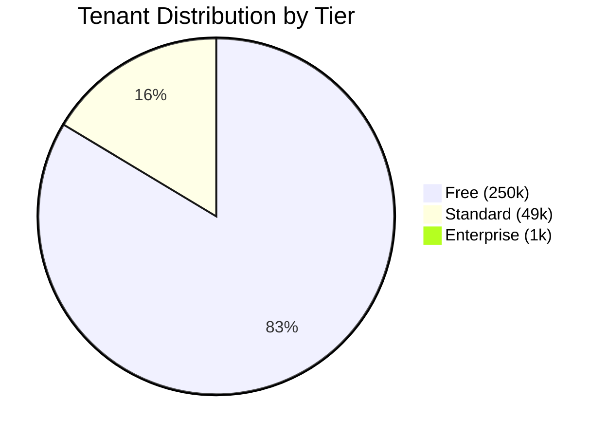
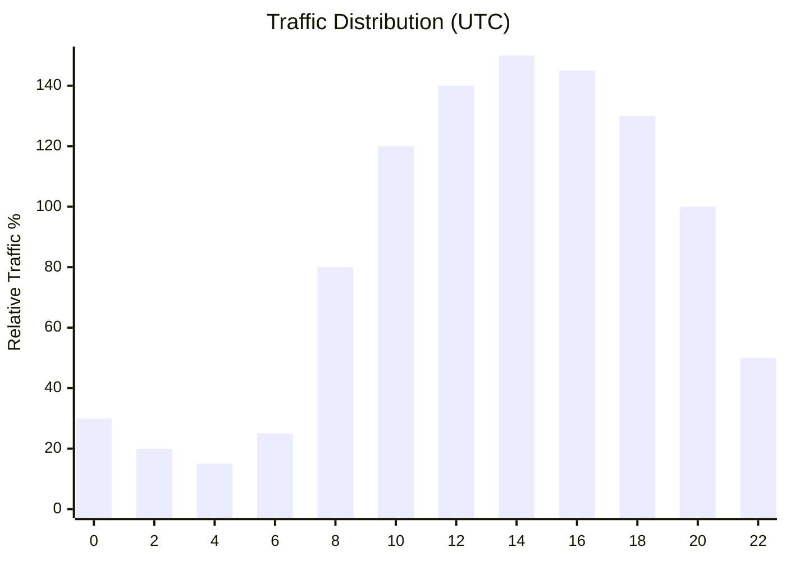
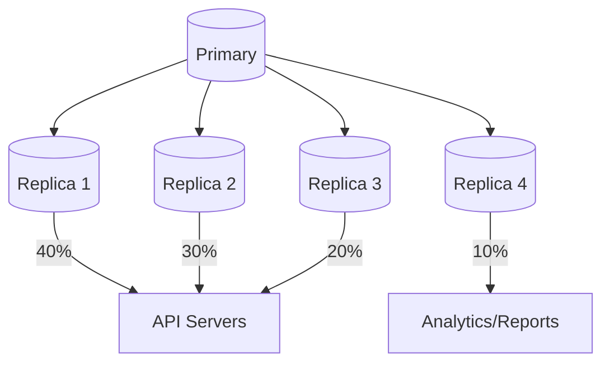
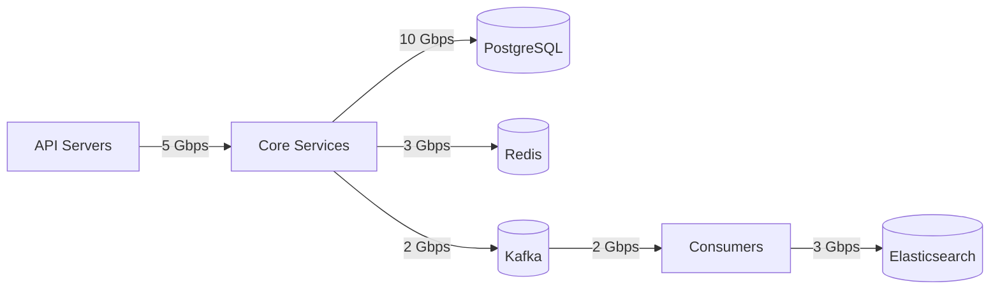

# Capacity Planning

[← Back to README](./README.md) | [← Previous: Audit Trail](./07-audit-trail-system.md)

## Scale Parameters

| Metric | Value |
|--------|-------|
| Total Tenants | 300,000 |
| DAU (Daily Active Users) | 50,000,000 |
| Total Issues | 10,000,000,000 |
| Total Comments | ~30,000,000,000 |
| Avg Issues per Tenant | ~33,000 |
| Read SLA | 99.9% |
| Write SLA | 99.5% |

---

## Tenant Distribution



| Tier | Tenants | % of Total | % of Issues | % of Traffic |
|------|---------|------------|-------------|--------------|
| Free | 250,000 | 83.3% | 5% | 10% |
| Standard | 49,000 | 16.3% | 35% | 40% |
| Enterprise | 1,000 | 0.4% | 60% | 50% |

### Whale Tenants

Top 100 tenants ("whales") account for:
- 40% of all issues
- 35% of all traffic
- Dedicated infrastructure allocation

---

## Storage Estimates

| Data Type | Records | Avg Size | Total Storage | Monthly Growth |
|-----------|---------|----------|---------------|----------------|
| Issues | 10B | 2KB | 20TB | 200GB |
| Comments | 30B | 1KB | 30TB | 300GB |
| Issue History | 100B | 500B | 50TB | 500GB |
| Search Index | 10B docs | 3KB | 30TB | 300GB |
| Attachments | 1B | 1MB avg | 1PB | 10TB |
| Audit Logs (hot) | 10B | 1KB | 10TB | 100GB |

### Storage Growth Projection

```
Year 1: ~150TB total (excluding attachments)
Year 2: ~300TB total
Year 3: ~450TB total

Attachments:
Year 1: ~1PB
Year 2: ~1.5PB
Year 3: ~2PB
```

---

## Read/Write Load Analysis

### Traffic Patterns

```
Total Issues: 10B
DAU: 50M users
Avg sessions/user/day: 5
Avg actions/session: 20 (mix of reads/writes)
```

### Read Operations

| Operation | Daily Volume | QPS (avg) | QPS (peak 5x) |
|-----------|--------------|-----------|---------------|
| Issue list views | 250M | 2,900 | 14,500 |
| Issue detail views | 500M | 5,800 | 29,000 |
| Search queries | 100M | 1,160 | 5,800 |
| Comment loads | 200M | 2,300 | 11,500 |
| **Total Reads** | **1.05B** | **~12K** | **~60K** |

### Write Operations

| Operation | Daily Volume | QPS (avg) | QPS (peak 5x) |
|-----------|--------------|-----------|---------------|
| Issue creates | 5M | 58 | 290 |
| Issue updates | 50M | 580 | 2,900 |
| Comments | 25M | 290 | 1,450 |
| Attachments | 5M | 58 | 290 |
| **Total Writes** | **85M** | **~1K** | **~5K** |

### Peak Hours



Peak hours: 12:00-18:00 UTC (business hours overlap US + Europe)

---

## Database Cluster Sizing

### PostgreSQL Clusters

| Cluster | Purpose | Nodes | Spec per Node | Total Storage |
|---------|---------|-------|---------------|---------------|
| **Primary (Issues)** | OLTP workload | 5 (1 primary + 4 replicas) | 64 vCPU, 256GB RAM, 4TB NVMe | 20TB |
| **Tenant Registry** | Metadata | 3 (1 primary + 2 replicas) | 8 vCPU, 32GB RAM, 500GB SSD | 1.5TB |
| **Audit DB** | Write-heavy | 3 (1 primary + 2 replicas) | 32 vCPU, 128GB RAM, 2TB NVMe | 6TB |

### Connection Pool Sizing

```
Max connections per node: 500
Total connections needed:
- API servers: 50 instances × 20 connections = 1,000
- Background workers: 20 instances × 10 connections = 200
- Admin/monitoring: 50 connections
Total: ~1,250 connections

With 5 replicas: 250 connections per replica (within limits)
```

### Read Replica Distribution



---

## Elasticsearch Cluster Sizing

### Cluster Configuration

| Role | Nodes | Spec per Node | Purpose |
|------|-------|---------------|---------|
| Master | 3 | 8 vCPU, 16GB RAM, 100GB SSD | Cluster management |
| Data (Hot) | 12 | 32 vCPU, 128GB RAM, 2TB NVMe | Recent data, high query load |
| Data (Warm) | 6 | 16 vCPU, 64GB RAM, 8TB HDD | Older data, lower query load |
| Coordinating | 4 | 16 vCPU, 32GB RAM | Query routing, aggregation |

### Shard Strategy

```
Index: issue-tracker-shared-2026.01
- Primary shards: 10
- Replica shards: 2 (total: 30 shards)
- Shard size target: 30-50GB

Total indices: ~24 (2 years of monthly indices)
Total shards: ~720
Shards per data node: ~60 (well within limits)
```

### Memory Allocation

```
Per Data Node (128GB RAM):
- JVM Heap: 31GB (50% rule, max 32GB)
- OS File Cache: 97GB (for Lucene segments)

Query Performance:
- Heap for queries: ~20GB
- Heap for indexing: ~10GB
- Reserved: ~1GB
```

---

## Redis Cluster Sizing

### Cluster Configuration

| Purpose | Nodes | Memory per Node | Total Memory |
|---------|-------|-----------------|--------------|
| Issue Cache | 6 (3 primary + 3 replica) | 64GB | 384GB |
| Session Cache | 4 (2 primary + 2 replica) | 32GB | 128GB |
| Rate Limiting | 4 (2 primary + 2 replica) | 16GB | 64GB |
| Search Cache | 4 (2 primary + 2 replica) | 32GB | 128GB |

### Memory Estimation

```
Issue Cache:
- Active issues in cache: ~100M (1% of total)
- Avg cached issue size: 2KB
- Total: ~200GB (with overhead)

Session Cache:
- Active sessions: ~10M
- Avg session size: 1KB
- Total: ~10GB

Rate Limiting:
- Active rate limit keys: ~5M
- Key size: ~100 bytes
- Total: ~500MB

Search Cache:
- Cached queries: ~1M
- Avg result size: 10KB
- Total: ~10GB
```

---

## Kafka Cluster Sizing

### Cluster Configuration

| Metric | Value |
|--------|-------|
| Brokers | 9 (3 racks × 3 brokers) |
| Storage per broker | 2TB NVMe |
| Total storage | 18TB |
| Replication factor | 3 |
| Min ISR | 2 |

### Topic Sizing

```
Events per day: ~500M
Avg event size: 2KB
Daily data: ~1TB

Retention: 7 days
Total retention storage: ~7TB

With replication (3x): ~21TB
Actual (with compaction): ~15TB
```

### Throughput

```
Peak events/second: 50,000
Peak throughput: 100 MB/s
Per broker: ~11 MB/s (well within NVMe limits)
```

---

## Network Capacity

### Inter-Service Traffic



### Bandwidth Requirements

| Path | Peak Bandwidth | Network Type |
|------|---------------|--------------|
| API → Services | 5 Gbps | 10G internal |
| Services → PostgreSQL | 10 Gbps | 25G storage network |
| Services → Redis | 3 Gbps | 10G internal |
| Services → Kafka | 2 Gbps | 10G internal |
| Kafka → ES | 3 Gbps | 10G internal |

---

## Compute Capacity

### Service Instances

| Service | Instances | vCPU | Memory | Notes |
|---------|-----------|------|--------|-------|
| API Gateway | 20 | 4 | 8GB | Stateless, autoscale |
| Issue Service | 30 | 8 | 16GB | Stateless, autoscale |
| Comment Service | 15 | 4 | 8GB | Stateless |
| Workflow Service | 10 | 4 | 8GB | Stateless |
| Search Service | 20 | 8 | 16GB | Stateless |
| Search Indexer | 16 | 4 | 8GB | Kafka consumers |
| Notification Service | 8 | 4 | 8GB | Kafka consumers |
| Audit Writer | 8 | 4 | 8GB | Kafka consumers |

### Autoscaling Rules

```yaml
# HPA configuration
apiVersion: autoscaling/v2
kind: HorizontalPodAutoscaler
metadata:
  name: issue-service-hpa
spec:
  scaleTargetRef:
    apiVersion: apps/v1
    kind: Deployment
    name: issue-service
  minReplicas: 30
  maxReplicas: 100
  metrics:
    - type: Resource
      resource:
        name: cpu
        target:
          type: Utilization
          averageUtilization: 70
    - type: Pods
      pods:
        metric:
          name: http_requests_per_second
        target:
          type: AverageValue
          averageValue: "1000"
```

---

## Cost Estimation (Monthly)

### AWS Cost Breakdown

| Component | Instances/Size | Monthly Cost |
|-----------|---------------|--------------|
| **Compute (EKS)** | 150 × m6i.2xlarge | $45,000 |
| **PostgreSQL (RDS)** | 11 × r6g.4xlarge | $25,000 |
| **Redis (ElastiCache)** | 18 × r6g.2xlarge | $15,000 |
| **Elasticsearch** | 25 × r6g.4xlarge | $35,000 |
| **Kafka (MSK)** | 9 × kafka.m5.2xlarge | $12,000 |
| **S3 Storage** | 100TB + 1PB | $25,000 |
| **Network (Data Transfer)** | 500TB | $20,000 |
| **Load Balancers** | ALB + NLB | $5,000 |
| **Monitoring** | CloudWatch, X-Ray | $8,000 |
| **Total** | | **~$190,000** |

### Cost Optimization Opportunities

| Optimization | Potential Savings |
|--------------|------------------|
| Reserved Instances (1yr) | 30-40% on compute |
| Spot instances for workers | 60-70% on batch jobs |
| S3 Intelligent Tiering | 20% on storage |
| Data compression | 30% on storage/network |

---

## Growth Planning

### 12-Month Projection

| Metric | Current | +6 Months | +12 Months |
|--------|---------|-----------|------------|
| Tenants | 300K | 400K | 500K |
| DAU | 50M | 65M | 80M |
| Issues | 10B | 12B | 15B |
| Peak QPS | 60K | 80K | 100K |
| Storage | 150TB | 200TB | 250TB |

### Scaling Triggers

| Metric | Threshold | Action |
|--------|-----------|--------|
| DB CPU | > 70% sustained | Add read replica |
| ES heap | > 75% | Add data nodes |
| Kafka consumer lag | > 10K msgs | Scale consumers |
| API latency p95 | > 150ms | Scale API pods |
| Cache hit rate | < 80% | Review cache strategy |

---

## Next

[Failure Modes & Mitigation →](./09-failure-modes-mitigation.md)
