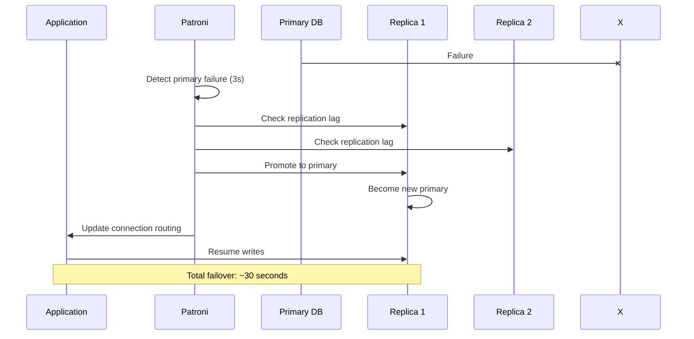
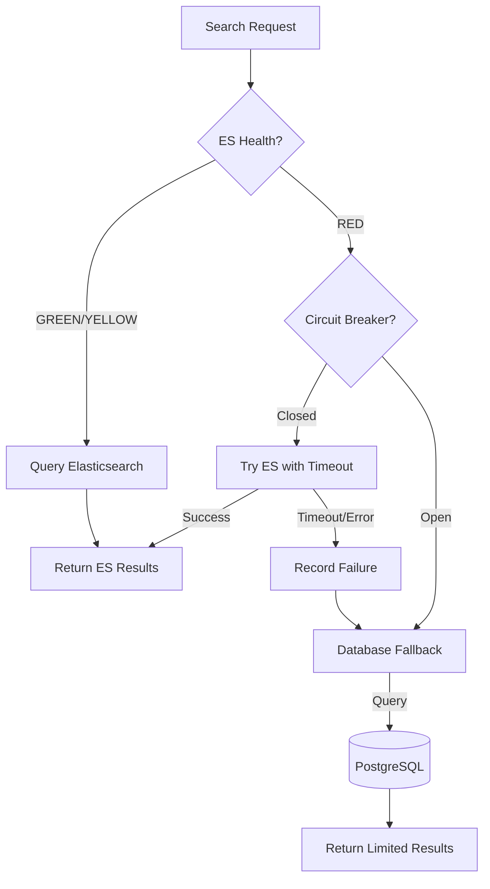
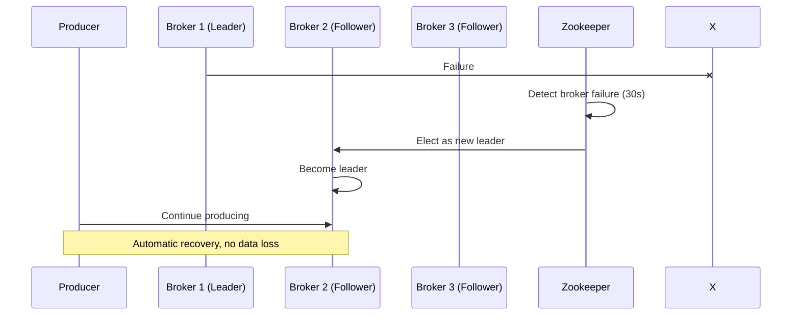
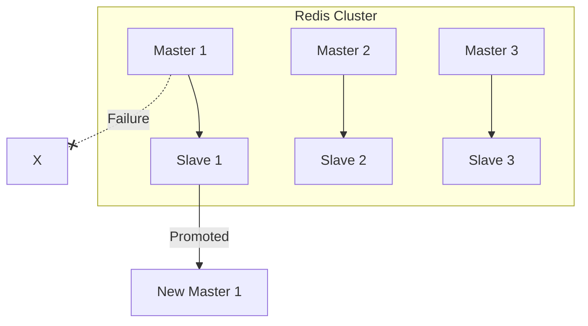
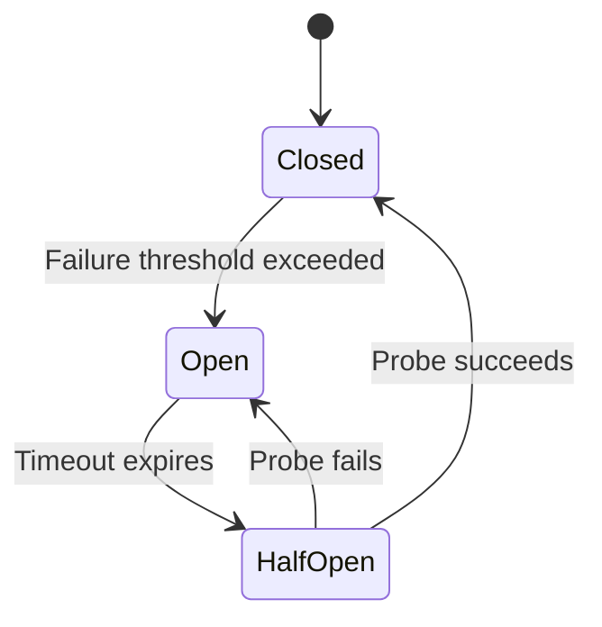
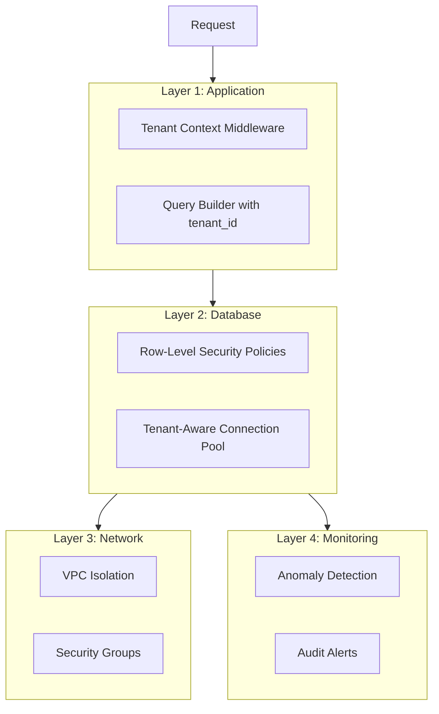
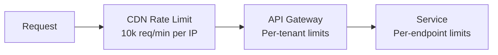
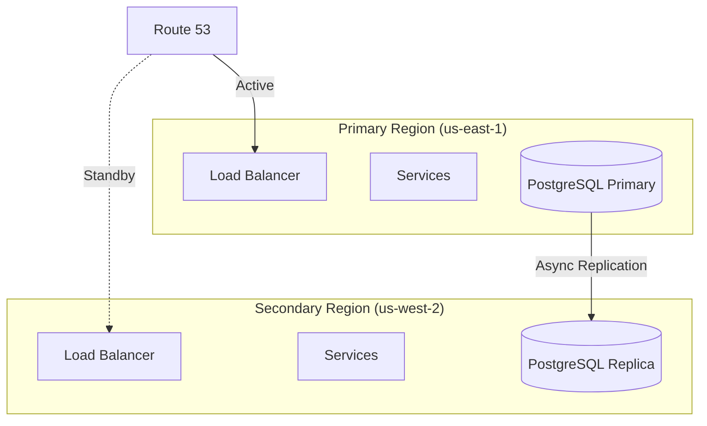

# Failure Modes & Mitigation

[← Back to README](./README.md) | [← Previous: Capacity Planning](./08-capacity-planning.md)

## Failure Scenarios Matrix

| Failure Mode | Detection | Impact | Mitigation | RTO | RPO |
|--------------|-----------|--------|------------|-----|-----|
| Primary DB down | Health checks, connection errors | Write unavailable | Promote replica via Patroni | 30s | 0 (sync replication) |
| DB replica lag | Replication lag metric | Stale reads | Route to primary, alert | N/A | N/A |
| Search cluster degraded | Latency alerts, error rates | Search slow/unavailable | Fallback to DB full-text | N/A (graceful) | N/A |
| Kafka broker failure | Under-replicated partitions | Event delay | Automatic partition reassignment | 5min | 0 (replication) |
| Redis cluster failure | Connection errors | Higher latency | DB fallback, degraded mode | 2min | N/A |
| Tenant data leak | Audit anomaly detection | Security incident | Immediate isolation | N/A | N/A |
| Search reindex lag | Consumer lag metric | Stale search results | Scale indexers | N/A | N/A |
| DDoS on tenant | Rate limit alerts | Service degradation | Aggressive rate limiting | Immediate | N/A |

---

## Database Failures

### Primary Database Failure



### Patroni Configuration

```yaml
# Patroni configuration for automatic failover
scope: issue-tracker-primary
namespace: /db/
name: node1

restapi:
  listen: 0.0.0.0:8008
  connect_address: node1:8008

etcd:
  hosts: etcd1:2379,etcd2:2379,etcd3:2379

bootstrap:
  dcs:
    ttl: 30
    loop_wait: 10
    retry_timeout: 10
    maximum_lag_on_failover: 0  # Only promote fully synced replica
    postgresql:
      use_pg_rewind: true
      parameters:
        synchronous_commit: "on"
        synchronous_standby_names: "*"

postgresql:
  listen: 0.0.0.0:5432
  data_dir: /var/lib/postgresql/data

  pg_hba:
    - host replication replicator 0.0.0.0/0 md5
    - host all all 0.0.0.0/0 md5
```

### Replica Lag Handling

```go
func (db *DBClient) Route(ctx context.Context, query Query) (*sql.Conn, error) {
    if query.RequiresFreshData() || query.IsWrite() {
        return db.primaryPool.Conn(ctx)
    }

    // Check replica lag
    replica := db.selectReplica()
    lag, err := replica.GetReplicationLag()
    if err != nil || lag > 5*time.Second {
        // Fallback to primary for fresh data
        metrics.ReplicaLagFallback.Inc()
        return db.primaryPool.Conn(ctx)
    }

    return replica.Pool.Conn(ctx)
}
```

---

## Search Cluster Failures

### Elasticsearch Degradation Levels

| Status | Meaning | Action |
|--------|---------|--------|
| GREEN | All shards assigned | Normal operation |
| YELLOW | Primary shards OK, some replicas unassigned | Monitor, auto-recovery |
| RED | Some primary shards unassigned | Alert, manual intervention |

### Graceful Degradation



### Fallback Search Implementation

```go
type SearchService struct {
    esClient       *elasticsearch.Client
    db             *sql.DB
    circuitBreaker *gobreaker.CircuitBreaker
}

func (s *SearchService) Search(ctx context.Context, req SearchRequest) (*SearchResult, error) {
    // Try Elasticsearch first
    result, err := s.circuitBreaker.Execute(func() (interface{}, error) {
        return s.searchElasticsearch(ctx, req)
    })

    if err == nil {
        return result.(*SearchResult), nil
    }

    // Fallback to database
    log.Warn("ES search failed, falling back to database",
        "error", err, "tenant_id", req.TenantID)

    metrics.SearchFallbackCounter.Inc()

    return s.searchDatabase(ctx, req)
}

func (s *SearchService) searchDatabase(ctx context.Context, req SearchRequest) (*SearchResult, error) {
    query := `
        SELECT id, title, description,
               ts_rank(to_tsvector('english', title || ' ' || COALESCE(description, '')),
                       websearch_to_tsquery('english', $1)) as rank
        FROM issues
        WHERE tenant_id = $2
          AND to_tsvector('english', title || ' ' || COALESCE(description, ''))
              @@ websearch_to_tsquery('english', $1)
        ORDER BY rank DESC
        LIMIT 50
    `

    // Note: Limited functionality compared to ES
    // - No highlighting
    // - No fuzzy matching
    // - No facets
    // - Slower performance

    rows, err := s.db.QueryContext(ctx, query, req.Query, req.TenantID)
    // ... process rows
}
```

---

## Kafka Failures

### Broker Failure Recovery



### Producer Configuration for Reliability

```go
producer, err := kafka.NewProducer(&kafka.ConfigMap{
    "bootstrap.servers":      "kafka1:9092,kafka2:9092,kafka3:9092",
    "acks":                   "all",        // Wait for all replicas
    "enable.idempotence":     true,         // Exactly-once semantics
    "max.in.flight.requests": 5,
    "retries":                10,
    "retry.backoff.ms":       100,
    "delivery.timeout.ms":    120000,
})
```

### Consumer Failure Handling

```go
func (c *Consumer) ProcessWithRetry(msg *kafka.Message) error {
    var lastErr error

    for attempt := 1; attempt <= 3; attempt++ {
        err := c.process(msg)
        if err == nil {
            return nil
        }

        lastErr = err
        backoff := time.Duration(attempt*attempt) * time.Second
        time.Sleep(backoff)
    }

    // Send to DLQ after max retries
    c.sendToDLQ(msg, lastErr)
    return lastErr
}
```

---

## Redis Failures

### Cluster Failover



### Graceful Degradation

```go
type CacheClient struct {
    redis       *redis.ClusterClient
    fallbackDB  *sql.DB
    localCache  *lru.Cache
}

func (c *CacheClient) Get(ctx context.Context, key string) ([]byte, error) {
    // Try local cache first
    if val, ok := c.localCache.Get(key); ok {
        return val.([]byte), nil
    }

    // Try Redis
    val, err := c.redis.Get(ctx, key).Bytes()
    if err == nil {
        c.localCache.Add(key, val)
        return val, nil
    }

    if err != redis.Nil {
        // Redis error - log but continue to DB
        log.Warn("Redis error, falling back to DB", "error", err)
        metrics.RedisFallbackCounter.Inc()
    }

    // Fallback to database
    return c.loadFromDB(ctx, key)
}
```

---

## Circuit Breaker Pattern

### State Machine



### Configuration

```go
cb := gobreaker.NewCircuitBreaker(gobreaker.Settings{
    Name:        "elasticsearch",
    MaxRequests: 3,                    // Requests in half-open
    Interval:    10 * time.Second,     // Reset failure count
    Timeout:     30 * time.Second,     // Time in open state
    ReadyToTrip: func(counts gobreaker.Counts) bool {
        failureRatio := float64(counts.TotalFailures) / float64(counts.Requests)
        return counts.Requests >= 10 && failureRatio >= 0.5
    },
    OnStateChange: func(name string, from, to gobreaker.State) {
        log.Info("Circuit breaker state change",
            "name", name,
            "from", from,
            "to", to,
        )
        metrics.CircuitBreakerState.WithLabelValues(name, to.String()).Set(1)
    },
})
```

---

## Tenant Isolation Safeguards

### Defense in Depth



### Safeguards Implementation

| Layer | Safeguard | Implementation |
|-------|-----------|----------------|
| Application | Tenant Context | Middleware extracts tenant from JWT/header |
| Application | Query Builder | ORM scope adds tenant_id to all queries |
| Database | RLS Policies | PostgreSQL enforces at query execution |
| Database | Connection Pool | Enterprise tenants use separate pools |
| Network | VPC | Enterprise tenants can have dedicated VPC |
| Monitoring | Anomaly Detection | Alert on cross-tenant access patterns |

### RLS Policy Verification

```sql
-- Verify RLS is enabled
SELECT tablename, rowsecurity, forcerowsecurity
FROM pg_tables
WHERE schemaname = 'public'
  AND tablename IN ('issues', 'comments', 'projects');

-- Test RLS policy
SET app.current_tenant = 'tenant-a';
SELECT * FROM issues;  -- Should only return tenant-a issues

SET app.current_tenant = 'tenant-b';
SELECT * FROM issues;  -- Should only return tenant-b issues
```

---

## Rate Limiting

### Multi-Layer Rate Limiting



### Tenant Rate Limits

| Tier | Requests/min | Burst | Concurrent |
|------|--------------|-------|------------|
| Free | 100 | 20 | 5 |
| Standard | 1,000 | 100 | 20 |
| Enterprise | 10,000 | 1,000 | 100 |

### Rate Limit Implementation

```lua
-- Redis Lua script for sliding window rate limiting
local key = KEYS[1]
local window = tonumber(ARGV[1])  -- Window in ms
local limit = tonumber(ARGV[2])
local now = tonumber(ARGV[3])

-- Remove old entries
redis.call('ZREMRANGEBYSCORE', key, 0, now - window)

-- Count current requests
local count = redis.call('ZCARD', key)

if count < limit then
    -- Add new request
    redis.call('ZADD', key, now, now .. ':' .. math.random())
    redis.call('EXPIRE', key, math.ceil(window / 1000))
    return {1, limit - count - 1}  -- Allowed, remaining
else
    return {0, 0}  -- Denied
end
```

---

## DDoS Mitigation

### Detection

```yaml
alerts:
  - name: DDoSDetected
    condition: |
      sum(rate(http_requests_total[1m])) by (tenant_id) >
      10 * avg_over_time(sum(rate(http_requests_total[1h])) by (tenant_id)[7d:1h])
    action: activate_ddos_protection
```

### Response

```go
func (h *RateLimiter) HandleDDoS(tenantID string) {
    // 1. Reduce rate limits aggressively
    h.setTemporaryLimit(tenantID, 10)  // 10 req/min

    // 2. Enable CAPTCHA for web requests
    h.featureFlags.Enable(tenantID, "require_captcha")

    // 3. Block suspicious IPs
    suspiciousIPs := h.identifySuspiciousIPs(tenantID)
    for _, ip := range suspiciousIPs {
        h.blockIP(ip, 1*time.Hour)
    }

    // 4. Alert on-call
    h.alerter.Page("DDoS detected for tenant " + tenantID)

    // 5. Scale up if legitimate traffic
    if h.isLegitimateSpike(tenantID) {
        h.autoscaler.ScaleUp("api-servers", 2.0)
    }
}
```

---

## Disaster Recovery

### Backup Strategy

| Data | Backup Frequency | Retention | Storage |
|------|------------------|-----------|---------|
| PostgreSQL | Continuous (WAL) + Daily full | 30 days | S3 Cross-region |
| Redis | Hourly snapshots | 7 days | S3 |
| Elasticsearch | Daily snapshots | 30 days | S3 |
| Kafka | Topic mirroring | Real-time | Secondary cluster |

### Multi-Region Failover



### RPO/RTO Targets

| Scenario | RPO | RTO |
|----------|-----|-----|
| Single node failure | 0 | 30s |
| AZ failure | 0 | 5min |
| Region failure | < 1min | 30min |

---

## Next

[Migration Strategy →](./10-migration-strategy.md)
