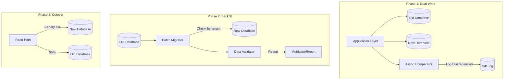
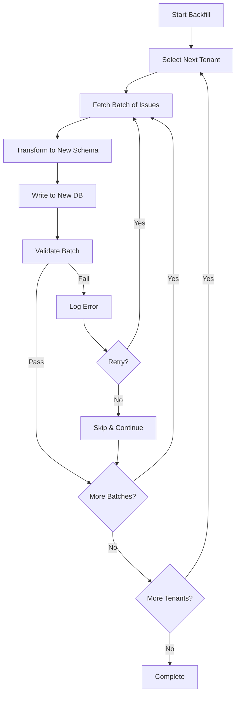
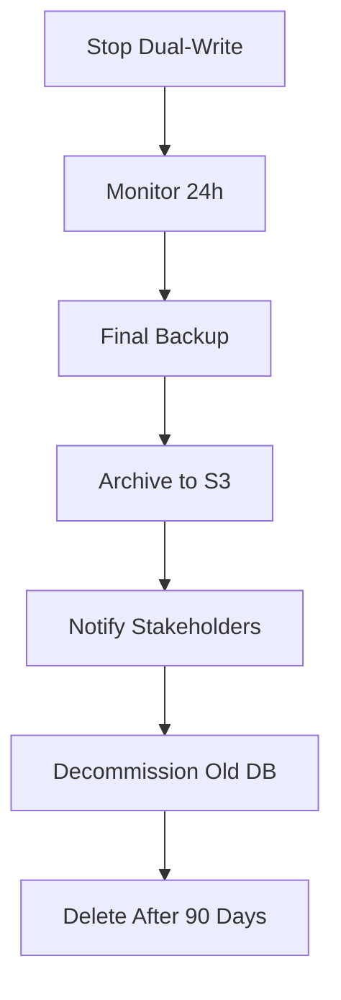

# Migration Strategy

[← Back to README](./README.md) | [← Previous: Failure Modes](./09-failure-modes-mitigation.md)

## Overview

This document describes the strategy for migrating from an existing system to the new multi-tenant architecture, or for major schema/infrastructure changes.

---

## Dual-Write Architecture



---

## Migration Phases

| Phase | Duration | Actions | Success Criteria | Rollback Criteria |
|-------|----------|---------|------------------|-------------------|
| **1. Shadow Mode** | 2 weeks | Write to both DBs, read from old | < 0.01% discrepancy rate | Any data inconsistency > 0.1% |
| **2. Backfill** | 1-2 weeks | Migrate historical data in batches | All data migrated, validated | Migration errors > 0.1% |
| **3. Canary** | 1 week | 5% of free-tier tenants on new | Error rate stable, latency normal | Error rate increase > 0.5% |
| **4. Gradual Rollout** | 2 weeks | 25% → 50% → 75% → 100% | SLOs maintained | p95 latency > 250ms |
| **5. Deprecate Old** | 1 week | Stop writes to old, archive | N/A | N/A |

---

## Phase 1: Shadow Mode (Dual-Write)

### Implementation

```go
type DualWriteService struct {
    oldDB      *sql.DB
    newDB      *sql.DB
    comparator *AsyncComparator
}

func (s *DualWriteService) CreateIssue(ctx context.Context, issue *Issue) error {
    // Write to old database (source of truth)
    err := s.createIssueOld(ctx, issue)
    if err != nil {
        return err
    }

    // Write to new database (shadow)
    go func() {
        err := s.createIssueNew(ctx, issue)
        if err != nil {
            log.Error("Shadow write failed", "issue_id", issue.ID, "error", err)
            metrics.ShadowWriteErrors.Inc()
        }

        // Compare and log discrepancies
        s.comparator.Compare(issue.ID)
    }()

    return nil
}
```

### Comparison Job

```go
type AsyncComparator struct {
    oldDB  *sql.DB
    newDB  *sql.DB
    differ *difflib.Differ
}

func (c *AsyncComparator) Compare(issueID string) {
    oldIssue, _ := c.fetchFromOld(issueID)
    newIssue, _ := c.fetchFromNew(issueID)

    diff := c.differ.Compare(oldIssue, newIssue)
    if len(diff) > 0 {
        c.logDiscrepancy(Discrepancy{
            IssueID:   issueID,
            Diff:      diff,
            Timestamp: time.Now(),
        })
        metrics.DataDiscrepancies.Inc()
    }
}
```

### Monitoring Dashboard

```yaml
panels:
  - title: "Dual-Write Success Rate"
    query: |
      sum(rate(dual_write_success_total[5m])) /
      sum(rate(dual_write_total[5m]))
    threshold: 0.9999

  - title: "Data Discrepancies"
    query: sum(rate(data_discrepancies_total[5m]))
    threshold: 0

  - title: "Shadow Write Latency"
    query: histogram_quantile(0.95, rate(shadow_write_duration_seconds_bucket[5m]))
    threshold: 0.5
```

---

## Phase 2: Backfill

### Batch Migration Strategy



### Backfill Configuration

```yaml
backfill:
  batch_size: 1000
  concurrent_tenants: 10
  rate_limit: 10000  # records per second

  retry:
    max_attempts: 3
    backoff: exponential
    initial_delay: 1s

  validation:
    sample_rate: 0.1  # Validate 10% of records
    strict_mode: false  # Continue on validation errors

  checkpoint:
    enabled: true
    storage: redis
    interval: 1000  # records
```

### Backfill Script

```python
import asyncio
from dataclasses import dataclass

@dataclass
class BackfillConfig:
    batch_size: int = 1000
    concurrent_tenants: int = 10
    checkpoint_interval: int = 1000

async def backfill_tenant(tenant_id: str, config: BackfillConfig):
    """Backfill all issues for a tenant."""

    checkpoint = load_checkpoint(tenant_id)
    last_id = checkpoint.last_issue_id if checkpoint else None

    while True:
        # Fetch batch from old database
        issues = await fetch_issues_batch(
            tenant_id=tenant_id,
            after_id=last_id,
            limit=config.batch_size
        )

        if not issues:
            break

        # Transform to new schema
        transformed = [transform_issue(issue) for issue in issues]

        # Bulk insert to new database
        await bulk_insert_issues(transformed)

        # Validate sample
        if random.random() < 0.1:
            await validate_batch(issues, transformed)

        # Update checkpoint
        last_id = issues[-1].id
        save_checkpoint(tenant_id, last_id)

        # Rate limiting
        await asyncio.sleep(len(issues) / 10000)

    mark_tenant_complete(tenant_id)

async def run_backfill():
    """Run backfill for all tenants."""

    tenants = get_all_tenants()

    # Process tenants in parallel
    semaphore = asyncio.Semaphore(10)

    async def limited_backfill(tenant):
        async with semaphore:
            await backfill_tenant(tenant.id)

    await asyncio.gather(*[limited_backfill(t) for t in tenants])
```

### Data Validation

```python
async def validate_batch(old_issues, new_issues):
    """Validate migrated data matches original."""

    errors = []

    for old, new in zip(old_issues, new_issues):
        # Check required fields
        if old.title != new.title:
            errors.append(f"Title mismatch: {old.id}")

        if old.description != new.description:
            errors.append(f"Description mismatch: {old.id}")

        # Check computed fields
        if old.issue_key != new.issue_key:
            errors.append(f"Issue key mismatch: {old.id}")

        # Check timestamps (allow small drift)
        if abs((old.created_at - new.created_at).total_seconds()) > 1:
            errors.append(f"Created_at mismatch: {old.id}")

    if errors:
        log_validation_errors(errors)
        metrics.validation_errors.inc(len(errors))

    return len(errors) == 0
```

---

## Phase 3: Canary Rollout

### Canary Tenant Selection

```yaml
canary_tenants:
  phase_1:
    tier: "free"
    criteria:
      - issues_count: "<1000"
      - dau: "<100"
      - non_critical: true
      - opted_in: true
    count: 1000  # ~0.3% of tenants

  phase_2:
    tier: ["free", "standard"]
    criteria:
      - issues_count: "<10000"
      - dau: "<500"
    count: 5000  # ~1.7% of tenants

  phase_3:
    tier: ["free", "standard"]
    criteria:
      - dau: "<2000"
    count: 30000  # ~10% of tenants
```

### Canary Selection Script

```sql
-- Select canary tenants for phase 1
SELECT t.id, t.slug, t.tier
FROM tenants t
JOIN tenant_stats ts ON t.id = ts.tenant_id
WHERE t.tier = 'free'
  AND t.status = 'active'
  AND ts.issue_count < 1000
  AND ts.daily_active_users < 100
  AND t.id NOT IN (SELECT tenant_id FROM critical_tenants)
ORDER BY ts.issue_count ASC
LIMIT 1000;
```

### Traffic Routing

```go
type TrafficRouter struct {
    canaryTenants map[string]bool
    canaryPercent float64
}

func (r *TrafficRouter) ShouldUseNewDB(tenantID string) bool {
    // Check if tenant is in canary list
    if r.canaryTenants[tenantID] {
        return true
    }

    // Percentage-based routing for gradual rollout
    hash := fnv.New32a()
    hash.Write([]byte(tenantID))
    return float64(hash.Sum32()%100) < r.canaryPercent
}

func (r *TrafficRouter) Route(ctx context.Context, tenantID string) *sql.DB {
    if r.ShouldUseNewDB(tenantID) {
        return r.newDB
    }
    return r.oldDB
}
```

### Canary Monitoring

```yaml
alerts:
  - name: CanaryErrorRateHigh
    expr: |
      sum(rate(http_requests_total{status=~"5..", canary="true"}[5m]))
      /
      sum(rate(http_requests_total{canary="true"}[5m])) > 0.005
    for: 5m
    action: pause_canary_rollout

  - name: CanaryLatencyHigh
    expr: |
      histogram_quantile(0.95,
        rate(http_request_duration_seconds_bucket{canary="true"}[5m])
      ) > 0.25
    for: 5m
    action: pause_canary_rollout
```

---

## Phase 4: Gradual Rollout

### Rollout Schedule

| Day | Percentage | Tenants | Criteria |
|-----|------------|---------|----------|
| 1 | 5% | 15,000 | Free tier, low activity |
| 3 | 10% | 30,000 | + Some standard tier |
| 5 | 25% | 75,000 | + Medium activity |
| 7 | 50% | 150,000 | All free, most standard |
| 10 | 75% | 225,000 | + Enterprise (non-whale) |
| 14 | 100% | 300,000 | All tenants |

### Rollout Automation

```go
type RolloutController struct {
    currentPercent float64
    targetPercent  float64
    stepSize       float64
    stepInterval   time.Duration
}

func (r *RolloutController) Run(ctx context.Context) {
    ticker := time.NewTicker(r.stepInterval)
    defer ticker.Stop()

    for {
        select {
        case <-ctx.Done():
            return
        case <-ticker.C:
            if r.canProgress() {
                r.incrementRollout()
            }
        }
    }
}

func (r *RolloutController) canProgress() bool {
    // Check SLOs
    errorRate := metrics.GetErrorRate("new_db")
    if errorRate > 0.005 {
        log.Warn("Error rate too high, pausing rollout", "rate", errorRate)
        return false
    }

    latency := metrics.GetP95Latency("new_db")
    if latency > 200*time.Millisecond {
        log.Warn("Latency too high, pausing rollout", "p95", latency)
        return false
    }

    return r.currentPercent < r.targetPercent
}

func (r *RolloutController) incrementRollout() {
    r.currentPercent += r.stepSize
    if r.currentPercent > r.targetPercent {
        r.currentPercent = r.targetPercent
    }

    log.Info("Rollout progressed", "percent", r.currentPercent)
    metrics.RolloutPercent.Set(r.currentPercent)

    r.updateFeatureFlag()
}
```

---

## Rollback Procedure

### Rollback Triggers

| Condition | Threshold | Action |
|-----------|-----------|--------|
| Error rate increase | > 0.5% | Automatic rollback |
| p95 latency | > 250ms for 5min | Automatic rollback |
| Data corruption detected | Any | Immediate manual rollback |
| Customer escalation | P0 ticket | Manual review |

### Rollback Script

```bash
#!/bin/bash
# rollback.sh - Emergency rollback procedure

set -e

echo "Starting rollback..."

# 1. Stop new traffic to new database
echo "Redirecting traffic to old database..."
kubectl patch configmap traffic-routing \
  -p '{"data": {"new_db_percent": "0"}}'

# 2. Wait for in-flight requests
echo "Waiting for in-flight requests..."
sleep 30

# 3. Disable dual-write
echo "Disabling dual-write..."
kubectl patch configmap migration-config \
  -p '{"data": {"dual_write_enabled": "false"}}'

# 4. Restart services to pick up config
echo "Restarting services..."
kubectl rollout restart deployment/issue-service

# 5. Verify old system is handling traffic
echo "Verifying old system..."
./scripts/verify-traffic.sh old-db

# 6. Alert on-call team
echo "Alerting on-call..."
./scripts/alert-oncall.sh "Migration rollback executed. Reason: $1"

echo "Rollback complete."
```

### Post-Rollback Analysis

```sql
-- Find records created during dual-write that may differ
SELECT
    old.id,
    old.updated_at as old_updated,
    new.updated_at as new_updated,
    CASE WHEN old.title != new.title THEN 'title' END,
    CASE WHEN old.status_id != new.status_id THEN 'status' END
FROM old_db.issues old
LEFT JOIN new_db.issues new ON old.id = new.id
WHERE old.created_at > '2026-01-01'  -- Migration start
  AND (old.title != new.title
       OR old.status_id != new.status_id
       OR new.id IS NULL);
```

---

## Phase 5: Deprecation

### Old System Shutdown



### Decommission Checklist

- [ ] Verify 100% traffic on new system for 7 days
- [ ] Final backup of old database
- [ ] Archive backup to S3 Glacier
- [ ] Document any data not migrated
- [ ] Update monitoring to remove old system
- [ ] Remove dual-write code
- [ ] Decommission old database instances
- [ ] Update documentation
- [ ] Post-migration review

---

## Next

[SLOs, Metrics & Alerting →](./11-slos-metrics-alerting.md)
