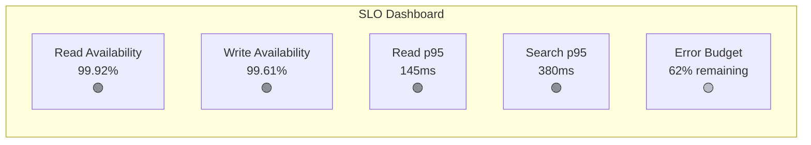

# SLOs, Metrics & Alerting

[← Back to README](./README.md) | [← Previous: Migration Strategy](./10-migration-strategy.md)

## Service Level Objectives (SLOs)

### Core SLOs

| SLO | Target | Measurement Window | Alerting Threshold |
|-----|--------|-------------------|-------------------|
| Issue read latency p95 | < 200ms | 5 minutes | > 180ms for 5min |
| Issue read latency p99 | < 500ms | 5 minutes | > 450ms for 5min |
| Issue read availability | 99.9% | 30 days rolling | < 99.85% for 5min |
| Issue write latency p95 | < 500ms | 5 minutes | > 450ms for 5min |
| Issue write availability | 99.5% | 30 days rolling | < 99.3% for 5min |
| Search latency p95 | < 500ms | 5 minutes | > 450ms for 5min |
| Search availability | 99.5% | 30 days rolling | < 99.3% for 5min |
| Search reindex lag | < 5s | 1 minute | > 10s for 5min |

### Error Budget

```
Monthly error budget (99.9% read SLA):
├── Allowed downtime: 43.8 minutes/month
├── Allowed error rate: 0.1%
└── Current burn rate: monitored in real-time

Monthly error budget (99.5% write SLA):
├── Allowed downtime: 3.6 hours/month
├── Allowed error rate: 0.5%
└── Current burn rate: monitored in real-time
```

### SLO Dashboard



---

## Key Metrics

### Request Metrics

```yaml
# Prometheus metrics configuration
metrics:
  # Request latency histogram
  - name: http_request_duration_seconds
    type: histogram
    labels: [tenant_id, service, method, endpoint, status_code]
    buckets: [0.01, 0.025, 0.05, 0.1, 0.2, 0.5, 1, 2.5, 5, 10]
    description: "HTTP request latency in seconds"

  # Request count
  - name: http_requests_total
    type: counter
    labels: [tenant_id, service, method, endpoint, status_code]
    description: "Total HTTP requests"

  # In-flight requests
  - name: http_requests_in_flight
    type: gauge
    labels: [service, endpoint]
    description: "Current in-flight requests"
```

### Tenant Metrics

```yaml
metrics:
  # Per-tenant error rate
  - name: tenant_error_rate
    type: gauge
    labels: [tenant_id, error_type]
    description: "Error rate per tenant"

  # Tenant resource usage
  - name: tenant_active_issues
    type: gauge
    labels: [tenant_id]
    description: "Number of active issues per tenant"

  - name: tenant_storage_bytes
    type: gauge
    labels: [tenant_id, storage_type]
    description: "Storage usage per tenant"

  - name: tenant_api_requests
    type: counter
    labels: [tenant_id, endpoint]
    description: "API requests per tenant"
```

### Infrastructure Metrics

```yaml
metrics:
  # Database
  - name: db_pool_connections
    type: gauge
    labels: [pool_name, state]
    description: "Database connection pool state"

  - name: db_query_duration_seconds
    type: histogram
    labels: [query_type, table]
    buckets: [0.001, 0.005, 0.01, 0.05, 0.1, 0.5, 1, 5]

  - name: db_replication_lag_seconds
    type: gauge
    labels: [replica]
    description: "Replication lag in seconds"

  # Cache
  - name: cache_hit_rate
    type: gauge
    labels: [cache_name, operation]
    description: "Cache hit rate"

  - name: cache_latency_seconds
    type: histogram
    labels: [cache_name, operation]
    buckets: [0.0001, 0.0005, 0.001, 0.005, 0.01]

  # Kafka
  - name: kafka_consumer_lag
    type: gauge
    labels: [consumer_group, topic, partition]
    description: "Kafka consumer lag"

  - name: kafka_produce_latency_seconds
    type: histogram
    labels: [topic]

  # Elasticsearch
  - name: es_query_duration_seconds
    type: histogram
    labels: [index, query_type]

  - name: es_indexing_latency_seconds
    type: histogram
    labels: [index]
```

### Search Metrics

```yaml
metrics:
  - name: search_reindex_lag_seconds
    type: gauge
    labels: [tenant_id, index_name]
    description: "Time since last successful reindex"

  - name: search_query_results_count
    type: histogram
    labels: [tenant_id]
    buckets: [0, 1, 10, 50, 100, 500, 1000]
    description: "Number of results returned"

  - name: search_fallback_total
    type: counter
    labels: [reason]
    description: "Search fallback to database"
```

---

## Alerting Rules

### SLO Alerts

```yaml
groups:
  - name: issue-tracker-slos
    rules:
      # Latency SLO alerts
      - alert: IssueReadLatencyP95High
        expr: |
          histogram_quantile(0.95,
            sum(rate(http_request_duration_seconds_bucket{
              endpoint=~"/api/v1/issues.*",
              method="GET"
            }[5m])) by (le)
          ) > 0.2
        for: 5m
        labels:
          severity: warning
          team: platform
        annotations:
          summary: "Issue read latency p95 exceeds 200ms"
          description: "Current p95: {{ $value | humanizeDuration }}"
          runbook_url: "https://runbooks.internal/issue-latency"

      - alert: IssueReadLatencyP99Critical
        expr: |
          histogram_quantile(0.99,
            sum(rate(http_request_duration_seconds_bucket{
              endpoint=~"/api/v1/issues.*",
              method="GET"
            }[5m])) by (le)
          ) > 0.5
        for: 5m
        labels:
          severity: critical
          team: platform
        annotations:
          summary: "Issue read latency p99 exceeds 500ms"
          description: "Current p99: {{ $value | humanizeDuration }}"

      # Availability SLO alerts
      - alert: IssueReadAvailabilityLow
        expr: |
          sum(rate(http_requests_total{
            endpoint=~"/api/v1/issues.*",
            method="GET",
            status_code!~"5.."
          }[5m]))
          /
          sum(rate(http_requests_total{
            endpoint=~"/api/v1/issues.*",
            method="GET"
          }[5m])) < 0.9985
        for: 5m
        labels:
          severity: critical
          team: platform
        annotations:
          summary: "Issue read availability below 99.85%"
          description: "Current availability: {{ $value | humanizePercentage }}"

      - alert: IssueWriteAvailabilityLow
        expr: |
          sum(rate(http_requests_total{
            endpoint=~"/api/v1/issues.*",
            method=~"POST|PUT|PATCH|DELETE",
            status_code!~"5.."
          }[5m]))
          /
          sum(rate(http_requests_total{
            endpoint=~"/api/v1/issues.*",
            method=~"POST|PUT|PATCH|DELETE"
          }[5m])) < 0.993
        for: 5m
        labels:
          severity: critical
          team: platform
```

### Tenant Alerts

```yaml
groups:
  - name: tenant-health
    rules:
      # Per-tenant error rate
      - alert: TenantErrorRateHigh
        expr: |
          sum(rate(http_requests_total{status_code=~"5.."}[5m])) by (tenant_id)
          /
          sum(rate(http_requests_total[5m])) by (tenant_id) > 0.01
        for: 5m
        labels:
          severity: warning
          team: platform
        annotations:
          summary: "High error rate for tenant {{ $labels.tenant_id }}"
          description: "Error rate: {{ $value | humanizePercentage }}"

      # Whale tenant monitoring
      - alert: WhaleTenantDegraded
        expr: |
          (
            sum(rate(http_requests_total{status_code=~"5.."}[5m])) by (tenant_id)
            /
            sum(rate(http_requests_total[5m])) by (tenant_id)
          )
          * on(tenant_id) group_left() (tenant_tier{tier="enterprise"}) > 0.005
        for: 2m
        labels:
          severity: critical
          team: platform
        annotations:
          summary: "Enterprise tenant {{ $labels.tenant_id }} experiencing errors"
```

### Infrastructure Alerts

```yaml
groups:
  - name: infrastructure
    rules:
      # Database
      - alert: DBReplicationLagHigh
        expr: db_replication_lag_seconds > 5
        for: 2m
        labels:
          severity: warning
          team: database
        annotations:
          summary: "Database replication lag on {{ $labels.replica }}"
          description: "Lag: {{ $value }}s"

      - alert: DBPoolExhausted
        expr: db_pool_connections{state="waiting"} > 10
        for: 2m
        labels:
          severity: critical
          team: database
        annotations:
          summary: "Database connection pool exhausted"
          description: "{{ $value }} connections waiting"

      # Cache
      - alert: CacheHitRateLow
        expr: cache_hit_rate < 0.8
        for: 10m
        labels:
          severity: warning
          team: platform
        annotations:
          summary: "Cache hit rate below 80%"
          description: "Current hit rate: {{ $value | humanizePercentage }}"

      # Kafka
      - alert: KafkaConsumerLagHigh
        expr: kafka_consumer_lag > 10000
        for: 5m
        labels:
          severity: warning
          team: platform
        annotations:
          summary: "Kafka consumer lag high for {{ $labels.consumer_group }}"
          description: "Lag: {{ $value }} messages"

      # Elasticsearch
      - alert: ESClusterYellow
        expr: es_cluster_status == 1
        for: 10m
        labels:
          severity: warning
          team: search

      - alert: ESClusterRed
        expr: es_cluster_status == 2
        for: 1m
        labels:
          severity: critical
          team: search
```

### Search Alerts

```yaml
groups:
  - name: search
    rules:
      - alert: SearchReindexLagHigh
        expr: |
          max(kafka_consumer_group_lag{group="search-indexer"}) > 10000
        for: 5m
        labels:
          severity: warning
          team: search
        annotations:
          summary: "Search indexer lag exceeds 10k messages"
          description: "Current lag: {{ $value }} messages"
          runbook_url: "https://runbooks.internal/search-lag"

      - alert: SearchFallbackActive
        expr: |
          rate(search_fallback_total[5m]) > 0
        for: 1m
        labels:
          severity: warning
          team: search
        annotations:
          summary: "Search falling back to database"
          description: "Fallback rate: {{ $value }}/s"
```

---

## Grafana Dashboards

### Overview Dashboard Panels

```
Dashboard: Issue Tracker Overview

Row 1: SLO Overview
├── Panel 1: Read Availability (30d rolling) - Gauge
├── Panel 2: Write Availability (30d rolling) - Gauge
├── Panel 3: Error Budget Remaining - Gauge
└── Panel 4: Active Incidents - Stat

Row 2: Latency
├── Panel 1: Read Latency Heatmap - Heatmap
├── Panel 2: Write Latency Heatmap - Heatmap
├── Panel 3: Search Latency Heatmap - Heatmap
└── Panel 4: Latency by Endpoint - Time Series

Row 3: Throughput
├── Panel 1: Request Rate by Service - Time Series
├── Panel 2: Error Rate by Service - Time Series
├── Panel 3: Top 10 Tenants by Traffic - Bar Chart
└── Panel 4: Events Published/Consumed - Time Series

Row 4: Infrastructure
├── Panel 1: Database Connections & Latency - Time Series
├── Panel 2: Cache Hit Rate - Gauge
├── Panel 3: Kafka Consumer Lag - Time Series
└── Panel 4: Elasticsearch Cluster Health - Stat
```

### Dashboard JSON Example

```json
{
  "dashboard": {
    "title": "Issue Tracker - SLO Dashboard",
    "panels": [
      {
        "title": "Read Availability (30d)",
        "type": "gauge",
        "gridPos": {"h": 6, "w": 6, "x": 0, "y": 0},
        "targets": [
          {
            "expr": "sum(increase(http_requests_total{endpoint=~\"/api/v1/issues.*\",method=\"GET\",status_code!~\"5..\"}[30d])) / sum(increase(http_requests_total{endpoint=~\"/api/v1/issues.*\",method=\"GET\"}[30d]))",
            "legendFormat": "Availability"
          }
        ],
        "fieldConfig": {
          "defaults": {
            "thresholds": {
              "steps": [
                {"value": 0, "color": "red"},
                {"value": 0.99, "color": "yellow"},
                {"value": 0.999, "color": "green"}
              ]
            },
            "unit": "percentunit",
            "min": 0.99,
            "max": 1
          }
        }
      },
      {
        "title": "Read Latency p95",
        "type": "timeseries",
        "gridPos": {"h": 8, "w": 12, "x": 0, "y": 6},
        "targets": [
          {
            "expr": "histogram_quantile(0.95, sum(rate(http_request_duration_seconds_bucket{endpoint=~\"/api/v1/issues.*\",method=\"GET\"}[5m])) by (le))",
            "legendFormat": "p95"
          },
          {
            "expr": "histogram_quantile(0.99, sum(rate(http_request_duration_seconds_bucket{endpoint=~\"/api/v1/issues.*\",method=\"GET\"}[5m])) by (le))",
            "legendFormat": "p99"
          }
        ],
        "fieldConfig": {
          "defaults": {
            "unit": "s",
            "thresholds": {
              "steps": [
                {"value": 0, "color": "green"},
                {"value": 0.2, "color": "yellow"},
                {"value": 0.5, "color": "red"}
              ]
            }
          }
        }
      }
    ]
  }
}
```

---

## On-Call Setup

### Escalation Policy

```yaml
escalation_policies:
  - name: platform-on-call
    teams: [platform]
    steps:
      - notify: primary_on_call
        timeout: 5m
      - notify: secondary_on_call
        timeout: 10m
      - notify: engineering_manager
        timeout: 15m
      - notify: vp_engineering

  - name: critical-incident
    teams: [platform, database, search]
    steps:
      - notify: all_on_call
        timeout: 2m
      - notify: incident_commander
        timeout: 5m
```

### Alert Routing

```yaml
route:
  receiver: 'slack-platform'
  group_by: ['alertname', 'tenant_id']
  group_wait: 30s
  group_interval: 5m
  repeat_interval: 4h

  routes:
    - match:
        severity: critical
      receiver: 'pagerduty-platform'
      continue: true

    - match:
        team: database
      receiver: 'slack-database'

    - match:
        team: search
      receiver: 'slack-search'

receivers:
  - name: 'pagerduty-platform'
    pagerduty_configs:
      - service_key: '<pagerduty_key>'

  - name: 'slack-platform'
    slack_configs:
      - channel: '#platform-alerts'
        send_resolved: true
```

---

## Error Budget Policies

### Budget Consumption Actions

| Budget Remaining | Actions |
|-----------------|---------|
| > 50% | Normal operations, feature development |
| 25-50% | Increased monitoring, careful deployments |
| 10-25% | Feature freeze, focus on reliability |
| < 10% | Incident mode, all hands on reliability |

### Error Budget Burn Rate

```yaml
# Fast burn (high urgency)
- alert: ErrorBudgetFastBurn
  expr: |
    (
      1 - (
        sum(rate(http_requests_total{status_code!~"5.."}[1h]))
        / sum(rate(http_requests_total[1h]))
      )
    ) > 14.4 * (1 - 0.999)
  for: 2m
  labels:
    severity: critical
  annotations:
    summary: "Error budget burning too fast (14.4x rate)"

# Slow burn (lower urgency)
- alert: ErrorBudgetSlowBurn
  expr: |
    (
      1 - (
        sum(rate(http_requests_total{status_code!~"5.."}[6h]))
        / sum(rate(http_requests_total[6h]))
      )
    ) > 6 * (1 - 0.999)
  for: 1h
  labels:
    severity: warning
```

---

## Next

[Operational Runbooks →](./12-operational-runbooks.md)
