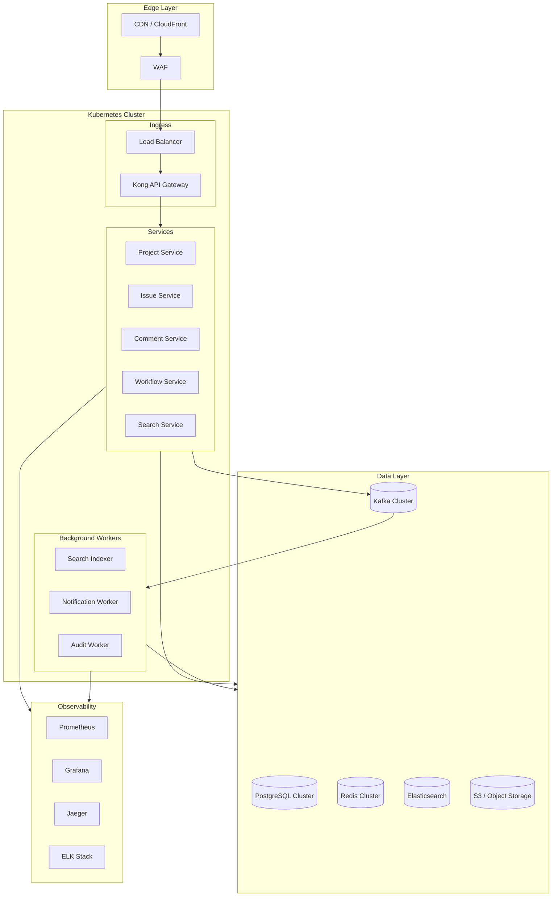

# Technology Stack

[← Back to README](./README.md) | [← Previous: Operational Runbooks](./12-operational-runbooks.md)

## Technology Choices

| Layer | Technology | Version | Justification |
|-------|------------|---------|---------------|
| **API Gateway** | Kong | 3.x | Rate limiting, auth, plugins ecosystem |
| **Core Services** | Go | 1.22+ | Performance, low memory, excellent concurrency |
| **Service Framework** | gRPC + REST | - | gRPC for internal, REST for public API |
| **Primary Database** | PostgreSQL | 16+ | ACID, RLS, partitioning, JSONB |
| **Database HA** | Patroni | 3.x | Automatic failover, consensus-based |
| **Cache** | Redis Cluster | 7.x | Sub-ms reads, pub/sub, Lua scripting |
| **Search** | Elasticsearch | 8.x | Full-text, aggregations, nested objects |
| **Message Queue** | Apache Kafka | 3.x | Durability, ordering, exactly-once |
| **Object Storage** | S3 / GCS | - | Attachments, audit archives |
| **CDN** | CloudFront / Cloudflare | - | Static assets, API caching at edge |
| **Container Orchestration** | Kubernetes | 1.28+ | Scheduling, scaling, service mesh |
| **Service Mesh** | Istio | 1.20+ | mTLS, observability, traffic management |
| **Monitoring** | Prometheus + Grafana | - | Metrics collection, visualization |
| **Tracing** | Jaeger | 1.x | Distributed tracing |
| **Logging** | ELK Stack | 8.x | Centralized logs |
| **Alerting** | PagerDuty | - | On-call management, escalations |
| **Feature Flags** | LaunchDarkly / Unleash | - | Gradual rollouts, kill switches |
| **Secrets Management** | HashiCorp Vault | 1.x | Secrets rotation, dynamic credentials |

---

## Infrastructure Diagram



---

## Detailed Technology Decisions

### API Gateway: Kong

**Why Kong:**
- Open-source with enterprise features
- Declarative configuration (GitOps friendly)
- Rich plugin ecosystem (rate limiting, auth, logging)
- High performance (built on nginx/OpenResty)
- Kubernetes-native with Ingress Controller

**Alternatives Considered:**
| Alternative | Why Not Chosen |
|-------------|----------------|
| AWS API Gateway | Vendor lock-in, cost at scale |
| Envoy | More complex to operate |
| Nginx | Fewer built-in features |

### Core Services: Go

**Why Go:**
- Excellent performance and low memory footprint
- Built-in concurrency primitives (goroutines, channels)
- Fast compilation and deployment
- Strong typing with simplicity
- Great ecosystem for microservices (gRPC, stdlib)

**Service Template:**
```go
// Standard service structure
pkg/
├── api/           # HTTP/gRPC handlers
├── domain/        # Business logic
├── repository/    # Data access
├── kafka/         # Event publishing
└── config/        # Configuration

cmd/
└── server/        # Main entrypoint
```

**Alternatives Considered:**
| Alternative | Why Not Chosen |
|-------------|----------------|
| Java/Spring | Higher memory footprint |
| Rust | Steeper learning curve, slower development |
| Node.js | Single-threaded, memory issues at scale |

### Database: PostgreSQL

**Why PostgreSQL:**
- ACID compliance for financial-grade data integrity
- Row-Level Security for tenant isolation
- Native partitioning (hash, range)
- JSONB for flexible schema fields
- Excellent performance with proper indexing
- Mature ecosystem (Patroni, pgBouncer)

**Key Features Used:**
```sql
-- Row-Level Security
ALTER TABLE issues ENABLE ROW LEVEL SECURITY;

-- Partitioning
CREATE TABLE issues (...) PARTITION BY HASH (tenant_id);

-- JSONB for custom fields
custom_fields JSONB DEFAULT '{}';

-- Full-text search fallback
CREATE INDEX idx_issues_title_gin ON issues USING gin(to_tsvector('english', title));
```

**Alternatives Considered:**
| Alternative | Why Not Chosen |
|-------------|----------------|
| MySQL | Weaker RLS support |
| CockroachDB | Higher latency, cost |
| MongoDB | No ACID, complex migrations |

### Cache: Redis Cluster

**Why Redis:**
- Sub-millisecond latency
- Rich data structures (strings, hashes, sorted sets)
- Pub/Sub for cache invalidation
- Lua scripting for atomic operations
- Cluster mode for horizontal scaling

**Use Cases:**
```
Session storage       → Strings with TTL
Issue cache          → Hashes
Rate limiting        → Sorted sets + Lua
Cache invalidation   → Pub/Sub
Distributed locks    → Redlock algorithm
```

**Alternatives Considered:**
| Alternative | Why Not Chosen |
|-------------|----------------|
| Memcached | No persistence, simpler data types |
| Hazelcast | More complex, Java-centric |

### Search: Elasticsearch

**Why Elasticsearch:**
- Powerful full-text search with analyzers
- Near real-time indexing (~1 second)
- Aggregations for faceted search
- Nested documents for comments
- Horizontal scaling with sharding

**Index Configuration:**
```json
{
  "settings": {
    "number_of_shards": 10,
    "number_of_replicas": 2,
    "refresh_interval": "1s"
  }
}
```

**Alternatives Considered:**
| Alternative | Why Not Chosen |
|-------------|----------------|
| OpenSearch | Forked, smaller community |
| Algolia | Cost at scale, vendor lock-in |
| PostgreSQL FTS | Performance at scale |
| Typesense | Less mature |

### Message Queue: Apache Kafka

**Why Kafka:**
- Durable message storage with replay
- Strong ordering guarantees per partition
- Exactly-once semantics support
- High throughput (millions of messages/sec)
- Mature ecosystem (Connect, Streams)

**Topic Design:**
```
issues.created     → 16 partitions, 7d retention
issues.updated     → 16 partitions, 7d retention
audit.events       → 32 partitions, 30d retention
```

**Alternatives Considered:**
| Alternative | Why Not Chosen |
|-------------|----------------|
| RabbitMQ | Less durable, no replay |
| AWS SQS | Vendor lock-in, no ordering |
| Pulsar | Less mature ecosystem |
| NATS | Simpler but less feature-rich |

### Container Orchestration: Kubernetes

**Why Kubernetes:**
- Industry standard for container orchestration
- Declarative configuration
- Auto-scaling (HPA, VPA)
- Service discovery and load balancing
- Rich ecosystem (Helm, operators)

**Key Resources:**
```yaml
# Deployment with HPA
apiVersion: apps/v1
kind: Deployment
metadata:
  name: issue-service
spec:
  replicas: 30
  strategy:
    type: RollingUpdate
    rollingUpdate:
      maxSurge: 25%
      maxUnavailable: 0
```

### Service Mesh: Istio

**Why Istio:**
- Automatic mTLS between services
- Traffic management (canary, circuit breaking)
- Observability (metrics, traces)
- Rate limiting at mesh level

**Alternatives Considered:**
| Alternative | Why Not Chosen |
|-------------|----------------|
| Linkerd | Fewer features |
| Consul Connect | HashiCorp ecosystem required |
| No mesh | Manual mTLS, harder observability |

---

## Observability Stack

### Metrics: Prometheus + Grafana

```yaml
# Prometheus scrape config
scrape_configs:
  - job_name: 'kubernetes-pods'
    kubernetes_sd_configs:
      - role: pod
    relabel_configs:
      - source_labels: [__meta_kubernetes_pod_annotation_prometheus_io_scrape]
        action: keep
        regex: true
```

### Tracing: Jaeger

```go
// OpenTelemetry tracer initialization
tp := trace.NewTracerProvider(
    trace.WithBatcher(jaegerExporter),
    trace.WithResource(resource.NewWithAttributes(
        semconv.ServiceNameKey.String("issue-service"),
    )),
)
```

### Logging: ELK Stack

```json
// Structured log format
{
  "timestamp": "2026-01-12T10:30:00.000Z",
  "level": "INFO",
  "service": "issue-service",
  "trace_id": "abc123",
  "span_id": "def456",
  "tenant_id": "tenant-uuid",
  "message": "Issue created",
  "issue_id": "issue-uuid"
}
```

---

## Security Components

### Secrets Management: HashiCorp Vault

**Use Cases:**
- Database credentials (dynamic)
- API keys rotation
- Encryption keys
- TLS certificates

```bash
# Dynamic database credentials
vault read database/creds/issue-service-role
```

### Authentication: JWT + OAuth2

**Token Structure:**
```json
{
  "sub": "user-uuid",
  "tenant_id": "tenant-uuid",
  "roles": ["admin"],
  "iat": 1704967200,
  "exp": 1704970800
}
```

---

## Development Tools

| Tool | Purpose |
|------|---------|
| **Make** | Build automation |
| **Docker Compose** | Local development |
| **Tilt** | K8s development workflow |
| **golangci-lint** | Go linting |
| **sqlc** | Type-safe SQL |
| **buf** | Protobuf management |
| **k6** | Load testing |
| **Postman/Bruno** | API testing |

---

## Cloud Provider Mapping

### AWS

| Component | AWS Service |
|-----------|-------------|
| Kubernetes | EKS |
| PostgreSQL | RDS for PostgreSQL |
| Redis | ElastiCache |
| Kafka | MSK |
| Elasticsearch | OpenSearch Service |
| Object Storage | S3 |
| CDN | CloudFront |
| Secrets | Secrets Manager |
| DNS | Route 53 |

### GCP

| Component | GCP Service |
|-----------|-------------|
| Kubernetes | GKE |
| PostgreSQL | Cloud SQL |
| Redis | Memorystore |
| Kafka | Confluent Cloud |
| Elasticsearch | Elastic Cloud |
| Object Storage | Cloud Storage |
| CDN | Cloud CDN |
| Secrets | Secret Manager |
| DNS | Cloud DNS |

---

## Version Requirements

```yaml
# Minimum versions
runtime:
  go: "1.22"
  node: "20"  # For frontend

databases:
  postgresql: "16"
  redis: "7.0"
  elasticsearch: "8.11"

infrastructure:
  kubernetes: "1.28"
  kafka: "3.6"
  istio: "1.20"
```

---

## Appendix

### A. Glossary

| Term | Definition |
|------|------------|
| **Tenant** | An organization using the issue tracker |
| **RLS** | Row-Level Security - PostgreSQL feature |
| **DAU** | Daily Active Users |
| **SLO** | Service Level Objective |
| **SLA** | Service Level Agreement |
| **RTO** | Recovery Time Objective |
| **RPO** | Recovery Point Objective |

### B. Change Log

| Date | Version | Author | Changes |
|------|---------|--------|---------|
| 2026-01-12 | 1.0 | System Design | Initial design document |

---

## Quick Links

- [README - Start Here](./README.md)
- [Architecture Overview](./01-high-level-architecture.md)
- [Data Modeling](./04-data-modeling.md)
- [Runbooks](./12-operational-runbooks.md)
