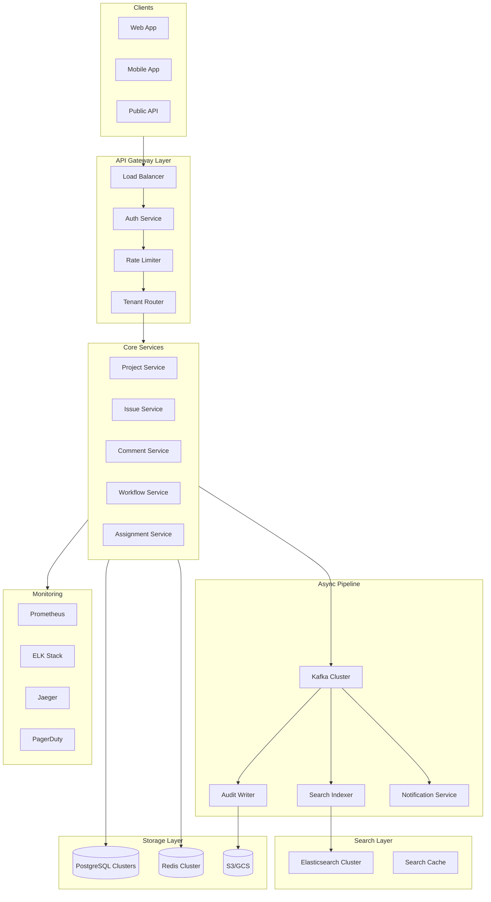

# Multi-Tenant Issue Tracking System Design

## Overview

A comprehensive system design for a multi-tenant issue tracking platform supporting:

| Metric | Target |
|--------|--------|
| **Tenants** | 300,000 (non-uniform: whales + small orgs) |
| **DAU** | 50,000,000 users |
| **Total Issues** | 10,000,000,000 |
| **Read SLA** | 99.9% availability |
| **Write SLA** | 99.5% availability |
| **Read Latency** | p95 < 200ms |

## System Architecture



## Design Goals

1. **Strong Multi-Tenancy**: Complete data isolation with no cross-tenant data leakage
2. **Sub-200ms Reads**: Fast issue retrieval for optimal user experience
3. **Powerful Search**: Full-text search across issues, comments, and custom fields
4. **Complete Audit Trail**: Every change tracked for compliance and debugging
5. **Flexible Workflows**: Customizable issue states and transitions per project
6. **High Availability**: 99.9% uptime for read operations, 99.5% for writes

## Documentation Structure

| # | Document | Description |
|---|----------|-------------|
| 1 | [High-Level Architecture](./01-high-level-architecture.md) | System components, request flows, component responsibilities |
| 2 | [Multi-Tenancy Strategy](./02-multi-tenancy-strategy.md) | Data isolation models, tenant routing, RLS policies |
| 3 | [Core Services Design](./03-core-services-design.md) | Service responsibilities, API contracts, caching strategies |
| 4 | [Data Modeling](./04-data-modeling.md) | Database schema, partitioning, indexes, ERD |
| 5 | [Search Infrastructure](./05-search-infrastructure.md) | Elasticsearch design, indexing pipeline, query patterns |
| 6 | [Event-Driven Pipeline](./06-event-driven-pipeline.md) | Kafka topics, event schemas, consumer groups |
| 7 | [Audit Trail System](./07-audit-trail-system.md) | Audit logging, storage tiers, query API |
| 8 | [Capacity Planning](./08-capacity-planning.md) | Storage estimates, QPS calculations, cluster sizing |
| 9 | [Failure Modes & Mitigation](./09-failure-modes-mitigation.md) | Failure scenarios, circuit breakers, tenant isolation |
| 10 | [Migration Strategy](./10-migration-strategy.md) | Dual-write, backfill, canary rollout, rollback |
| 11 | [SLOs, Metrics & Alerting](./11-slos-metrics-alerting.md) | SLO targets, Prometheus metrics, alerting rules |
| 12 | [Operational Runbooks](./12-operational-runbooks.md) | Tenant isolation incident, search degradation |
| 13 | [Technology Stack](./13-technology-stack.md) | Technology choices and justifications |

## Quick Links

- [Database Schema](./04-data-modeling.md#core-schema-design)
- [Elasticsearch Index Design](./05-search-infrastructure.md#elasticsearch-index-design)
- [Kafka Topic Design](./06-event-driven-pipeline.md#kafka-topic-design)
- [SLO Targets](./11-slos-metrics-alerting.md#service-level-objectives)
- [Runbook: Tenant Isolation](./12-operational-runbooks.md#runbook-tenant-isolation-incident)
- [Runbook: Search Degradation](./12-operational-runbooks.md#runbook-search-degradation)

## Technology Stack Summary

| Layer | Technology | Purpose |
|-------|------------|---------|
| API Gateway | Kong | Rate limiting, auth, tenant routing |
| Core Services | Go | Performance, low memory, concurrency |
| Primary Database | PostgreSQL 16 | ACID, RLS, partitioning, JSONB |
| Cache | Redis Cluster | Sub-ms reads, pub/sub invalidation |
| Search | Elasticsearch 8.x | Full-text, aggregations, nested objects |
| Message Queue | Kafka | Durability, ordering, replay |
| Object Storage | S3/GCS | Attachments, audit archives |
| Monitoring | Prometheus + Grafana | Metrics, alerting, dashboards |
| Tracing | Jaeger | Distributed tracing |
| Logging | ELK Stack | Centralized logs |

## Capacity Overview

```
Read Operations:  ~12K QPS (peak: 60K QPS)
Write Operations: ~1K QPS (peak: 5K QPS)

Storage:
├── Issues:        20TB (10B records × 2KB)
├── Comments:      30TB (30B records × 1KB)
├── History:       50TB (100B records × 500B)
├── Search Index:  30TB
└── Attachments:   1PB
```

## Contributing

When updating this design:

1. Update the relevant section document
2. Update the README if adding new sections
3. Ensure all Mermaid diagrams render correctly
4. Update the changelog in the Technology Stack document
