# Multi-Tenant Issue Tracking System Design

## Overview

A comprehensive system design for a multi-tenant issue tracking platform supporting:

- **300k tenants** (non-uniform: whales + small orgs)
- **50M DAU** across all tenants
- **10B total issues** with full audit history
- **99.9% read SLA**, **99.5% write SLA**
- **p95 read latency < 200ms**

### Business Context

Teams need a reliable, scalable issue tracking system to manage projects, track bugs, plan features, and collaborate efficiently. The system must support organizations of all sizes—from small startups to enterprise companies with thousands of users—while maintaining strict data isolation between tenants.

### Goals

1. **Strong Multi-Tenancy**: Complete data isolation with no cross-tenant data leakage
2. **Sub-200ms Reads**: Fast issue retrieval for optimal user experience
3. **Powerful Search**: Full-text search across issues, comments, and custom fields
4. **Complete Audit Trail**: Every change tracked for compliance and debugging
5. **Flexible Workflows**: Customizable issue states and transitions per project
6. **High Availability**: 99.9% uptime for read operations, 99.5% for writes

---

## Table of Contents

1. [High-Level Architecture](#1-high-level-architecture)
2. [Multi-Tenancy Strategy](#2-multi-tenancy-strategy)
3. [Core Services Design](#3-core-services-design)
4. [Data Modeling (Deep Dive)](#4-data-modeling-deep-dive)
5. [Search Infrastructure](#5-search-infrastructure)
6. [Event-Driven Pipeline](#6-event-driven-pipeline)
7. [Audit Trail System](#7-audit-trail-system)
8. [Capacity Planning](#8-capacity-planning)
9. [Failure Modes and Mitigation](#9-failure-modes-and-mitigation)
10. [Migration Strategy](#10-migration-strategy)
11. [SLOs, Metrics, and Alerting](#11-slos-metrics-and-alerting)
12. [Operational Runbooks](#12-operational-runbooks)
13. [Technology Stack Summary](#13-technology-stack-summary)

---

## 1. High-Level Architecture

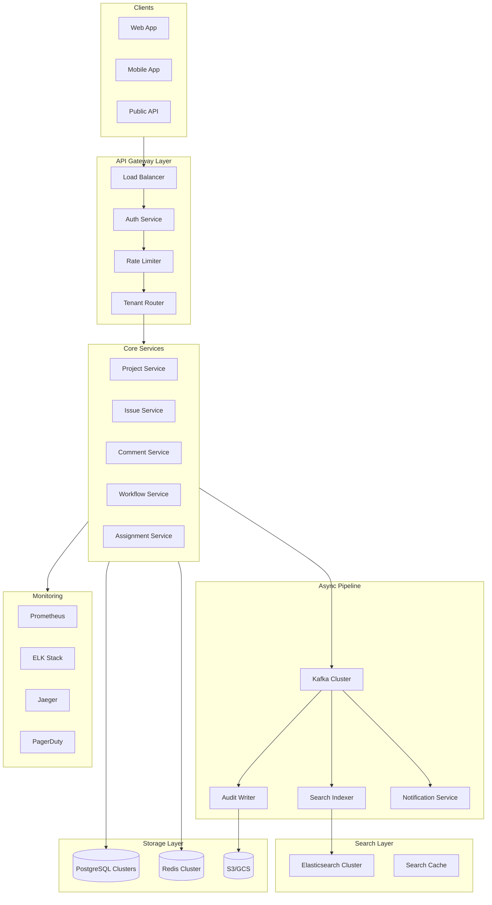

### Component Overview

| Layer | Components | Purpose |
|-------|------------|---------|
| **Clients** | Web, Mobile, Public API | User interfaces and integrations |
| **API Gateway** | Load Balancer, Auth, Rate Limiter, Tenant Router | Request routing, authentication, throttling |
| **Core Services** | Project, Issue, Comment, Workflow, Assignment | Business logic and data operations |
| **Async Pipeline** | Kafka, Indexer, Audit Writer, Notifications | Event processing and async operations |
| **Search Layer** | Elasticsearch, Search Cache | Full-text search and caching |
| **Storage** | PostgreSQL, Redis, S3/GCS | Persistent storage and caching |
| **Observability** | Prometheus, ELK, Jaeger, PagerDuty | Monitoring, logging, tracing, alerting |

---

## 2. Multi-Tenancy Strategy

### Data Isolation Model: Hybrid Approach

We use a tiered multi-tenancy model based on customer tier to optimize for both isolation requirements and operational efficiency:

| Tenant Tier | Strategy | Isolation Level | Description |
|-------------|----------|-----------------|-------------|
| **Enterprise (Whales)** | Dedicated Schema | Strong | Own PostgreSQL schema per tenant, dedicated connection pools |
| **Standard** | Shared Schema + Row-Level Security | Medium | `tenant_id` column with RLS policies |
| **Free/Trial** | Shared Everything | Basic | Shared tables with tenant_id filtering |

### Why Hybrid Multi-Tenancy?

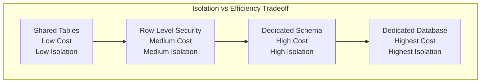

**Rationale:**
- **Enterprise customers** pay premium prices and require strong isolation guarantees (compliance, security audits)
- **Standard customers** need good isolation but can share infrastructure for cost efficiency
- **Free/trial users** generate minimal revenue; maximize density to control costs

### Tenant Routing Architecture

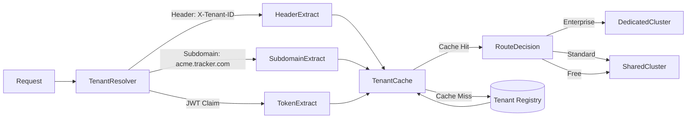

### Tenant Resolution Methods

| Method | Use Case | Priority |
|--------|----------|----------|
| **JWT Claim** | API requests with bearer token | 1 (highest) |
| **X-Tenant-ID Header** | Service-to-service calls | 2 |
| **Subdomain** | Web app access (acme.tracker.com) | 3 |
| **Path Prefix** | Public API (/v1/tenants/{id}/...) | 4 |

### Tenant Context Propagation

```go
// Middleware to extract and propagate tenant context
func TenantMiddleware(next http.Handler) http.Handler {
    return http.HandlerFunc(func(w http.ResponseWriter, r *http.Request) {
        tenantID, err := resolveTenant(r)
        if err != nil {
            http.Error(w, "Invalid tenant", http.StatusUnauthorized)
            return
        }

        // Add tenant to context
        ctx := context.WithValue(r.Context(), TenantKey, tenantID)

        // Set PostgreSQL session variable for RLS
        // This is done at connection acquisition from pool

        next.ServeHTTP(w, r.WithContext(ctx))
    })
}
```

---

## 3. Core Services Design

### Service Responsibilities

| Service | Responsibilities | Database | Cache Strategy |
|---------|-----------------|----------|----------------|
| **Project Service** | CRUD projects, members, permissions, settings | PostgreSQL | Write-through (5min TTL) |
| **Issue Service** | CRUD issues, attachments, labels, milestones | PostgreSQL | Write-behind, invalidation |
| **Comment Service** | Comments, mentions, reactions | PostgreSQL | Read-through (2min TTL) |
| **Workflow Service** | State machine, transitions, automations | PostgreSQL | Warm cache on startup |
| **Assignment Service** | Assignees, watchers, teams | PostgreSQL | Event-driven invalidation |

### Service Communication Patterns

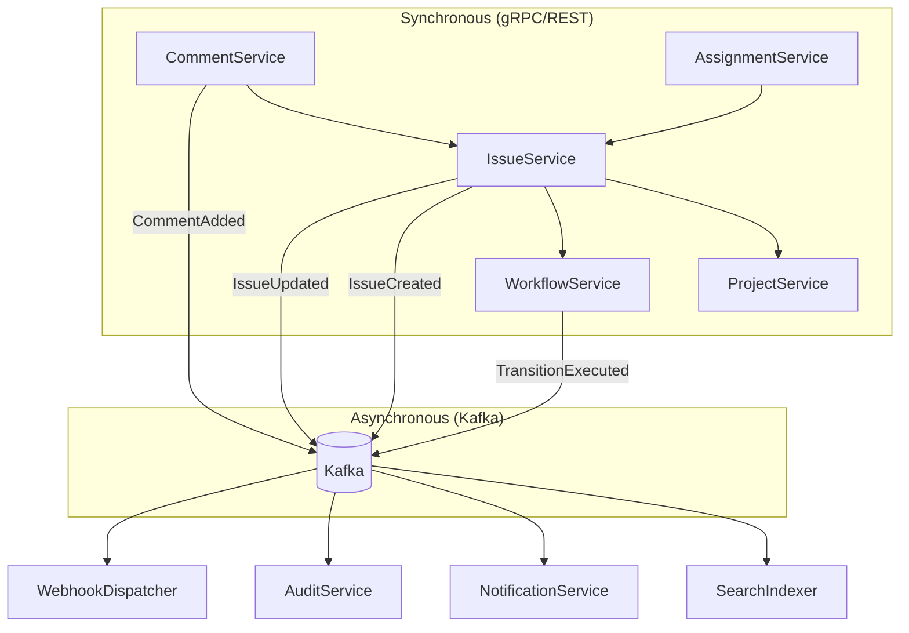

### Issue Service Deep Dive

The Issue Service is the core of the system, handling the most critical operations:

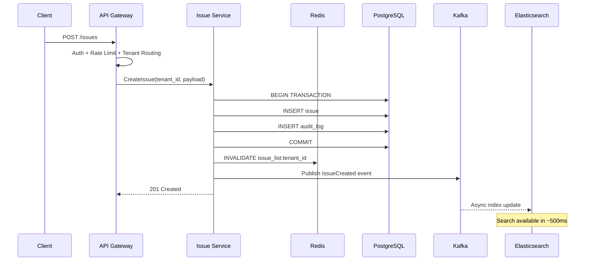

### Issue Read Flow (Optimized for p95 < 200ms)

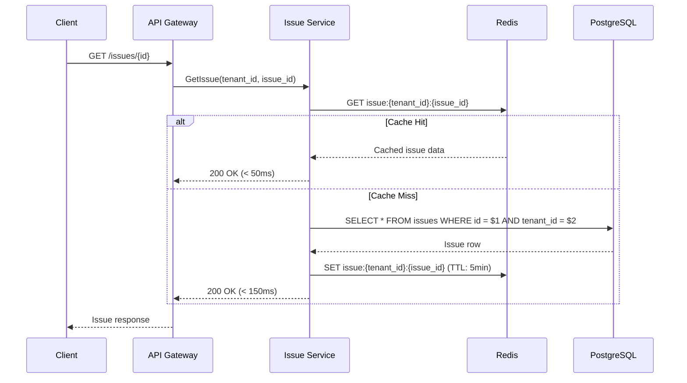

### API Contracts

#### Create Issue

```http
POST /api/v1/projects/{project_key}/issues
Content-Type: application/json
Authorization: Bearer {token}
X-Tenant-ID: {tenant_id}

{
  "title": "Login button not working on Safari",
  "description": "Users report the login button is unresponsive...",
  "type": "bug",
  "priority": 2,
  "assignee_id": "uuid",
  "labels": ["frontend", "critical"],
  "custom_fields": {
    "browser": "Safari 17.0",
    "os": "macOS Sonoma"
  }
}
```

#### Response

```json
{
  "id": "uuid",
  "project_id": "uuid",
  "issue_number": 1234,
  "key": "PROJ-1234",
  "title": "Login button not working on Safari",
  "status": {
    "id": "uuid",
    "name": "Open",
    "category": "todo"
  },
  "priority": 2,
  "reporter": {
    "id": "uuid",
    "name": "Jane Doe",
    "avatar_url": "..."
  },
  "assignee": {
    "id": "uuid",
    "name": "John Smith",
    "avatar_url": "..."
  },
  "labels": ["frontend", "critical"],
  "created_at": "2026-01-12T10:30:00Z",
  "updated_at": "2026-01-12T10:30:00Z"
}
```

---

## 4. Data Modeling (Deep Dive)

### Entity Relationship Diagram

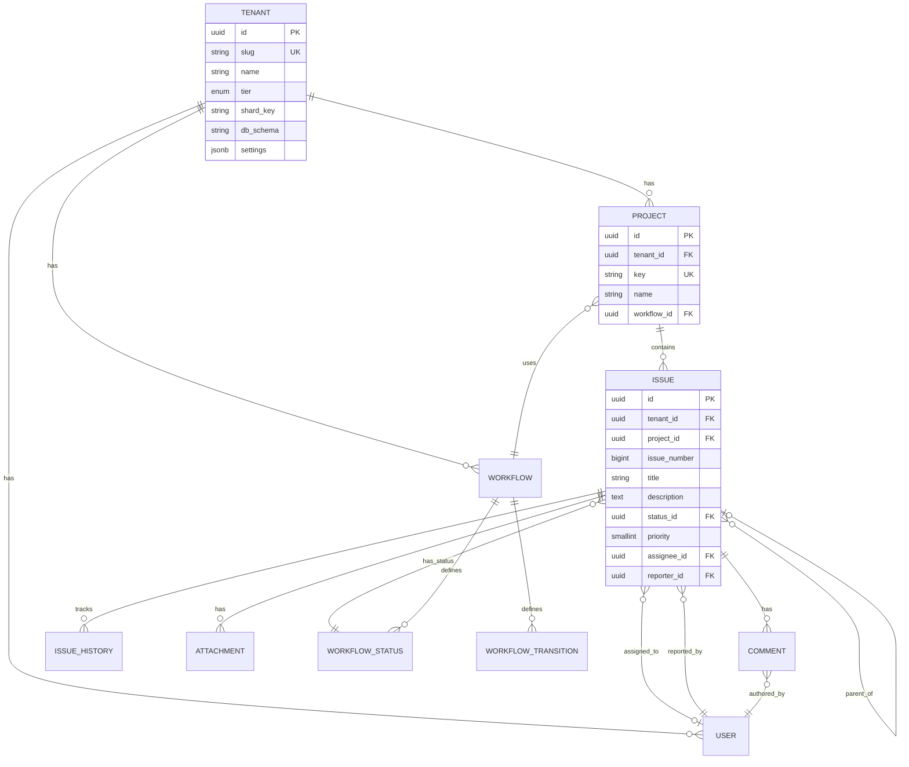

### Core Schema Design

```sql
-- ============================================
-- TENANT REGISTRY (Separate database)
-- ============================================

CREATE TABLE tenants (
    id UUID PRIMARY KEY DEFAULT gen_random_uuid(),
    slug VARCHAR(63) UNIQUE NOT NULL,
    name VARCHAR(255) NOT NULL,
    tier VARCHAR(20) NOT NULL DEFAULT 'free'
        CHECK (tier IN ('free', 'standard', 'enterprise')),
    shard_key VARCHAR(16) NOT NULL,  -- For routing to correct DB cluster
    db_schema VARCHAR(63),            -- Schema name for enterprise tenants
    settings JSONB DEFAULT '{}',
    feature_flags JSONB DEFAULT '{}',
    created_at TIMESTAMPTZ DEFAULT NOW(),
    updated_at TIMESTAMPTZ DEFAULT NOW(),
    deleted_at TIMESTAMPTZ  -- Soft delete
);

CREATE INDEX idx_tenants_slug ON tenants(slug);
CREATE INDEX idx_tenants_tier ON tenants(tier);

-- ============================================
-- USERS
-- ============================================

CREATE TABLE users (
    id UUID PRIMARY KEY DEFAULT gen_random_uuid(),
    tenant_id UUID NOT NULL REFERENCES tenants(id),
    email VARCHAR(255) NOT NULL,
    name VARCHAR(255) NOT NULL,
    avatar_url TEXT,
    role VARCHAR(50) NOT NULL DEFAULT 'member'
        CHECK (role IN ('owner', 'admin', 'member', 'viewer')),
    settings JSONB DEFAULT '{}',
    last_active_at TIMESTAMPTZ,
    created_at TIMESTAMPTZ DEFAULT NOW(),
    updated_at TIMESTAMPTZ DEFAULT NOW(),
    UNIQUE(tenant_id, email)
);

CREATE INDEX idx_users_tenant ON users(tenant_id);
CREATE INDEX idx_users_email ON users(tenant_id, email);

-- ============================================
-- WORKFLOWS
-- ============================================

CREATE TABLE workflows (
    id UUID PRIMARY KEY DEFAULT gen_random_uuid(),
    tenant_id UUID NOT NULL REFERENCES tenants(id),
    name VARCHAR(255) NOT NULL,
    description TEXT,
    is_default BOOLEAN DEFAULT FALSE,
    created_at TIMESTAMPTZ DEFAULT NOW(),
    updated_at TIMESTAMPTZ DEFAULT NOW(),
    UNIQUE(tenant_id, name)
);

CREATE TABLE workflow_statuses (
    id UUID PRIMARY KEY DEFAULT gen_random_uuid(),
    workflow_id UUID NOT NULL REFERENCES workflows(id) ON DELETE CASCADE,
    name VARCHAR(100) NOT NULL,
    category VARCHAR(20) NOT NULL
        CHECK (category IN ('todo', 'in_progress', 'done')),
    color VARCHAR(7),  -- Hex color code
    position SMALLINT NOT NULL,
    is_initial BOOLEAN DEFAULT FALSE,
    is_final BOOLEAN DEFAULT FALSE,
    created_at TIMESTAMPTZ DEFAULT NOW(),
    UNIQUE(workflow_id, name),
    UNIQUE(workflow_id, position)
);

CREATE TABLE workflow_transitions (
    id UUID PRIMARY KEY DEFAULT gen_random_uuid(),
    workflow_id UUID NOT NULL REFERENCES workflows(id) ON DELETE CASCADE,
    from_status_id UUID REFERENCES workflow_statuses(id),  -- NULL = any status
    to_status_id UUID NOT NULL REFERENCES workflow_statuses(id),
    name VARCHAR(100) NOT NULL,
    conditions JSONB DEFAULT '{}',   -- Permission rules, field requirements
    automations JSONB DEFAULT '{}',  -- Actions on transition (assign, notify, etc.)
    created_at TIMESTAMPTZ DEFAULT NOW()
);

CREATE INDEX idx_transitions_from ON workflow_transitions(from_status_id);
CREATE INDEX idx_transitions_to ON workflow_transitions(to_status_id);

-- ============================================
-- PROJECTS
-- ============================================

CREATE TABLE projects (
    id UUID PRIMARY KEY DEFAULT gen_random_uuid(),
    tenant_id UUID NOT NULL REFERENCES tenants(id),
    key VARCHAR(10) NOT NULL,  -- e.g., "PROJ", "BUG"
    name VARCHAR(255) NOT NULL,
    description TEXT,
    workflow_id UUID NOT NULL REFERENCES workflows(id),
    lead_id UUID REFERENCES users(id),
    issue_counter BIGINT DEFAULT 0,  -- For sequential issue numbers
    settings JSONB DEFAULT '{}',
    archived_at TIMESTAMPTZ,
    created_at TIMESTAMPTZ DEFAULT NOW(),
    updated_at TIMESTAMPTZ DEFAULT NOW(),
    UNIQUE(tenant_id, key)
);

CREATE INDEX idx_projects_tenant ON projects(tenant_id);

-- ============================================
-- ISSUES (Partitioned by tenant_id for performance)
-- ============================================

CREATE TABLE issues (
    id UUID NOT NULL DEFAULT gen_random_uuid(),
    tenant_id UUID NOT NULL,
    project_id UUID NOT NULL,
    issue_number BIGINT NOT NULL,  -- Per-project sequential (PROJ-123)

    -- Core fields
    title VARCHAR(500) NOT NULL,
    description TEXT,
    description_html TEXT,  -- Pre-rendered for performance

    -- Classification
    issue_type VARCHAR(50) NOT NULL DEFAULT 'task'
        CHECK (issue_type IN ('bug', 'task', 'story', 'epic', 'subtask')),
    priority SMALLINT NOT NULL DEFAULT 3 CHECK (priority BETWEEN 1 AND 5),

    -- Status
    status_id UUID NOT NULL,
    resolution VARCHAR(50),  -- 'fixed', 'wontfix', 'duplicate', etc.

    -- People
    reporter_id UUID NOT NULL,
    assignee_id UUID,

    -- Hierarchy
    parent_issue_id UUID,
    epic_id UUID,

    -- Metadata
    labels JSONB DEFAULT '[]',
    custom_fields JSONB DEFAULT '{}',

    -- Planning
    due_date DATE,
    estimated_hours DECIMAL(10,2),
    story_points SMALLINT,
    sprint_id UUID,

    -- Timestamps
    created_at TIMESTAMPTZ DEFAULT NOW(),
    updated_at TIMESTAMPTZ DEFAULT NOW(),
    resolved_at TIMESTAMPTZ,

    -- Constraints
    PRIMARY KEY (id, tenant_id),
    UNIQUE(project_id, issue_number)
) PARTITION BY HASH (tenant_id);

-- Create 32 partitions (can be adjusted based on tenant distribution)
CREATE TABLE issues_p0 PARTITION OF issues FOR VALUES WITH (MODULUS 32, REMAINDER 0);
CREATE TABLE issues_p1 PARTITION OF issues FOR VALUES WITH (MODULUS 32, REMAINDER 1);
CREATE TABLE issues_p2 PARTITION OF issues FOR VALUES WITH (MODULUS 32, REMAINDER 2);
CREATE TABLE issues_p3 PARTITION OF issues FOR VALUES WITH (MODULUS 32, REMAINDER 3);
CREATE TABLE issues_p4 PARTITION OF issues FOR VALUES WITH (MODULUS 32, REMAINDER 4);
CREATE TABLE issues_p5 PARTITION OF issues FOR VALUES WITH (MODULUS 32, REMAINDER 5);
CREATE TABLE issues_p6 PARTITION OF issues FOR VALUES WITH (MODULUS 32, REMAINDER 6);
CREATE TABLE issues_p7 PARTITION OF issues FOR VALUES WITH (MODULUS 32, REMAINDER 7);
CREATE TABLE issues_p8 PARTITION OF issues FOR VALUES WITH (MODULUS 32, REMAINDER 8);
CREATE TABLE issues_p9 PARTITION OF issues FOR VALUES WITH (MODULUS 32, REMAINDER 9);
CREATE TABLE issues_p10 PARTITION OF issues FOR VALUES WITH (MODULUS 32, REMAINDER 10);
CREATE TABLE issues_p11 PARTITION OF issues FOR VALUES WITH (MODULUS 32, REMAINDER 11);
CREATE TABLE issues_p12 PARTITION OF issues FOR VALUES WITH (MODULUS 32, REMAINDER 12);
CREATE TABLE issues_p13 PARTITION OF issues FOR VALUES WITH (MODULUS 32, REMAINDER 13);
CREATE TABLE issues_p14 PARTITION OF issues FOR VALUES WITH (MODULUS 32, REMAINDER 14);
CREATE TABLE issues_p15 PARTITION OF issues FOR VALUES WITH (MODULUS 32, REMAINDER 15);
CREATE TABLE issues_p16 PARTITION OF issues FOR VALUES WITH (MODULUS 32, REMAINDER 16);
CREATE TABLE issues_p17 PARTITION OF issues FOR VALUES WITH (MODULUS 32, REMAINDER 17);
CREATE TABLE issues_p18 PARTITION OF issues FOR VALUES WITH (MODULUS 32, REMAINDER 18);
CREATE TABLE issues_p19 PARTITION OF issues FOR VALUES WITH (MODULUS 32, REMAINDER 19);
CREATE TABLE issues_p20 PARTITION OF issues FOR VALUES WITH (MODULUS 32, REMAINDER 20);
CREATE TABLE issues_p21 PARTITION OF issues FOR VALUES WITH (MODULUS 32, REMAINDER 21);
CREATE TABLE issues_p22 PARTITION OF issues FOR VALUES WITH (MODULUS 32, REMAINDER 22);
CREATE TABLE issues_p23 PARTITION OF issues FOR VALUES WITH (MODULUS 32, REMAINDER 23);
CREATE TABLE issues_p24 PARTITION OF issues FOR VALUES WITH (MODULUS 32, REMAINDER 24);
CREATE TABLE issues_p25 PARTITION OF issues FOR VALUES WITH (MODULUS 32, REMAINDER 25);
CREATE TABLE issues_p26 PARTITION OF issues FOR VALUES WITH (MODULUS 32, REMAINDER 26);
CREATE TABLE issues_p27 PARTITION OF issues FOR VALUES WITH (MODULUS 32, REMAINDER 27);
CREATE TABLE issues_p28 PARTITION OF issues FOR VALUES WITH (MODULUS 32, REMAINDER 28);
CREATE TABLE issues_p29 PARTITION OF issues FOR VALUES WITH (MODULUS 32, REMAINDER 29);
CREATE TABLE issues_p30 PARTITION OF issues FOR VALUES WITH (MODULUS 32, REMAINDER 30);
CREATE TABLE issues_p31 PARTITION OF issues FOR VALUES WITH (MODULUS 32, REMAINDER 31);

-- ============================================
-- ISSUE HISTORY (Audit Trail) - Partitioned by time
-- ============================================

CREATE TABLE issue_history (
    id UUID NOT NULL DEFAULT gen_random_uuid(),
    tenant_id UUID NOT NULL,
    issue_id UUID NOT NULL,
    user_id UUID NOT NULL,

    field_name VARCHAR(100) NOT NULL,
    old_value JSONB,
    new_value JSONB,
    change_type VARCHAR(20) NOT NULL
        CHECK (change_type IN ('create', 'update', 'delete')),

    -- Request context for debugging
    request_id UUID,
    ip_address INET,
    user_agent TEXT,

    created_at TIMESTAMPTZ NOT NULL DEFAULT NOW(),

    PRIMARY KEY (id, created_at)
) PARTITION BY RANGE (created_at);

-- Create quarterly partitions
CREATE TABLE issue_history_2025_q1 PARTITION OF issue_history
    FOR VALUES FROM ('2025-01-01') TO ('2025-04-01');
CREATE TABLE issue_history_2025_q2 PARTITION OF issue_history
    FOR VALUES FROM ('2025-04-01') TO ('2025-07-01');
CREATE TABLE issue_history_2025_q3 PARTITION OF issue_history
    FOR VALUES FROM ('2025-07-01') TO ('2025-10-01');
CREATE TABLE issue_history_2025_q4 PARTITION OF issue_history
    FOR VALUES FROM ('2025-10-01') TO ('2026-01-01');
CREATE TABLE issue_history_2026_q1 PARTITION OF issue_history
    FOR VALUES FROM ('2026-01-01') TO ('2026-04-01');
CREATE TABLE issue_history_2026_q2 PARTITION OF issue_history
    FOR VALUES FROM ('2026-04-01') TO ('2026-07-01');

-- ============================================
-- COMMENTS
-- ============================================

CREATE TABLE comments (
    id UUID PRIMARY KEY DEFAULT gen_random_uuid(),
    tenant_id UUID NOT NULL,
    issue_id UUID NOT NULL,
    parent_id UUID REFERENCES comments(id),  -- For threaded comments

    author_id UUID NOT NULL,
    body TEXT NOT NULL,
    body_html TEXT,  -- Pre-rendered markdown

    mentions UUID[] DEFAULT '{}',  -- User IDs mentioned
    reactions JSONB DEFAULT '{}',  -- {"👍": ["user1", "user2"], "❤️": ["user3"]}

    is_internal BOOLEAN DEFAULT FALSE,  -- Internal notes not visible to reporters
    is_resolution BOOLEAN DEFAULT FALSE,  -- Marked as resolution comment

    edited_at TIMESTAMPTZ,
    created_at TIMESTAMPTZ DEFAULT NOW(),
    updated_at TIMESTAMPTZ DEFAULT NOW(),
    deleted_at TIMESTAMPTZ  -- Soft delete
);

CREATE INDEX idx_comments_issue ON comments(issue_id, created_at);
CREATE INDEX idx_comments_author ON comments(author_id);

-- ============================================
-- ATTACHMENTS
-- ============================================

CREATE TABLE attachments (
    id UUID PRIMARY KEY DEFAULT gen_random_uuid(),
    tenant_id UUID NOT NULL,
    issue_id UUID NOT NULL,
    comment_id UUID REFERENCES comments(id),  -- Optional: attached to comment

    uploader_id UUID NOT NULL,
    filename VARCHAR(255) NOT NULL,
    content_type VARCHAR(100) NOT NULL,
    size_bytes BIGINT NOT NULL,
    storage_key TEXT NOT NULL,  -- S3/GCS path

    thumbnail_key TEXT,  -- For images
    metadata JSONB DEFAULT '{}',  -- dimensions, duration, etc.

    created_at TIMESTAMPTZ DEFAULT NOW(),
    deleted_at TIMESTAMPTZ
);

CREATE INDEX idx_attachments_issue ON attachments(issue_id);

-- ============================================
-- LABELS
-- ============================================

CREATE TABLE labels (
    id UUID PRIMARY KEY DEFAULT gen_random_uuid(),
    tenant_id UUID NOT NULL,
    project_id UUID REFERENCES projects(id),  -- NULL = org-wide label

    name VARCHAR(100) NOT NULL,
    color VARCHAR(7) NOT NULL,  -- Hex color
    description TEXT,

    created_at TIMESTAMPTZ DEFAULT NOW(),
    UNIQUE(tenant_id, project_id, name)
);

-- ============================================
-- INDEXES FOR COMMON QUERY PATTERNS
-- ============================================

-- Issue list queries (most common)
CREATE INDEX idx_issues_tenant_project ON issues(tenant_id, project_id);
CREATE INDEX idx_issues_tenant_status ON issues(tenant_id, status_id);
CREATE INDEX idx_issues_tenant_assignee ON issues(tenant_id, assignee_id)
    WHERE assignee_id IS NOT NULL;
CREATE INDEX idx_issues_tenant_updated ON issues(tenant_id, updated_at DESC);
CREATE INDEX idx_issues_tenant_created ON issues(tenant_id, created_at DESC);

-- Filter by type and priority
CREATE INDEX idx_issues_type ON issues(tenant_id, issue_type);
CREATE INDEX idx_issues_priority ON issues(tenant_id, priority)
    WHERE priority <= 2;  -- High priority issues

-- Hierarchy queries
CREATE INDEX idx_issues_parent ON issues(parent_issue_id)
    WHERE parent_issue_id IS NOT NULL;
CREATE INDEX idx_issues_epic ON issues(epic_id)
    WHERE epic_id IS NOT NULL;

-- Full-text search fallback (when Elasticsearch is down)
CREATE INDEX idx_issues_title_gin ON issues
    USING gin(to_tsvector('english', title));
CREATE INDEX idx_issues_description_gin ON issues
    USING gin(to_tsvector('english', description))
    WHERE description IS NOT NULL;

-- History queries
CREATE INDEX idx_history_issue ON issue_history(issue_id, created_at DESC);
CREATE INDEX idx_history_user ON issue_history(user_id, created_at DESC);
CREATE INDEX idx_history_tenant ON issue_history(tenant_id, created_at DESC);
```

### Partitioning Strategy

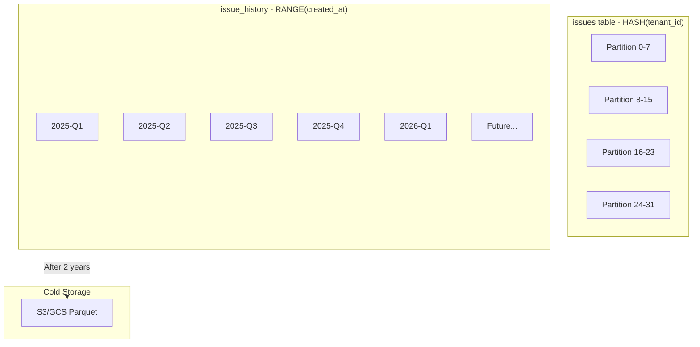

### Row-Level Security (RLS) for Tenant Isolation

```sql
-- Enable RLS on all tenant-scoped tables
ALTER TABLE issues ENABLE ROW LEVEL SECURITY;
ALTER TABLE comments ENABLE ROW LEVEL SECURITY;
ALTER TABLE issue_history ENABLE ROW LEVEL SECURITY;
ALTER TABLE projects ENABLE ROW LEVEL SECURITY;

-- Policy: Users can only see their tenant's data
CREATE POLICY tenant_isolation_issues ON issues
    FOR ALL
    USING (tenant_id = current_setting('app.current_tenant')::uuid);

CREATE POLICY tenant_isolation_comments ON comments
    FOR ALL
    USING (tenant_id = current_setting('app.current_tenant')::uuid);

CREATE POLICY tenant_isolation_history ON issue_history
    FOR ALL
    USING (tenant_id = current_setting('app.current_tenant')::uuid);

CREATE POLICY tenant_isolation_projects ON projects
    FOR ALL
    USING (tenant_id = current_setting('app.current_tenant')::uuid);

-- Application sets this at connection time
-- SET app.current_tenant = 'tenant-uuid-here';
```

### Issue Number Generation

Sequential issue numbers (PROJ-123) require careful handling at scale:

```sql
-- Atomic issue number generation using advisory locks
CREATE OR REPLACE FUNCTION next_issue_number(p_project_id UUID)
RETURNS BIGINT AS $$
DECLARE
    v_next_number BIGINT;
BEGIN
    -- Acquire advisory lock for this project
    PERFORM pg_advisory_xact_lock(hashtext(p_project_id::text));

    -- Increment and return
    UPDATE projects
    SET issue_counter = issue_counter + 1
    WHERE id = p_project_id
    RETURNING issue_counter INTO v_next_number;

    RETURN v_next_number;
END;
$$ LANGUAGE plpgsql;
```

---

## 5. Search Infrastructure

### Search Requirements

| Requirement | Target | Notes |
|-------------|--------|-------|
| Search latency p95 | < 500ms | Including network |
| Indexing lag | < 5 seconds | From write to searchable |
| Query types | Full-text, filters, facets | Boolean, phrase, fuzzy |
| Result freshness | Near real-time | Eventual consistency acceptable |

### Elasticsearch Index Design

```json
{
  "settings": {
    "number_of_shards": 10,
    "number_of_replicas": 2,
    "refresh_interval": "1s",
    "analysis": {
      "analyzer": {
        "autocomplete": {
          "type": "custom",
          "tokenizer": "standard",
          "filter": ["lowercase", "autocomplete_filter"]
        },
        "autocomplete_search": {
          "type": "custom",
          "tokenizer": "standard",
          "filter": ["lowercase"]
        }
      },
      "filter": {
        "autocomplete_filter": {
          "type": "edge_ngram",
          "min_gram": 2,
          "max_gram": 20
        }
      }
    }
  },
  "mappings": {
    "properties": {
      "tenant_id": {
        "type": "keyword",
        "doc_values": true
      },
      "project_id": {
        "type": "keyword",
        "doc_values": true
      },
      "project_key": {
        "type": "keyword"
      },
      "issue_number": {
        "type": "long"
      },
      "issue_key": {
        "type": "keyword"
      },
      "title": {
        "type": "text",
        "analyzer": "english",
        "fields": {
          "keyword": {
            "type": "keyword",
            "ignore_above": 500
          },
          "autocomplete": {
            "type": "text",
            "analyzer": "autocomplete",
            "search_analyzer": "autocomplete_search"
          }
        }
      },
      "description": {
        "type": "text",
        "analyzer": "english"
      },
      "status": {
        "type": "keyword"
      },
      "status_category": {
        "type": "keyword"
      },
      "issue_type": {
        "type": "keyword"
      },
      "priority": {
        "type": "integer"
      },
      "labels": {
        "type": "keyword"
      },
      "assignee_id": {
        "type": "keyword"
      },
      "assignee_name": {
        "type": "text",
        "fields": {
          "keyword": { "type": "keyword" }
        }
      },
      "reporter_id": {
        "type": "keyword"
      },
      "reporter_name": {
        "type": "text",
        "fields": {
          "keyword": { "type": "keyword" }
        }
      },
      "created_at": {
        "type": "date"
      },
      "updated_at": {
        "type": "date"
      },
      "resolved_at": {
        "type": "date"
      },
      "due_date": {
        "type": "date"
      },
      "custom_fields": {
        "type": "object",
        "enabled": true
      },
      "comments": {
        "type": "nested",
        "properties": {
          "id": { "type": "keyword" },
          "body": { "type": "text", "analyzer": "english" },
          "author_id": { "type": "keyword" },
          "created_at": { "type": "date" }
        }
      }
    }
  }
}
```

### Index per Tenant Strategy

For enterprise tenants with high volume, we use dedicated indices:

```
issue-tracker-shared-2026.01     # Shared index for free/standard tenants
issue-tracker-acme-corp          # Dedicated index for enterprise tenant
issue-tracker-bigtech-inc        # Dedicated index for enterprise tenant
```

### Search Architecture

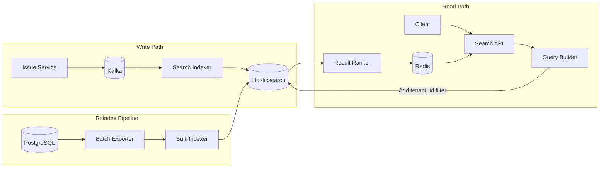

### Search Query Flow

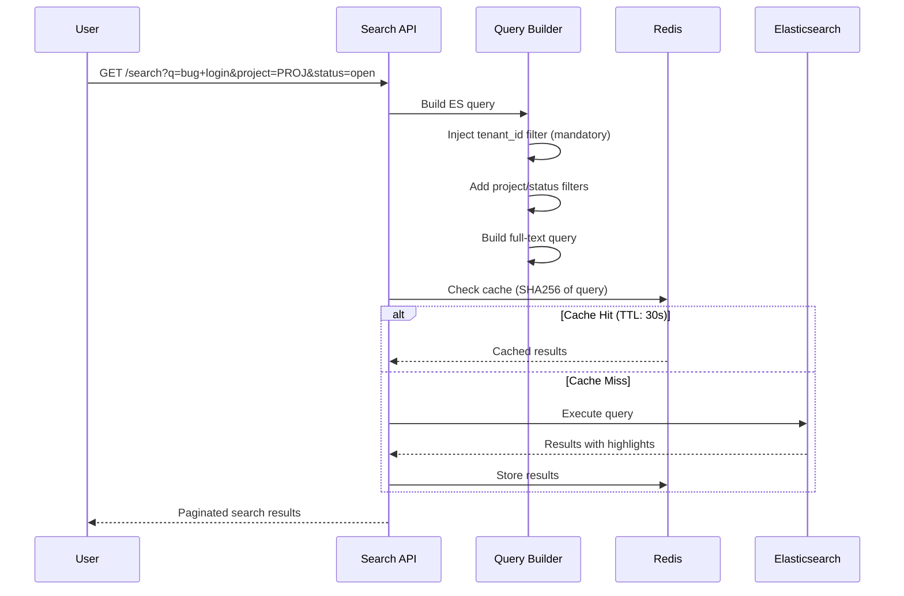

### Search Query Example

```json
{
  "query": {
    "bool": {
      "filter": [
        { "term": { "tenant_id": "tenant-uuid" } },
        { "term": { "project_key": "PROJ" } },
        { "term": { "status_category": "todo" } }
      ],
      "must": [
        {
          "multi_match": {
            "query": "login button not working",
            "fields": ["title^3", "description", "comments.body"],
            "type": "best_fields",
            "fuzziness": "AUTO"
          }
        }
      ]
    }
  },
  "highlight": {
    "fields": {
      "title": {},
      "description": { "fragment_size": 150 }
    }
  },
  "sort": [
    { "_score": "desc" },
    { "updated_at": "desc" }
  ],
  "from": 0,
  "size": 20
}
```

### Fallback to Database Search

When Elasticsearch is degraded, fallback to PostgreSQL full-text search:

```sql
-- Fallback search query using PostgreSQL
SELECT id, title, ts_rank(search_vector, query) AS rank
FROM issues,
     websearch_to_tsquery('english', $1) query
WHERE tenant_id = $2
  AND project_id = $3
  AND search_vector @@ query
ORDER BY rank DESC
LIMIT 20;
```

---

## 6. Event-Driven Pipeline

### Kafka Topic Design

| Topic | Partition Key | Partitions | Purpose |
|-------|---------------|------------|---------|
| `issues.created` | tenant_id | 16 | New issue events |
| `issues.updated` | tenant_id | 16 | Field change events |
| `issues.deleted` | tenant_id | 8 | Soft delete events |
| `issues.transitions` | tenant_id | 16 | Workflow transitions |
| `comments.created` | tenant_id | 8 | New comments |
| `comments.updated` | tenant_id | 8 | Comment edits |
| `search.reindex` | issue_id | 8 | Triggered reindex requests |
| `audit.events` | tenant_id | 32 | All auditable actions |
| `notifications.email` | user_id | 16 | Email notifications |
| `notifications.push` | user_id | 8 | Push notifications |
| `webhooks.outbound` | tenant_id | 8 | Webhook deliveries |

### Event Schema (CloudEvents-compatible)

```json
{
  "specversion": "1.0",
  "id": "550e8400-e29b-41d4-a716-446655440000",
  "type": "com.issuetracker.issue.updated",
  "source": "/tenants/tenant-uuid/projects/proj-uuid/issues/issue-uuid",
  "subject": "PROJ-1234",
  "time": "2026-01-12T10:30:00.000Z",
  "datacontenttype": "application/json",
  "data": {
    "tenant_id": "tenant-uuid",
    "project_id": "proj-uuid",
    "issue_id": "issue-uuid",
    "issue_key": "PROJ-1234",
    "actor": {
      "user_id": "user-uuid",
      "name": "Jane Doe",
      "ip_address": "10.0.0.1"
    },
    "changes": [
      {
        "field": "status",
        "old_value": { "id": "status-1", "name": "Open" },
        "new_value": { "id": "status-2", "name": "In Progress" }
      },
      {
        "field": "assignee_id",
        "old_value": null,
        "new_value": "user-uuid-2"
      }
    ],
    "metadata": {
      "request_id": "req-uuid",
      "trace_id": "trace-uuid",
      "source": "api",
      "version": 5
    }
  }
}
```

### Consumer Groups

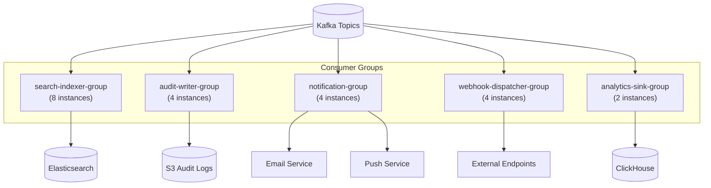

### Consumer Processing Guarantees

| Consumer | Semantics | Ordering | Idempotency Strategy |
|----------|-----------|----------|----------------------|
| Search Indexer | At-least-once | Per tenant | Version field in document |
| Audit Writer | Exactly-once | Per tenant | Dedup by event_id in Kafka transactions |
| Notification Service | At-least-once | Per user | Dedup by event_id + user_id |
| Webhook Dispatcher | At-least-once | Per tenant | Include idempotency key in payload |
| Analytics Sink | At-least-once | None | Dedup in ClickHouse by event_id |

### Dead Letter Queue (DLQ) Handling

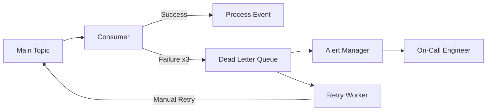

---

## 7. Audit Trail System

### Audit Requirements

- **Completeness**: Every state change must be recorded
- **Immutability**: Audit logs cannot be modified or deleted
- **Queryability**: Fast queries for compliance and debugging
- **Retention**: 7 years for compliance (configurable per tenant)

### Audit Log Storage Tiers

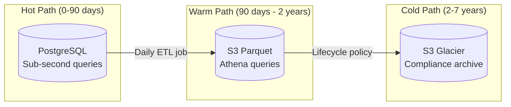

### Audit Event Structure

```json
{
  "id": "audit-uuid",
  "timestamp": "2026-01-12T10:30:00.000Z",
  "tenant_id": "tenant-uuid",

  "actor": {
    "type": "user",
    "id": "user-uuid",
    "email": "jane@example.com",
    "ip_address": "10.0.0.1",
    "user_agent": "Mozilla/5.0...",
    "auth_method": "oauth2"
  },

  "action": "issue.update",
  "outcome": "success",

  "resource": {
    "type": "issue",
    "id": "issue-uuid",
    "key": "PROJ-1234",
    "project_id": "project-uuid"
  },

  "changes": [
    {
      "field": "status",
      "old_value": "open",
      "new_value": "in_progress"
    }
  ],

  "context": {
    "request_id": "req-uuid",
    "trace_id": "trace-uuid",
    "source": "web_app",
    "session_id": "session-uuid"
  }
}
```

### Audit Query API

```http
GET /api/v1/audit?
  tenant_id=xxx&
  entity_type=issue&
  entity_id=xxx&
  from=2026-01-01T00:00:00Z&
  to=2026-01-12T23:59:59Z&
  actor_id=xxx&
  action=issue.update&
  page=1&
  limit=50

Authorization: Bearer {token}
```

### Response

```json
{
  "data": [
    {
      "id": "audit-uuid",
      "timestamp": "2026-01-12T10:30:00.000Z",
      "actor": {
        "id": "user-uuid",
        "name": "Jane Doe",
        "email": "jane@example.com"
      },
      "action": "issue.update",
      "resource": {
        "type": "issue",
        "id": "issue-uuid",
        "key": "PROJ-1234"
      },
      "changes": [
        {
          "field": "status",
          "old_value": "open",
          "new_value": "in_progress"
        }
      ]
    }
  ],
  "pagination": {
    "page": 1,
    "limit": 50,
    "total": 1234,
    "has_more": true
  }
}
```

---

## 8. Capacity Planning

### Scale Parameters

| Metric | Value |
|--------|-------|
| Total Tenants | 300,000 |
| DAU (Daily Active Users) | 50,000,000 |
| Total Issues | 10,000,000,000 |
| Total Comments | ~30,000,000,000 |
| Avg Issues per Tenant | ~33,000 |
| Read SLA | 99.9% |
| Write SLA | 99.5% |

### Storage Estimates

| Data Type | Records | Avg Size | Total Storage | Monthly Growth |
|-----------|---------|----------|---------------|----------------|
| Issues | 10B | 2KB | 20TB | 200GB |
| Comments | 30B | 1KB | 30TB | 300GB |
| Issue History | 100B | 500B | 50TB | 500GB |
| Search Index | 10B docs | 3KB | 30TB | 300GB |
| Attachments | 1B | 1MB avg | 1PB | 10TB |
| Audit Logs (hot) | 10B | 1KB | 10TB | 100GB |

### Read/Write Load Analysis

```
Total Issues: 10B
DAU: 50M users
Avg sessions/user/day: 5
Avg actions/session: 20

Read Operations:
├── Issue list views: 250M/day = ~2,900 QPS
├── Issue detail views: 500M/day = ~5,800 QPS
├── Search queries: 100M/day = ~1,160 QPS
├── Comment loads: 200M/day = ~2,300 QPS
└── Total reads: ~12K QPS (peak 5x: 60K QPS)

Write Operations:
├── Issue creates: 5M/day = ~58 QPS
├── Issue updates: 50M/day = ~580 QPS
├── Comments: 25M/day = ~290 QPS
├── Attachments: 5M/day = ~58 QPS
└── Total writes: ~1K QPS (peak 5x: 5K QPS)
```

### Database Cluster Sizing

| Cluster | Purpose | Nodes | Spec per Node |
|---------|---------|-------|---------------|
| Primary (Issues) | OLTP workload | 5 (1 primary + 4 replicas) | 64 vCPU, 256GB RAM, 4TB NVMe |
| Tenant Registry | Metadata | 3 (1 primary + 2 replicas) | 8 vCPU, 32GB RAM, 500GB SSD |
| Audit DB | Write-heavy | 3 (1 primary + 2 replicas) | 32 vCPU, 128GB RAM, 2TB NVMe |

### Elasticsearch Cluster Sizing

| Role | Nodes | Spec per Node |
|------|-------|---------------|
| Master | 3 | 8 vCPU, 16GB RAM, 100GB SSD |
| Data (Hot) | 12 | 32 vCPU, 128GB RAM, 2TB NVMe |
| Data (Warm) | 6 | 16 vCPU, 64GB RAM, 8TB HDD |
| Coordinating | 4 | 16 vCPU, 32GB RAM |

### Redis Cluster Sizing

| Purpose | Nodes | Memory per Node |
|---------|-------|-----------------|
| Issue Cache | 6 (3 primary + 3 replica) | 64GB |
| Session Cache | 4 (2 primary + 2 replica) | 32GB |
| Rate Limiting | 4 (2 primary + 2 replica) | 16GB |

### Kafka Cluster Sizing

| Metric | Value |
|--------|-------|
| Brokers | 9 (3 racks × 3 brokers) |
| Storage per broker | 2TB NVMe |
| Replication factor | 3 |
| Avg message size | 2KB |
| Messages/second | ~50K |
| Retention | 7 days |

---

## 9. Failure Modes and Mitigation

### Failure Scenarios Matrix

| Failure Mode | Detection | Impact | Mitigation | RTO | RPO |
|--------------|-----------|--------|------------|-----|-----|
| Primary DB down | Health checks, connection errors | Write unavailable | Promote replica via Patroni | 30s | 0 (sync replication) |
| DB replica lag | Replication lag metric | Stale reads | Route to primary, alert | N/A | N/A |
| Search cluster degraded | Latency alerts, error rates | Search slow/unavailable | Fallback to DB full-text | N/A (graceful) | N/A |
| Kafka broker failure | Under-replicated partitions | Event delay | Automatic partition reassignment | 5min | 0 (replication) |
| Redis cluster failure | Connection errors | Higher latency | DB fallback, degraded mode | 2min | N/A |
| Tenant data leak | Audit anomaly detection | Security incident | Immediate isolation | N/A | N/A |
| Search reindex lag | Consumer lag metric | Stale search results | Scale indexers | N/A | N/A |
| DDoS on tenant | Rate limit alerts | Service degradation | Aggressive rate limiting | Immediate | N/A |

### Circuit Breaker Pattern

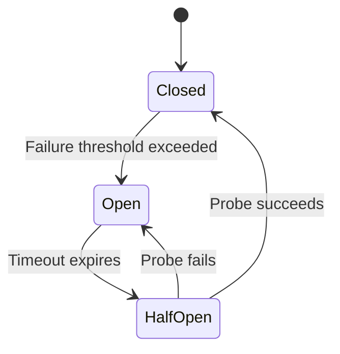

**Configuration:**
```yaml
circuit_breaker:
  elasticsearch:
    failure_threshold: 5
    success_threshold: 3
    timeout_seconds: 30
  redis:
    failure_threshold: 10
    success_threshold: 5
    timeout_seconds: 10
  external_webhooks:
    failure_threshold: 3
    success_threshold: 2
    timeout_seconds: 60
```

### Tenant Isolation Safeguards

Defense-in-depth approach to prevent cross-tenant data access:

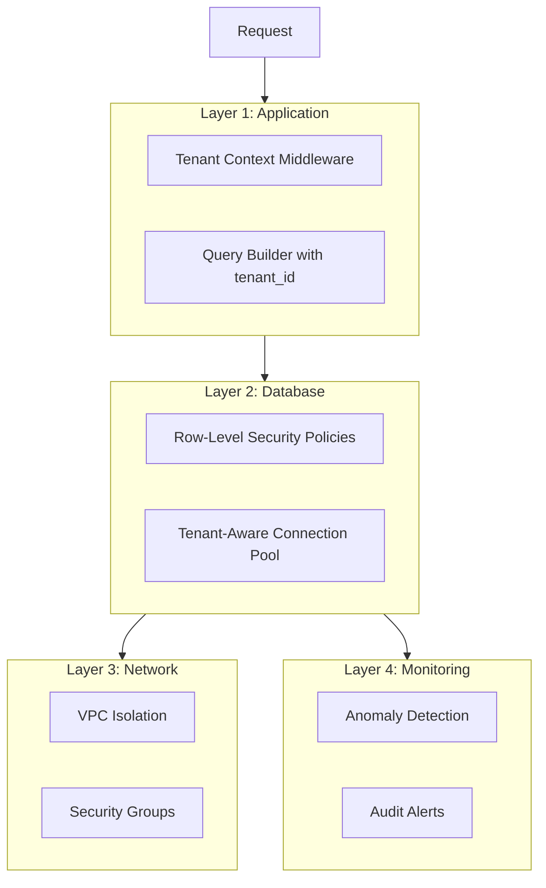

**Safeguards:**

1. **Query-level**: All queries include `tenant_id` in WHERE clause
2. **ORM-level**: Tenant filter automatically injected via query scope
3. **Connection-level**: Enterprise tenants use dedicated connection pools
4. **Database-level**: PostgreSQL RLS policies as last line of defense
5. **Network-level**: VPC peering for enterprise, shared VPC for standard
6. **Monitoring-level**: Anomaly detection on access patterns

### RLS Policy Implementation

```sql
-- Enable RLS
ALTER TABLE issues ENABLE ROW LEVEL SECURITY;
ALTER TABLE issues FORCE ROW LEVEL SECURITY;  -- Apply even to table owners

-- Create isolation policy
CREATE POLICY tenant_isolation ON issues
    FOR ALL
    USING (tenant_id = current_setting('app.current_tenant', true)::uuid);

-- Superuser policy for migrations/maintenance
CREATE POLICY admin_bypass ON issues
    FOR ALL
    TO admin_role
    USING (true);
```

### Graceful Degradation Modes

| Component Down | Fallback Behavior |
|----------------|-------------------|
| Elasticsearch | Use PostgreSQL GIN index for search (slower) |
| Redis | Read from database, skip caching (higher latency) |
| Kafka | Write to local queue, retry later |
| Notification service | Queue notifications, batch later |
| Webhook delivery | Store in DLQ, retry with exponential backoff |

---

## 10. Migration Strategy

### Dual-Write Architecture

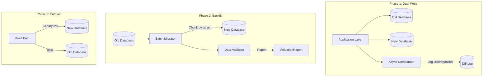

### Migration Phases

| Phase | Duration | Actions | Success Criteria | Rollback Criteria |
|-------|----------|---------|------------------|-------------------|
| **1. Shadow Mode** | 2 weeks | Write to both DBs, read from old | < 0.01% discrepancy rate | Any data inconsistency > 0.1% |
| **2. Backfill** | 1-2 weeks | Migrate historical data in batches (1M rows/hour) | All data migrated, validated | Migration errors > 0.1% |
| **3. Canary** | 1 week | 5% of free-tier tenants on new system | Error rate stable, latency normal | Error rate increase > 0.5% |
| **4. Gradual Rollout** | 2 weeks | 25% → 50% → 75% → 100% | SLOs maintained | p95 latency > 250ms |
| **5. Deprecate Old** | 1 week | Stop writes to old, archive | N/A | N/A |

### Canary Tenant Selection Criteria

```yaml
canary_tenants:
  phase_1:
    tier: "free"
    criteria:
      - issues_count: "<1000"
      - dau: "<100"
      - non_critical: true
      - opted_in: true
    count: 1000  # ~0.3% of tenants

  phase_2:
    tier: ["free", "standard"]
    criteria:
      - issues_count: "<10000"
      - dau: "<500"
    count: 5000  # ~1.7% of tenants

  phase_3:
    tier: ["free", "standard"]
    criteria:
      - dau: "<2000"
    count: 30000  # ~10% of tenants
```

### Data Validation Strategy

```python
# Validation script pseudo-code
def validate_migration(tenant_id: str, batch_size: int = 1000):
    """Compare data between old and new databases."""

    discrepancies = []

    # Fetch issues in batches
    for offset in range(0, total_issues, batch_size):
        old_issues = old_db.query(
            "SELECT * FROM issues WHERE tenant_id = ? LIMIT ? OFFSET ?",
            tenant_id, batch_size, offset
        )
        new_issues = new_db.query(
            "SELECT * FROM issues WHERE tenant_id = ? LIMIT ? OFFSET ?",
            tenant_id, batch_size, offset
        )

        # Compare each field
        for old, new in zip(old_issues, new_issues):
            diff = compare_records(old, new)
            if diff:
                discrepancies.append({
                    'issue_id': old.id,
                    'fields': diff
                })

    return {
        'tenant_id': tenant_id,
        'total_issues': total_issues,
        'discrepancies': len(discrepancies),
        'discrepancy_rate': len(discrepancies) / total_issues,
        'details': discrepancies[:100]  # Sample
    }
```

### Rollback Procedure

```bash
#!/bin/bash
# rollback.sh - Execute if migration fails

# 1. Stop writes to new database
kubectl scale deployment issue-service --replicas=0

# 2. Update feature flag to route all traffic to old DB
curl -X POST https://feature-flags.internal/api/v1/flags/use-new-database \
  -H "Content-Type: application/json" \
  -d '{"enabled": false, "rollout_percentage": 0}'

# 3. Restart services with old DB config
kubectl rollout restart deployment issue-service

# 4. Verify old system is handling traffic
./verify-traffic.sh old-db

# 5. Alert on-call team
./alert-oncall.sh "Migration rollback executed. Reason: $1"
```

---

## 11. SLOs, Metrics, and Alerting

### Service Level Objectives

| SLO | Target | Measurement Window | Alerting Threshold |
|-----|--------|-------------------|-------------------|
| Issue read latency p95 | < 200ms | 5 minutes | > 180ms for 5min |
| Issue read latency p99 | < 500ms | 5 minutes | > 450ms for 5min |
| Issue read availability | 99.9% | 30 days rolling | < 99.85% for 5min |
| Issue write latency p95 | < 500ms | 5 minutes | > 450ms for 5min |
| Issue write availability | 99.5% | 30 days rolling | < 99.3% for 5min |
| Search latency p95 | < 500ms | 5 minutes | > 450ms for 5min |
| Search availability | 99.5% | 30 days rolling | < 99.3% for 5min |
| Search reindex lag | < 5s | 1 minute | > 10s for 5min |

### Error Budget

```
Monthly error budget (99.9% read SLA):
- Allowed downtime: 43.8 minutes/month
- Allowed error rate: 0.1%

Monthly error budget (99.5% write SLA):
- Allowed downtime: 3.6 hours/month
- Allowed error rate: 0.5%
```

### Key Metrics

```yaml
# Prometheus metrics configuration
metrics:
  # Request latency histogram
  - name: http_request_duration_seconds
    type: histogram
    labels: [tenant_id, service, method, endpoint, status_code]
    buckets: [0.01, 0.025, 0.05, 0.1, 0.2, 0.5, 1, 2.5, 5, 10]

  # Request count
  - name: http_requests_total
    type: counter
    labels: [tenant_id, service, method, endpoint, status_code]

  # Per-tenant error rate
  - name: tenant_error_rate
    type: gauge
    labels: [tenant_id, error_type]

  # Search reindex lag
  - name: search_reindex_lag_seconds
    type: gauge
    labels: [tenant_id, index_name]

  # Kafka consumer lag
  - name: kafka_consumer_lag
    type: gauge
    labels: [consumer_group, topic, partition]

  # Database connection pool
  - name: db_pool_connections
    type: gauge
    labels: [pool_name, state]  # state: active, idle, waiting

  # Cache hit rate
  - name: cache_hit_rate
    type: gauge
    labels: [cache_name, operation]

  # Tenant resource usage
  - name: tenant_active_issues
    type: gauge
    labels: [tenant_id]

  - name: tenant_storage_bytes
    type: gauge
    labels: [tenant_id, storage_type]
```

### Alerting Rules

```yaml
groups:
  - name: issue-tracker-slos
    rules:
      # Latency SLO alerts
      - alert: IssueReadLatencyP95High
        expr: |
          histogram_quantile(0.95,
            sum(rate(http_request_duration_seconds_bucket{
              endpoint=~"/api/v1/issues.*",
              method="GET"
            }[5m])) by (le)
          ) > 0.2
        for: 5m
        labels:
          severity: warning
          team: platform
        annotations:
          summary: "Issue read latency p95 exceeds 200ms"
          description: "Current p95: {{ $value | humanizeDuration }}"
          runbook_url: "https://runbooks.internal/issue-latency"

      # Availability SLO alerts
      - alert: IssueReadAvailabilityLow
        expr: |
          sum(rate(http_requests_total{
            endpoint=~"/api/v1/issues.*",
            method="GET",
            status_code!~"5.."
          }[5m]))
          /
          sum(rate(http_requests_total{
            endpoint=~"/api/v1/issues.*",
            method="GET"
          }[5m])) < 0.9985
        for: 5m
        labels:
          severity: critical
          team: platform
        annotations:
          summary: "Issue read availability below 99.85%"
          description: "Current availability: {{ $value | humanizePercentage }}"

      # Per-tenant error rate
      - alert: TenantErrorRateHigh
        expr: |
          sum(rate(http_requests_total{status_code=~"5.."}[5m])) by (tenant_id)
          /
          sum(rate(http_requests_total[5m])) by (tenant_id) > 0.01
        for: 5m
        labels:
          severity: warning
          team: platform
        annotations:
          summary: "High error rate for tenant {{ $labels.tenant_id }}"
          description: "Error rate: {{ $value | humanizePercentage }}"

      # Search reindex lag
      - alert: SearchReindexLagHigh
        expr: |
          max(kafka_consumer_group_lag{group="search-indexer"}) > 10000
        for: 5m
        labels:
          severity: warning
          team: search
        annotations:
          summary: "Search indexer lag exceeds 10k messages"
          description: "Current lag: {{ $value }} messages"
          runbook_url: "https://runbooks.internal/search-lag"

      # Database connection pool exhaustion
      - alert: DBPoolExhausted
        expr: |
          db_pool_connections{state="waiting"} > 10
        for: 2m
        labels:
          severity: critical
          team: database
        annotations:
          summary: "Database connection pool has waiting connections"
          description: "{{ $value }} connections waiting for pool {{ $labels.pool_name }}"
```

### Grafana Dashboard Panels

```
Dashboard: Issue Tracker Overview

Row 1: SLO Overview
├── Panel 1: Read Availability (30d rolling)
├── Panel 2: Write Availability (30d rolling)
├── Panel 3: Error Budget Remaining
└── Panel 4: Active Incidents

Row 2: Latency
├── Panel 1: Read Latency Heatmap (p50, p95, p99)
├── Panel 2: Write Latency Heatmap
├── Panel 3: Search Latency Heatmap
└── Panel 4: Latency by Endpoint

Row 3: Throughput
├── Panel 1: Request Rate by Service
├── Panel 2: Error Rate by Service
├── Panel 3: Top 10 Tenants by Traffic
└── Panel 4: Events Published/Consumed

Row 4: Infrastructure
├── Panel 1: Database Connections & Latency
├── Panel 2: Cache Hit Rate
├── Panel 3: Kafka Consumer Lag
└── Panel 4: Elasticsearch Cluster Health
```

---

## 12. Operational Runbooks

### Runbook: Tenant Isolation Incident

```markdown
# Runbook: Tenant Data Isolation Incident

## Severity: P0 (Critical)
## On-Call: Platform Team + Security Team

---

### Detection

**Triggers:**
- Alert: "Cross-tenant data access detected"
- Alert: "RLS policy violation logged"
- User report of seeing another tenant's data

**Sources:**
- Audit log anomaly detection system
- User support tickets
- Security monitoring tools

---

### Immediate Actions (SLA: < 5 minutes)

1. **DISABLE affected tenant API access immediately**
   ```bash
   # Disable tenant via API
   curl -X POST https://api.internal/admin/tenants/{tenant_id}/disable \
     -H "Authorization: Bearer $ADMIN_TOKEN" \
     -H "Content-Type: application/json" \
     -d '{"reason": "security_incident", "ticket": "INC-XXXX"}'
   ```

2. **Revoke all active sessions for affected users**
   ```bash
   # Invalidate all sessions
   redis-cli -h redis.internal KEYS "session:*:${TENANT_ID}:*" | xargs redis-cli DEL
   ```

3. **Page security team**
   ```bash
   ./page-security.sh "P0: Tenant isolation incident - ${TENANT_ID}"
   ```

4. **Create incident channel**
   - Slack: #incident-YYYYMMDD-isolation
   - Add: Platform lead, Security lead, Affected tenant's account manager

---

### Investigation

1. **Determine scope of exposure**
   ```sql
   -- Query audit logs for unusual access patterns
   SELECT
     actor_user_id,
     resource_tenant_id,
     COUNT(*) as access_count,
     MIN(created_at) as first_access,
     MAX(created_at) as last_access
   FROM audit_logs
   WHERE resource_tenant_id = 'affected_tenant_id'
     AND actor_tenant_id != resource_tenant_id
     AND created_at > NOW() - INTERVAL '24 hours'
   GROUP BY actor_user_id, resource_tenant_id
   ORDER BY access_count DESC;
   ```

2. **Identify root cause**

   Check for:
   - [ ] RLS policy disabled/modified
   - [ ] Application query missing tenant_id filter
   - [ ] Connection pool tenant context leak
   - [ ] Cache key collision
   - [ ] API endpoint missing auth check

   ```bash
   # Check recent deployments
   kubectl rollout history deployment/issue-service

   # Check RLS policies
   psql -c "SELECT * FROM pg_policies WHERE tablename = 'issues';"

   # Check recent config changes
   git log --oneline -20 -- config/
   ```

3. **Document exposed data**
   - What data types were exposed?
   - Which issues/comments/attachments?
   - Time window of exposure?
   - Number of affected records?

---

### Resolution

1. **Deploy hotfix** (if code bug)
   ```bash
   # Fast-track hotfix deployment
   ./deploy.sh --hotfix --service=issue-service --version=v1.2.3-hotfix
   ```

2. **Restore RLS policies** (if configuration issue)
   ```sql
   -- Re-enable RLS
   ALTER TABLE issues ENABLE ROW LEVEL SECURITY;
   ALTER TABLE issues FORCE ROW LEVEL SECURITY;

   -- Verify policy exists
   SELECT * FROM pg_policies WHERE tablename = 'issues';
   ```

3. **Clear affected caches**
   ```bash
   # Invalidate all caches for affected tenants
   redis-cli -h redis.internal KEYS "*:${TENANT_ID}:*" | xargs redis-cli DEL
   ```

4. **Re-enable tenant access** (after verification)
   ```bash
   curl -X POST https://api.internal/admin/tenants/{tenant_id}/enable \
     -H "Authorization: Bearer $ADMIN_TOKEN"
   ```

---

### Communication

1. **Notify affected tenants** (per compliance requirements)
   - Use template: `security-incident-notification.md`
   - Include: What happened, what data, what we did, next steps
   - Legal review required before sending

2. **Update status page**
   - Post incident notice (if public-facing)

---

### Post-Incident

- [ ] Blameless postmortem within 48 hours
- [ ] Update access pattern monitoring rules
- [ ] Add regression tests for this failure mode
- [ ] Review and update RLS policies
- [ ] Conduct security audit of similar code paths
- [ ] Update this runbook with lessons learned

---

### Escalation Path

1. Platform On-Call Engineer
2. Platform Team Lead
3. VP of Engineering
4. CISO (if data breach confirmed)
```

---

### Runbook: Search Degradation

```markdown
# Runbook: Search Degradation

## Severity: P1 (High)
## On-Call: Search Team

---

### Detection

**Triggers:**
- Alert: "Search latency p95 > 500ms"
- Alert: "Search error rate > 1%"
- Alert: "Kafka consumer lag > 10s"
- Alert: "Elasticsearch cluster status YELLOW/RED"

---

### Diagnosis Tree

```
Search Degradation
├── Is ES cluster healthy?
│   ├── YES → Check consumer lag
│   └── NO → Go to "ES Cluster Issues"
│
├── Is consumer lag high?
│   ├── YES → Go to "Consumer Lag Issues"
│   └── NO → Check query patterns
│
└── Are queries slow?
    ├── YES → Go to "Query Performance Issues"
    └── NO → Check network/load balancer
```

---

### Immediate Actions

1. **Check Elasticsearch cluster health**
   ```bash
   curl -s 'http://elasticsearch.internal:9200/_cluster/health?pretty'
   ```

   Expected: `"status": "green"`

2. **Check consumer lag**
   ```bash
   kafka-consumer-groups.sh \
     --bootstrap-server kafka.internal:9092 \
     --group search-indexer-group \
     --describe
   ```

   Expected: Lag < 1000 per partition

3. **Check hot threads** (for slow queries)
   ```bash
   curl -s 'http://elasticsearch.internal:9200/_nodes/hot_threads'
   ```

---

### ES Cluster Issues

#### Cluster Status: YELLOW

1. **Identify unassigned shards**
   ```bash
   curl -s 'http://elasticsearch.internal:9200/_cat/shards?v&h=index,shard,prirep,state,unassigned.reason' \
     | grep UNASSIGNED
   ```

2. **Check disk space**
   ```bash
   curl -s 'http://elasticsearch.internal:9200/_cat/allocation?v'
   ```

   If disk > 85%:
   ```bash
   # Delete old indices
   curl -X DELETE 'http://elasticsearch.internal:9200/issue-tracker-shared-2025.*'
   ```

3. **Force shard allocation** (if node recovered)
   ```bash
   curl -X POST 'http://elasticsearch.internal:9200/_cluster/reroute?retry_failed=true'
   ```

#### Cluster Status: RED

1. **Identify missing primary shards**
   ```bash
   curl -s 'http://elasticsearch.internal:9200/_cat/shards?v' | grep -E 'p.*UNASSIGNED'
   ```

2. **Check node status**
   ```bash
   curl -s 'http://elasticsearch.internal:9200/_cat/nodes?v'
   ```

3. **If node permanently lost, allocate stale primary**
   ```bash
   # WARNING: May lose some data
   curl -X POST 'http://elasticsearch.internal:9200/_cluster/reroute' \
     -H 'Content-Type: application/json' \
     -d '{
       "commands": [{
         "allocate_stale_primary": {
           "index": "issue-tracker-shared-2026.01",
           "shard": 0,
           "node": "es-data-1",
           "accept_data_loss": true
         }
       }]
     }'
   ```

---

### Consumer Lag Issues

1. **Scale up indexer replicas**
   ```bash
   kubectl scale deployment search-indexer --replicas=16
   ```

2. **If backlog critical, pause non-essential consumers**
   ```bash
   # Pause analytics consumer to prioritize search
   kubectl scale deployment analytics-sink --replicas=0
   ```

3. **Check for poison messages**
   ```bash
   # Check DLQ
   kafka-console-consumer.sh \
     --bootstrap-server kafka.internal:9092 \
     --topic search-indexer-dlq \
     --from-beginning \
     --max-messages 10
   ```

4. **If poison message blocking, skip it**
   ```bash
   # Manually commit offset past poison message
   kafka-consumer-groups.sh \
     --bootstrap-server kafka.internal:9092 \
     --group search-indexer-group \
     --topic issues.updated \
     --reset-offsets \
     --shift-by 1 \
     --execute
   ```

---

### Query Performance Issues

1. **Identify slow queries**
   ```bash
   curl -s 'http://elasticsearch.internal:9200/_nodes/stats/indices/search?pretty' \
     | jq '.nodes[].indices.search'
   ```

2. **Check for expensive queries**
   ```bash
   # Enable slow query log temporarily
   curl -X PUT 'http://elasticsearch.internal:9200/issue-tracker-*/_settings' \
     -H 'Content-Type: application/json' \
     -d '{
       "index.search.slowlog.threshold.query.warn": "1s",
       "index.search.slowlog.threshold.query.info": "500ms"
     }'
   ```

3. **Add query caching**
   ```bash
   # Ensure query cache is enabled
   curl -X PUT 'http://elasticsearch.internal:9200/issue-tracker-*/_settings' \
     -H 'Content-Type: application/json' \
     -d '{"index.requests.cache.enable": true}'
   ```

---

### Fallback to Database Search

If ES cannot be recovered quickly:

1. **Enable database fallback via feature flag**
   ```bash
   curl -X POST 'https://feature-flags.internal/api/v1/flags' \
     -H "Authorization: Bearer $ADMIN_TOKEN" \
     -H "Content-Type: application/json" \
     -d '{
       "flag": "search.use_database_fallback",
       "enabled": true,
       "rollout_percentage": 100
     }'
   ```

2. **Monitor database load**
   - Watch for increased query latency
   - Watch for connection pool saturation

3. **Communicate to users**
   - Search may be slower than usual
   - Some advanced filters may not work

---

### Recovery Validation

Before declaring recovered:

- [ ] ES cluster status is GREEN
- [ ] Consumer lag < 1000 total
- [ ] Search latency p95 < 500ms for 10 minutes
- [ ] Search error rate < 0.1% for 10 minutes
- [ ] Run search regression tests: `./run-search-tests.sh`

---

### Post-Incident

- [ ] Document what happened and timeline
- [ ] Review indexer scaling policies
- [ ] Review ES cluster capacity
- [ ] Update alerting thresholds if needed
```

---

## 13. Technology Stack Summary

| Layer | Technology | Version | Justification |
|-------|------------|---------|---------------|
| **API Gateway** | Kong | 3.x | Rate limiting, auth, tenant routing, plugins ecosystem |
| **Core Services** | Go | 1.22+ | Performance, low memory, excellent concurrency |
| **Service Framework** | gRPC + REST | - | gRPC for internal, REST for public API |
| **Primary Database** | PostgreSQL | 16+ | ACID, RLS, partitioning, JSONB, mature ecosystem |
| **Database HA** | Patroni | 3.x | Automatic failover, consensus-based leader election |
| **Cache** | Redis Cluster | 7.x | Sub-ms reads, pub/sub for invalidation, Lua scripting |
| **Search** | Elasticsearch | 8.x | Full-text, aggregations, nested objects, horizontal scaling |
| **Message Queue** | Apache Kafka | 3.x | Durability, ordering, replay, exactly-once semantics |
| **Object Storage** | S3 / GCS | - | Attachments, audit archives, backups |
| **CDN** | CloudFront / Cloudflare | - | Static assets, API caching at edge |
| **Container Orchestration** | Kubernetes | 1.28+ | Scheduling, scaling, service mesh integration |
| **Service Mesh** | Istio | 1.20+ | mTLS, observability, traffic management |
| **Monitoring** | Prometheus + Grafana | - | Metrics collection, visualization, alerting |
| **Tracing** | Jaeger | 1.x | Distributed tracing, performance analysis |
| **Logging** | ELK Stack | 8.x | Centralized logs, search, visualization |
| **Alerting** | PagerDuty | - | On-call management, escalations |
| **Feature Flags** | LaunchDarkly / Unleash | - | Gradual rollouts, kill switches |
| **Secrets Management** | HashiCorp Vault | 1.x | Secrets rotation, dynamic credentials |

### Infrastructure Diagram

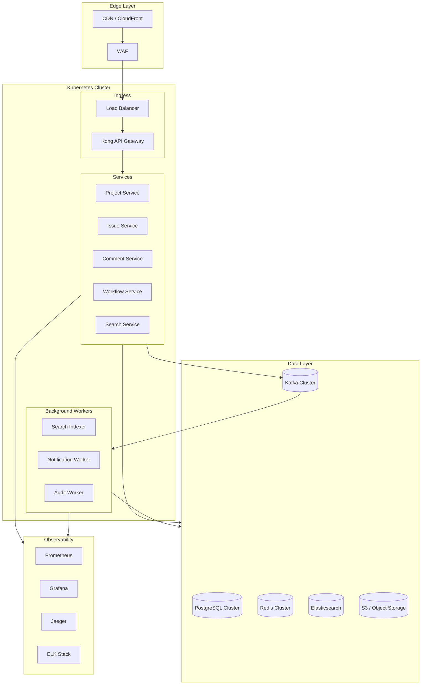

---

## Appendix

### A. Glossary

| Term | Definition |
|------|------------|
| **Tenant** | An organization using the issue tracker (e.g., Acme Corp) |
| **RLS** | Row-Level Security - PostgreSQL feature for data isolation |
| **DAU** | Daily Active Users |
| **SLO** | Service Level Objective - target reliability metric |
| **SLA** | Service Level Agreement - contractual commitment |
| **RTO** | Recovery Time Objective - max acceptable downtime |
| **RPO** | Recovery Point Objective - max acceptable data loss |

### B. Related Documents

- [API Reference Documentation](./api-reference.md)
- [Database Schema Migrations](./migrations/)
- [Deployment Runbook](./deployment-runbook.md)
- [Security Policy](./security-policy.md)
- [Compliance Requirements](./compliance.md)

### C. Change Log

| Date | Version | Author | Changes |
|------|---------|--------|---------|
| 2026-01-12 | 1.0 | System Design | Initial design document |
