# Salary Growth & Career Trajectory in India's Tech Industry

A comprehensive guide to compensation structures, growth curves, and strategic career planning for software engineers and engineering leaders in India.

---

## Table of Contents

- [Salary Curve by Experience](#salary-curve-by-experience)
- [FAANG-Tier Compensation Structure](#faang-tier-compensation-structure)
- [Company-Specific Base Salary Numbers](#company-specific-base-salary-numbers)
- [In-Hand Post-Tax Estimates](#in-hand-post-tax-estimates)
- [Career Growth Projection from ₹1 Cr Base](#career-growth-projection-from-1-cr-base)
- [Key Takeaways](#key-takeaways)

---

## Salary Curve by Experience

### Industry-Wide Overview (All Company Tiers)

| Experience | Typical CTC Range (LPA) | Growth Characteristics |
|---|---|---|
| 0–1 yr (Fresher) | 3–12 | Huge variance by college tier & company |
| 1–3 yrs | 6–20 | Steep; job switches yield 30–70% hikes |
| 3–5 yrs | 10–30 | Still strong growth, specialization begins |
| 5–7 yrs | 18–45 | Growth decelerates, first fork in the road |
| 7–10 yrs | 25–60 | First plateau for many at 15–25 LPA (services) |
| 10–12 yrs | 30–80 | Plateau solidifies unless at top-tier companies |
| 12–15 yrs | 35–1 Cr+ | Gap between top 5% and median widens to 3–5x |
| 15+ yrs | Role-dependent | Salary is a function of role & impact, not YoE |

### Growth Curve Shape

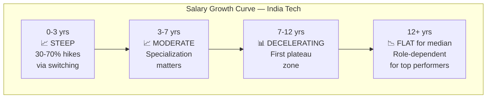

### The Two Diverging Paths

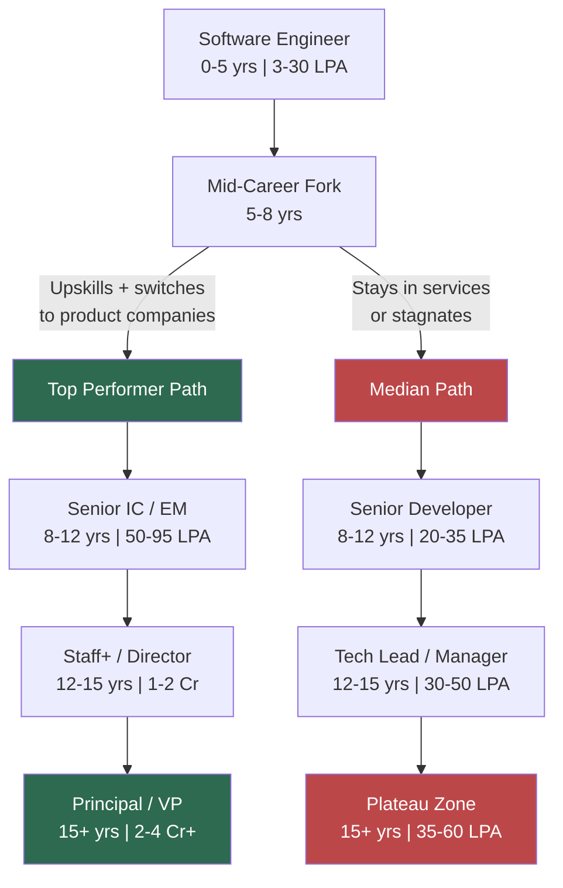

### Plateau Breakers vs Plateau Traps

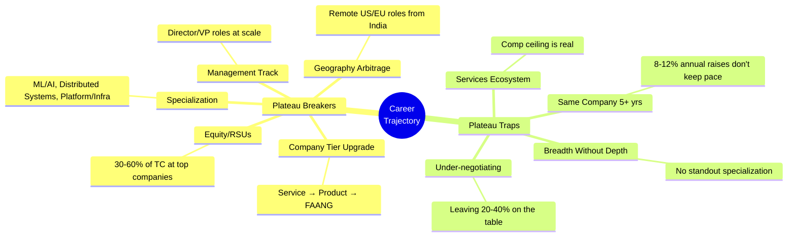

---

## FAANG-Tier Compensation Structure

### IC Track — Total Compensation

| Level | Title | YoE | Base (LPA) | Bonus (LPA) | RSUs/yr (LPA) | Total Comp (LPA) |
|---|---|---|---|---|---|---|
| L3 / SDE-1 | Software Engineer | 0–2 | 15–22 | 2–4 | 5–12 | **22–38** |
| L4 / SDE-2 | Software Engineer II | 2–5 | 22–32 | 4–6 | 10–25 | **36–60** |
| L5 / Senior | Senior SWE | 5–10 | 30–45 | 6–10 | 20–45 | **55–95** |
| L6 / Staff | Staff SWE | 8–15 | 40–55 | 8–15 | 35–70 | **85–140** |
| L7 / Sr Staff | Senior Staff SWE | 12–20 | 50–65 | 12–20 | 60–120 | **120–200+** |
| L8 / Principal | Principal Engineer | 15–25+ | 60–75 | 15–25 | 100–200+ | **175–300+** |
| L9+ / Fellow | Distinguished / Fellow | 20+ | Rare in India | — | — | **250–400+** |

### EM Track — Total Compensation

| Level | Title | YoE | Team Size | Total Comp (LPA) |
|---|---|---|---|---|
| M0 / L5 | Engineering Manager | 7–12 | 5–10 ICs | **60–100** |
| M1 / L6 | Senior EM | 10–15 | 15–30 ICs | **90–150** |
| M2 / L7 | Director of Engineering | 12–18 | 40–80 ICs | **130–220** |
| M3 / L8 | Senior Director | 15–22 | 80–200+ ICs | **180–300+** |
| VP / L9+ | VP of Engineering | 18+ | Org-level | **250–400+** |

### Compensation Mix by Level

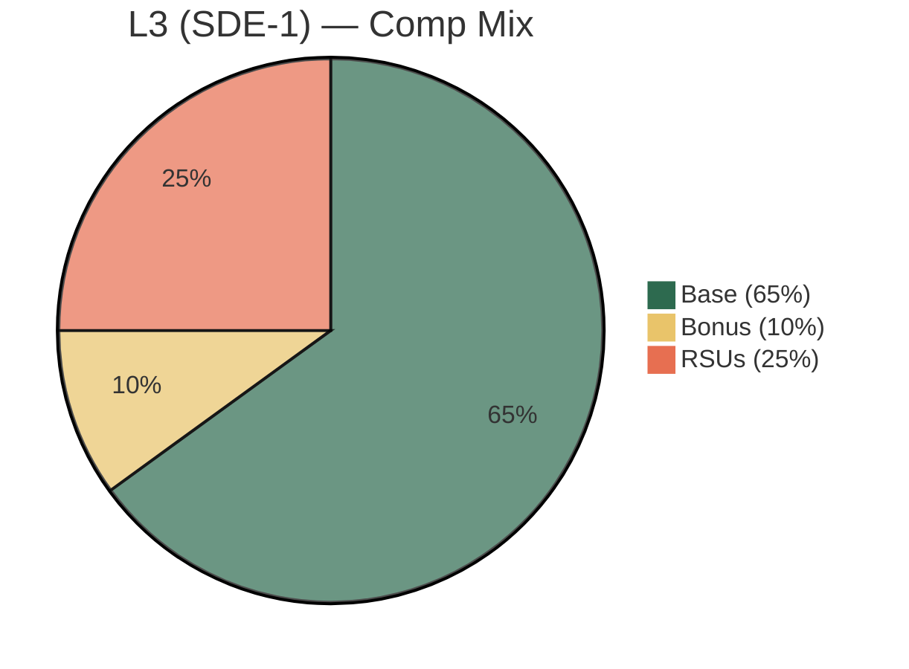

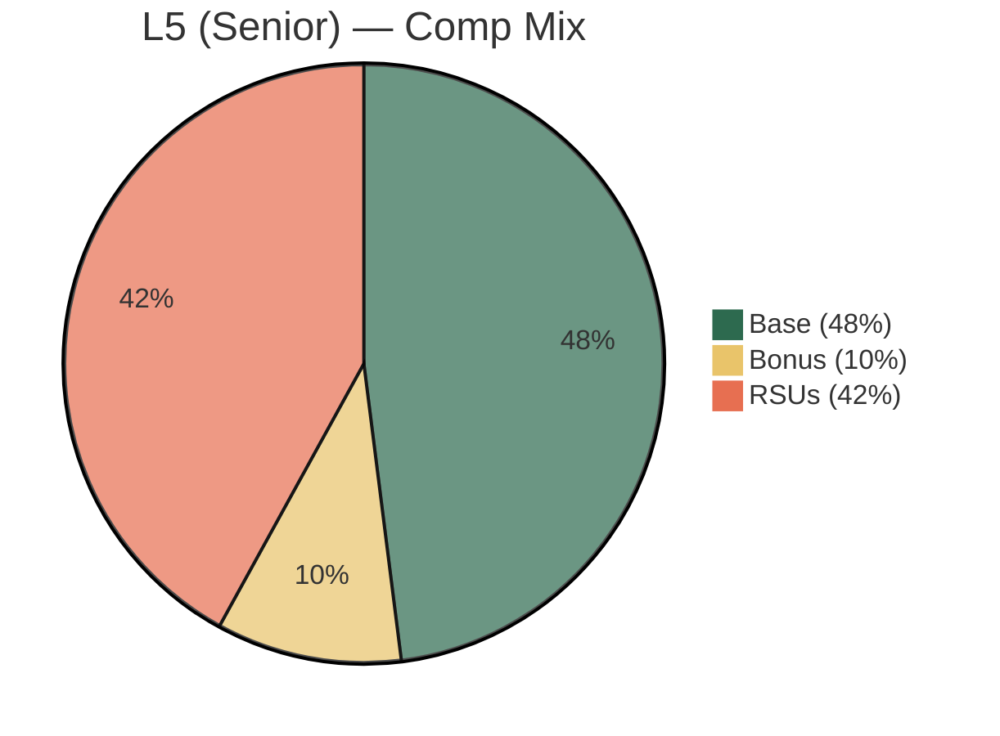

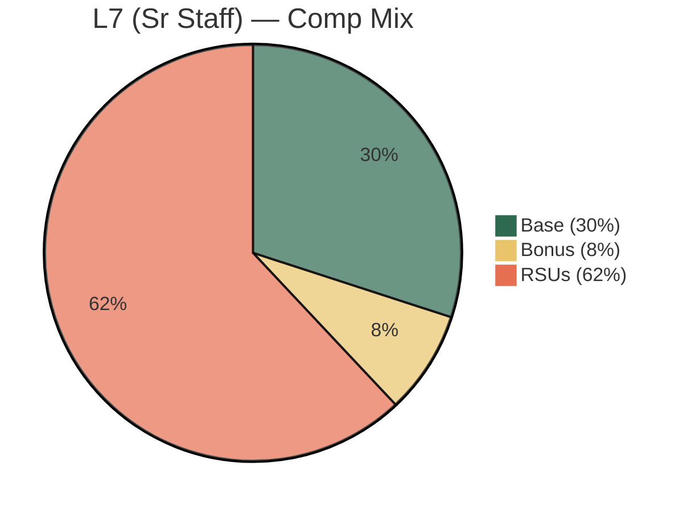

### Level Progression & Jump Economics

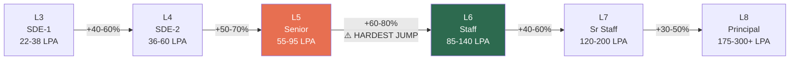

### Typical Timeline Between Levels

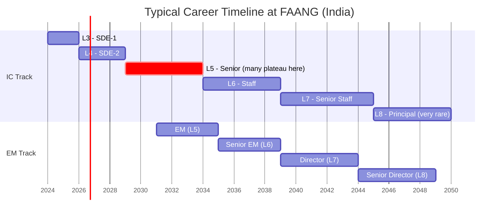

---

## Company-Specific Base Salary Numbers

### Google India

| Level | Base (LPA) | Monthly Gross |
|---|---|---|
| L3 | 18–22 LPA | ₹1.50L – ₹1.83L |
| L4 | 25–32 LPA | ₹2.08L – ₹2.67L |
| L5 | 35–45 LPA | ₹2.92L – ₹3.75L |
| L6 | 45–55 LPA | ₹3.75L – ₹4.58L |
| L7 | 55–65 LPA | ₹4.58L – ₹5.42L |

Strong RSU grants. Refreshers generous for top performers. L5 is the terminal level for many.

### Amazon India

| Level | Base (LPA) | Monthly Gross |
|---|---|---|
| L4 (SDE-1) | 16–22 LPA | ₹1.33L – ₹1.83L |
| L5 (SDE-2) | 22–32 LPA | ₹1.83L – ₹2.67L |
| L6 (SDE-3) | 30–42 LPA | ₹2.50L – ₹3.50L |
| L7 (Principal) | 40–55 LPA | ₹3.33L – ₹4.58L |

RSU vesting is **back-loaded**: 5% / 15% / 40% / 40%. Year 1–2 comp lower, padded with sign-on. Year 3–4 is when real money hits.

### Microsoft India

| Level | Base (LPA) | Monthly Gross |
|---|---|---|
| L59 (SDE) | 16–20 LPA | ₹1.33L – ₹1.67L |
| L61 (SDE-2) | 22–30 LPA | ₹1.83L – ₹2.50L |
| L63 (Senior) | 32–42 LPA | ₹2.67L – ₹3.50L |
| L65 (Principal) | 42–55 LPA | ₹3.50L – ₹4.58L |
| L67 (Partner) | 55–70 LPA | ₹4.58L – ₹5.83L |

Most **base-heavy** FAANG. Generally best work-life balance in India.

### Apple India

| Level | Base (LPA) | Monthly Gross |
|---|---|---|
| ICT2 | 18–24 LPA | ₹1.50L – ₹2.00L |
| ICT3 | 26–35 LPA | ₹2.17L – ₹2.92L |
| ICT4 | 36–48 LPA | ₹3.00L – ₹4.00L |
| ICT5 | 48–60 LPA | ₹4.00L – ₹5.00L |

### Base Salary Comparison Across Companies

```mermaid
xychart-beta
    title "Base Salary by Level — FAANG India (LPA, midpoint)"
    x-axis ["L3/SDE-1", "L4/SDE-2", "L5/Senior", "L6/Staff", "L7/Sr Staff"]
    y-axis "Base Salary (LPA)" 10 --> 70
    bar [20, 28, 40, 50, 60]
    bar [19, 27, 37, 48, 62]
    bar [18, 26, 37, 48, 55]
```

---

## In-Hand Post-Tax Estimates

| Gross Monthly | Approx Tax (Old Regime ~30%) | In-Hand Monthly |
|---|---|---|
| ₹1.50L | ~₹30K | ~₹1.20L |
| ₹2.00L | ~₹45K | ~₹1.55L |
| ₹2.50L | ~₹60K | ~₹1.90L |
| ₹3.00L | ~₹78K | ~₹2.22L |
| ₹3.75L | ~₹1.02L | ~₹2.73L |
| ₹4.50L | ~₹1.28L | ~₹3.22L |
| ₹5.50L | ~₹1.60L | ~₹3.90L |
| ₹6.25L | ~₹1.85L | ~₹4.40L |

> Assumes old tax regime with standard deductions and 80C.

---

## Career Growth Projection from ₹1 Cr Base

**Starting point:** Senior Engineering Manager, ₹1 Cr base, no bonus or RSUs.

### Scenario Overview

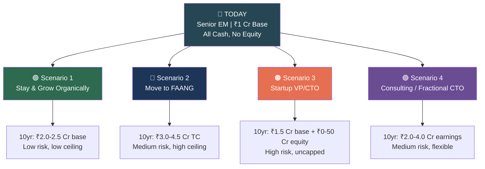

### Scenario 1 — Stay & Grow Organically (Same Company Type)

High-base / no-equity companies (Indian startups, non-FAANG MNCs).

| Year | Role | Expected Base | Annual Growth |
|---|---|---|---|
| Now | Senior EM | ₹1.00 Cr | — |
| Year 1–2 | Senior EM → Director | ₹1.10–1.20 Cr | 10–12% |
| Year 3–4 | Director of Engineering | ₹1.25–1.45 Cr | 8–12% |
| Year 5–6 | Senior Director | ₹1.45–1.70 Cr | 8–10% |
| Year 7–8 | VP Engineering | ₹1.70–2.00 Cr | 8–10% |
| Year 9–10 | VP / SVP Engineering | ₹2.00–2.50 Cr | 5–10% |

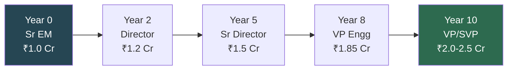

**Conservative estimate (with a stall):** ₹1.6–2.0 Cr.

### Scenario 2 — Move to FAANG (Equity Enters the Picture)

| Year | Role | Base | Bonus | RSUs/yr | Total Comp |
|---|---|---|---|---|---|
| Year 1 | EM L6 (lateral) | 50–55 LPA | 8–10 LPA | 40–70 LPA | ₹1.0–1.35 Cr |
| Year 2–3 | EM L6 (refreshers) | 55–60 LPA | 10–12 LPA | 55–85 LPA | ₹1.2–1.55 Cr |
| Year 4–5 | Director L7 | 60–68 LPA | 12–18 LPA | 80–130 LPA | ₹1.5–2.2 Cr |
| Year 6–8 | Sr Director L8 | 68–78 LPA | 15–25 LPA | 130–220 LPA | ₹2.1–3.2 Cr |
| Year 9–10 | Sr Director / VP | 75–85 LPA | 20–30 LPA | 200–350 LPA | ₹3.0–4.5 Cr |

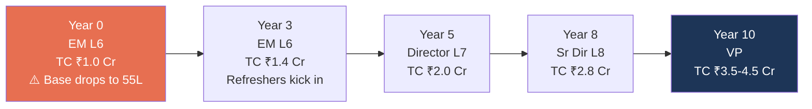

> **The psychological catch:** Base drops from ₹1 Cr to ~₹55 LPA. Feels like a 45% pay cut. TC surpasses current comp within 2–3 years and significantly ahead by Year 5+.

### Scenario 3 — Startup VP/CTO (Binary Outcome)

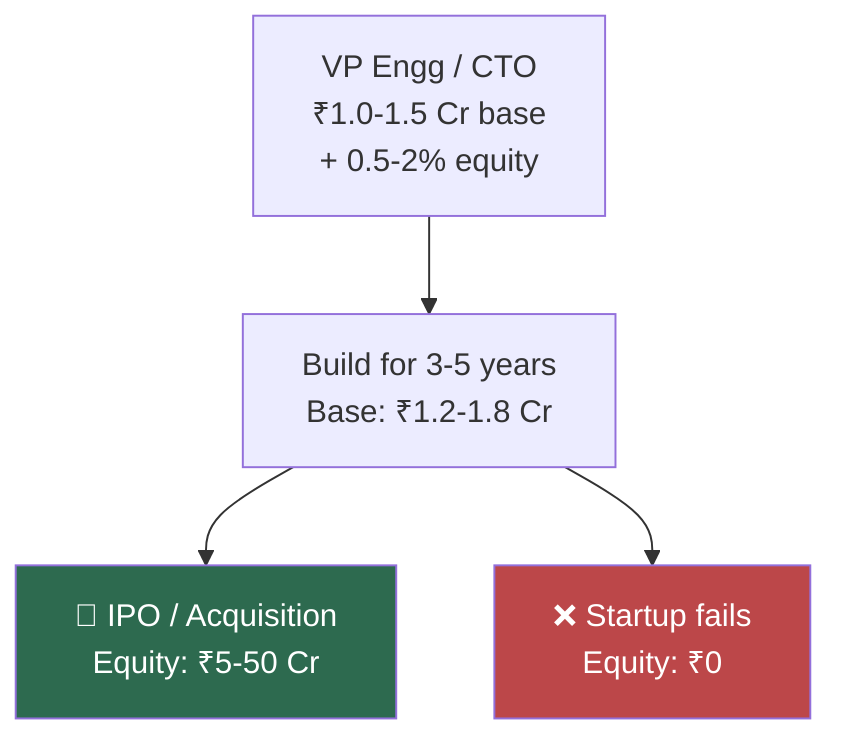

### Scenario 4 — Consulting / Fractional CTO

| Year | Mode | Annual Earnings |
|---|---|---|
| Year 1–2 | Full-time + side consulting | ₹1.0–1.3 Cr |
| Year 3–5 | Fractional CTO (2–3 clients) | ₹1.5–2.5 Cr |
| Year 6–10 | Advisory + consulting firm | ₹2.0–4.0 Cr |

### 10-Year Outcome Comparison

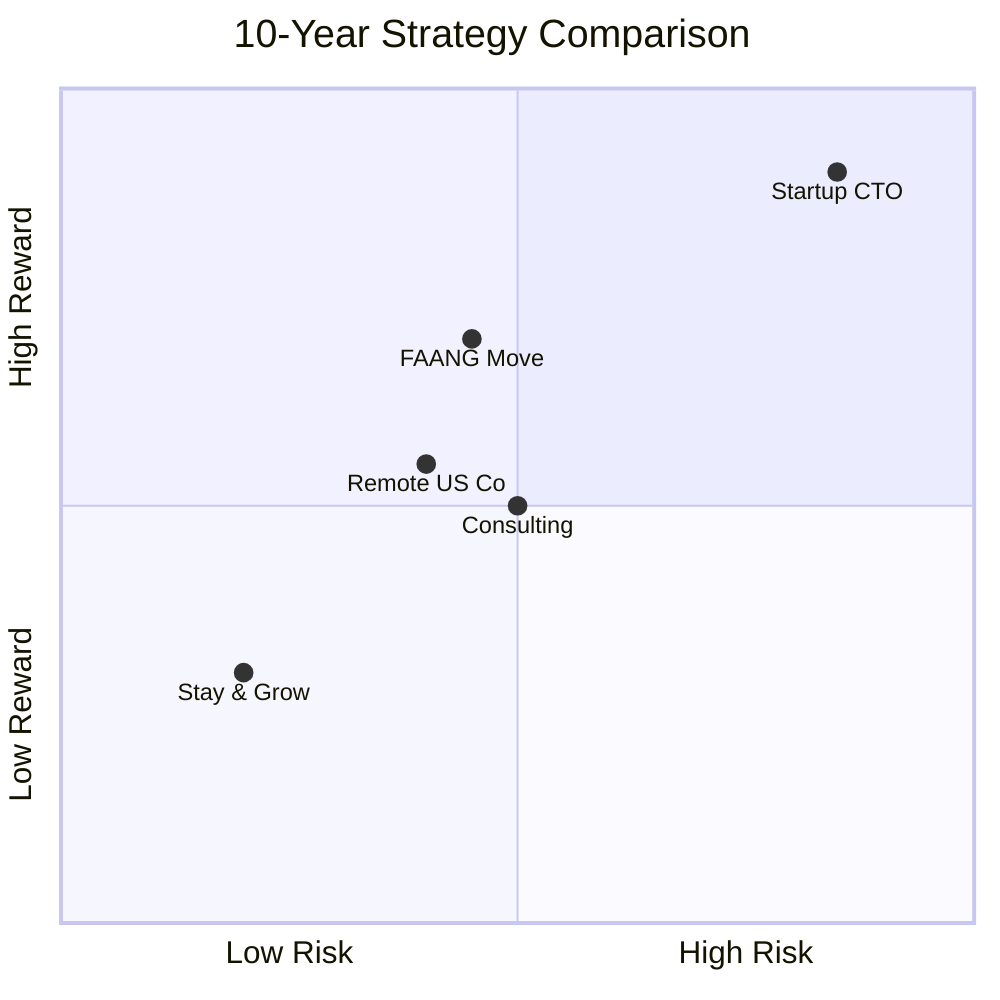

| Strategy | 10-Year Base | 10-Year TC | Risk |
|---|---|---|---|
| Stay & grow organically | ₹1.6–2.0 Cr | ₹1.6–2.0 Cr | Low |
| Switch to FAANG | ₹65–85 LPA (capped) | ₹3.0–4.5 Cr | Medium |
| Startup VP/CTO | ₹1.2–1.8 Cr | ₹1.5 Cr – ₹50 Cr | High |
| Consulting / Fractional | N/A | ₹2.0–4.0 Cr | Medium |
| Remote for US company | ₹1.5–2.5 Cr | ₹2.0–3.5 Cr | Medium |

### The Compounding Reality Check

```
10% annual raise on ₹1 Cr over 10 years  = ₹2.59 Cr (nominal)
Inflation at ~6% annually                 = erodes real value
Real purchasing power after 10 years      ≈ ₹1.45 Cr (in today's money)

→ Only ~45% real growth over a decade without strategic moves.
```

---

## Key Takeaways

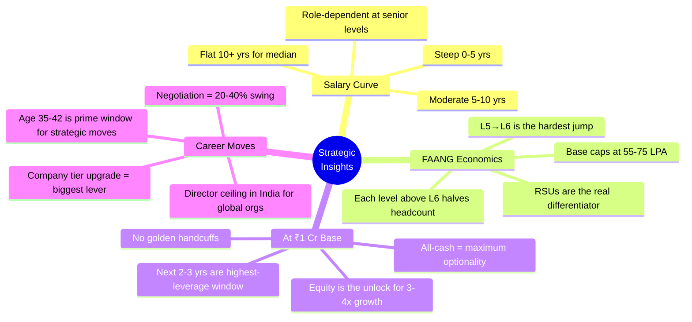

### The One-Line Summary

> Without equity entering the picture, base salary alone will roughly 1.5–2.5x over the next decade. To get to 3–4x+, you need meaningful equity compensation or a startup bet. The all-cash ₹1 Cr is a great foundation — the question is whether to trade some stability for higher upside.

---

*Last updated: February 2026. All figures are approximate and based on publicly available data, community reports (levels.fyi, Glassdoor, Blind), and industry knowledge. Individual outcomes vary significantly.*
