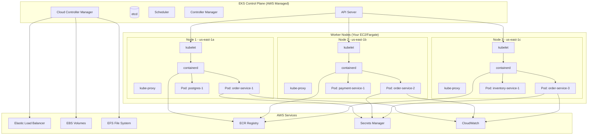
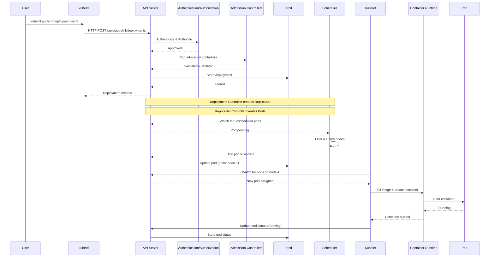
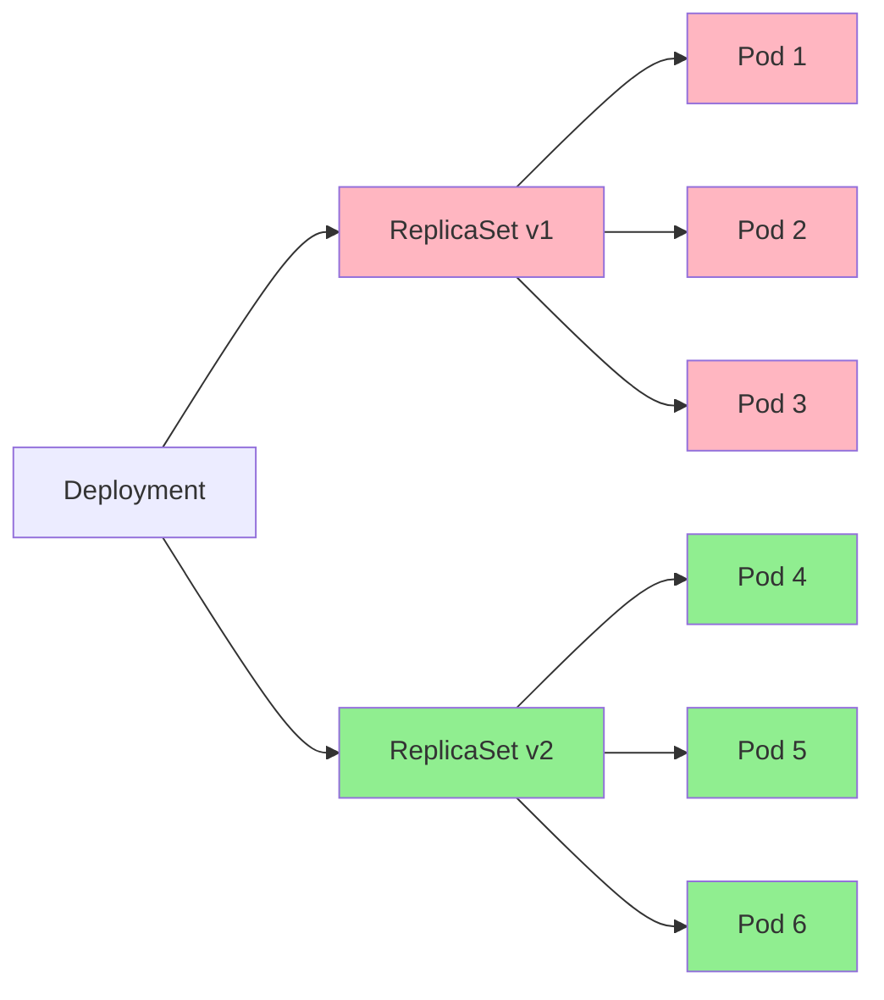
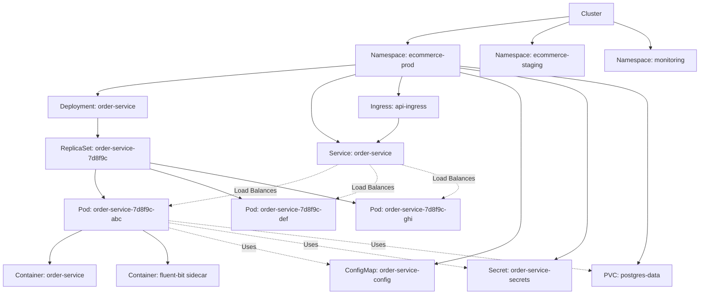
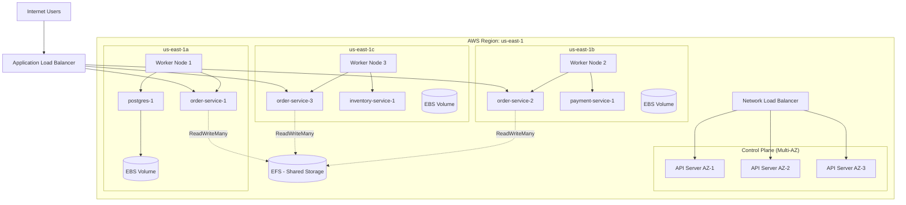
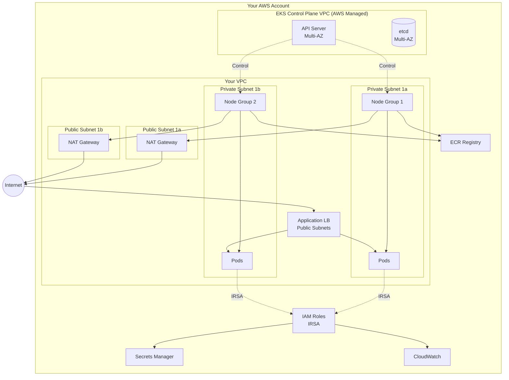
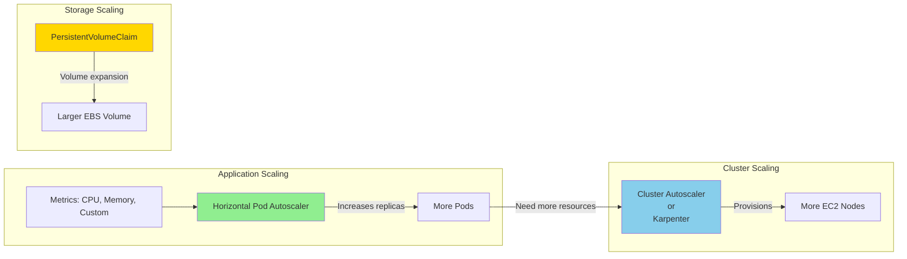

# Kubernetes Architecture Overview

## High-Level Architecture

## Control Plane Components

### API Server
- **Role**: Central hub for all cluster operations
- **Responsibilities**:
  - Validates and processes API requests
  - Only component that talks to etcd
  - Authentication and authorization
  - Admission control
- **In EKS**: Fully managed by AWS, multi-AZ by default

### etcd
- **Role**: Distributed key-value store for cluster state
- **What it stores**:
  - All resource definitions (Pods, Services, ConfigMaps, etc.)
  - Cluster configuration
  - State of all objects
- **In EKS**: Managed, backed up, and highly available

### Scheduler
- **Role**: Assigns pods to nodes
- **Decision factors**:
  - Resource requirements (CPU, memory)
  - Node affinity/anti-affinity
  - Taints and tolerations
  - Data locality
  - Pod topology spread constraints
- **Process**:
  1. Watches for unscheduled pods
  2. Filters nodes (feasibility)
  3. Scores nodes (best fit)
  4. Binds pod to highest-scored node

### Controller Manager
- **Role**: Runs control loops to maintain desired state
- **Key controllers**:
  - **Deployment Controller**: Manages ReplicaSets for deployments
  - **ReplicaSet Controller**: Ensures correct number of pod replicas
  - **Service Controller**: Creates/updates load balancers
  - **Node Controller**: Monitors node health
  - **Job Controller**: Manages batch jobs
  - **PersistentVolume Controller**: Binds PVCs to PVs

### Cloud Controller Manager
- **Role**: AWS-specific integrations
- **Responsibilities**:
  - Provisions ELB/NLB/ALB for LoadBalancer services
  - Manages EBS volume lifecycle
  - Updates node metadata from EC2
  - Removes nodes when EC2 instances are terminated

## Worker Node Components

### kubelet
- **Role**: Node agent ensuring containers are running
- **Responsibilities**:
  - Watches API server for pod assignments
  - Pulls container images from registry
  - Starts/stops containers via container runtime
  - Reports pod and node status to API server
  - Executes liveness/readiness probes
  - Mounts volumes

### kube-proxy
- **Role**: Network proxy implementing Service abstraction
- **Modes**:
  - **iptables** (default): Uses Linux iptables rules for load balancing
  - **IPVS**: More efficient for large clusters
- **Responsibilities**:
  - Maintains network rules on nodes
  - Enables service discovery and load balancing
  - Forwards traffic to correct pods

### Container Runtime
- **Current**: containerd (Docker deprecated since K8s 1.24)
- **Role**: Pulls images and runs containers
- **Interface**: Communicates with kubelet via CRI (Container Runtime Interface)

## Request Flow Example

## Deployment Flow

## Kubernetes Objects Hierarchy

## Multi-AZ High Availability

## Key Concepts Summary

| Component | Scope | Purpose | Managed by |
|-----------|-------|---------|------------|
| **Cluster** | Global | Complete Kubernetes deployment | You + AWS |
| **Namespace** | Cluster | Virtual cluster for isolation | You |
| **Node** | Cluster | Worker machine (EC2/Fargate) | AWS (hardware), You (registration) |
| **Pod** | Namespace | Smallest deployable unit (1+ containers) | Kubernetes |
| **Deployment** | Namespace | Declarative pod management | Kubernetes |
| **Service** | Namespace | Stable network endpoint | Kubernetes |
| **Ingress** | Namespace | HTTP(S) routing | AWS Load Balancer Controller |
| **ConfigMap** | Namespace | Non-sensitive configuration | You |
| **Secret** | Namespace | Sensitive data | You + AWS Secrets Manager |
| **PersistentVolume** | Cluster | Storage resource | AWS (EBS/EFS) |
| **PersistentVolumeClaim** | Namespace | Request for storage | You |

## EKS-Specific Architecture

## Scalability Model

## Next Steps

- **[02-structure-and-components.md](./02-structure-and-components.md)**: Deep dive into Pods, Deployments, StatefulSets
- **[03-networking.md](./03-networking.md)**: Services, Ingress, Network Policies
- **[04-storage-volumes.md](./04-storage-volumes.md)**: Persistent storage with EBS and EFS
- **[05-secrets-management.md](./05-secrets-management.md)**: Secrets, ConfigMaps, AWS integration
- **[06-monitoring-observability.md](./06-monitoring-observability.md)**: Prometheus, CloudWatch, logging
- **[07-complete-example.md](./07-complete-example.md)**: Full e-commerce microservices example
- **[08-best-practices.md](./08-best-practices.md)**: Production best practices and patterns
