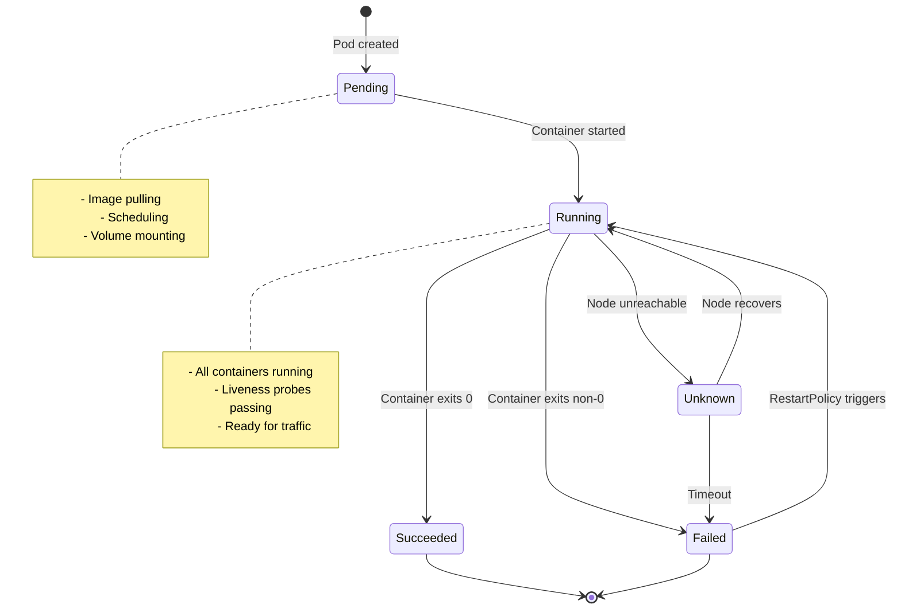
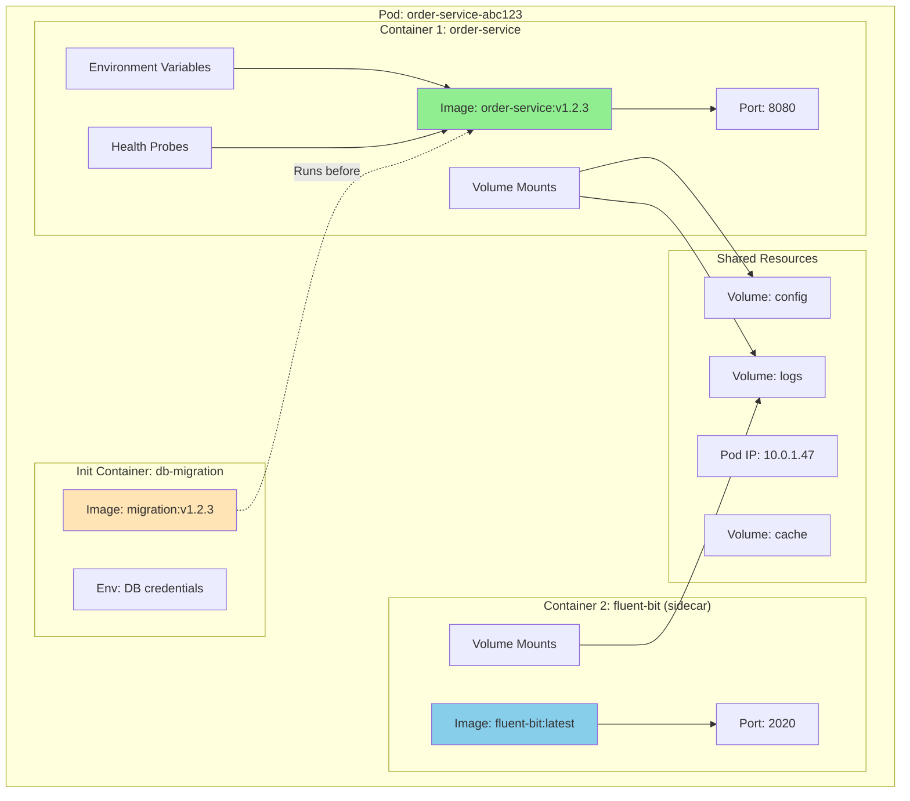
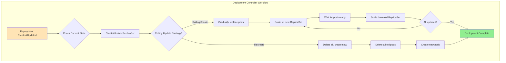
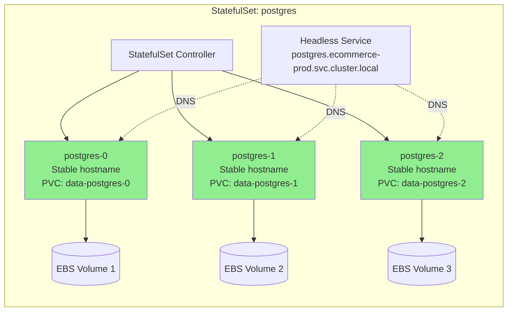
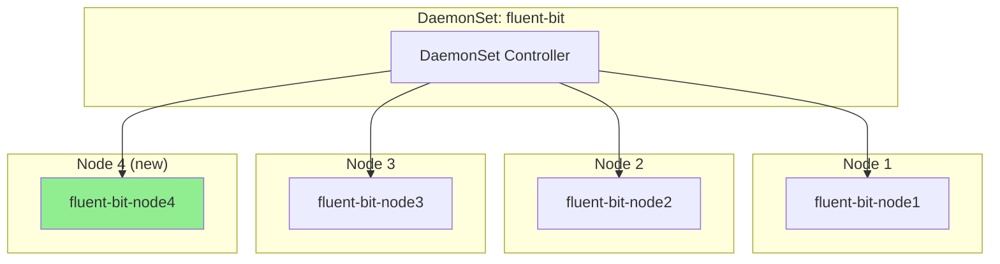
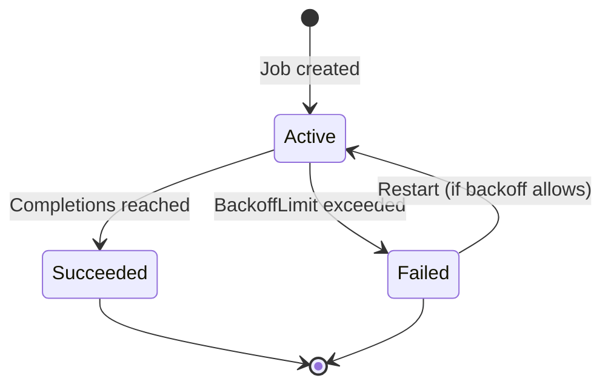
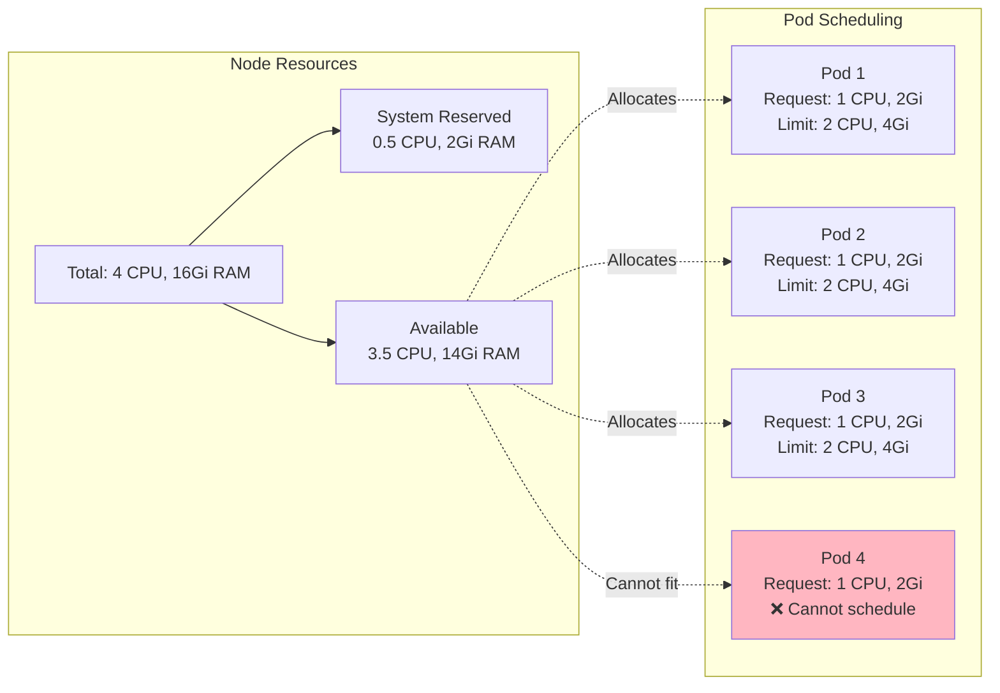
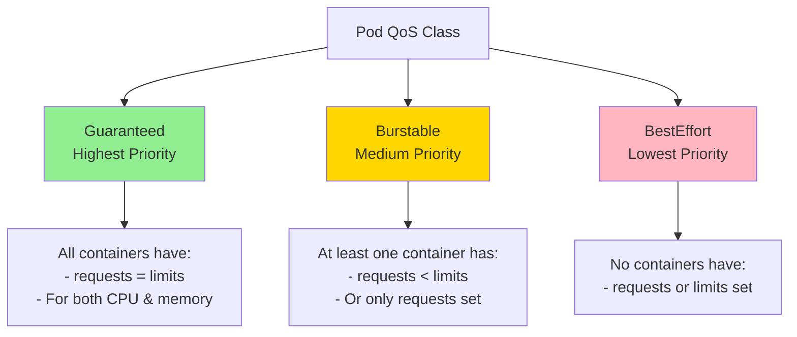

# Kubernetes Structure and Components

## Pod Lifecycle



## Pod Structure



## Basic Pod YAML

```yaml
apiVersion: v1
kind: Pod
metadata:
  name: order-service-pod
  namespace: ecommerce-prod
  labels:
    app: order-service
    version: v1
    tier: backend
  annotations:
    prometheus.io/scrape: "true"
    prometheus.io/port: "9090"
spec:
  # Service account for AWS IRSA
  serviceAccountName: order-service-sa

  # Init containers (run before main containers)
  initContainers:
  - name: db-migration
    image: order-service-migration:v1.2.3
    command: ['sh', '-c', 'flyway migrate']
    env:
    - name: DB_URL
      value: "jdbc:postgresql://postgres:5432/orders"
    - name: DB_PASSWORD
      valueFrom:
        secretKeyRef:
          name: postgres-secrets
          key: password

  # Main containers
  containers:
  - name: order-service
    image: 123456789012.dkr.ecr.us-east-1.amazonaws.com/order-service:v1.2.3

    # Image pull policy
    imagePullPolicy: IfNotPresent  # Always, Never, IfNotPresent

    # Container ports
    ports:
    - containerPort: 8080
      name: http
      protocol: TCP
    - containerPort: 9090
      name: metrics
      protocol: TCP

    # Resource management
    resources:
      requests:  # Guaranteed resources
        memory: "512Mi"
        cpu: "500m"
      limits:  # Max resources
        memory: "1Gi"
        cpu: "1000m"

    # Environment variables
    env:
    - name: POD_NAME
      valueFrom:
        fieldRef:
          fieldPath: metadata.name
    - name: POD_NAMESPACE
      valueFrom:
        fieldRef:
          fieldPath: metadata.namespace
    - name: POD_IP
      valueFrom:
        fieldRef:
          fieldPath: status.podIP
    - name: NODE_NAME
      valueFrom:
        fieldRef:
          fieldPath: spec.nodeName
    - name: DB_PASSWORD
      valueFrom:
        secretKeyRef:
          name: postgres-secrets
          key: password

    # Volume mounts
    volumeMounts:
    - name: config
      mountPath: /etc/config
      readOnly: true
    - name: logs
      mountPath: /var/log/app
    - name: cache
      mountPath: /tmp/cache

    # Liveness probe (restart if fails)
    livenessProbe:
      httpGet:
        path: /actuator/health/liveness
        port: 8080
        httpHeaders:
        - name: Custom-Header
          value: HealthCheck
      initialDelaySeconds: 60  # Wait before first check
      periodSeconds: 10        # Check every 10s
      timeoutSeconds: 5        # Timeout after 5s
      failureThreshold: 3      # Restart after 3 failures
      successThreshold: 1      # Consider healthy after 1 success

    # Readiness probe (remove from service if fails)
    readinessProbe:
      httpGet:
        path: /actuator/health/readiness
        port: 8080
      initialDelaySeconds: 30
      periodSeconds: 5
      timeoutSeconds: 3
      failureThreshold: 2
      successThreshold: 1

    # Startup probe (for slow-starting apps)
    startupProbe:
      httpGet:
        path: /actuator/health/startup
        port: 8080
      initialDelaySeconds: 0
      periodSeconds: 10
      failureThreshold: 30  # 30 * 10s = 5 minutes max startup time

    # Lifecycle hooks
    lifecycle:
      postStart:
        exec:
          command: ["/bin/sh", "-c", "echo 'Container started' >> /var/log/app/lifecycle.log"]
      preStop:
        exec:
          command: ["/bin/sh", "-c", "sleep 15"]  # Graceful shutdown

  # Sidecar container
  - name: fluent-bit
    image: public.ecr.aws/aws-observability/aws-for-fluent-bit:latest
    volumeMounts:
    - name: logs
      mountPath: /var/log/app
      readOnly: true
    resources:
      requests:
        memory: "128Mi"
        cpu: "100m"
      limits:
        memory: "256Mi"
        cpu: "200m"

  # Volumes
  volumes:
  - name: config
    configMap:
      name: order-service-config
      items:
      - key: application.yaml
        path: application.yaml
  - name: logs
    emptyDir:
      sizeLimit: 1Gi
  - name: cache
    emptyDir:
      medium: Memory  # RAM-backed
      sizeLimit: 500Mi

  # Restart policy
  restartPolicy: Always  # Always, OnFailure, Never

  # Termination grace period
  terminationGracePeriodSeconds: 30

  # DNS configuration
  dnsPolicy: ClusterFirst  # Default, ClusterFirstWithHostNet, None

  # Node selection
  nodeSelector:
    workload-type: backend

  # Tolerations (allow scheduling on tainted nodes)
  tolerations:
  - key: "dedicated"
    operator: "Equal"
    value: "backend"
    effect: "NoSchedule"

  # Affinity rules
  affinity:
    # Prefer different AZs
    podAntiAffinity:
      preferredDuringSchedulingIgnoredDuringExecution:
      - weight: 100
        podAffinityTerm:
          labelSelector:
            matchExpressions:
            - key: app
              operator: In
              values:
              - order-service
          topologyKey: topology.kubernetes.io/zone
```

## Deployment Deep Dive



## Deployment YAML

```yaml
apiVersion: apps/v1
kind: Deployment
metadata:
  name: order-service
  namespace: ecommerce-prod
  labels:
    app: order-service
    tier: backend
  annotations:
    kubernetes.io/change-cause: "Update to version 1.2.3"
spec:
  # Number of desired pods
  replicas: 3

  # Selector must match pod labels
  selector:
    matchLabels:
      app: order-service

  # Update strategy
  strategy:
    type: RollingUpdate  # or Recreate
    rollingUpdate:
      maxSurge: 1        # Max pods above desired during update (can be % or number)
      maxUnavailable: 0  # Max unavailable pods during update (zero downtime)

  # Minimum seconds a pod must be ready before considered available
  minReadySeconds: 10

  # Revisions to keep for rollback
  revisionHistoryLimit: 10

  # Template for pods
  template:
    metadata:
      labels:
        app: order-service
        version: v1.2.3
      annotations:
        prometheus.io/scrape: "true"
    spec:
      # Multi-AZ distribution
      topologySpreadConstraints:
      - maxSkew: 1
        topologyKey: topology.kubernetes.io/zone
        whenUnsatisfiable: DoNotSchedule
        labelSelector:
          matchLabels:
            app: order-service

      serviceAccountName: order-service-sa

      containers:
      - name: order-service
        image: order-service:v1.2.3
        ports:
        - containerPort: 8080
        resources:
          requests:
            memory: "512Mi"
            cpu: "500m"
          limits:
            memory: "1Gi"
            cpu: "1000m"
        livenessProbe:
          httpGet:
            path: /health
            port: 8080
          initialDelaySeconds: 30
          periodSeconds: 10
        readinessProbe:
          httpGet:
            path: /ready
            port: 8080
          initialDelaySeconds: 10
          periodSeconds: 5
```

## Deployment Operations

```bash
# Create deployment
kubectl apply -f deployment.yaml

# Check deployment status
kubectl get deployments -n ecommerce-prod
kubectl describe deployment order-service -n ecommerce-prod

# Check rollout status
kubectl rollout status deployment/order-service -n ecommerce-prod

# Check rollout history
kubectl rollout history deployment/order-service -n ecommerce-prod

# Scale deployment
kubectl scale deployment order-service --replicas=5 -n ecommerce-prod

# Update image (triggers rolling update)
kubectl set image deployment/order-service order-service=order-service:v1.2.4 -n ecommerce-prod

# Pause rollout (useful for canary)
kubectl rollout pause deployment/order-service -n ecommerce-prod

# Resume rollout
kubectl rollout resume deployment/order-service -n ecommerce-prod

# Rollback to previous version
kubectl rollout undo deployment/order-service -n ecommerce-prod

# Rollback to specific revision
kubectl rollout undo deployment/order-service --to-revision=2 -n ecommerce-prod

# Auto-scale
kubectl autoscale deployment order-service --min=3 --max=10 --cpu-percent=70 -n ecommerce-prod
```

## StatefulSet for Stateful Applications



## StatefulSet YAML

```yaml
apiVersion: apps/v1
kind: StatefulSet
metadata:
  name: postgres
  namespace: ecommerce-prod
spec:
  # Headless service name
  serviceName: postgres

  # Number of replicas
  replicas: 3

  # Selector
  selector:
    matchLabels:
      app: postgres

  # Pod management policy
  podManagementPolicy: OrderedReady  # or Parallel

  # Update strategy
  updateStrategy:
    type: RollingUpdate
    rollingUpdate:
      partition: 0  # Update pods >= this number

  template:
    metadata:
      labels:
        app: postgres
    spec:
      containers:
      - name: postgres
        image: postgres:14
        ports:
        - containerPort: 5432
          name: postgres
        env:
        - name: POSTGRES_DB
          value: orders
        - name: POSTGRES_PASSWORD
          valueFrom:
            secretKeyRef:
              name: postgres-secrets
              key: password
        - name: PGDATA
          value: /var/lib/postgresql/data/pgdata
        volumeMounts:
        - name: postgres-data
          mountPath: /var/lib/postgresql/data
        resources:
          requests:
            memory: "1Gi"
            cpu: "500m"
          limits:
            memory: "2Gi"
            cpu: "1000m"

  # Volume claim templates (creates PVC per pod)
  volumeClaimTemplates:
  - metadata:
      name: postgres-data
    spec:
      accessModes: ["ReadWriteOnce"]
      storageClassName: ebs-gp3
      resources:
        requests:
          storage: 100Gi

---
# Headless Service for StatefulSet
apiVersion: v1
kind: Service
metadata:
  name: postgres
  namespace: ecommerce-prod
spec:
  clusterIP: None  # Headless
  selector:
    app: postgres
  ports:
  - port: 5432
    targetPort: 5432
    name: postgres
```

## StatefulSet Features

| Feature | Deployment | StatefulSet |
|---------|-----------|-------------|
| **Pod Naming** | Random suffix (pod-abc123) | Ordinal suffix (pod-0, pod-1) |
| **Pod Creation** | Parallel | Sequential (ordered) |
| **Pod Deletion** | Random order | Reverse order (N to 0) |
| **DNS Hostname** | No stable hostname | Stable: pod-0.service.ns.svc.cluster.local |
| **Volume Binding** | Shared PVC | Unique PVC per pod |
| **Use Case** | Stateless apps | Databases, caches, queues |

## DaemonSet (One pod per node)



## DaemonSet YAML

```yaml
apiVersion: apps/v1
kind: DaemonSet
metadata:
  name: fluent-bit
  namespace: amazon-cloudwatch
spec:
  selector:
    matchLabels:
      app: fluent-bit

  updateStrategy:
    type: RollingUpdate
    rollingUpdate:
      maxUnavailable: 1

  template:
    metadata:
      labels:
        app: fluent-bit
    spec:
      # Run on all nodes including master
      tolerations:
      - key: node-role.kubernetes.io/master
        effect: NoSchedule

      serviceAccountName: fluent-bit

      containers:
      - name: fluent-bit
        image: fluent/fluent-bit:latest
        volumeMounts:
        - name: varlog
          mountPath: /var/log
          readOnly: true
        - name: varlibdockercontainers
          mountPath: /var/lib/docker/containers
          readOnly: true
        resources:
          requests:
            memory: "128Mi"
            cpu: "100m"
          limits:
            memory: "256Mi"
            cpu: "200m"

      volumes:
      - name: varlog
        hostPath:
          path: /var/log
      - name: varlibdockercontainers
        hostPath:
          path: /var/lib/docker/containers
```

## Job (Run to completion)



## Job YAML

```yaml
apiVersion: batch/v1
kind: Job
metadata:
  name: db-backup
  namespace: ecommerce-prod
spec:
  # Number of successful completions needed
  completions: 1

  # Number of pods to run in parallel
  parallelism: 1

  # Number of retries before marking as failed
  backoffLimit: 3

  # Cleanup completed jobs after 1 hour
  ttlSecondsAfterFinished: 3600

  template:
    metadata:
      labels:
        job: db-backup
    spec:
      restartPolicy: OnFailure  # Never or OnFailure

      serviceAccountName: db-backup-sa

      containers:
      - name: backup
        image: postgres:14
        command:
        - sh
        - -c
        - |
          pg_dump -h postgres -U orderuser orders > /backup/backup-$(date +%Y%m%d-%H%M%S).sql
          aws s3 cp /backup/*.sql s3://my-backups/postgres/
        env:
        - name: PGPASSWORD
          valueFrom:
            secretKeyRef:
              name: postgres-secrets
              key: password
        volumeMounts:
        - name: backup
          mountPath: /backup

      volumes:
      - name: backup
        emptyDir: {}
```

## CronJob (Scheduled jobs)

```yaml
apiVersion: batch/v1
kind: CronJob
metadata:
  name: db-backup-cron
  namespace: ecommerce-prod
spec:
  # Schedule (cron format)
  schedule: "0 2 * * *"  # Every day at 2 AM

  # Timezone
  timeZone: "America/New_York"

  # Concurrency policy
  concurrencyPolicy: Forbid  # Allow, Forbid, Replace

  # How many successful jobs to keep
  successfulJobsHistoryLimit: 3

  # How many failed jobs to keep
  failedJobsHistoryLimit: 1

  # Deadline for starting job (seconds)
  startingDeadlineSeconds: 300

  jobTemplate:
    spec:
      template:
        spec:
          restartPolicy: OnFailure
          containers:
          - name: backup
            image: postgres:14
            command:
            - sh
            - -c
            - |
              pg_dump -h postgres -U orderuser orders > /backup/backup-$(date +%Y%m%d-%H%M%S).sql
              aws s3 cp /backup/*.sql s3://my-backups/postgres/
            env:
            - name: PGPASSWORD
              valueFrom:
                secretKeyRef:
                  name: postgres-secrets
                  key: password
```

## Resource Requests and Limits



## QoS Classes



## Next Steps

- **[03-networking.md](./03-networking.md)**: Services, Ingress, Load Balancing
- **[04-storage-volumes.md](./04-storage-volumes.md)**: Persistent storage
- **[05-secrets-management.md](./05-secrets-management.md)**: Configuration and secrets
