# Kubernetes Networking

## Networking Model Overview

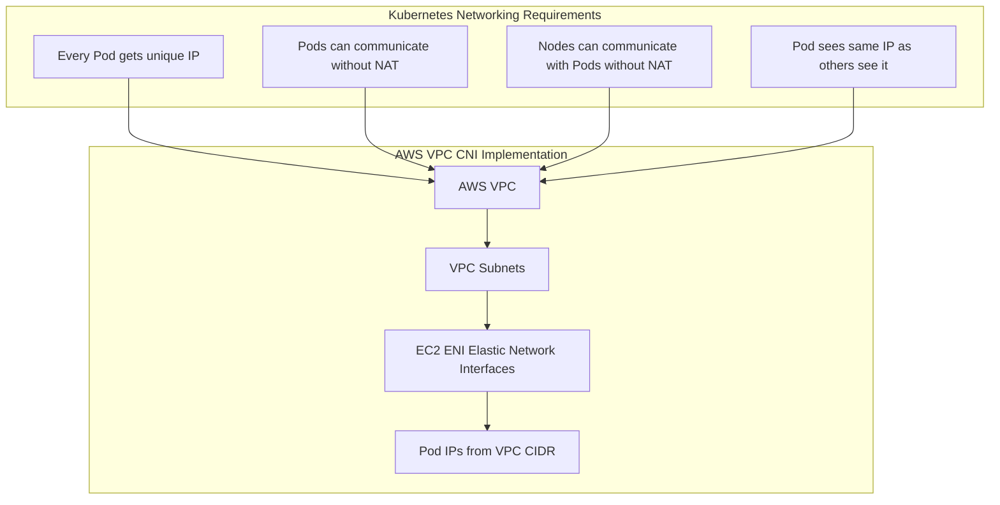

## Pod-to-Pod Communication

```mermaid
graph LR
    subgraph "Node 1 - IP: 10.0.1.100"
        POD1[Pod A<br/>IP: 10.0.1.47<br/>Container: 8080]
        VETH1[veth pair]
        POD1 --> VETH1
    end

    subgraph "Node 2 - IP: 10.0.2.200"
        POD2[Pod B<br/>IP: 10.0.2.89<br/>Container: 8080]
        VETH2[veth pair]
        POD2 --> VETH2
    end

    subgraph "AWS VPC"
        ROUTE[VPC Route Tables]
    end

    VETH1 -.Direct route.-> ROUTE
    ROUTE -.Direct route.-> VETH2

    POD1 -.curl 10.0.2.89:8080.-> POD2

    style POD1 fill:#90EE90
    style POD2 fill:#87CEEB
```

## Service Types

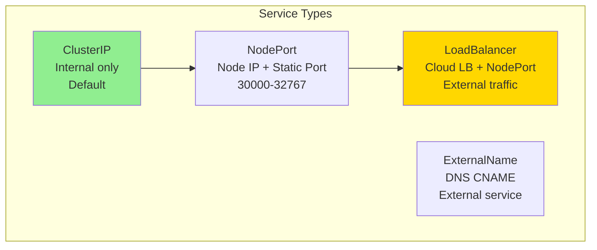

## ClusterIP Service (Internal)

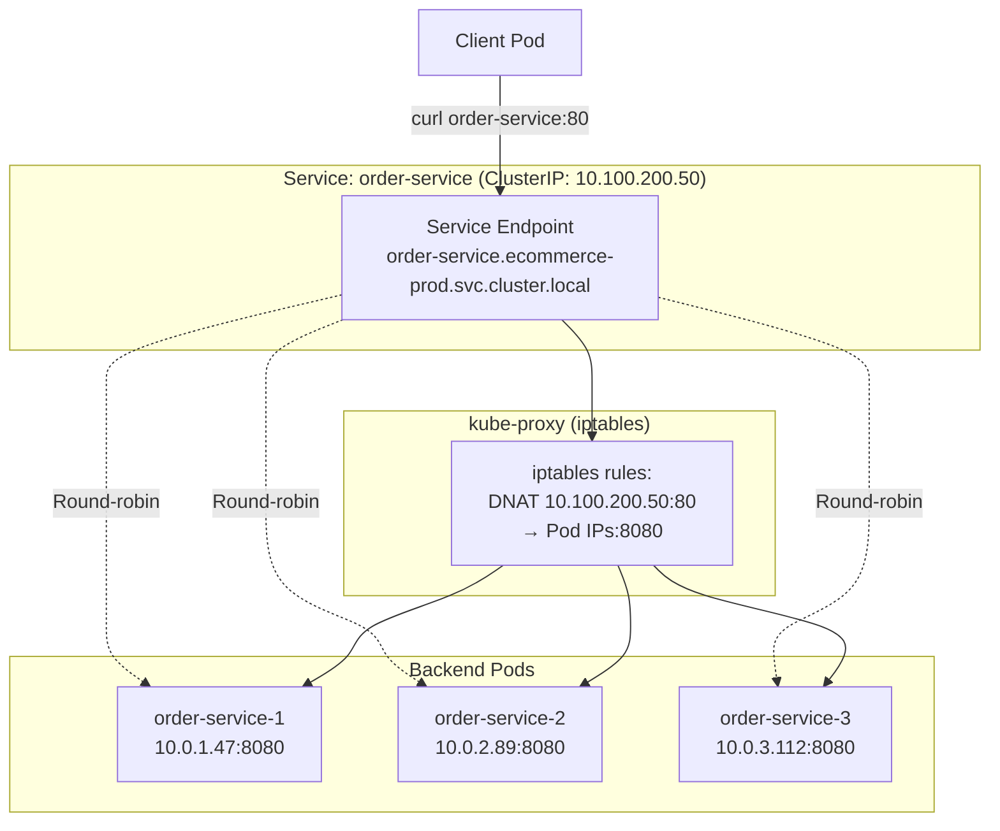

### ClusterIP YAML

```yaml
apiVersion: v1
kind: Service
metadata:
  name: order-service
  namespace: ecommerce-prod
  labels:
    app: order-service
spec:
  type: ClusterIP  # Default, can be omitted

  # Label selector for backend pods
  selector:
    app: order-service

  # Service ports
  ports:
  - name: http
    port: 80          # Service port
    targetPort: 8080  # Container port
    protocol: TCP
  - name: metrics
    port: 9090
    targetPort: 9090

  # Session affinity (sticky sessions)
  sessionAffinity: ClientIP
  sessionAffinityConfig:
    clientIP:
      timeoutSeconds: 3600

  # IP family
  ipFamilies:
  - IPv4
  ipFamilyPolicy: SingleStack
```

## NodePort Service

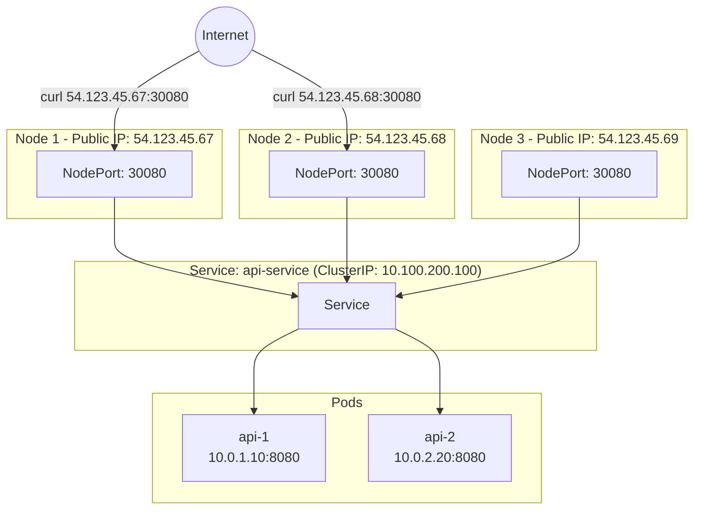

### NodePort YAML

```yaml
apiVersion: v1
kind: Service
metadata:
  name: api-nodeport
  namespace: ecommerce-prod
spec:
  type: NodePort

  selector:
    app: api-service

  ports:
  - port: 80
    targetPort: 8080
    nodePort: 30080  # Optional, auto-assigned if omitted (30000-32767)
    protocol: TCP
```

## LoadBalancer Service (AWS ELB/NLB)

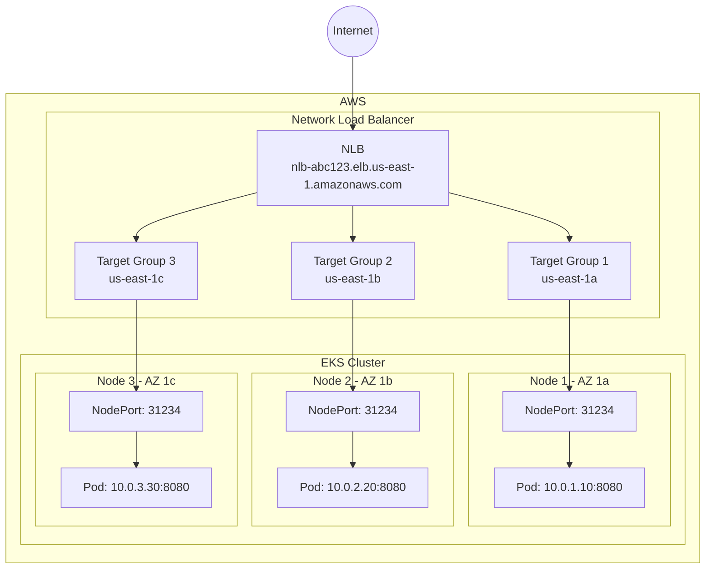

### LoadBalancer YAML

```yaml
apiVersion: v1
kind: Service
metadata:
  name: api-loadbalancer
  namespace: ecommerce-prod
  annotations:
    # Use Network Load Balancer (default is Classic Load Balancer)
    service.beta.kubernetes.io/aws-load-balancer-type: "nlb"

    # Internal LB (private subnets)
    service.beta.kubernetes.io/aws-load-balancer-internal: "true"

    # Cross-zone load balancing
    service.beta.kubernetes.io/aws-load-balancer-cross-zone-load-balancing-enabled: "true"

    # SSL/TLS termination at LB
    service.beta.kubernetes.io/aws-load-balancer-ssl-cert: "arn:aws:acm:us-east-1:123456789012:certificate/abc123"
    service.beta.kubernetes.io/aws-load-balancer-ssl-ports: "443"
    service.beta.kubernetes.io/aws-load-balancer-backend-protocol: "http"

    # Connection draining
    service.beta.kubernetes.io/aws-load-balancer-connection-draining-enabled: "true"
    service.beta.kubernetes.io/aws-load-balancer-connection-draining-timeout: "60"

    # Health check
    service.beta.kubernetes.io/aws-load-balancer-healthcheck-path: "/health"
    service.beta.kubernetes.io/aws-load-balancer-healthcheck-port: "8080"
    service.beta.kubernetes.io/aws-load-balancer-healthcheck-interval: "10"
    service.beta.kubernetes.io/aws-load-balancer-healthcheck-timeout: "5"
    service.beta.kubernetes.io/aws-load-balancer-healthcheck-healthy-threshold: "2"
    service.beta.kubernetes.io/aws-load-balancer-healthcheck-unhealthy-threshold: "2"

    # Subnet selection (for internal LBs)
    service.beta.kubernetes.io/aws-load-balancer-subnets: "subnet-abc123,subnet-def456,subnet-ghi789"

    # EIP allocation (for public NLB)
    service.beta.kubernetes.io/aws-load-balancer-eip-allocations: "eipalloc-abc123,eipalloc-def456"

    # Proxy protocol v2
    service.beta.kubernetes.io/aws-load-balancer-proxy-protocol: "*"

spec:
  type: LoadBalancer

  selector:
    app: api-service

  ports:
  - name: https
    port: 443
    targetPort: 8080
    protocol: TCP
  - name: http
    port: 80
    targetPort: 8080
    protocol: TCP

  # Preserve client source IP
  externalTrafficPolicy: Local  # or Cluster (default)
```

## Ingress with AWS Load Balancer Controller

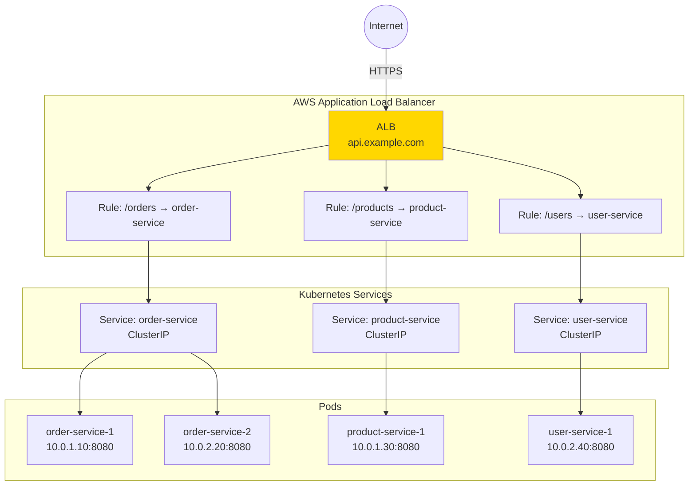

### Ingress YAML

```yaml
apiVersion: networking.k8s.io/v1
kind: Ingress
metadata:
  name: api-ingress
  namespace: ecommerce-prod
  annotations:
    # Ingress class
    kubernetes.io/ingress.class: alb

    # Scheme
    alb.ingress.kubernetes.io/scheme: internet-facing  # or internal

    # Target type
    alb.ingress.kubernetes.io/target-type: ip  # or instance (use ip for Fargate)

    # Listen ports
    alb.ingress.kubernetes.io/listen-ports: '[{"HTTP": 80}, {"HTTPS": 443}]'

    # SSL redirect
    alb.ingress.kubernetes.io/ssl-redirect: '443'

    # Certificate
    alb.ingress.kubernetes.io/certificate-arn: arn:aws:acm:us-east-1:123456789012:certificate/abc-123

    # Health check
    alb.ingress.kubernetes.io/healthcheck-path: /health
    alb.ingress.kubernetes.io/healthcheck-interval-seconds: '15'
    alb.ingress.kubernetes.io/healthcheck-timeout-seconds: '5'
    alb.ingress.kubernetes.io/healthy-threshold-count: '2'
    alb.ingress.kubernetes.io/unhealthy-threshold-count: '2'

    # Target group attributes
    alb.ingress.kubernetes.io/target-group-attributes: stickiness.enabled=true,stickiness.lb_cookie.duration_seconds=3600

    # WAF
    alb.ingress.kubernetes.io/wafv2-acl-arn: arn:aws:wafv2:us-east-1:123456789012:global/webacl/prod/abc-123

    # Security groups
    alb.ingress.kubernetes.io/security-groups: sg-abc123,sg-def456

    # Subnets
    alb.ingress.kubernetes.io/subnets: subnet-abc123,subnet-def456,subnet-ghi789

    # Tags
    alb.ingress.kubernetes.io/tags: Environment=prod,Team=platform

    # Actions (for advanced routing)
    alb.ingress.kubernetes.io/actions.ssl-redirect: '{"Type": "redirect", "RedirectConfig": { "Protocol": "HTTPS", "Port": "443", "StatusCode": "HTTP_301"}}'

spec:
  rules:
  # Host-based routing
  - host: api.example.com
    http:
      paths:
      # Path-based routing
      - path: /orders
        pathType: Prefix
        backend:
          service:
            name: order-service
            port:
              number: 80

      - path: /products
        pathType: Prefix
        backend:
          service:
            name: product-service
            port:
              number: 80

      - path: /users
        pathType: Prefix
        backend:
          service:
            name: user-service
            port:
              number: 80

  # Multiple hosts
  - host: admin.example.com
    http:
      paths:
      - path: /
        pathType: Prefix
        backend:
          service:
            name: admin-service
            port:
              number: 80

  # TLS configuration
  tls:
  - hosts:
    - api.example.com
    - admin.example.com
    secretName: tls-secret  # Optional, can use ACM cert from annotations
```

## DNS and Service Discovery

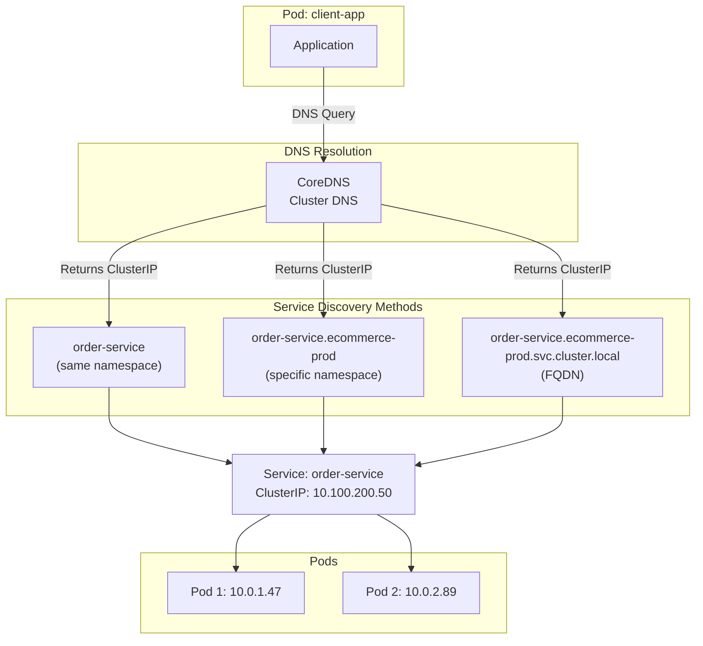

### DNS Records

```bash
# Service DNS format
<service-name>.<namespace>.svc.cluster.local

# Examples
order-service.ecommerce-prod.svc.cluster.local
postgres.ecommerce-prod.svc.cluster.local

# Headless service (StatefulSet) - returns pod IPs
postgres-0.postgres.ecommerce-prod.svc.cluster.local
postgres-1.postgres.ecommerce-prod.svc.cluster.local

# Pod DNS (if enabled)
<pod-ip-with-dashes>.<namespace>.pod.cluster.local
10-0-1-47.ecommerce-prod.pod.cluster.local
```

## Network Policies (Firewall Rules)

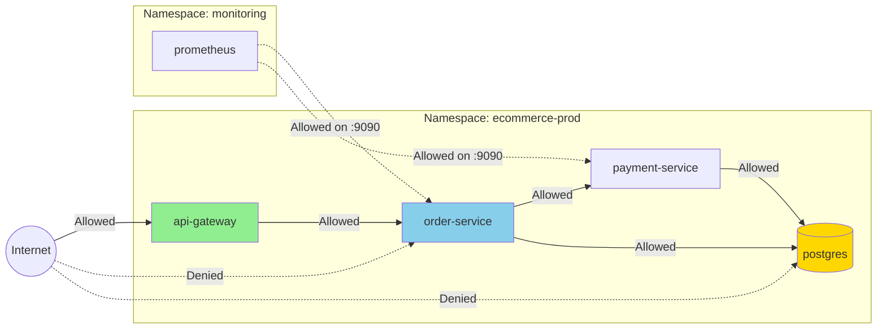

### Network Policy: Default Deny

```yaml
# Deny all ingress traffic by default
apiVersion: networking.k8s.io/v1
kind: NetworkPolicy
metadata:
  name: default-deny-ingress
  namespace: ecommerce-prod
spec:
  podSelector: {}  # Applies to all pods
  policyTypes:
  - Ingress

---
# Deny all egress traffic by default
apiVersion: networking.k8s.io/v1
kind: NetworkPolicy
metadata:
  name: default-deny-egress
  namespace: ecommerce-prod
spec:
  podSelector: {}
  policyTypes:
  - Egress
```

### Network Policy: Allow Specific Traffic

```yaml
apiVersion: networking.k8s.io/v1
kind: NetworkPolicy
metadata:
  name: order-service-netpol
  namespace: ecommerce-prod
spec:
  # Apply to these pods
  podSelector:
    matchLabels:
      app: order-service

  policyTypes:
  - Ingress
  - Egress

  # Ingress rules (who can connect TO this service)
  ingress:
  # Allow from api-gateway
  - from:
    - podSelector:
        matchLabels:
          app: api-gateway
    ports:
    - protocol: TCP
      port: 8080

  # Allow from prometheus (different namespace)
  - from:
    - namespaceSelector:
        matchLabels:
          name: monitoring
      podSelector:
        matchLabels:
          app: prometheus
    ports:
    - protocol: TCP
      port: 9090  # Metrics port

  # Egress rules (where this service can connect TO)
  egress:
  # Allow DNS (kube-system namespace)
  - to:
    - namespaceSelector:
        matchLabels:
          name: kube-system
    ports:
    - protocol: UDP
      port: 53

  # Allow postgres
  - to:
    - podSelector:
        matchLabels:
          app: postgres
    ports:
    - protocol: TCP
      port: 5432

  # Allow payment service
  - to:
    - podSelector:
        matchLabels:
          app: payment-service
    ports:
    - protocol: TCP
      port: 8080

  # Allow external HTTPS (for APIs)
  - to:
    - namespaceSelector: {}
    ports:
    - protocol: TCP
      port: 443
```

### Network Policy: Advanced Scenarios

```yaml
# Allow traffic from specific IP blocks (external services)
apiVersion: networking.k8s.io/v1
kind: NetworkPolicy
metadata:
  name: allow-external-ips
  namespace: ecommerce-prod
spec:
  podSelector:
    matchLabels:
      app: webhook-receiver
  policyTypes:
  - Ingress
  ingress:
  - from:
    - ipBlock:
        cidr: 192.168.1.0/24
        except:
        - 192.168.1.5/32
    ports:
    - protocol: TCP
      port: 8080

---
# Allow traffic based on namespace labels
apiVersion: networking.k8s.io/v1
kind: NetworkPolicy
metadata:
  name: allow-from-production
  namespace: shared-services
spec:
  podSelector:
    matchLabels:
      tier: backend
  policyTypes:
  - Ingress
  ingress:
  - from:
    - namespaceSelector:
        matchLabels:
          environment: production
    ports:
    - protocol: TCP
      port: 8080
```

## Service Mesh (AWS App Mesh / Istio)

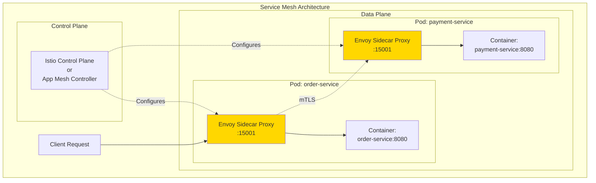

### Service Mesh Features

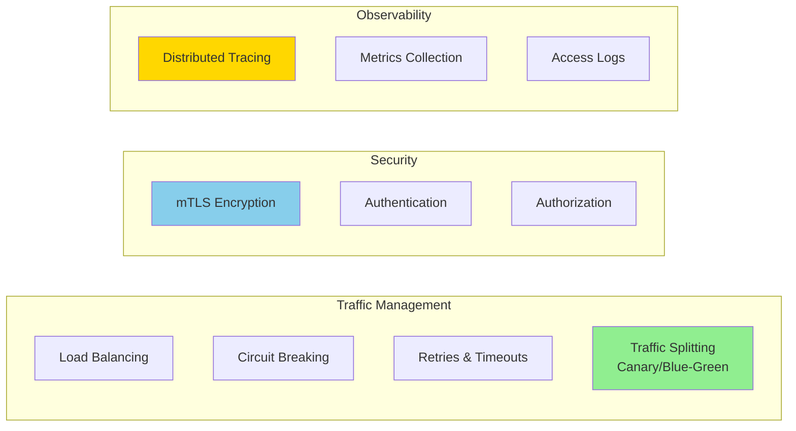

### AWS App Mesh Example

```yaml
# Virtual Node (represents a microservice)
apiVersion: appmesh.k8s.aws/v1beta2
kind: VirtualNode
metadata:
  name: order-service
  namespace: ecommerce-prod
spec:
  podSelector:
    matchLabels:
      app: order-service

  listeners:
  - portMapping:
      port: 8080
      protocol: http
    healthCheck:
      protocol: http
      path: /health
      healthyThreshold: 2
      unhealthyThreshold: 3
      timeoutMillis: 2000
      intervalMillis: 5000

  serviceDiscovery:
    dns:
      hostname: order-service.ecommerce-prod.svc.cluster.local

  backends:
  - virtualService:
      virtualServiceRef:
        name: payment-service

---
# Virtual Service (routing rules)
apiVersion: appmesh.k8s.aws/v1beta2
kind: VirtualService
metadata:
  name: order-service
  namespace: ecommerce-prod
spec:
  provider:
    virtualRouter:
      virtualRouterRef:
        name: order-service-router

---
# Virtual Router (traffic distribution)
apiVersion: appmesh.k8s.aws/v1beta2
kind: VirtualRouter
metadata:
  name: order-service-router
  namespace: ecommerce-prod
spec:
  listeners:
  - portMapping:
      port: 8080
      protocol: http

  routes:
  - name: order-service-route
    httpRoute:
      match:
        prefix: /
      action:
        weightedTargets:
        - virtualNodeRef:
            name: order-service-v1
          weight: 90
        - virtualNodeRef:
            name: order-service-v2
          weight: 10  # 10% canary traffic
      retryPolicy:
        maxRetries: 3
        perRetryTimeout:
          unit: ms
          value: 2000
        httpRetryEvents:
        - server-error
        - gateway-error
```

## Traffic Flow Summary

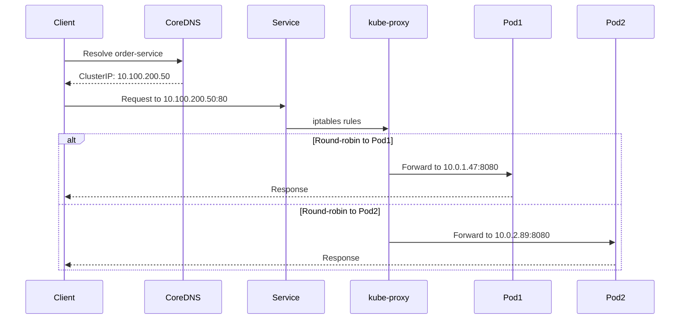

## Common Networking Patterns

| Pattern | Use Case | Implementation |
|---------|----------|----------------|
| **ClusterIP** | Internal microservice communication | Default service type |
| **Headless Service** | StatefulSet, direct pod access | `clusterIP: None` |
| **NodePort** | Development, debugging | Expose on node IP:port |
| **LoadBalancer** | Single-service external access | AWS ELB/NLB |
| **Ingress** | Multi-service HTTP(S) routing | ALB with path/host rules |
| **Service Mesh** | Advanced traffic management, security | Istio, App Mesh |

## Next Steps

- **[04-storage-volumes.md](./04-storage-volumes.md)**: Persistent storage with EBS and EFS
- **[05-secrets-management.md](./05-secrets-management.md)**: Configuration and secrets
- **[06-monitoring-observability.md](./06-monitoring-observability.md)**: Metrics, logs, traces
