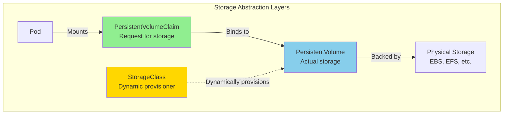
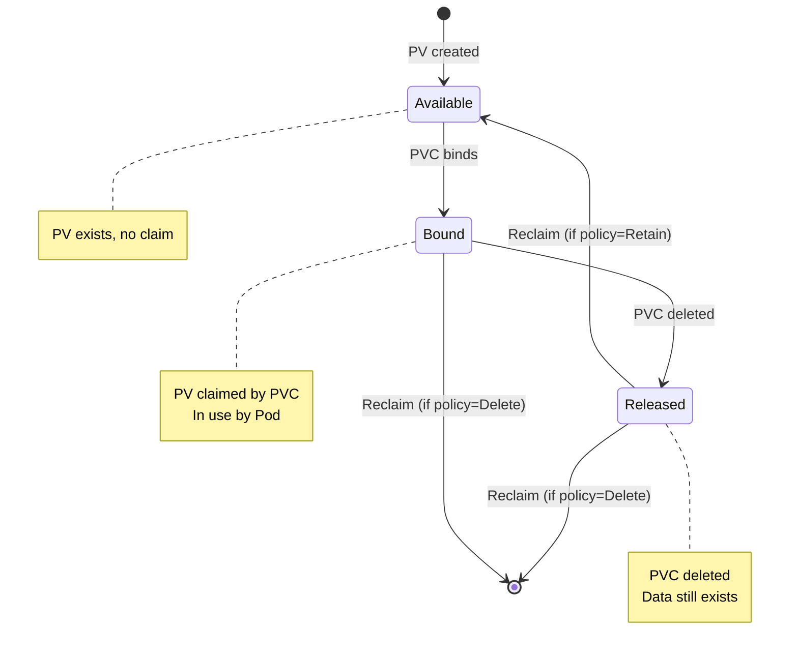
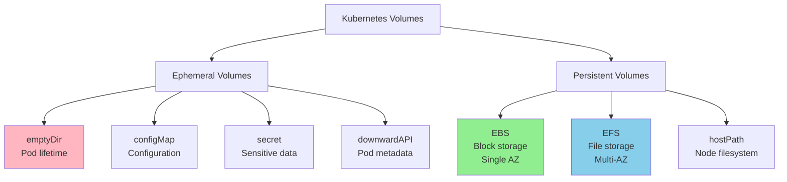
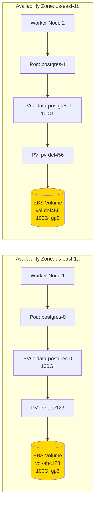
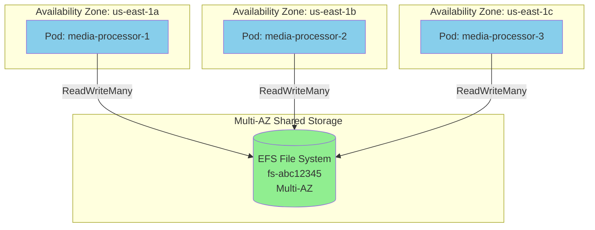
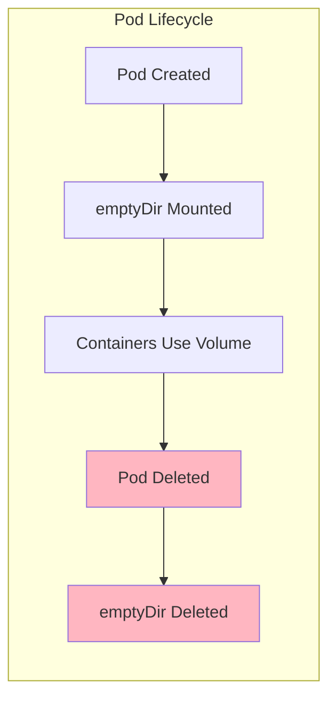
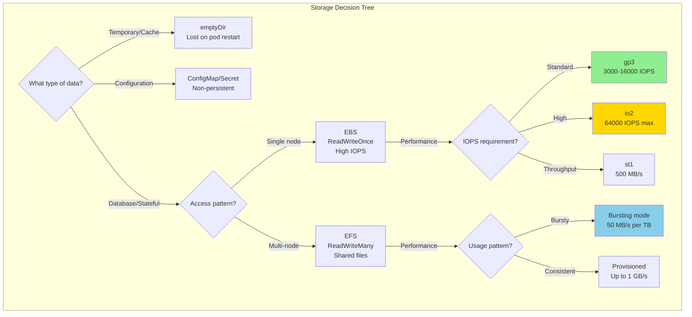

# Kubernetes Storage and Volumes

## Storage Architecture



## Volume Lifecycle



## Volume Types Overview



## EBS Volumes (Block Storage)



### EBS StorageClass

```yaml
# GP3 StorageClass (recommended for most workloads)
apiVersion: storage.k8s.io/v1
kind: StorageClass
metadata:
  name: ebs-gp3
  annotations:
    storageclass.kubernetes.io/is-default-class: "true"
provisioner: ebs.csi.aws.com
parameters:
  type: gp3
  iops: "3000"          # 3,000-16,000 IOPS
  throughput: "125"     # 125-1000 MiB/s
  encrypted: "true"
  kmsKeyId: "arn:aws:kms:us-east-1:123456789012:key/abc-123"
  fsType: ext4

# Volume binding mode
volumeBindingMode: WaitForFirstConsumer  # Creates volume in same AZ as pod

# Reclaim policy
reclaimPolicy: Retain  # or Delete

# Allow volume expansion
allowVolumeExpansion: true

---
# IO2 StorageClass (for high IOPS workloads)
apiVersion: storage.k8s.io/v1
kind: StorageClass
metadata:
  name: ebs-io2
provisioner: ebs.csi.aws.com
parameters:
  type: io2
  iops: "10000"
  encrypted: "true"
volumeBindingMode: WaitForFirstConsumer
allowVolumeExpansion: true
reclaimPolicy: Delete

---
# ST1 StorageClass (for throughput-optimized workloads)
apiVersion: storage.k8s.io/v1
kind: StorageClass
metadata:
  name: ebs-st1
provisioner: ebs.csi.aws.com
parameters:
  type: st1
  encrypted: "true"
volumeBindingMode: WaitForFirstConsumer
allowVolumeExpansion: true
```

### EBS PersistentVolumeClaim

```yaml
apiVersion: v1
kind: PersistentVolumeClaim
metadata:
  name: postgres-data
  namespace: ecommerce-prod
  labels:
    app: postgres
spec:
  # Access modes
  accessModes:
    - ReadWriteOnce  # Single node read-write (EBS limitation)

  # Storage class
  storageClassName: ebs-gp3

  # Resource request
  resources:
    requests:
      storage: 100Gi

  # Optional: Volume selector
  selector:
    matchLabels:
      type: database

  # Optional: Volume mode
  volumeMode: Filesystem  # or Block
```

### Using EBS in StatefulSet

```yaml
apiVersion: apps/v1
kind: StatefulSet
metadata:
  name: postgres
  namespace: ecommerce-prod
spec:
  serviceName: postgres
  replicas: 3

  selector:
    matchLabels:
      app: postgres

  template:
    metadata:
      labels:
        app: postgres
    spec:
      containers:
      - name: postgres
        image: postgres:14
        ports:
        - containerPort: 5432
        env:
        - name: POSTGRES_DB
          value: orders
        - name: POSTGRES_PASSWORD
          valueFrom:
            secretKeyRef:
              name: postgres-secrets
              key: password
        - name: PGDATA
          value: /var/lib/postgresql/data/pgdata

        volumeMounts:
        - name: postgres-data
          mountPath: /var/lib/postgresql/data

        resources:
          requests:
            memory: "1Gi"
            cpu: "500m"
          limits:
            memory: "2Gi"
            cpu: "1000m"

  # VolumeClaimTemplates - creates PVC per replica
  volumeClaimTemplates:
  - metadata:
      name: postgres-data
    spec:
      accessModes: ["ReadWriteOnce"]
      storageClassName: ebs-gp3
      resources:
        requests:
          storage: 100Gi
```

### EBS Volume Expansion

```yaml
# 1. Ensure StorageClass has allowVolumeExpansion: true

# 2. Edit PVC to increase size
apiVersion: v1
kind: PersistentVolumeClaim
metadata:
  name: postgres-data
  namespace: ecommerce-prod
spec:
  accessModes:
    - ReadWriteOnce
  storageClassName: ebs-gp3
  resources:
    requests:
      storage: 200Gi  # Increased from 100Gi
```

```bash
# Check expansion status
kubectl describe pvc postgres-data -n ecommerce-prod

# Events will show:
# - External resizer is resizing volume
# - FileSystemResizeRequired
# - FileSystemResizeSuccessful
```

## EFS Volumes (Shared File Storage)



### EFS StorageClass

```yaml
# EFS CSI Driver StorageClass
apiVersion: storage.k8s.io/v1
kind: StorageClass
metadata:
  name: efs-sc
provisioner: efs.csi.aws.com
parameters:
  # EFS file system ID
  fileSystemId: fs-abc12345

  # Provisioning mode
  provisioningMode: efs-ap  # Access Point mode (recommended)

  # Directory permissions
  directoryPerms: "700"

  # GID range for access points
  gidRangeStart: "1000"
  gidRangeEnd: "2000"

  # Base path
  basePath: "/dynamic_provisioning"

  # Performance mode (set during EFS creation, not modifiable here)
  # performanceMode: generalPurpose  # or maxIO

  # Throughput mode (set during EFS creation)
  # throughputMode: bursting  # or provisioned

mountOptions:
  - tls  # Enable TLS encryption in transit
  - iam  # Use IAM for authentication

---
# Static provisioning (existing EFS)
apiVersion: storage.k8s.io/v1
kind: StorageClass
metadata:
  name: efs-sc-static
provisioner: efs.csi.aws.com
parameters:
  fileSystemId: fs-abc12345
  provisioningMode: efs-ap
  directoryPerms: "755"
```

### EFS PersistentVolumeClaim

```yaml
# Dynamic provisioning
apiVersion: v1
kind: PersistentVolumeClaim
metadata:
  name: shared-uploads
  namespace: ecommerce-prod
spec:
  accessModes:
    - ReadWriteMany  # Multiple pods can mount
  storageClassName: efs-sc
  resources:
    requests:
      storage: 100Gi  # For tracking, EFS is elastic

---
# Static provisioning
apiVersion: v1
kind: PersistentVolume
metadata:
  name: efs-pv
spec:
  capacity:
    storage: 5Gi  # For tracking only
  volumeMode: Filesystem
  accessModes:
    - ReadWriteMany
  persistentVolumeReclaimPolicy: Retain
  storageClassName: efs-sc-static
  csi:
    driver: efs.csi.aws.com
    volumeHandle: fs-abc12345  # EFS file system ID
    volumeAttributes:
      path: /shared  # Optional subdirectory

---
apiVersion: v1
kind: PersistentVolumeClaim
metadata:
  name: efs-claim
  namespace: ecommerce-prod
spec:
  accessModes:
    - ReadWriteMany
  storageClassName: efs-sc-static
  resources:
    requests:
      storage: 5Gi
```

### Using EFS in Deployment

```yaml
apiVersion: apps/v1
kind: Deployment
metadata:
  name: media-processor
  namespace: ecommerce-prod
spec:
  replicas: 5  # All replicas share the same volume

  selector:
    matchLabels:
      app: media-processor

  template:
    metadata:
      labels:
        app: media-processor
    spec:
      containers:
      - name: processor
        image: media-processor:latest
        volumeMounts:
        - name: shared-storage
          mountPath: /mnt/uploads
          # Optional: Mount subdirectory
          subPath: uploads

        - name: shared-storage
          mountPath: /mnt/processed
          subPath: processed

      volumes:
      - name: shared-storage
        persistentVolumeClaim:
          claimName: shared-uploads
```

## Ephemeral Volumes

### emptyDir (Temporary Storage)



```yaml
apiVersion: v1
kind: Pod
metadata:
  name: cache-pod
  namespace: ecommerce-prod
spec:
  containers:
  - name: app
    image: app:latest
    volumeMounts:
    - name: cache
      mountPath: /cache
    - name: logs
      mountPath: /var/log/app

  # Sidecar to process logs
  - name: log-processor
    image: log-processor:latest
    volumeMounts:
    - name: logs
      mountPath: /var/log/app
      readOnly: true

  volumes:
  # Disk-backed emptyDir
  - name: cache
    emptyDir:
      sizeLimit: 1Gi  # Optional size limit

  # RAM-backed emptyDir (faster, but uses node memory)
  - name: logs
    emptyDir:
      medium: Memory
      sizeLimit: 500Mi
```

### ConfigMap as Volume

```yaml
apiVersion: v1
kind: ConfigMap
metadata:
  name: app-config
  namespace: ecommerce-prod
data:
  # File 1
  application.yaml: |
    server:
      port: 8080
    database:
      host: postgres
      port: 5432

  # File 2
  logging.yaml: |
    level: info
    format: json

  # File 3
  nginx.conf: |
    server {
      listen 80;
      location / {
        proxy_pass http://backend:8080;
      }
    }

---
apiVersion: v1
kind: Pod
metadata:
  name: app-pod
  namespace: ecommerce-prod
spec:
  containers:
  - name: app
    image: app:latest
    volumeMounts:
    # Mount entire ConfigMap
    - name: config
      mountPath: /etc/config
      readOnly: true
    # Result: /etc/config/application.yaml
    #         /etc/config/logging.yaml
    #         /etc/config/nginx.conf

    # Mount single file
    - name: config
      mountPath: /etc/app/application.yaml
      subPath: application.yaml
      readOnly: true

  volumes:
  - name: config
    configMap:
      name: app-config
      # Optional: Select specific items
      items:
      - key: application.yaml
        path: app.yaml  # Rename file
      - key: nginx.conf
        path: nginx.conf
      # Optional: Set permissions
      defaultMode: 0644
```

### Secret as Volume

```yaml
apiVersion: v1
kind: Secret
metadata:
  name: db-secrets
  namespace: ecommerce-prod
type: Opaque
data:
  username: b3JkZXJ1c2Vy  # base64 encoded
  password: cGFzc3dvcmQxMjM=

---
apiVersion: v1
kind: Pod
metadata:
  name: app-pod
  namespace: ecommerce-prod
spec:
  containers:
  - name: app
    image: app:latest
    volumeMounts:
    # Mount as files
    - name: db-secrets
      mountPath: /etc/secrets
      readOnly: true
    # Result: /etc/secrets/username
    #         /etc/secrets/password

    # Or use environment variables
    env:
    - name: DB_USERNAME
      valueFrom:
        secretKeyRef:
          name: db-secrets
          key: username
    - name: DB_PASSWORD
      valueFrom:
        secretKeyRef:
          name: db-secrets
          key: password

  volumes:
  - name: db-secrets
    secret:
      secretName: db-secrets
      defaultMode: 0400  # Read-only by owner
```

### Downward API (Pod Metadata)

```yaml
apiVersion: v1
kind: Pod
metadata:
  name: metadata-pod
  namespace: ecommerce-prod
  labels:
    app: order-service
    version: v1.2.3
  annotations:
    prometheus.io/scrape: "true"
spec:
  containers:
  - name: app
    image: app:latest

    # Method 1: Environment variables
    env:
    - name: POD_NAME
      valueFrom:
        fieldRef:
          fieldPath: metadata.name
    - name: POD_NAMESPACE
      valueFrom:
        fieldRef:
          fieldPath: metadata.namespace
    - name: POD_IP
      valueFrom:
        fieldRef:
          fieldPath: status.podIP
    - name: NODE_NAME
      valueFrom:
        fieldRef:
          fieldPath: spec.nodeName
    - name: POD_SERVICE_ACCOUNT
      valueFrom:
        fieldRef:
          fieldPath: spec.serviceAccountName
    - name: CPU_REQUEST
      valueFrom:
        resourceFieldRef:
          containerName: app
          resource: requests.cpu
    - name: MEMORY_LIMIT
      valueFrom:
        resourceFieldRef:
          containerName: app
          resource: limits.memory

    # Method 2: Volume files
    volumeMounts:
    - name: podinfo
      mountPath: /etc/podinfo
      readOnly: true

  volumes:
  - name: podinfo
    downwardAPI:
      items:
      - path: "labels"
        fieldRef:
          fieldPath: metadata.labels
      - path: "annotations"
        fieldRef:
          fieldPath: metadata.annotations
      - path: "pod_name"
        fieldRef:
          fieldPath: metadata.name
      - path: "namespace"
        fieldRef:
          fieldPath: metadata.namespace
```

## Projected Volumes (Combine Multiple Sources)

```yaml
apiVersion: v1
kind: Pod
metadata:
  name: combined-volume-pod
  namespace: ecommerce-prod
spec:
  serviceAccountName: order-service-sa

  containers:
  - name: app
    image: app:latest
    volumeMounts:
    - name: combined
      mountPath: /combined
      readOnly: true

  volumes:
  - name: combined
    projected:
      sources:
      # Service account token
      - serviceAccountToken:
          path: token
          expirationSeconds: 7200
          audience: api

      # ConfigMap
      - configMap:
          name: app-config
          items:
          - key: application.yaml
            path: config/app.yaml

      # Secret
      - secret:
          name: db-secrets
          items:
          - key: password
            path: secrets/db-password

      # Downward API
      - downwardAPI:
          items:
          - path: metadata/labels
            fieldRef:
              fieldPath: metadata.labels
          - path: metadata/name
            fieldRef:
              fieldPath: metadata.name

# Result directory structure:
# /combined/
#   token
#   config/app.yaml
#   secrets/db-password
#   metadata/labels
#   metadata/name
```

## hostPath (Node Filesystem - Use with Caution)

```yaml
# WARNING: hostPath breaks pod portability and has security implications
# Use only for specific use cases like log collection, monitoring

apiVersion: v1
kind: Pod
metadata:
  name: log-collector
  namespace: monitoring
spec:
  containers:
  - name: fluent-bit
    image: fluent/fluent-bit:latest
    volumeMounts:
    - name: varlog
      mountPath: /var/log
      readOnly: true
    - name: varlibdockercontainers
      mountPath: /var/lib/docker/containers
      readOnly: true

  volumes:
  - name: varlog
    hostPath:
      path: /var/log
      type: Directory  # Must exist

  - name: varlibdockercontainers
    hostPath:
      path: /var/lib/docker/containers
      type: DirectoryOrCreate  # Create if missing
```

### hostPath Types

| Type | Behavior | Use Case |
|------|----------|----------|
| `""` | No checks | Generic |
| `DirectoryOrCreate` | Create if missing | Log directories |
| `Directory` | Must exist | Existing paths |
| `FileOrCreate` | Create file if missing | Config files |
| `File` | Must exist | Specific files |
| `Socket` | Must be UNIX socket | Docker socket |
| `CharDevice` | Must be char device | Hardware access |
| `BlockDevice` | Must be block device | Raw block storage |

## Volume Snapshots (Backup & Restore)

```yaml
# VolumeSnapshotClass
apiVersion: snapshot.storage.k8s.io/v1
kind: VolumeSnapshotClass
metadata:
  name: ebs-snapshot-class
driver: ebs.csi.aws.com
deletionPolicy: Delete  # or Retain
parameters:
  tags: "Environment=prod,Team=platform"

---
# Create Snapshot
apiVersion: snapshot.storage.k8s.io/v1
kind: VolumeSnapshot
metadata:
  name: postgres-snapshot-20260122
  namespace: ecommerce-prod
spec:
  volumeSnapshotClassName: ebs-snapshot-class
  source:
    persistentVolumeClaimName: postgres-data

---
# Restore from Snapshot
apiVersion: v1
kind: PersistentVolumeClaim
metadata:
  name: postgres-data-restored
  namespace: ecommerce-prod
spec:
  accessModes:
    - ReadWriteOnce
  storageClassName: ebs-gp3
  dataSource:
    name: postgres-snapshot-20260122
    kind: VolumeSnapshot
    apiGroup: snapshot.storage.k8s.io
  resources:
    requests:
      storage: 100Gi
```

## Storage Best Practices



## Storage Comparison

| Feature | emptyDir | ConfigMap/Secret | EBS | EFS |
|---------|----------|------------------|-----|-----|
| **Lifetime** | Pod | Cluster | Independent | Independent |
| **Access Mode** | Pod-local | Read-only | ReadWriteOnce | ReadWriteMany |
| **Performance** | Node-dependent | Fast | High IOPS | Lower latency |
| **Durability** | Lost on restart | Stored in etcd | Persistent | Persistent |
| **Multi-AZ** | No | N/A | No | Yes |
| **Use Case** | Cache, temp files | Config, secrets | Databases | Shared files |
| **Cost** | Included | Included | $/GB-month | $/GB-month + I/O |

## Next Steps

- **[05-secrets-management.md](./05-secrets-management.md)**: Managing sensitive data
- **[06-monitoring-observability.md](./06-monitoring-observability.md)**: Monitoring and logging
- **[07-complete-example.md](./07-complete-example.md)**: Full application example
